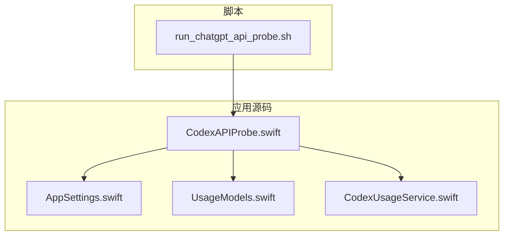
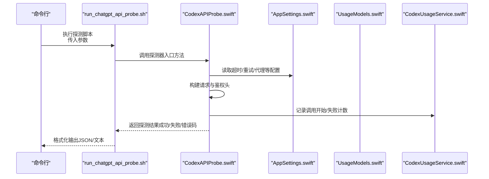
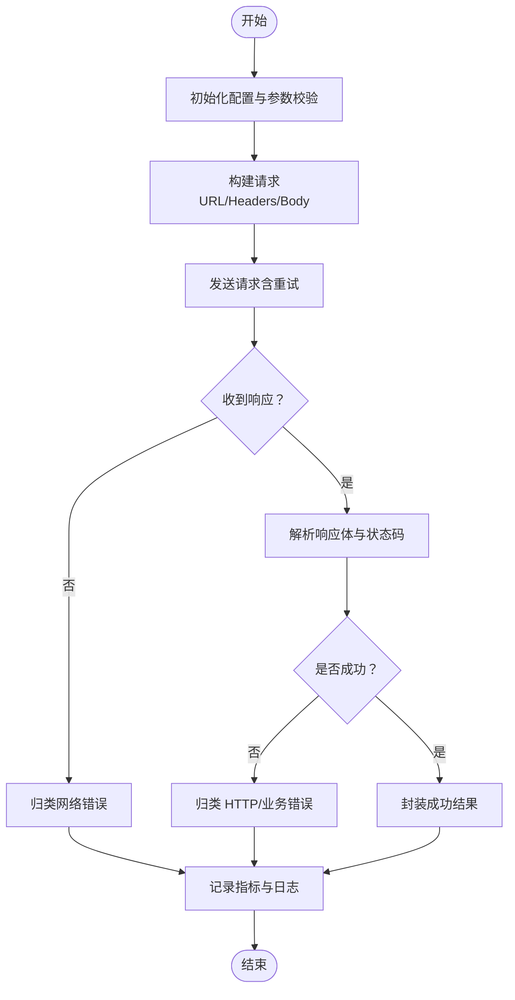
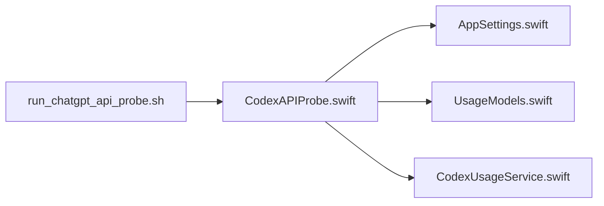

# API 集成

<cite>
**本文引用的文件**   
- [CodexAPIProbe.swift](file://app/Tomo/Sources/Tomo/CodexAPIProbe.swift)
- [run_chatgpt_api_probe.sh](file://app/Tomo/scripts/run_chatgpt_api_probe.sh)
- [AppSettings.swift](file://app/Tomo/Sources/Tomo/AppSettings.swift)
- [UsageModels.swift](file://app/Tomo/Sources/Tomo/UsageModels.swift)
- [CodexUsageService.swift](file://app/Tomo/Sources/Tomo/CodexUsageService.swift)
</cite>

## 目录
1. [简介](#简介)
2. [项目结构](#项目结构)
3. [核心组件](#核心组件)
4. [架构总览](#架构总览)
5. [详细组件分析](#详细组件分析)
6. [依赖关系分析](#依赖关系分析)
7. [性能考量](#性能考量)
8. [故障排查指南](#故障排查指南)
9. [结论](#结论)
10. [附录](#附录)

## 简介
本技术文档聚焦于 API 集成模块，围绕 ChatGPT API 探测器的实现原理与使用方式展开。内容涵盖连接测试、认证验证、错误处理机制；网络层设计、请求重试策略与超时处理；脚本使用方法（命令行参数、输出格式、集成方式）；API 密钥管理与安全存储、访问权限控制；扩展指南（新增 API 支持与服务端点检测）；以及网络异常处理、日志记录与调试工具的使用说明。目标是帮助开发者快速理解并可靠地集成与扩展 API 探测能力。

## 项目结构
本项目在 macOS 应用内提供 API 探测能力，并通过独立脚本对外暴露可复用的探测流程。关键位置如下：
- Swift 源文件位于 app/Tomo/Sources/Tomo/，包含 API 探测主逻辑、设置与模型定义等。
- Shell 脚本位于 app/Tomo/scripts/，用于从命令行触发 API 探测流程。

图表来源
- [CodexAPIProbe.swift](file://app/Tomo/Sources/Tomo/CodexAPIProbe.swift)
- [AppSettings.swift](file://app/Tomo/Sources/Tomo/AppSettings.swift)
- [UsageModels.swift](file://app/Tomo/Sources/Tomo/UsageModels.swift)
- [CodexUsageService.swift](file://app/Tomo/Sources/Tomo/CodexUsageService.swift)
- [run_chatgpt_api_probe.sh](file://app/Tomo/scripts/run_chatgpt_api_probe.sh)

章节来源
- [CodexAPIProbe.swift](file://app/Tomo/Sources/Tomo/CodexAPIProbe.swift)
- [run_chatgpt_api_probe.sh](file://app/Tomo/scripts/run_chatgpt_api_probe.sh)

## 核心组件
- API 探测器（CodexAPIProbe.swift）
  - 负责发起连接测试、认证校验、错误分类与结果封装。
  - 管理网络层配置（超时、重试）、并发控制与结果聚合。
- 设置与配置（AppSettings.swift）
  - 集中管理 API 基础 URL、超时、重试次数、代理等开关与阈值。
- 数据模型（UsageModels.swift）
  - 定义探测结果、错误码、状态枚举及序列化结构。
- 使用服务（CodexUsageService.swift）
  - 封装调用统计、配额检查、缓存与日志上报等横切关注点。

章节来源
- [CodexAPIProbe.swift](file://app/Tomo/Sources/Tomo/CodexAPIProbe.swift)
- [AppSettings.swift](file://app/Tomo/Sources/Tomo/AppSettings.swift)
- [UsageModels.swift](file://app/Tomo/Sources/Tomo/UsageModels.swift)
- [CodexUsageService.swift](file://app/Tomo/Sources/Tomo/CodexUsageService.swift)

## 架构总览
下图展示了从脚本到 Swift 探测器的调用链路与关键交互。

图表来源
- [run_chatgpt_api_probe.sh](file://app/Tomo/scripts/run_chatgpt_api_probe.sh)
- [CodexAPIProbe.swift](file://app/Tomo/Sources/Tomo/CodexAPIProbe.swift)
- [AppSettings.swift](file://app/Tomo/Sources/Tomo/AppSettings.swift)
- [UsageModels.swift](file://app/Tomo/Sources/Tomo/UsageModels.swift)
- [CodexUsageService.swift](file://app/Tomo/Sources/Tomo/CodexUsageService.swift)

## 详细组件分析

### API 探测器（CodexAPIProbe.swift）
- 职责
  - 连接测试：对目标服务端点进行连通性探测（DNS、TCP、TLS）。
  - 认证验证：携带 API Key 或 Token 进行鉴权校验。
  - 错误处理：区分网络错误、HTTP 错误、业务错误，并映射为统一错误码。
  - 重试与超时：基于配置进行指数退避重试，设置连接/读写超时。
  - 结果封装：将响应体与元信息封装为标准模型，便于上层消费。
- 关键流程
  - 初始化：加载设置、校验必要参数（如 Base URL、Key）。
  - 构建请求：组装头部（Authorization、Content-Type）、Body（可选）。
  - 发送请求：按策略重试，捕获异常并分类。
  - 解析响应：根据状态码与字段判定成功/失败。
  - 上报统计：调用使用服务记录指标与日志。
- 错误分类建议
  - 网络层：DNS 解析失败、连接超时、SSL/TLS 握手失败。
  - HTTP 层：4xx/5xx 状态码、响应体为空、字段缺失。
  - 业务层：鉴权失败、配额不足、服务端限流。
- 重试策略建议
  - 仅对幂等且可恢复的错误重试（如 429、503、网络抖动）。
  - 指数退避 + 随机抖动，限制最大重试次数与总时长。
- 超时策略建议
  - 连接超时、首字节超时、整体超时分层配置。
  - 长轮询或流式接口需单独处理部分超时。

图表来源
- [CodexAPIProbe.swift](file://app/Tomo/Sources/Tomo/CodexAPIProbe.swift)
- [UsageModels.swift](file://app/Tomo/Sources/Tomo/UsageModels.swift)

章节来源
- [CodexAPIProbe.swift](file://app/Tomo/Sources/Tomo/CodexAPIProbe.swift)
- [UsageModels.swift](file://app/Tomo/Sources/Tomo/UsageModels.swift)

### 设置与配置（AppSettings.swift）
- 作用
  - 集中管理 API 基础地址、超时、重试次数、代理、日志级别等。
- 关键点
  - 默认值与覆盖：支持配置文件与环境变量覆盖。
  - 安全项：敏感字段（如 API Key）应加密存储或从安全钥匙串读取。
  - 运行时校验：启动时校验必填项与取值范围。

章节来源
- [AppSettings.swift](file://app/Tomo/Sources/Tomo/AppSettings.swift)

### 数据模型（UsageModels.swift）
- 作用
  - 统一定义探测结果、错误码、状态枚举、统计指标等数据结构。
- 关键点
  - 可序列化：便于 JSON 输出与日志持久化。
  - 可扩展：预留字段以兼容未来版本。

章节来源
- [UsageModels.swift](file://app/Tomo/Sources/Tomo/UsageModels.swift)

### 使用服务（CodexUsageService.swift）
- 作用
  - 记录调用次数、成功率、延迟分布、错误分布等指标。
  - 提供配额检查、缓存命中统计、日志上报等能力。
- 关键点
  - 异步写入：避免阻塞主流程。
  - 采样与限流：防止日志风暴。

章节来源
- [CodexUsageService.swift](file://app/Tomo/Sources/Tomo/CodexUsageService.swift)

### 脚本（run_chatgpt_api_probe.sh）
- 作用
  - 提供命令行入口，接收参数后调用 Swift 探测器，输出结构化结果。
- 典型参数
  - --base-url：目标 API 基础地址
  - --api-key：API 密钥
  - --timeout：超时秒数
  - --retries：最大重试次数
  - --format：输出格式（json/text）
  - --verbose：详细日志开关
- 输出格式
  - JSON：包含状态、错误码、耗时、消息等字段。
  - Text：人类可读的摘要行，便于 CI 管道解析。
- 集成方式
  - 本地开发：直接执行脚本进行连通性与鉴权测试。
  - CI/CD：作为健康检查步骤，失败则阻断发布。

章节来源
- [run_chatgpt_api_probe.sh](file://app/Tomo/scripts/run_chatgpt_api_probe.sh)

## 依赖关系分析
- 组件耦合
  - 探测器依赖设置与模型，使用服务作为横切能力。
  - 脚本仅依赖探测器入口，保持薄封装。
- 外部依赖
  - 网络栈（系统 HTTP 客户端或第三方库）。
  - 日志框架（控制台/文件/远程收集）。
  - 安全存储（钥匙串/环境变量/配置文件）。

图表来源
- [run_chatgpt_api_probe.sh](file://app/Tomo/scripts/run_chatgpt_api_probe.sh)
- [CodexAPIProbe.swift](file://app/Tomo/Sources/Tomo/CodexAPIProbe.swift)
- [AppSettings.swift](file://app/Tomo/Sources/Tomo/AppSettings.swift)
- [UsageModels.swift](file://app/Tomo/Sources/Tomo/UsageModels.swift)
- [CodexUsageService.swift](file://app/Tomo/Sources/Tomo/CodexUsageService.swift)

章节来源
- [CodexAPIProbe.swift](file://app/Tomo/Sources/Tomo/CodexAPIProbe.swift)
- [AppSettings.swift](file://app/Tomo/Sources/Tomo/AppSettings.swift)
- [UsageModels.swift](file://app/Tomo/Sources/Tomo/UsageModels.swift)
- [CodexUsageService.swift](file://app/Tomo/Sources/Tomo/CodexUsageService.swift)
- [run_chatgpt_api_probe.sh](file://app/Tomo/scripts/run_chatgpt_api_probe.sh)

## 性能考量
- 连接复用与池化：复用 TCP/TLS 连接，减少握手开销。
- 超时分层：细粒度控制连接、读、写超时，避免资源泄露。
- 重试退避：指数退避+抖动，限制最大重试次数与总时长。
- 并发控制：限制并发请求数，避免雪崩。
- 日志采样：降低高频日志 I/O 压力。
- 缓存策略：对非敏感查询结果做短期缓存，降低重复请求。

## 故障排查指南
- 常见问题
  - DNS 解析失败：检查域名与网络环境。
  - 连接超时：确认防火墙/代理设置与端口可达性。
  - SSL/TLS 握手失败：核对证书链与时间同步。
  - 鉴权失败：检查 API Key 有效性、权限与作用域。
  - 限流/配额不足：观察 429/配额错误，调整频率或申请额度。
- 定位手段
  - 启用详细日志（--verbose），抓取请求/响应头与时间戳。
  - 使用抓包工具（如 Charles、Wireshark）验证链路。
  - 通过使用服务的指标查看成功率、延迟分位与错误分布。
- 修复建议
  - 调整超时与重试参数，确保与网络质量匹配。
  - 增加重试白名单，避免对非幂等请求盲目重试。
  - 对关键路径增加熔断与降级策略。

## 结论
本模块通过清晰的职责划分与稳健的网络层设计，实现了可靠的 ChatGPT API 探测能力。结合脚本化入口与结构化输出，便于开发与运维一体化使用。建议在后续迭代中持续完善错误分类、指标观测与扩展点，以支撑更多 API 与服务端点的接入。

## 附录

### API 密钥管理与安全存储
- 存储位置
  - 优先使用系统钥匙串或受保护的环境变量，避免明文落盘。
- 访问控制
  - 最小权限原则：仅授予必要的 API 作用域。
  - 轮换策略：定期更换密钥，保留旧密钥过渡期。
- 审计与告警
  - 记录密钥使用事件与异常访问，设置告警阈值。

### 扩展指南：新增 API 支持与端点检测
- 步骤
  - 定义新 API 的配置项（Base URL、鉴权方式、超时、重试）。
  - 在探测器中注册新的端点与请求构造器。
  - 扩展错误码与状态枚举，适配新业务的响应结构。
  - 更新脚本参数与默认值，保证 CLI 一致性。
  - 补充单元测试与端到端测试用例。
- 最佳实践
  - 抽象通用请求构造与解析逻辑，减少重复代码。
  - 使用插件化注册表管理不同 API 的实现。
  - 保持向后兼容，逐步迁移旧实现。

### 网络异常处理与日志记录
- 异常分类
  - 网络层、HTTP 层、业务层分别处理，便于定位与恢复。
- 日志规范
  - 结构化日志（JSON），包含时间、级别、模块、请求 ID、耗时、错误码。
  - 脱敏：禁止输出敏感字段（如 Key、Token、用户隐私）。
- 调试工具
  - 启用调试模式打印完整请求/响应。
  - 使用指标面板观察成功率、延迟与错误分布。