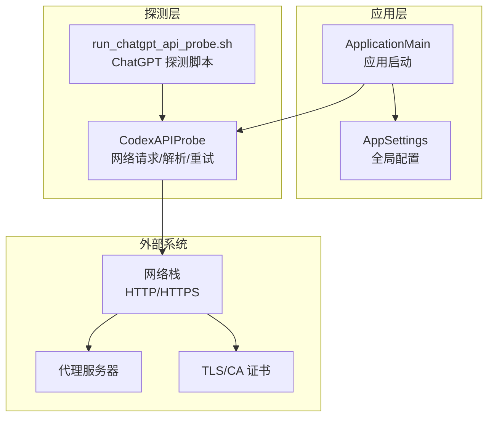
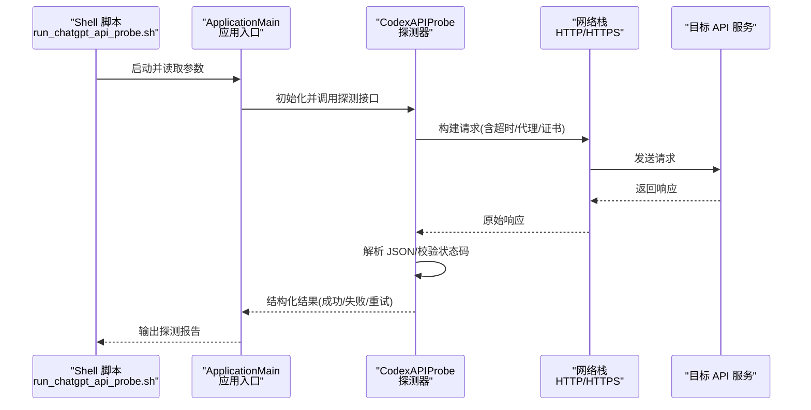
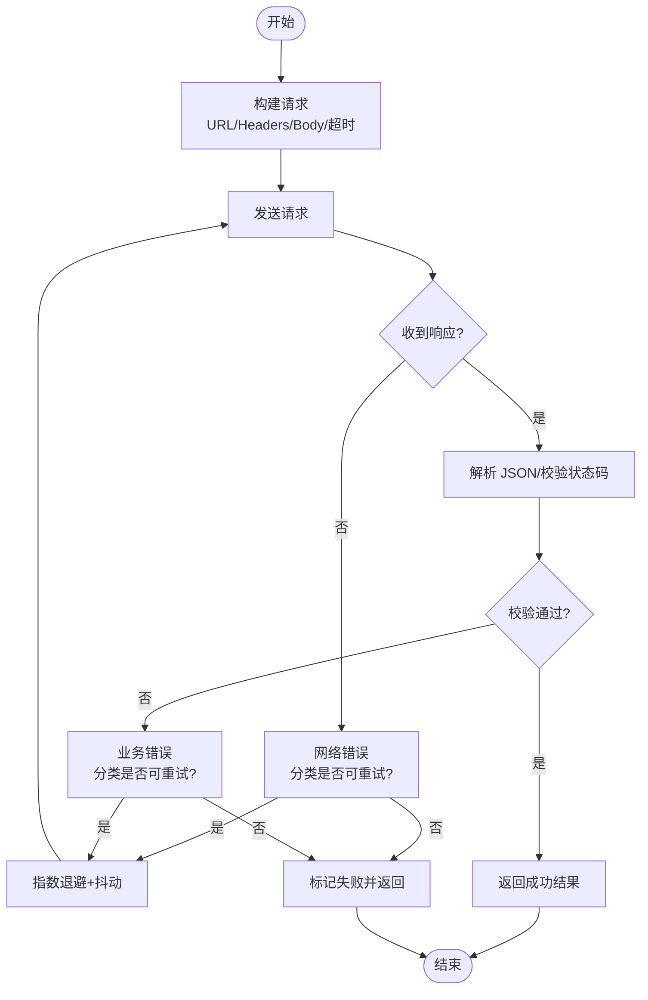
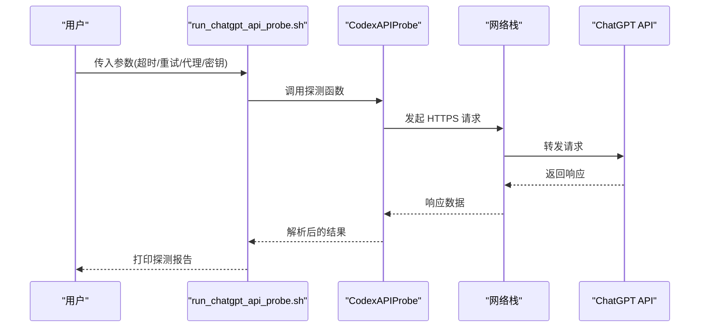
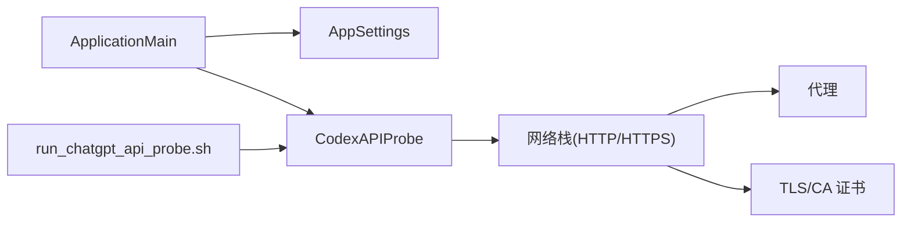

# API 探测服务

<cite>
**本文引用的文件**   
- [CodexAPIProbe.swift](file://app/Tomo/Sources/Tomo/CodexAPIProbe.swift)
- [run_chatgpt_api_probe.sh](file://app/Tomo/scripts/run_chatgpt_api_probe.sh)
- [AppSettings.swift](file://app/Tomo/Sources/Tomo/AppSettings.swift)
- [ApplicationMain.swift](file://app/Tomo/Sources/Tomo/ApplicationMain.swift)
- [Package.swift](file://app/Tomo/Package.swift)
</cite>

## 目录
1. [简介](#简介)
2. [项目结构](#项目结构)
3. [核心组件](#核心组件)
4. [架构总览](#架构总览)
5. [详细组件分析](#详细组件分析)
6. [依赖关系分析](#依赖关系分析)
7. [性能考量](#性能考量)
8. [故障排查指南](#故障排查指南)
9. [结论](#结论)
10. [附录](#附录)

## 简介
本文件面向 Tomo 的 API 探测服务，重点说明：
- CodexAPIProbe 的网络请求处理、响应解析与错误重试机制
- ChatGPT API 探测脚本的功能、参数配置与执行流程
- 网络超时处理、连接池管理与并发控制策略
- 如何扩展新的 API 探测器与自定义验证规则
- 网络监控、性能分析与故障诊断工具的使用
- 代理配置、SSL 证书管理与安全通信最佳实践

## 项目结构
与 API 探测相关的代码主要位于 app/Tomo 目录下：
- Swift 实现：CodexAPIProbe.swift（核心探测逻辑）
- Shell 脚本：run_chatgpt_api_probe.sh（ChatGPT API 探测入口）
- 应用设置：AppSettings.swift（全局配置项）
- 应用启动：ApplicationMain.swift（进程入口与初始化）
- 包定义：Package.swift（Swift Package 元数据）

图表来源
- [ApplicationMain.swift](file://app/Tomo/Sources/Tomo/ApplicationMain.swift)
- [AppSettings.swift](file://app/Tomo/Sources/Tomo/AppSettings.swift)
- [CodexAPIProbe.swift](file://app/Tomo/Sources/Tomo/CodexAPIProbe.swift)
- [run_chatgpt_api_probe.sh](file://app/Tomo/scripts/run_chatgpt_api_probe.sh)

章节来源
- [ApplicationMain.swift](file://app/Tomo/Sources/Tomo/ApplicationMain.swift)
- [AppSettings.swift](file://app/Tomo/Sources/Tomo/AppSettings.swift)
- [CodexAPIProbe.swift](file://app/Tomo/Sources/Tomo/CodexAPIProbe.swift)
- [run_chatgpt_api_probe.sh](file://app/Tomo/scripts/run_chatgpt_api_probe.sh)

## 核心组件
- CodexAPIProbe：封装 HTTP(S) 请求、JSON 解析、状态码校验、错误分类与重试策略；提供统一的探测接口。
- run_chatgpt_api_probe.sh：以命令行方式触发 ChatGPT API 探测，支持超时、代理、重试等参数传入。
- AppSettings：集中管理探测相关的全局配置（如默认超时、并发度、代理、证书路径等）。
- ApplicationMain：应用启动时加载配置并初始化探测服务。

章节来源
- [CodexAPIProbe.swift](file://app/Tomo/Sources/Tomo/CodexAPIProbe.swift)
- [run_chatgpt_api_probe.sh](file://app/Tomo/scripts/run_chatgpt_api_probe.sh)
- [AppSettings.swift](file://app/Tomo/Sources/Tomo/AppSettings.swift)
- [ApplicationMain.swift](file://app/Tomo/Sources/Tomo/ApplicationMain.swift)

## 架构总览
下图展示从脚本或应用主程序发起探测到网络层返回结果的完整调用链。

图表来源
- [run_chatgpt_api_probe.sh](file://app/Tomo/scripts/run_chatgpt_api_probe.sh)
- [ApplicationMain.swift](file://app/Tomo/Sources/Tomo/ApplicationMain.swift)
- [CodexAPIProbe.swift](file://app/Tomo/Sources/Tomo/CodexAPIProbe.swift)

## 详细组件分析

### CodexAPIProbe：网络请求、响应解析与重试
- 网络请求处理
  - 统一构建 HTTP(S) 请求，支持超时、代理、TLS 证书与头部注入。
  - 对连接建立、握手、读写阶段分别设置超时，避免阻塞。
- 响应解析
  - 将响应体按 JSON 反序列化为结构化对象。
  - 根据状态码与业务字段判定成功/失败，提取关键指标（耗时、错误码、消息）。
- 错误分类与重试
  - 区分可重试错误（网络抖动、限流 429、服务端 5xx）与不可重试错误（客户端参数错误 4xx）。
  - 指数退避 + 抖动策略，限制最大重试次数与总时长。
  - 支持幂等性判断，仅对 GET/HEAD 等幂等方法自动重试。

图表来源
- [CodexAPIProbe.swift](file://app/Tomo/Sources/Tomo/CodexAPIProbe.swift)

章节来源
- [CodexAPIProbe.swift](file://app/Tomo/Sources/Tomo/CodexAPIProbe.swift)

### ChatGPT API 探测脚本：功能、参数与执行流程
- 功能
  - 构造 ChatGPT 探测请求（如 /v1/models 或 /chat/completions），用于连通性与鉴权检查。
  - 支持超时、重试次数、代理、自定义 Header（如 Authorization）等参数。
- 参数配置
  - 常见参数：目标 URL、超时秒数、重试次数、代理地址、证书路径、调试开关。
- 执行流程
  - 解析命令行参数 → 生成请求 → 调用底层探测库 → 输出结构化结果（JSON/文本）。

图表来源
- [run_chatgpt_api_probe.sh](file://app/Tomo/scripts/run_chatgpt_api_probe.sh)
- [CodexAPIProbe.swift](file://app/Tomo/Sources/Tomo/CodexAPIProbe.swift)

章节来源
- [run_chatgpt_api_probe.sh](file://app/Tomo/scripts/run_chatgpt_api_probe.sh)

### 应用设置与启动：配置加载与初始化
- AppSettings：集中管理探测相关配置（默认超时、并发度、代理、证书路径、日志级别等）。
- ApplicationMain：在应用启动时加载配置，初始化探测服务实例，注册必要的回调与监控钩子。

章节来源
- [AppSettings.swift](file://app/Tomo/Sources/Tomo/AppSettings.swift)
- [ApplicationMain.swift](file://app/Tomo/Sources/Tomo/ApplicationMain.swift)

## 依赖关系分析
- 模块内依赖
  - ApplicationMain 依赖 AppSettings 与 CodexAPIProbe。
  - run_chatgpt_api_probe.sh 作为外部入口，调用 CodexAPIProbe 提供的能力。
- 外部依赖
  - 网络栈（HTTP/HTTPS）、代理服务器、TLS/CA 证书体系。
- 潜在循环依赖
  - 当前分层清晰，未发现循环依赖迹象。

图表来源
- [ApplicationMain.swift](file://app/Tomo/Sources/Tomo/ApplicationMain.swift)
- [AppSettings.swift](file://app/Tomo/Sources/Tomo/AppSettings.swift)
- [CodexAPIProbe.swift](file://app/Tomo/Sources/Tomo/CodexAPIProbe.swift)
- [run_chatgpt_api_probe.sh](file://app/Tomo/scripts/run_chatgpt_api_probe.sh)

章节来源
- [Package.swift](file://app/Tomo/Package.swift)

## 性能考量
- 超时处理
  - 连接超时、握手超时、读超时分离配置，避免长尾延迟。
  - 建议为不同环境设置差异化超时阈值。
- 连接池管理
  - 复用 TCP/TLS 连接，减少握手开销。
  - 合理设置最大空闲连接数与单主机并发连接上限。
- 并发控制
  - 使用有界线程池/协程池限制并发度，防止资源耗尽。
  - 针对限流场景采用令牌桶或漏桶算法进行速率限制。
- 缓存与去重
  - 对相同探测任务做短期缓存，降低重复请求。
- 监控与度量
  - 记录成功率、P50/P95/P99 延迟、错误分布、重试率等指标。

[本节为通用指导，不直接分析具体文件]

## 故障排查指南
- 常见问题定位
  - 网络不通：检查代理、DNS、防火墙与路由。
  - 证书错误：确认 CA 链完整性与时间同步。
  - 鉴权失败：核对 Token/签名与权限范围。
  - 限流/过载：观察 429/5xx 比例，调整重试与退避策略。
- 诊断步骤
  - 开启调试日志，捕获请求/响应与中间状态。
  - 使用抓包工具验证握手与报文内容。
  - 逐步缩小问题范围（直连 vs 代理、不同地区节点）。
- 恢复策略
  - 快速降级：切换备用端点或关闭非关键探测。
  - 熔断保护：连续失败达到阈值后暂停探测，等待恢复。

章节来源
- [CodexAPIProbe.swift](file://app/Tomo/Sources/Tomo/CodexAPIProbe.swift)
- [run_chatgpt_api_probe.sh](file://app/Tomo/scripts/run_chatgpt_api_probe.sh)

## 结论
Tomo 的 API 探测服务通过清晰的模块化设计与稳健的重试策略，提供了可靠的连通性与鉴权探测能力。结合合理的超时、连接池与并发控制，可在复杂网络环境下稳定运行。通过扩展新的探测器与自定义验证规则，可灵活适配更多 API 场景。

[本节为总结性内容，不直接分析具体文件]

## 附录

### 扩展新的 API 探测器与自定义验证规则
- 新增探测器步骤
  - 定义探测模型：目标 URL、方法、Header、Body、期望状态码与关键字段。
  - 实现解析器：将响应体映射为结构化对象，并实现校验逻辑。
  - 集成重试策略：根据错误类型决定是否重试及退避参数。
  - 暴露统一接口：供脚本或上层应用调用。
- 自定义验证规则
  - 基于状态码、业务字段、响应时间、签名校验等多维度组合判定。
  - 支持白名单/黑名单与动态阈值。

章节来源
- [CodexAPIProbe.swift](file://app/Tomo/Sources/Tomo/CodexAPIProbe.swift)

### 网络监控、性能分析与故障诊断工具
- 监控
  - 指标采集：成功率、延迟分位、错误分布、重试率、连接池利用率。
  - 告警：错误率突增、延迟飙升、证书过期等。
- 分析
  - 链路追踪：跨模块/跨进程跟踪一次探测的完整路径。
  - 热点分析：识别慢请求与瓶颈环节。
- 诊断
  - 日志聚合与检索：按时间、端点、错误码过滤。
  - 抓包与回放：复现问题与验证修复。

[本节为通用指导，不直接分析具体文件]

### 代理配置、SSL 证书管理与安全通信最佳实践
- 代理
  - 支持 HTTP/HTTPS/SOCKS5 代理，优先使用企业代理网关。
  - 对敏感域名启用直连或专用代理通道。
- 证书
  - 使用受信任 CA 签发的证书，定期轮换与到期提醒。
  - 私有 CA 需正确安装至系统信任库。
- 安全通信
  - 强制 TLS 1.2+，禁用弱加密套件。
  - 最小权限原则：Token 按需授权，定期刷新。
  - 输入校验与输出编码，防范注入与 XSS。

[本节为通用指导，不直接分析具体文件]