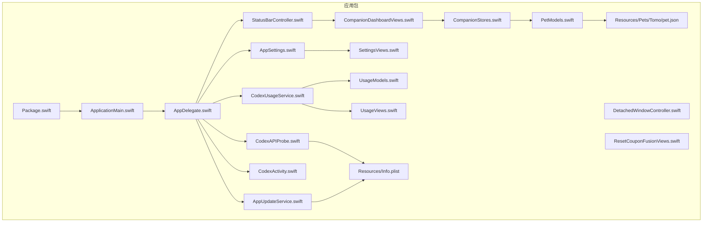
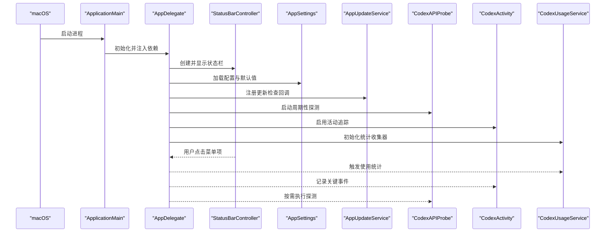
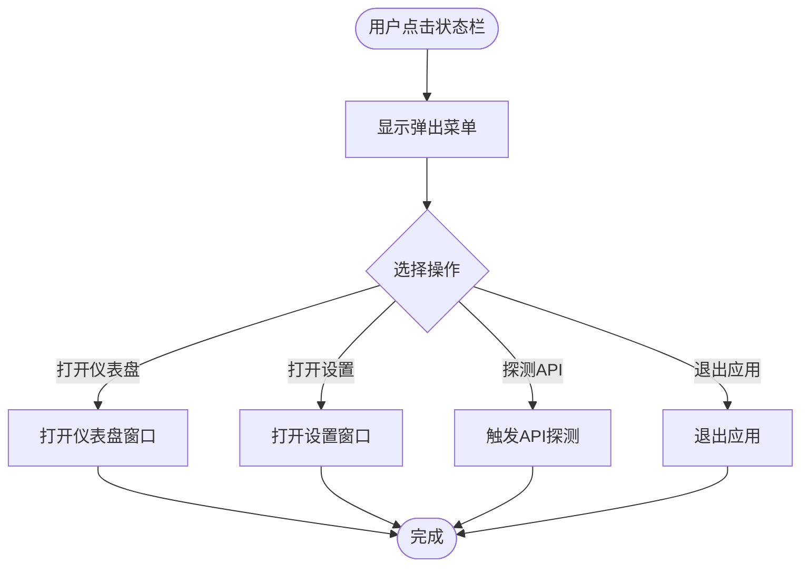
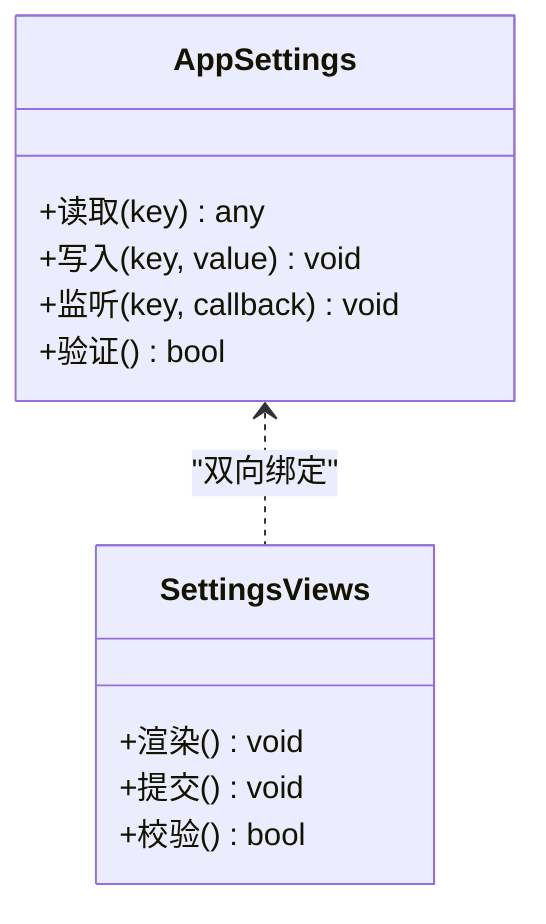
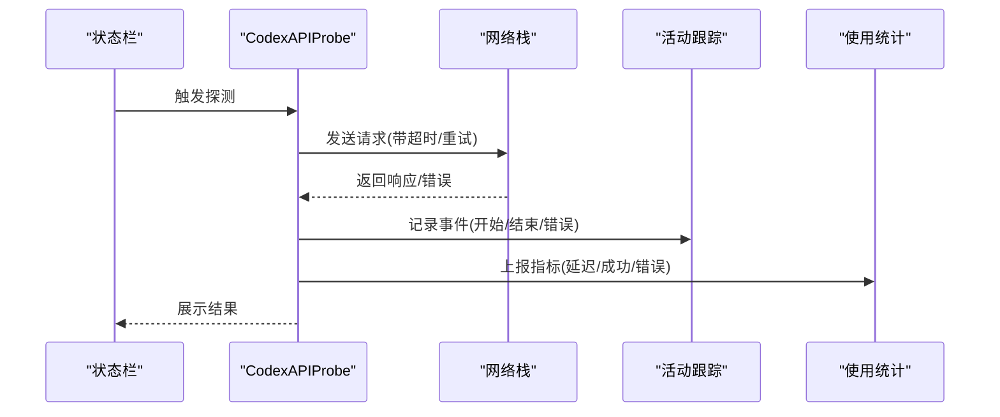
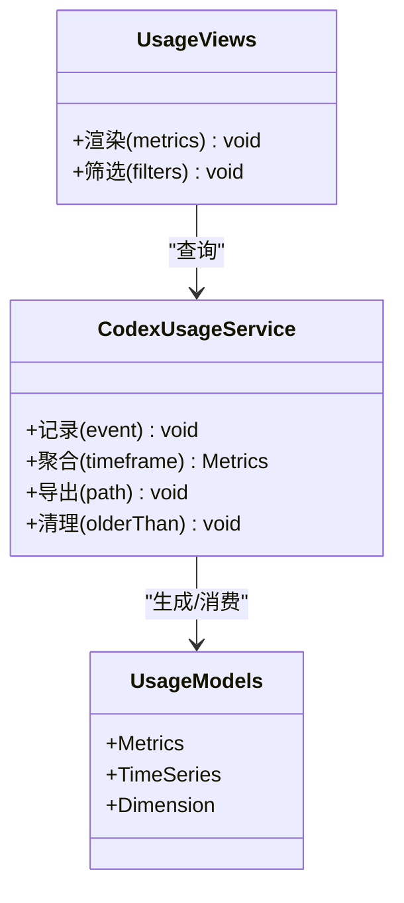
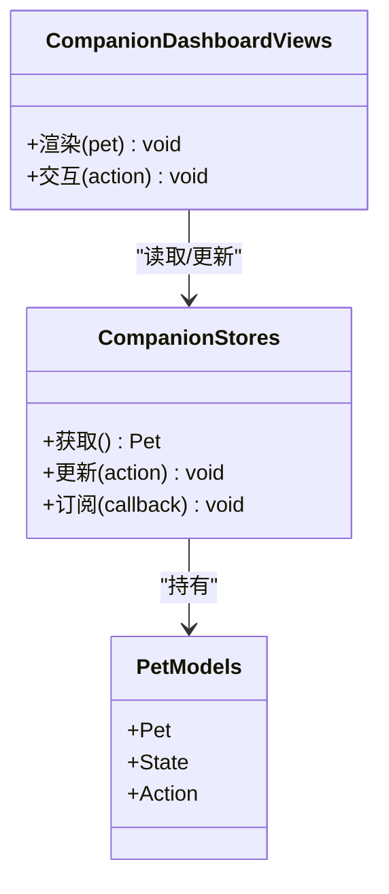
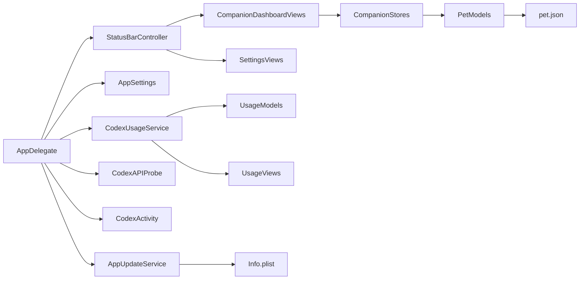

# Tomo 主应用

<cite>
**本文档引用的文件**   
- [AppDelegate.swift](file://app/Tomo/Sources/Tomo/AppDelegate.swift)
- [ApplicationMain.swift](file://app/Tomo/Sources/Tomo/ApplicationMain.swift)
- [AppSettings.swift](file://app/Tomo/Sources/Tomo/AppSettings.swift)
- [AppUpdateService.swift](file://app/Tomo/Sources/Tomo/AppUpdateService.swift)
- [CodexAPIProbe.swift](file://app/Tomo/Sources/Tomo/CodexAPIProbe.swift)
- [CodexActivity.swift](file://app/Tomo/Sources/Tomo/CodexActivity.swift)
- [CodexUsageService.swift](file://app/Tomo/Sources/Tomo/CodexUsageService.swift)
- [CompanionDashboardViews.swift](file://app/Tomo/Sources/Tomo/CompanionDashboardViews.swift)
- [CompanionStores.swift](file://app/Tomo/Sources/Tomo/CompanionStores.swift)
- [DetachedWindowController.swift](file://app/Tomo/Sources/Tomo/DetachedWindowController.swift)
- [PetModels.swift](file://app/Tomo/Sources/Tomo/PetModels.swift)
- [ResetCouponFusionViews.swift](file://app/Tomo/Sources/Tomo/ResetCouponFusionViews.swift)
- [SettingsViews.swift](file://app/Tomo/Sources/Tomo/SettingsViews.swift)
- [StatusBarController.swift](file://app/Tomo/Sources/Tomo/StatusBarController.swift)
- [UsageModels.swift](file://app/Tomo/Sources/Tomo/UsageModels.swift)
- [UsageViews.swift](file://app/Tomo/Sources/Tomo/UsageViews.swift)
- [Package.swift](file://app/Tomo/Package.swift)
- [package_app.sh](file://app/Tomo/package_app.sh)
- [rebuild_and_run.sh](file://app/Tomo/rebuild_and_run.sh)
- [release_app.sh](file://app/Tomo/release_app.sh)
- [run_chatgpt_api_probe.sh](file://app/Tomo/scripts/run_chatgpt_api_probe.sh)
- [Info.plist](file://app/Tomo/Resources/Info.plist)
- [pet.json](file://app/Tomo/Resources/Pets/Tomo/pet.json)
</cite>

## 目录
1. [简介](#简介)
2. [项目结构](#项目结构)
3. [核心组件](#核心组件)
4. [架构总览](#架构总览)
5. [详细组件分析](#详细组件分析)
6. [依赖关系分析](#依赖关系分析)
7. [性能考虑](#性能考虑)
8. [故障排查指南](#故障排查指南)
9. [结论](#结论)
10. [附录](#附录)

## 简介
本文件为 Tomo 主应用的权威技术文档，聚焦以下目标：
- 深入解释应用启动流程、AppDelegate 实现、状态栏控制器与设置管理系统。
- 详细描述核心功能模块：宠物伴侣系统、使用统计服务、API 探测器、活动跟踪。
- 说明架构设计模式：数据流、事件处理与用户界面交互。
- 提供扩展功能的实践指引与代码示例路径。
- 文档化配置选项、环境变量与自定义设置。
- 总结错误处理策略、性能优化建议与调试技巧。

## 项目结构
Tomo 主应用采用 Swift Package + macOS App 的组织方式，核心源码位于 app/Tomo/Sources/Tomo，资源位于 Resources，脚本位于 scripts 与根级 shell 脚本用于构建与发布。

图表来源
- [Package.swift](file://app/Tomo/Package.swift)
- [ApplicationMain.swift](file://app/Tomo/Sources/Tomo/ApplicationMain.swift)
- [AppDelegate.swift](file://app/Tomo/Sources/Tomo/AppDelegate.swift)
- [StatusBarController.swift](file://app/Tomo/Sources/Tomo/StatusBarController.swift)
- [AppSettings.swift](file://app/Tomo/Sources/Tomo/AppSettings.swift)
- [AppUpdateService.swift](file://app/Tomo/Sources/Tomo/AppUpdateService.swift)
- [CodexAPIProbe.swift](file://app/Tomo/Sources/Tomo/CodexAPIProbe.swift)
- [CodexActivity.swift](file://app/Tomo/Sources/Tomo/CodexActivity.swift)
- [CodexUsageService.swift](file://app/Tomo/Sources/Tomo/CodexUsageService.swift)
- [CompanionDashboardViews.swift](file://app/Tomo/Sources/Tomo/CompanionDashboardViews.swift)
- [CompanionStores.swift](file://app/Tomo/Sources/Tomo/CompanionStores.swift)
- [PetModels.swift](file://app/Tomo/Sources/Tomo/PetModels.swift)
- [DetachedWindowController.swift](file://app/Tomo/Sources/Tomo/DetachedWindowController.swift)
- [ResetCouponFusionViews.swift](file://app/Tomo/Sources/Tomo/ResetCouponFusionViews.swift)
- [SettingsViews.swift](file://app/Tomo/Sources/Tomo/SettingsViews.swift)
- [UsageModels.swift](file://app/Tomo/Sources/Tomo/UsageModels.swift)
- [UsageViews.swift](file://app/Tomo/Sources/Tomo/UsageViews.swift)
- [Info.plist](file://app/Tomo/Resources/Info.plist)
- [pet.json](file://app/Tomo/Resources/Pets/Tomo/pet.json)

章节来源
- [Package.swift](file://app/Tomo/Package.swift)
- [ApplicationMain.swift](file://app/Tomo/Sources/Tomo/ApplicationMain.swift)
- [AppDelegate.swift](file://app/Tomo/Sources/Tomo/AppDelegate.swift)

## 核心组件
- 应用入口与生命周期
  - ApplicationMain：应用进程入口，负责初始化运行环境与启动 AppDelegate。
  - AppDelegate：集中管理应用生命周期、菜单、窗口、状态栏、后台任务与全局状态。
- 状态栏控制器
  - StatusBarController：管理菜单栏图标、弹出菜单、点击行为与快捷操作入口。
- 设置管理系统
  - AppSettings：统一读取/写入应用配置（如 API Key、代理、主题、自动更新开关等）。
  - SettingsViews：设置面板 UI，绑定 AppSettings 的键值，支持实时预览与校验。
- 更新服务
  - AppUpdateService：检查版本、下载与安装更新，结合 Info.plist 的版本信息。
- API 探测器
  - CodexAPIProbe：探测外部 API（如 ChatGPT）可达性与延迟，输出诊断结果。
- 活动跟踪
  - CodexActivity：记录关键用户动作与系统事件，便于分析与排障。
- 使用统计服务
  - CodexUsageService：聚合使用指标（调用次数、耗时、错误率），持久化并暴露给 UI。
  - UsageModels / UsageViews：统计模型与可视化视图。
- 宠物伴侣系统
  - PetModels：宠物实体与状态定义。
  - CompanionStores：宠物状态存储与变更通知。
  - CompanionDashboardViews：伴侣仪表盘 UI，展示状态、情绪、互动反馈。
- 窗口管理
  - DetachedWindowController：独立窗口控制，承载仪表盘或设置页。
- 其他
  - ResetCouponFusionViews：重置优惠券融合相关 UI。
  - 脚本：构建、打包、发布与 API 探测辅助脚本。

章节来源
- [ApplicationMain.swift](file://app/Tomo/Sources/Tomo/ApplicationMain.swift)
- [AppDelegate.swift](file://app/Tomo/Sources/Tomo/AppDelegate.swift)
- [StatusBarController.swift](file://app/Tomo/Sources/Tomo/StatusBarController.swift)
- [AppSettings.swift](file://app/Tomo/Sources/Tomo/AppSettings.swift)
- [SettingsViews.swift](file://app/Tomo/Sources/Tomo/SettingsViews.swift)
- [AppUpdateService.swift](file://app/Tomo/Sources/Tomo/AppUpdateService.swift)
- [CodexAPIProbe.swift](file://app/Tomo/Sources/Tomo/CodexAPIProbe.swift)
- [CodexActivity.swift](file://app/Tomo/Sources/Tomo/CodexActivity.swift)
- [CodexUsageService.swift](file://app/Tomo/Sources/Tomo/CodexUsageService.swift)
- [UsageModels.swift](file://app/Tomo/Sources/Tomo/UsageModels.swift)
- [UsageViews.swift](file://app/Tomo/Sources/Tomo/UsageViews.swift)
- [PetModels.swift](file://app/Tomo/Sources/Tomo/PetModels.swift)
- [CompanionStores.swift](file://app/Tomo/Sources/Tomo/CompanionStores.swift)
- [CompanionDashboardViews.swift](file://app/Tomo/Sources/Tomo/CompanionDashboardViews.swift)
- [DetachedWindowController.swift](file://app/Tomo/Sources/Tomo/DetachedWindowController.swift)
- [ResetCouponFusionViews.swift](file://app/Tomo/Sources/Tomo/ResetCouponFusionViews.swift)

## 架构总览
Tomo 采用“入口-控制器-服务-视图”的分层架构：
- 入口层：ApplicationMain 启动应用，创建 AppDelegate。
- 控制层：AppDelegate 协调各子系统；StatusBarController 作为用户交互入口。
- 服务层：AppSettings、AppUpdateService、CodexAPIProbe、CodexActivity、CodexUsageService。
- 数据层：CompanionStores、UsageModels、PetModels。
- 视图层：SettingsViews、CompanionDashboardViews、UsageViews、ResetCouponFusionViews。

图表来源
- [ApplicationMain.swift](file://app/Tomo/Sources/Tomo/ApplicationMain.swift)
- [AppDelegate.swift](file://app/Tomo/Sources/Tomo/AppDelegate.swift)
- [StatusBarController.swift](file://app/Tomo/Sources/Tomo/StatusBarController.swift)
- [AppSettings.swift](file://app/Tomo/Sources/Tomo/AppSettings.swift)
- [AppUpdateService.swift](file://app/Tomo/Sources/Tomo/AppUpdateService.swift)
- [CodexAPIProbe.swift](file://app/Tomo/Sources/Tomo/CodexAPIProbe.swift)
- [CodexActivity.swift](file://app/Tomo/Sources/Tomo/CodexActivity.swift)
- [CodexUsageService.swift](file://app/Tomo/Sources/Tomo/CodexUsageService.swift)

## 详细组件分析

### 应用启动与 AppDelegate
- 启动流程
  - ApplicationMain 初始化运行时环境并实例化 AppDelegate。
  - AppDelegate 在应用生命周期方法中完成：
    - 菜单与窗口初始化
    - 状态栏控制器装配
    - 设置系统加载与验证
    - 更新服务订阅
    - API 探测器调度
    - 活动跟踪与使用统计初始化
- 关键职责
  - 集中式依赖注入，避免循环依赖
  - 事件总线或闭包回调分发用户操作
  - 错误兜底与降级策略（例如网络不可用时的本地缓存）

章节来源
- [ApplicationMain.swift](file://app/Tomo/Sources/Tomo/ApplicationMain.swift)
- [AppDelegate.swift](file://app/Tomo/Sources/Tomo/AppDelegate.swift)

### 状态栏控制器
- 职责
  - 管理菜单栏图标与弹出菜单
  - 响应点击、右键菜单、快捷键
  - 打开仪表盘、设置页、执行快速操作（如立即探测 API）
- 交互流程
  - 用户点击状态栏图标 -> 弹出菜单 -> 选择操作 -> 通过 AppDelegate 路由到对应服务或视图

图表来源
- [StatusBarController.swift](file://app/Tomo/Sources/Tomo/StatusBarController.swift)
- [CompanionDashboardViews.swift](file://app/Tomo/Sources/Tomo/CompanionDashboardViews.swift)
- [SettingsViews.swift](file://app/Tomo/Sources/Tomo/SettingsViews.swift)
- [CodexAPIProbe.swift](file://app/Tomo/Sources/Tomo/CodexAPIProbe.swift)

章节来源
- [StatusBarController.swift](file://app/Tomo/Sources/Tomo/StatusBarController.swift)

### 设置管理系统
- AppSettings
  - 提供统一的配置读写接口，支持默认值、类型校验、热重载。
  - 常见键：API 端点、超时、重试次数、主题、自动更新开关、日志级别等。
- SettingsViews
  - 将配置映射到表单控件，支持即时校验与保存提示。
  - 对敏感字段（如密钥）进行掩码显示与权限保护。

图表来源
- [AppSettings.swift](file://app/Tomo/Sources/Tomo/AppSettings.swift)
- [SettingsViews.swift](file://app/Tomo/Sources/Tomo/SettingsViews.swift)

章节来源
- [AppSettings.swift](file://app/Tomo/Sources/Tomo/AppSettings.swift)
- [SettingsViews.swift](file://app/Tomo/Sources/Tomo/SettingsViews.swift)

### 更新服务
- AppUpdateService
  - 定时检查新版本，比较 Info.plist 中的版本与远程元数据。
  - 支持静默下载与提示安装，失败时回退到浏览器跳转。
  - 与 AppDelegate 集成，确保在合适时机触发检查。

章节来源
- [AppUpdateService.swift](file://app/Tomo/Sources/Tomo/AppUpdateService.swift)
- [Info.plist](file://app/Tomo/Resources/Info.plist)

### API 探测器
- CodexAPIProbe
  - 周期性或按需发起 HTTP 请求，测量延迟、成功率与错误码分布。
  - 将结果写入活动跟踪与使用统计，供仪表盘展示。
  - 可配置重试、超时与代理。

图表来源
- [CodexAPIProbe.swift](file://app/Tomo/Sources/Tomo/CodexAPIProbe.swift)
- [CodexActivity.swift](file://app/Tomo/Sources/Tomo/CodexActivity.swift)
- [CodexUsageService.swift](file://app/Tomo/Sources/Tomo/CodexUsageService.swift)

章节来源
- [CodexAPIProbe.swift](file://app/Tomo/Sources/Tomo/CodexAPIProbe.swift)
- [run_chatgpt_api_probe.sh](file://app/Tomo/scripts/run_chatgpt_api_probe.sh)

### 活动跟踪
- CodexActivity
  - 记录用户操作、系统事件与异常堆栈。
  - 支持分级日志、采样与导出，便于问题定位。
  - 与使用统计联动，形成“行为-指标”闭环。

章节来源
- [CodexActivity.swift](file://app/Tomo/Sources/Tomo/CodexActivity.swift)

### 使用统计服务
- CodexUsageService
  - 聚合调用次数、平均耗时、错误率、峰值时段等指标。
  - 持久化存储（本地文件或沙盒），定期清理与压缩。
  - 暴露查询接口供 UsageViews 渲染图表。
- UsageModels / UsageViews
  - 模型定义时间序列、维度标签与聚合函数。
  - 视图负责绘制折线/柱状图与筛选器。

图表来源
- [CodexUsageService.swift](file://app/Tomo/Sources/Tomo/CodexUsageService.swift)
- [UsageModels.swift](file://app/Tomo/Sources/Tomo/UsageModels.swift)
- [UsageViews.swift](file://app/Tomo/Sources/Tomo/UsageViews.swift)

章节来源
- [CodexUsageService.swift](file://app/Tomo/Sources/Tomo/CodexUsageService.swift)
- [UsageModels.swift](file://app/Tomo/Sources/Tomo/UsageModels.swift)
- [UsageViews.swift](file://app/Tomo/Sources/Tomo/UsageViews.swift)

### 宠物伴侣系统
- PetModels
  - 定义宠物的属性、状态机（饥饿、开心、疲倦等）、成长曲线。
- CompanionStores
  - 管理宠物状态变更、持久化与事件广播。
- CompanionDashboardViews
  - 仪表盘展示宠物状态、互动按钮、动画反馈。

图表来源
- [PetModels.swift](file://app/Tomo/Sources/Tomo/PetModels.swift)
- [CompanionStores.swift](file://app/Tomo/Sources/Tomo/CompanionStores.swift)
- [CompanionDashboardViews.swift](file://app/Tomo/Sources/Tomo/CompanionDashboardViews.swift)
- [pet.json](file://app/Tomo/Resources/Pets/Tomo/pet.json)

章节来源
- [PetModels.swift](file://app/Tomo/Sources/Tomo/PetModels.swift)
- [CompanionStores.swift](file://app/Tomo/Sources/Tomo/CompanionStores.swift)
- [CompanionDashboardViews.swift](file://app/Tomo/Sources/Tomo/CompanionDashboardViews.swift)
- [pet.json](file://app/Tomo/Resources/Pets/Tomo/pet.json)

### 窗口管理与设置页
- DetachedWindowController
  - 管理独立窗口的创建、显示与销毁，承载仪表盘或设置页。
- SettingsViews
  - 设置面板 UI，与 AppSettings 双向绑定，支持校验与保存。

章节来源
- [DetachedWindowController.swift](file://app/Tomo/Sources/Tomo/DetachedWindowController.swift)
- [SettingsViews.swift](file://app/Tomo/Sources/Tomo/SettingsViews.swift)

### 重置优惠券融合视图
- ResetCouponFusionViews
  - 提供重置优惠券相关的交互界面，可能涉及后端同步与本地缓存合并。

章节来源
- [ResetCouponFusionViews.swift](file://app/Tomo/Sources/Tomo/ResetCouponFusionViews.swift)

## 依赖关系分析
- 内部依赖
  - AppDelegate 依赖 StatusBarController、AppSettings、AppUpdateService、CodexAPIProbe、CodexActivity、CodexUsageService。
  - 视图层依赖对应的 Store/Service 以获取数据与触发操作。
- 外部依赖
  - Info.plist 提供版本与应用标识。
  - pet.json 提供宠物初始配置。
  - 脚本用于构建、打包与探测。

图表来源
- [AppDelegate.swift](file://app/Tomo/Sources/Tomo/AppDelegate.swift)
- [StatusBarController.swift](file://app/Tomo/Sources/Tomo/StatusBarController.swift)
- [AppSettings.swift](file://app/Tomo/Sources/Tomo/AppSettings.swift)
- [AppUpdateService.swift](file://app/Tomo/Sources/Tomo/AppUpdateService.swift)
- [CodexAPIProbe.swift](file://app/Tomo/Sources/Tomo/CodexAPIProbe.swift)
- [CodexActivity.swift](file://app/Tomo/Sources/Tomo/CodexActivity.swift)
- [CodexUsageService.swift](file://app/Tomo/Sources/Tomo/CodexUsageService.swift)
- [CompanionDashboardViews.swift](file://app/Tomo/Sources/Tomo/CompanionDashboardViews.swift)
- [CompanionStores.swift](file://app/Tomo/Sources/Tomo/CompanionStores.swift)
- [PetModels.swift](file://app/Tomo/Sources/Tomo/PetModels.swift)
- [pet.json](file://app/Tomo/Resources/Pets/Tomo/pet.json)
- [Info.plist](file://app/Tomo/Resources/Info.plist)

章节来源
- [AppDelegate.swift](file://app/Tomo/Sources/Tomo/AppDelegate.swift)
- [Package.swift](file://app/Tomo/Package.swift)

## 性能考虑
- 网络与 I/O
  - 合理设置超时与重试上限，避免阻塞主线程。
  - 使用后台队列进行探测与统计写入，减少 UI 卡顿。
- 内存与存储
  - 限制日志与统计数据的保留周期，定期归档与清理。
  - 宠物状态与设置变更采用增量持久化，避免全量写盘。
- UI 渲染
  - 视图层按需刷新，避免频繁重绘。
  - 图表数据分页加载与节流更新。
- 更新检查
  - 仅在空闲或用户主动触发时检查更新，避免影响前台体验。

[本节为通用指导，不直接分析具体文件]

## 故障排查指南
- 常见问题
  - API 探测失败：检查网络连通性、代理设置与证书信任。
  - 设置无法保存：确认权限与磁盘空间，查看 AppSettings 校验逻辑。
  - 更新失败：核对 Info.plist 版本与远程元数据一致性。
- 调试技巧
  - 启用详细日志（CodexActivity），过滤关键事件。
  - 使用 UsageViews 的筛选器定位异常时段。
  - 通过脚本 run_chatgpt_api_probe.sh 快速复现网络问题。
- 错误处理策略
  - 网络错误：重试+指数退避，最终降级为本地缓存或提示用户。
  - 解析错误：记录原始响应，提供回退数据结构。
  - 权限错误：引导用户授权或切换账户。

章节来源
- [CodexActivity.swift](file://app/Tomo/Sources/Tomo/CodexActivity.swift)
- [CodexUsageService.swift](file://app/Tomo/Sources/Tomo/CodexUsageService.swift)
- [AppSettings.swift](file://app/Tomo/Sources/Tomo/AppSettings.swift)
- [AppUpdateService.swift](file://app/Tomo/Sources/Tomo/AppUpdateService.swift)
- [run_chatgpt_api_probe.sh](file://app/Tomo/scripts/run_chatgpt_api_probe.sh)

## 结论
Tomo 主应用以清晰的层次结构与模块化设计实现了状态栏驱动的用户交互、完善的设置管理、稳定的更新机制、可靠的 API 探测与丰富的使用统计。宠物伴侣系统通过状态存储与视图解耦，具备良好的可扩展性。遵循本文档的扩展指引与最佳实践，可在不破坏现有架构的前提下快速增强功能。

[本节为总结性内容，不直接分析具体文件]

## 附录
- 构建与发布
  - package_app.sh：打包应用产物。
  - rebuild_and_run.sh：重建并运行开发版本。
  - release_app.sh：生成发布包。
- 配置与环境变量
  - Info.plist：应用标识、版本、权限声明。
  - pet.json：宠物初始配置与行为参数。
  - AppSettings：运行时配置键值（API 端点、超时、重试、主题、日志级别等）。
- 扩展示例（路径参考）
  - 新增设置项：在 AppSettings 中添加键与默认值，并在 SettingsViews 中渲染与校验。
  - 新增统计指标：在 CodexUsageService 中记录事件，UsageModels 定义维度，UsageViews 渲染图表。
  - 新增探测器：在 CodexAPIProbe 中增加新的探测任务，接入活动跟踪与统计。
  - 新增宠物行为：在 PetModels 中扩展状态与动作，CompanionStores 处理变更，CompanionDashboardViews 更新 UI。

章节来源
- [package_app.sh](file://app/Tomo/package_app.sh)
- [rebuild_and_run.sh](file://app/Tomo/rebuild_and_run.sh)
- [release_app.sh](file://app/Tomo/release_app.sh)
- [Info.plist](file://app/Tomo/Resources/Info.plist)
- [pet.json](file://app/Tomo/Resources/Pets/Tomo/pet.json)
- [AppSettings.swift](file://app/Tomo/Sources/Tomo/AppSettings.swift)
- [SettingsViews.swift](file://app/Tomo/Sources/Tomo/SettingsViews.swift)
- [CodexUsageService.swift](file://app/Tomo/Sources/Tomo/CodexUsageService.swift)
- [UsageModels.swift](file://app/Tomo/Sources/Tomo/UsageModels.swift)
- [UsageViews.swift](file://app/Tomo/Sources/Tomo/UsageViews.swift)
- [CodexAPIProbe.swift](file://app/Tomo/Sources/Tomo/CodexAPIProbe.swift)
- [PetModels.swift](file://app/Tomo/Sources/Tomo/PetModels.swift)
- [CompanionStores.swift](file://app/Tomo/Sources/Tomo/CompanionStores.swift)
- [CompanionDashboardViews.swift](file://app/Tomo/Sources/Tomo/CompanionDashboardViews.swift)