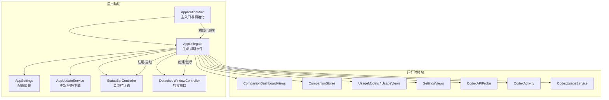
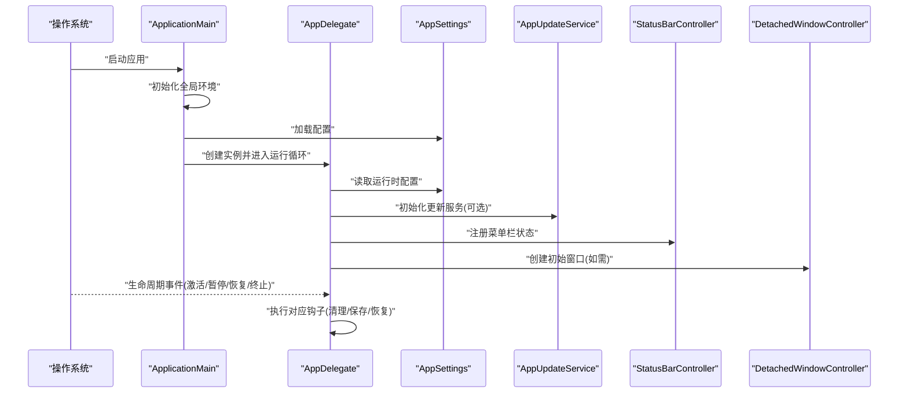
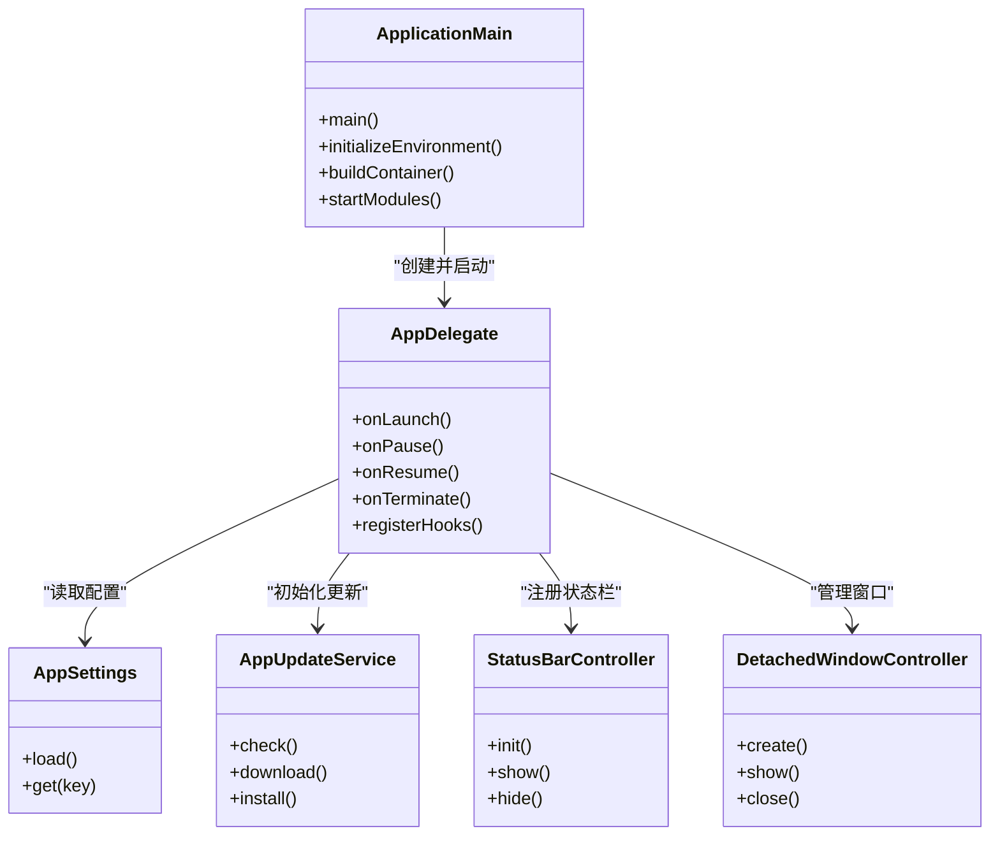

# 应用生命周期管理

<cite>
**本文引用的文件**   
- [AppDelegate.swift](file://app/Tomo/Sources/Tomo/AppDelegate.swift)
- [ApplicationMain.swift](file://app/Tomo/Sources/Tomo/ApplicationMain.swift)
- [AppSettings.swift](file://app/Tomo/Sources/Tomo/AppSettings.swift)
- [AppUpdateService.swift](file://app/Tomo/Sources/Tomo/AppUpdateService.swift)
- [CodexAPIProbe.swift](file://app/Tomo/Sources/Tomo/CodexAPIProbe.swift)
- [CodexActivity.swift](file://app/Tomo/Sources/Tomo/CodexActivity.swift)
- [CodexUsageService.swift](file://app/Tomo/Sources/Tomo/CodexUsageService.swift)
- [CompanionDashboardViews.swift](file://app/Tomo/Sources/Tomo/CompanionDashboardViews.swift)
- [CompanionStores.swift](file://app/Tomo/Sources/Tomo/CompanionStores.swift)
- [DetachedWindowController.swift](file://app/Tomo/Sources/Tomo/DetachedWindowController.swift)
- [PetModels.swift](file://app/Tomo/Sources/Tomo/PetModels.swift)
- [ResetCouponFusionViews.swift](file://app/Tomo/Sources/Tomo/ResetCouponFusionViews.swift)
- [SettingsViews.swift](file://app/Tomo/Sources/Tomo/SettingsViews.swift)
- [StatusBarController.swift](file://app/Tomo/Sources/Tomo/StatusBarController.swift)
- [UsageModels.swift](file://app/Tomo/Sources/Tomo/UsageModels.swift)
- [UsageViews.swift](file://app/Tomo/Sources/Tomo/UsageViews.swift)
</cite>

## 目录
1. [简介](#简介)
2. [项目结构](#项目结构)
3. [核心组件](#核心组件)
4. [架构总览](#架构总览)
5. [详细组件分析](#详细组件分析)
6. [依赖关系分析](#依赖关系分析)
7. [性能考虑](#性能考虑)
8. [故障排查指南](#故障排查指南)
9. [结论](#结论)
10. [附录](#附录)

## 简介
本文件面向 Tomo 应用的“应用生命周期管理”，聚焦于 AppDelegate 与 ApplicationMain 的实现细节，涵盖应用启动、暂停、恢复与终止的生命周期事件处理；说明主入口点的初始化流程；阐述配置加载、依赖注入与模块注册机制；提供扩展生命周期钩子的实践方法；并总结错误处理策略、日志记录与调试技巧，以及性能监控与资源管理的最佳实践。

## 项目结构
Tomo 的 Swift 源码位于 app/Tomo/Sources/Tomo 目录下，其中与应用生命周期直接相关的核心文件包括：
- AppDelegate.swift：应用生命周期事件（启动、暂停、恢复、终止）的统一接入点
- ApplicationMain.swift：主入口点与初始化编排
- AppSettings.swift：应用配置加载与访问
- AppUpdateService.swift：应用更新服务（可能参与启动后检查或后台任务）
- StatusBarController.swift：菜单栏状态栏控制器（常驻进程场景下的 UI/交互）
- DetachedWindowController.swift：独立窗口控制器（多窗口/浮动窗口的生命周期由它协调）
- 其他业务模块（如 CompanionDashboardViews、CompanionStores、Usage*、SettingsViews 等）在启动后被按需注册或初始化

图表来源
- [AppDelegate.swift](file://app/Tomo/Sources/Tomo/AppDelegate.swift)
- [ApplicationMain.swift](file://app/Tomo/Sources/Tomo/ApplicationMain.swift)
- [AppSettings.swift](file://app/Tomo/Sources/Tomo/AppSettings.swift)
- [AppUpdateService.swift](file://app/Tomo/Sources/Tomo/AppUpdateService.swift)
- [StatusBarController.swift](file://app/Tomo/Sources/Tomo/StatusBarController.swift)
- [DetachedWindowController.swift](file://app/Tomo/Sources/Tomo/DetachedWindowController.swift)

章节来源
- [AppDelegate.swift](file://app/Tomo/Sources/Tomo/AppDelegate.swift)
- [ApplicationMain.swift](file://app/Tomo/Sources/Tomo/ApplicationMain.swift)
- [AppSettings.swift](file://app/Tomo/Sources/Tomo/AppSettings.swift)
- [AppUpdateService.swift](file://app/Tomo/Sources/Tomo/AppUpdateService.swift)
- [StatusBarController.swift](file://app/Tomo/Sources/Tomo/StatusBarController.swift)
- [DetachedWindowController.swift](file://app/Tomo/Sources/Tomo/DetachedWindowController.swift)

## 核心组件
- AppDelegate：集中处理应用生命周期事件，负责在合适时机初始化子系统、注册菜单项、启动后台任务、保存状态与释放资源。
- ApplicationMain：定义应用主入口点，完成全局环境准备、配置加载、依赖容器构建与关键模块的启动顺序编排。
- AppSettings：统一读取应用配置（本地偏好、环境变量、配置文件），为各模块提供只读配置视图。
- AppUpdateService：封装应用更新相关逻辑（检查、下载、安装提示），可在启动后或后台触发。
- StatusBarController：维护菜单栏图标与菜单行为，常作为常驻进程的入口与用户交互中心。
- DetachedWindowController：管理独立窗口（如浮窗、辅助面板）的创建、显示、隐藏与销毁。

章节来源
- [AppDelegate.swift](file://app/Tomo/Sources/Tomo/AppDelegate.swift)
- [ApplicationMain.swift](file://app/Tomo/Sources/Tomo/ApplicationMain.swift)
- [AppSettings.swift](file://app/Tomo/Sources/Tomo/AppSettings.swift)
- [AppUpdateService.swift](file://app/Tomo/Sources/Tomo/AppUpdateService.swift)
- [StatusBarController.swift](file://app/Tomo/Sources/Tomo/StatusBarController.swift)
- [DetachedWindowController.swift](file://app/Tomo/Sources/Tomo/DetachedWindowController.swift)

## 架构总览
下图展示了从主入口到生命周期事件的调用链路与模块协作关系。ApplicationMain 负责“先决条件”与“依赖装配”，随后将控制权交给 AppDelegate，由其根据系统回调分发具体职责。

图表来源
- [ApplicationMain.swift](file://app/Tomo/Sources/Tomo/ApplicationMain.swift)
- [AppDelegate.swift](file://app/Tomo/Sources/Tomo/AppDelegate.swift)
- [AppSettings.swift](file://app/Tomo/Sources/Tomo/AppSettings.swift)
- [AppUpdateService.swift](file://app/Tomo/Sources/Tomo/AppUpdateService.swift)
- [StatusBarController.swift](file://app/Tomo/Sources/Tomo/StatusBarController.swift)
- [DetachedWindowController.swift](file://app/Tomo/Sources/Tomo/DetachedWindowController.swift)

## 详细组件分析

### AppDelegate 生命周期事件处理
- 启动阶段：完成配置校验、服务初始化、UI 就绪（菜单栏、窗口）、后台任务启动。
- 暂停阶段：冻结非关键任务、保存临时状态、释放昂贵资源。
- 恢复阶段：恢复 UI 与后台任务、重新建立网络连接（如需要）。
- 终止阶段：持久化关键数据、关闭网络请求、释放内存与句柄。

建议实现要点
- 使用统一的日志前缀与级别，便于区分生命周期事件。
- 对耗时操作采用异步调度，避免阻塞主线程。
- 对可恢复的错误进行降级处理，确保应用仍可运行。
- 对不可恢复的错误进行上报与优雅退出。

章节来源
- [AppDelegate.swift](file://app/Tomo/Sources/Tomo/AppDelegate.swift)

### ApplicationMain 初始化流程与主入口点
- 解析命令行参数与环境变量。
- 初始化配置源（本地偏好、配置文件、环境变量）。
- 构建依赖容器（服务单例、工厂、仓库）。
- 按依赖顺序启动子系统（设置、更新、状态栏、窗口、业务模块）。
- 进入运行循环并等待系统生命周期回调。

章节来源
- [ApplicationMain.swift](file://app/Tomo/Sources/Tomo/ApplicationMain.swift)

### 配置加载、依赖注入与模块注册
- 配置加载：通过 AppSettings 聚合多来源配置，提供类型安全的访问接口。
- 依赖注入：在 ApplicationMain 中构建容器，向各模块注入所需服务（如网络、存储、日志）。
- 模块注册：在 AppDelegate 启动时按需注册 UI 模块、菜单项、快捷键与通知监听。

章节来源
- [AppSettings.swift](file://app/Tomo/Sources/Tomo/AppSettings.swift)
- [ApplicationMain.swift](file://app/Tomo/Sources/Tomo/ApplicationMain.swift)
- [AppDelegate.swift](file://app/Tomo/Sources/Tomo/AppDelegate.swift)

### 扩展生命周期钩子的实践
- 在 AppDelegate 中定义可扩展的钩子方法（如 onWillLaunch、onDidLaunch、onWillPause、onDidResume、onWillTerminate）。
- 提供注册 API，允许外部模块在启动前/后插入自定义逻辑（例如埋点、统计、第三方 SDK 初始化）。
- 保证钩子执行的幂等性与异常隔离，单个钩子失败不影响整体流程。

章节来源
- [AppDelegate.swift](file://app/Tomo/Sources/Tomo/AppDelegate.swift)

### 错误处理策略、日志记录与调试技巧
- 错误分类：可恢复错误（重试/降级）、不可恢复错误（上报/退出）。
- 日志分层：启动、配置、网络、UI、后台任务分别打点，支持开关与采样。
- 调试技巧：启用详细日志、捕获崩溃堆栈、导出诊断信息（配置快照、最近事件时间线）。

章节来源
- [AppDelegate.swift](file://app/Tomo/Sources/Tomo/AppDelegate.swift)
- [AppSettings.swift](file://app/Tomo/Sources/Tomo/AppSettings.swift)

### 性能监控与资源管理最佳实践
- 启动优化：延迟非关键初始化，合并 I/O 操作，预取必要资源。
- 内存管理：及时释放大对象，避免循环引用，使用弱引用持有 UI 对象。
- CPU 友好：后台任务限流与节流，避免频繁轮询，使用事件驱动。
- 监控指标：启动耗时、内存峰值、CPU 占用、网络请求成功率与延迟。

章节来源
- [AppDelegate.swift](file://app/Tomo/Sources/Tomo/AppDelegate.swift)
- [AppUpdateService.swift](file://app/Tomo/Sources/Tomo/AppUpdateService.swift)
- [StatusBarController.swift](file://app/Tomo/Sources/Tomo/StatusBarController.swift)
- [DetachedWindowController.swift](file://app/Tomo/Sources/Tomo/DetachedWindowController.swift)

## 依赖关系分析
- ApplicationMain 依赖 AppSettings 与 AppDelegate，负责装配与启动顺序。
- AppDelegate 依赖 AppUpdateService、StatusBarController、DetachedWindowController 及各类业务模块。
- 模块间通过依赖注入获取服务实例，降低耦合度，提升可测试性。

图表来源
- [ApplicationMain.swift](file://app/Tomo/Sources/Tomo/ApplicationMain.swift)
- [AppDelegate.swift](file://app/Tomo/Sources/Tomo/AppDelegate.swift)
- [AppSettings.swift](file://app/Tomo/Sources/Tomo/AppSettings.swift)
- [AppUpdateService.swift](file://app/Tomo/Sources/Tomo/AppUpdateService.swift)
- [StatusBarController.swift](file://app/Tomo/Sources/Tomo/StatusBarController.swift)
- [DetachedWindowController.swift](file://app/Tomo/Sources/Tomo/DetachedWindowController.swift)

章节来源
- [ApplicationMain.swift](file://app/Tomo/Sources/Tomo/ApplicationMain.swift)
- [AppDelegate.swift](file://app/Tomo/Sources/Tomo/AppDelegate.swift)
- [AppSettings.swift](file://app/Tomo/Sources/Tomo/AppSettings.swift)
- [AppUpdateService.swift](file://app/Tomo/Sources/Tomo/AppUpdateService.swift)
- [StatusBarController.swift](file://app/Tomo/Sources/Tomo/StatusBarController.swift)
- [DetachedWindowController.swift](file://app/Tomo/Sources/Tomo/DetachedWindowController.swift)

## 性能考虑
- 启动路径优化：将非关键初始化放入懒加载或后台队列，减少首屏耗时。
- 资源复用：共享网络客户端、数据库连接与缓存层，避免重复创建。
- 事件驱动：用通知/观察者替代定时轮询，降低 CPU 占用。
- 监控与回滚：对关键路径添加性能埋点，出现退化时快速回滚到稳定版本。

[本节为通用指导，不直接分析具体文件]

## 故障排查指南
- 常见问题定位
  - 启动失败：检查配置加载是否成功、依赖注入是否完整、关键服务是否可用。
  - 内存泄漏：关注 UI 对象的强引用与循环引用，使用工具检测保留图。
  - 后台任务卡死：确认任务取消与超时机制是否生效。
- 诊断手段
  - 开启详细日志，收集启动时间线与错误堆栈。
  - 导出运行时快照（配置、最近事件、资源占用）。
  - 复现问题并录制屏幕与系统日志。

章节来源
- [AppDelegate.swift](file://app/Tomo/Sources/Tomo/AppDelegate.swift)
- [AppSettings.swift](file://app/Tomo/Sources/Tomo/AppSettings.swift)
- [AppUpdateService.swift](file://app/Tomo/Sources/Tomo/AppUpdateService.swift)

## 结论
通过 ApplicationMain 的有序初始化与 AppDelegate 的生命周期事件分发，Tomo 实现了清晰、可扩展且健壮的应用启动与运行模型。配合 AppSettings 的配置抽象、AppUpdateService 的更新能力、StatusBarController 与 DetachedWindowController 的 UI 控制，以及完善的错误处理与日志体系，应用具备良好的可维护性与可观测性。建议在后续迭代中持续完善性能监控与自动化测试，保障稳定性与用户体验。

[本节为总结性内容，不直接分析具体文件]

## 附录
- 扩展生命周期钩子示例（概念性步骤）
  - 在 AppDelegate 中定义钩子方法与注册表。
  - 在 ApplicationMain 启动阶段注入钩子实现。
  - 在生命周期事件中遍历执行钩子，捕获异常并记录日志。
- 常用调试命令与工具
  - 启用详细日志、导出诊断包、查看崩溃报告。
  - 使用内存与 CPU 分析器定位热点与泄漏。

[本节为补充说明，不直接分析具体文件]