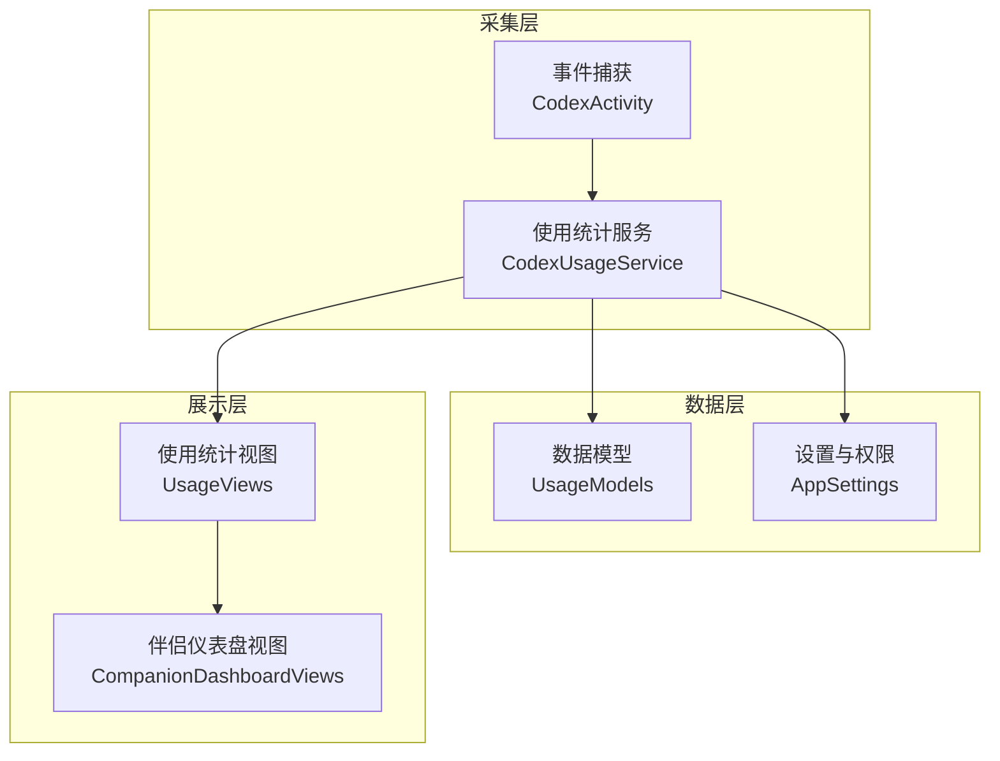
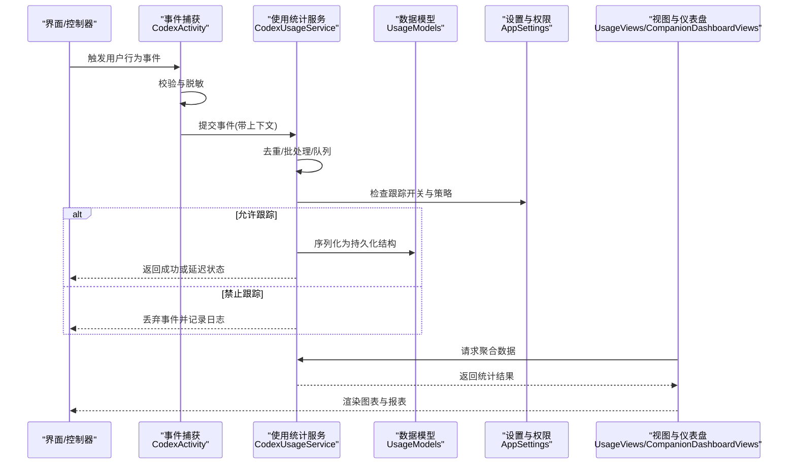
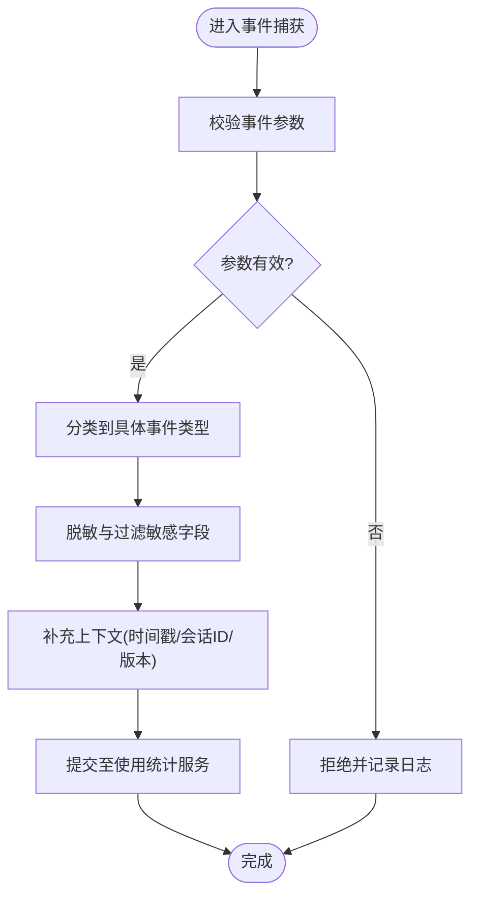
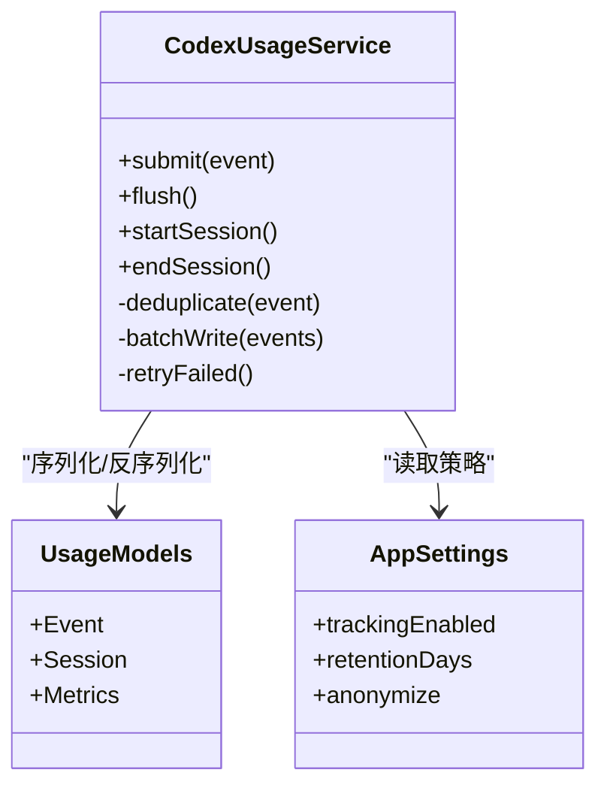
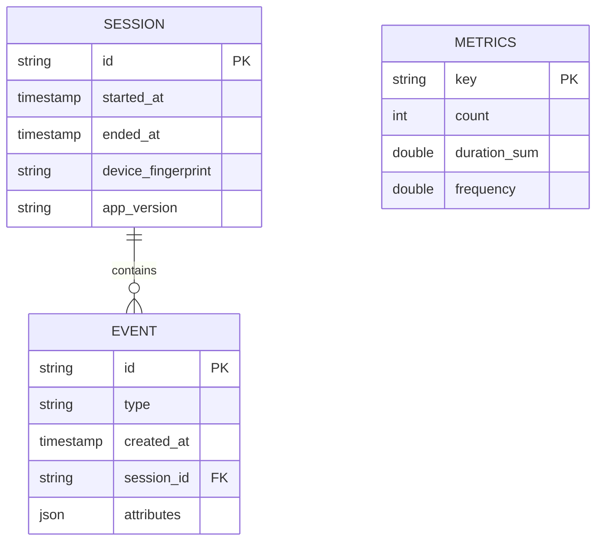
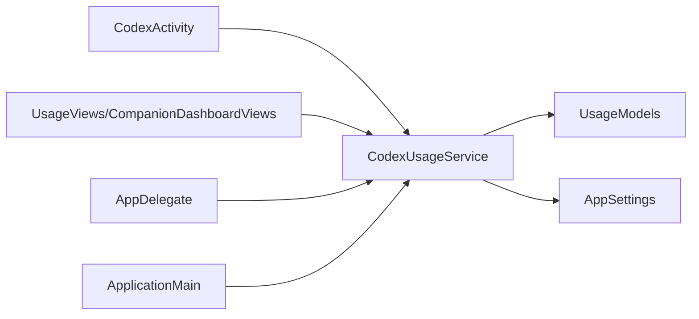

# 活动跟踪服务

<cite>
**本文引用的文件**   
- [CodexActivity.swift](file://app/Tomo/Sources/Tomo/CodexActivity.swift)
- [CodexUsageService.swift](file://app/Tomo/Sources/Tomo/CodexUsageService.swift)
- [UsageModels.swift](file://app/Tomo/Sources/Tomo/UsageModels.swift)
- [UsageViews.swift](file://app/Tomo/Sources/Tomo/UsageViews.swift)
- [CompanionDashboardViews.swift](file://app/Tomo/Sources/Tomo/CompanionDashboardViews.swift)
- [AppSettings.swift](file://app/Tomo/Sources/Tomo/AppSettings.swift)
- [AppDelegate.swift](file://app/Tomo/Sources/Tomo/AppDelegate.swift)
- [ApplicationMain.swift](file://app/Tomo/Sources/Tomo/ApplicationMain.swift)
</cite>

## 目录
1. [简介](#简介)
2. [项目结构](#项目结构)
3. [核心组件](#核心组件)
4. [架构总览](#架构总览)
5. [详细组件分析](#详细组件分析)
6. [依赖关系分析](#依赖关系分析)
7. [性能考虑](#性能考虑)
8. [故障排查指南](#故障排查指南)
9. [结论](#结论)
10. [附录](#附录)

## 简介
本文件为 Tomo 活动跟踪服务的权威技术文档，聚焦于事件捕获、数据收集与存储机制，用户行为分析、会话跟踪与活动模式识别的实现思路，以及数据隐私保护、匿名化与安全存储策略。同时提供扩展新活动类型与自定义跟踪规则的实践指南，并说明数据分析接口、报表生成与可视化展示能力。最后给出面向高吞吐场景的性能优化、内存管理与大数据处理建议。

## 项目结构
活动跟踪相关代码集中在 app/Tomo/Sources/Tomo 目录下，围绕“事件采集—数据处理—持久化—可视化”的链路组织：
- 事件模型与枚举：定义活动类型、属性结构与序列化格式
- 采集与服务层：负责事件捕获、去重、批处理、队列与上报
- 设置与权限：控制是否启用跟踪、数据保留策略与隐私开关
- 视图与仪表盘：将聚合结果以图表形式呈现，支持导出与筛选

**图示来源** 
- [CodexActivity.swift](file://app/Tomo/Sources/Tomo/CodexActivity.swift)
- [CodexUsageService.swift](file://app/Tomo/Sources/Tomo/CodexUsageService.swift)
- [UsageModels.swift](file://app/Tomo/Sources/Tomo/UsageModels.swift)
- [AppSettings.swift](file://app/Tomo/Sources/Tomo/AppSettings.swift)
- [UsageViews.swift](file://app/Tomo/Sources/Tomo/UsageViews.swift)
- [CompanionDashboardViews.swift](file://app/Tomo/Sources/Tomo/CompanionDashboardViews.swift)

**章节来源**
- [CodexActivity.swift](file://app/Tomo/Sources/Tomo/CodexActivity.swift)
- [CodexUsageService.swift](file://app/Tomo/Sources/Tomo/CodexUsageService.swift)
- [UsageModels.swift](file://app/Tomo/Sources/Tomo/UsageModels.swift)
- [AppSettings.swift](file://app/Tomo/Sources/Tomo/AppSettings.swift)
- [UsageViews.swift](file://app/Tomo/Sources/Tomo/UsageViews.swift)
- [CompanionDashboardViews.swift](file://app/Tomo/Sources/Tomo/CompanionDashboardViews.swift)

## 核心组件
- 事件捕获（CodexActivity）
  - 职责：统一入口记录用户行为与应用交互事件；对事件进行结构化封装与必要校验
  - 关键点：事件类型枚举、时间戳、上下文信息、可选敏感字段过滤
- 使用统计服务（CodexUsageService）
  - 职责：事件缓冲、去重、批处理、异步写入与上报；维护会话生命周期
  - 关键点：内存队列、批量大小阈值、失败重试、幂等写入
- 数据模型（UsageModels）
  - 职责：定义事件实体、会话实体、聚合指标的结构与序列化
  - 关键点：不可变结构、版本兼容、最小化字段集
- 设置与权限（AppSettings）
  - 职责：管理跟踪开关、数据保留周期、匿名化策略与导出权限
  - 关键点：默认安全策略、运行时切换、持久化配置
- 视图与仪表盘（UsageViews / CompanionDashboardViews）
  - 职责：读取聚合数据、渲染图表、支持筛选与导出
  - 关键点：懒加载、分页、缓存、响应式更新

**章节来源**
- [CodexActivity.swift](file://app/Tomo/Sources/Tomo/CodexActivity.swift)
- [CodexUsageService.swift](file://app/Tomo/Sources/Tomo/CodexUsageService.swift)
- [UsageModels.swift](file://app/Tomo/Sources/Tomo/UsageModels.swift)
- [AppSettings.swift](file://app/Tomo/Sources/Tomo/AppSettings.swift)
- [UsageViews.swift](file://app/Tomo/Sources/Tomo/UsageViews.swift)
- [CompanionDashboardViews.swift](file://app/Tomo/Sources/Tomo/CompanionDashboardViews.swift)

## 架构总览
整体采用分层架构：采集层负责事件捕获与预处理，服务层负责批处理与持久化，数据层提供模型与配置，展示层消费聚合结果用于分析与可视化。

**图示来源** 
- [CodexActivity.swift](file://app/Tomo/Sources/Tomo/CodexActivity.swift)
- [CodexUsageService.swift](file://app/Tomo/Sources/Tomo/CodexUsageService.swift)
- [UsageModels.swift](file://app/Tomo/Sources/Tomo/UsageModels.swift)
- [AppSettings.swift](file://app/Tomo/Sources/Tomo/AppSettings.swift)
- [UsageViews.swift](file://app/Tomo/Sources/Tomo/UsageViews.swift)
- [CompanionDashboardViews.swift](file://app/Tomo/Sources/Tomo/CompanionDashboardViews.swift)

## 详细组件分析

### 事件捕获（CodexActivity）
- 设计要点
  - 统一事件入口：所有用户行为通过单一方法记录，保证一致性
  - 事件类型枚举：覆盖常用交互（如点击、页面切换、功能调用、错误上报）
  - 上下文信息：包含时间戳、设备信息、应用版本、会话ID等元数据
  - 敏感字段过滤：在采集阶段即剔除可能泄露隐私的字段
- 扩展新活动类型
  - 步骤概述：新增事件类型枚举项 → 在捕获入口增加分支逻辑 → 确保上下文字段完整 → 在设置中确认该类型未被禁用
  - 参考路径：[CodexActivity.swift](file://app/Tomo/Sources/Tomo/CodexActivity.swift)

**图示来源** 
- [CodexActivity.swift](file://app/Tomo/Sources/Tomo/CodexActivity.swift)

**章节来源**
- [CodexActivity.swift](file://app/Tomo/Sources/Tomo/CodexActivity.swift)

### 使用统计服务（CodexUsageService）
- 设计要点
  - 事件缓冲与批处理：内存队列累积事件，达到阈值或定时触发写入
  - 去重与幂等：基于事件键（如类型+会话+时间窗口）避免重复计数
  - 会话跟踪：启动时创建会话ID，退出或超时后结束会话并落盘
  - 失败重试与降级：网络或IO失败时本地暂存，后续重试；极端情况回退到只写日志
- 自定义跟踪规则
  - 规则注入：在服务初始化时注册过滤器与转换器
  - 动态开关：根据设置实时启用/禁用特定规则
  - 参考路径：[CodexUsageService.swift](file://app/Tomo/Sources/Tomo/CodexUsageService.swift)

**图示来源** 
- [CodexUsageService.swift](file://app/Tomo/Sources/Tomo/CodexUsageService.swift)
- [UsageModels.swift](file://app/Tomo/Sources/Tomo/UsageModels.swift)
- [AppSettings.swift](file://app/Tomo/Sources/Tomo/AppSettings.swift)

**章节来源**
- [CodexUsageService.swift](file://app/Tomo/Sources/Tomo/CodexUsageService.swift)

### 数据模型（UsageModels）
- 设计要点
  - 事件实体：包含类型、时间戳、会话ID、属性键值对
  - 会话实体：会话ID、开始/结束时间、设备指纹、版本信息
  - 指标实体：按维度聚合的计数、时长、频率等
  - 版本兼容：字段演进需保持向后兼容，弃用字段标记
  - 参考路径：[UsageModels.swift](file://app/Tomo/Sources/Tomo/UsageModels.swift)

**图示来源** 
- [UsageModels.swift](file://app/Tomo/Sources/Tomo/UsageModels.swift)

**章节来源**
- [UsageModels.swift](file://app/Tomo/Sources/Tomo/UsageModels.swift)

### 设置与权限（AppSettings）
- 设计要点
  - 跟踪开关：全局启用/禁用，影响采集与服务层行为
  - 数据保留：按天清理过期事件与会话
  - 匿名化：移除可识别字段，仅保留聚合所需信息
  - 导出权限：限制报表导出范围与受众
  - 参考路径：[AppSettings.swift](file://app/Tomo/Sources/Tomo/AppSettings.swift)

**章节来源**
- [AppSettings.swift](file://app/Tomo/Sources/Tomo/AppSettings.swift)

### 视图与仪表盘（UsageViews / CompanionDashboardViews）
- 设计要点
  - 数据消费：从服务层拉取聚合结果，支持时间范围与维度筛选
  - 渲染策略：懒加载、分页、增量更新，避免阻塞主线程
  - 导出能力：CSV/JSON导出，受权限控制
  - 参考路径：[UsageViews.swift](file://app/Tomo/Sources/Tomo/UsageViews.swift)、[CompanionDashboardViews.swift](file://app/Tomo/Sources/Tomo/CompanionDashboardViews.swift)

**章节来源**
- [UsageViews.swift](file://app/Tomo/Sources/Tomo/UsageViews.swift)
- [CompanionDashboardViews.swift](file://app/Tomo/Sources/Tomo/CompanionDashboardViews.swift)

### 应用生命周期集成（AppDelegate / ApplicationMain）
- 设计要点
  - 启动初始化：注册事件捕获入口、初始化统计服务、加载设置
  - 生命周期回调：应用进入前台/后台时更新会话状态与刷新缓存
  - 参考路径：[AppDelegate.swift](file://app/Tomo/Sources/Tomo/AppDelegate.swift)、[ApplicationMain.swift](file://app/Tomo/Sources/Tomo/ApplicationMain.swift)

**章节来源**
- [AppDelegate.swift](file://app/Tomo/Sources/Tomo/AppDelegate.swift)
- [ApplicationMain.swift](file://app/Tomo/Sources/Tomo/ApplicationMain.swift)

## 依赖关系分析
- 耦合与内聚
  - 事件捕获与服务层低耦合：通过统一接口提交事件，便于替换实现
  - 服务层与模型层强内聚：数据结构变更直接影响序列化与查询
  - 视图层依赖服务层提供的聚合接口，不直接访问原始事件
- 外部依赖
  - 文件系统：本地持久化与导出
  - 系统设置：读取用户偏好与权限
- 潜在循环依赖
  - 避免视图层反向依赖采集层，应通过服务层暴露只读接口

**图示来源** 
- [CodexActivity.swift](file://app/Tomo/Sources/Tomo/CodexActivity.swift)
- [CodexUsageService.swift](file://app/Tomo/Sources/Tomo/CodexUsageService.swift)
- [UsageModels.swift](file://app/Tomo/Sources/Tomo/UsageModels.swift)
- [AppSettings.swift](file://app/Tomo/Sources/Tomo/AppSettings.swift)
- [UsageViews.swift](file://app/Tomo/Sources/Tomo/UsageViews.swift)
- [CompanionDashboardViews.swift](file://app/Tomo/Sources/Tomo/CompanionDashboardViews.swift)
- [AppDelegate.swift](file://app/Tomo/Sources/Tomo/AppDelegate.swift)
- [ApplicationMain.swift](file://app/Tomo/Sources/Tomo/ApplicationMain.swift)

**章节来源**
- [CodexUsageService.swift](file://app/Tomo/Sources/Tomo/CodexUsageService.swift)
- [UsageModels.swift](file://app/Tomo/Sources/Tomo/UsageModels.swift)
- [AppSettings.swift](file://app/Tomo/Sources/Tomo/AppSettings.swift)
- [UsageViews.swift](file://app/Tomo/Sources/Tomo/UsageViews.swift)
- [CompanionDashboardViews.swift](file://app/Tomo/Sources/Tomo/CompanionDashboardViews.swift)
- [AppDelegate.swift](file://app/Tomo/Sources/Tomo/AppDelegate.swift)
- [ApplicationMain.swift](file://app/Tomo/Sources/Tomo/ApplicationMain.swift)

## 性能考虑
- 事件批处理
  - 合理设置批次大小与定时器，平衡延迟与I/O开销
  - 使用环形缓冲区减少分配与拷贝
- 内存管理
  - 及时释放已写入的事件引用，避免内存泄漏
  - 大对象（如属性字典）按需构建，避免常驻内存
- 并发与锁
  - 读写分离：消费者与生产者使用无锁队列或分片锁
  - 限流与背压：当写入慢时暂停采集或降级为只记日志
- 大数据处理
  - 分区与归档：按日期/会话分文件，定期压缩归档
  - 增量聚合：滚动窗口计算指标，避免全量扫描
- 监控与诊断
  - 关键指标：队列长度、批大小、写入耗时、失败率
  - 采样日志：在高吞吐下降低日志级别，避免放大问题

[本节为通用指导，无需特定文件引用]

## 故障排查指南
- 常见问题
  - 事件未上报：检查跟踪开关、网络/IO异常、队列积压
  - 数据缺失：确认上下文字段填充、会话生命周期是否正确
  - 性能抖动：观察批处理阈值、锁竞争、GC压力
- 定位手段
  - 启用调试模式：输出事件摘要与队列状态
  - 导出样本数据：对比模型版本与字段映射
  - 回放测试：构造典型事件序列验证处理链路
- 恢复策略
  - 自动重试与死信队列：失败事件隔离与人工干预
  - 快速回滚：临时关闭非关键事件类型，保障核心功能

**章节来源**
- [CodexUsageService.swift](file://app/Tomo/Sources/Tomo/CodexUsageService.swift)
- [AppSettings.swift](file://app/Tomo/Sources/Tomo/AppSettings.swift)

## 结论
Tomo 活动跟踪服务通过清晰的分层设计与严格的隐私策略，实现了可靠的事件采集、高效的数据处理与安全的存储。遵循本文档的扩展与实践指南，可在不影响用户体验的前提下持续增强行为分析与报表能力。建议在上线前进行充分的性能与稳定性测试，并建立完善的监控与告警体系。

[本节为总结性内容，无需特定文件引用]

## 附录
- 添加新活动类型的步骤清单
  - 在事件类型枚举中新增条目
  - 在事件捕获入口增加分支逻辑
  - 完善上下文字段与脱敏规则
  - 在服务层注册新的过滤与转换规则
  - 在设置中确认该类型未被禁用
  - 在视图中新增对应的指标与图表
- 自定义跟踪规则示例路径
  - 规则注入点：[CodexUsageService.swift](file://app/Tomo/Sources/Tomo/CodexUsageService.swift)
  - 模型适配点：[UsageModels.swift](file://app/Tomo/Sources/Tomo/UsageModels.swift)
  - 设置开关点：[AppSettings.swift](file://app/Tomo/Sources/Tomo/AppSettings.swift)
- 数据分析接口与报表导出
  - 聚合查询：通过服务层暴露的只读接口获取指标
  - 导出格式：CSV/JSON，受权限控制
  - 可视化：基于视图层的图表组件进行渲染

[本节为补充信息，无需特定文件引用]