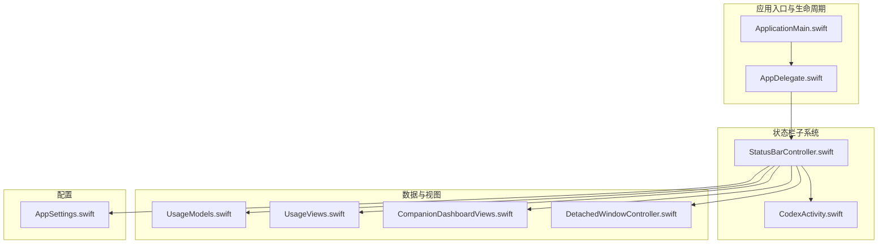
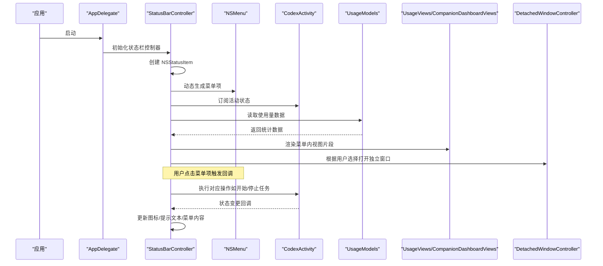
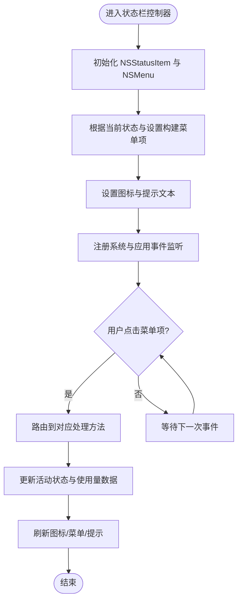
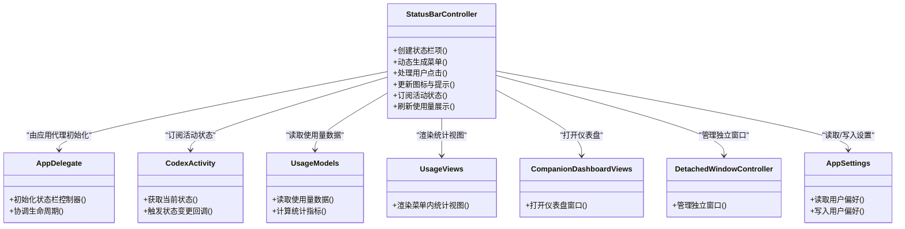

# 状态栏控制器

<cite>
**本文引用的文件**   
- [StatusBarController.swift](file://app/Tomo/Sources/Tomo/StatusBarController.swift)
- [AppDelegate.swift](file://app/Tomo/Sources/Tomo/AppDelegate.swift)
- [AppSettings.swift](file://app/Tomo/Sources/Tomo/AppSettings.swift)
- [CodexActivity.swift](file://app/Tomo/Sources/Tomo/CodexActivity.swift)
- [UsageModels.swift](file://app/Tomo/Sources/Tomo/UsageModels.swift)
- [UsageViews.swift](file://app/Tomo/Sources/Tomo/UsageViews.swift)
- [CompanionDashboardViews.swift](file://app/Tomo/Sources/Tomo/CompanionDashboardViews.swift)
- [DetachedWindowController.swift](file://app/Tomo/Sources/Tomo/DetachedWindowController.swift)
- [ApplicationMain.swift](file://app/Tomo/Sources/Tomo/ApplicationMain.swift)
</cite>

## 目录
1. [简介](#简介)
2. [项目结构](#项目结构)
3. [核心组件](#核心组件)
4. [架构总览](#架构总览)
5. [详细组件分析](#详细组件分析)
6. [依赖关系分析](#依赖关系分析)
7. [性能考量](#性能考量)
8. [故障排查指南](#故障排查指南)
9. [结论](#结论)
10. [附录](#附录)

## 简介
本文件为 Tomo 的状态栏控制器提供系统化、可操作的文档。内容覆盖：
- 状态栏菜单的动态生成与事件处理
- 用户交互逻辑与反馈机制
- 状态栏图标状态管理、动画效果与视觉反馈
- 与系统状态栏的集成方式、权限要求与兼容性处理
- 新增菜单项与操作处理的实践示例
- 状态同步机制、通知监听与实时更新策略
- 自定义样式与主题支持的实现指南

## 项目结构
与状态栏控制器相关的代码主要位于应用 Swift 源目录中，关键文件包括状态栏控制器、应用代理、设置、活动模型、使用量数据与视图等。下图展示了这些文件在整体应用中的位置与职责分工。

图表来源
- [ApplicationMain.swift](file://app/Tomo/Sources/Tomo/ApplicationMain.swift)
- [AppDelegate.swift](file://app/Tomo/Sources/Tomo/AppDelegate.swift)
- [StatusBarController.swift](file://app/Tomo/Sources/Tomo/StatusBarController.swift)
- [CodexActivity.swift](file://app/Tomo/Sources/Tomo/CodexActivity.swift)
- [AppSettings.swift](file://app/Tomo/Sources/Tomo/AppSettings.swift)
- [UsageModels.swift](file://app/Tomo/Sources/Tomo/UsageModels.swift)
- [UsageViews.swift](file://app/Tomo/Sources/Tomo/UsageViews.swift)
- [CompanionDashboardViews.swift](file://app/Tomo/Sources/Tomo/CompanionDashboardViews.swift)
- [DetachedWindowController.swift](file://app/Tomo/Sources/Tomo/DetachedWindowController.swift)

章节来源
- [ApplicationMain.swift](file://app/Tomo/Sources/Tomo/ApplicationMain.swift)
- [AppDelegate.swift](file://app/Tomo/Sources/Tomo/AppDelegate.swift)
- [StatusBarController.swift](file://app/Tomo/Sources/Tomo/StatusBarController.swift)

## 核心组件
- 状态栏控制器（StatusBarController）：负责创建并维护 NSStatusItem，动态构建菜单、响应点击与系统事件、更新图标与提示文本、驱动界面刷新。
- 应用代理（AppDelegate）：在应用启动时初始化状态栏控制器，协调窗口与状态栏的生命周期。
- 活动模型（CodexActivity）：封装与后端或本地服务交互的活动状态，供状态栏展示“进行中/完成/失败”等状态。
- 使用量模型与视图（UsageModels/UsageViews）：提供状态栏菜单中显示的使用统计与可视化信息。
- 配套仪表盘视图（CompanionDashboardViews）：用于从状态栏快捷入口打开更丰富的仪表板界面。
- 独立窗口控制器（DetachedWindowController）：管理从状态栏触发的独立窗口行为。
- 应用设置（AppSettings）：集中管理状态栏相关偏好（如是否常驻、是否显示计数、主题模式等）。

章节来源
- [StatusBarController.swift](file://app/Tomo/Sources/Tomo/StatusBarController.swift)
- [AppDelegate.swift](file://app/Tomo/Sources/Tomo/AppDelegate.swift)
- [CodexActivity.swift](file://app/Tomo/Sources/Tomo/CodexActivity.swift)
- [UsageModels.swift](file://app/Tomo/Sources/Tomo/UsageModels.swift)
- [UsageViews.swift](file://app/Tomo/Sources/Tomo/UsageViews.swift)
- [CompanionDashboardViews.swift](file://app/Tomo/Sources/Tomo/CompanionDashboardViews.swift)
- [DetachedWindowController.swift](file://app/Tomo/Sources/Tomo/DetachedWindowController.swift)
- [AppSettings.swift](file://app/Tomo/Sources/Tomo/AppSettings.swift)

## 架构总览
状态栏控制器作为 UI 与业务之间的桥梁，通过事件驱动的方式将系统状态变化映射到状态栏图标与菜单，同时支持用户操作反哺业务层。

图表来源
- [AppDelegate.swift](file://app/Tomo/Sources/Tomo/AppDelegate.swift)
- [StatusBarController.swift](file://app/Tomo/Sources/Tomo/StatusBarController.swift)
- [CodexActivity.swift](file://app/Tomo/Sources/Tomo/CodexActivity.swift)
- [UsageModels.swift](file://app/Tomo/Sources/Tomo/UsageModels.swift)
- [UsageViews.swift](file://app/Tomo/Sources/Tomo/UsageViews.swift)
- [CompanionDashboardViews.swift](file://app/Tomo/Sources/Tomo/CompanionDashboardViews.swift)
- [DetachedWindowController.swift](file://app/Tomo/Sources/Tomo/DetachedWindowController.swift)

## 详细组件分析

### 状态栏控制器（StatusBarController）
- 职责
  - 创建并持有 NSStatusItem，控制其在菜单栏的可见性与位置。
  - 动态生成 NSMenu，包含常用操作、状态指示、统计摘要与快捷入口。
  - 监听系统事件（如登录/注销、网络变化、应用前后台切换），更新状态栏内容与图标。
  - 处理用户交互（点击、悬停、右键菜单），调用业务层方法并刷新 UI。
  - 管理图标状态与动画（如旋转、闪烁、颜色变化），提供即时视觉反馈。
  - 与设置模块联动，根据用户偏好决定显示哪些菜单项与统计信息。
- 关键流程
  - 菜单动态生成：依据当前活动状态与使用量数据，按需添加/隐藏菜单项。
  - 事件分发：将菜单动作路由到具体处理方法，避免耦合。
  - 状态同步：通过观察者或回调机制，确保状态栏与业务状态一致。
  - 主题适配：根据系统深色/浅色模式或应用主题切换，调整图标与文字颜色。

图表来源
- [StatusBarController.swift](file://app/Tomo/Sources/Tomo/StatusBarController.swift)
- [AppSettings.swift](file://app/Tomo/Sources/Tomo/AppSettings.swift)
- [CodexActivity.swift](file://app/Tomo/Sources/Tomo/CodexActivity.swift)
- [UsageModels.swift](file://app/Tomo/Sources/Tomo/UsageModels.swift)

章节来源
- [StatusBarController.swift](file://app/Tomo/Sources/Tomo/StatusBarController.swift)
- [AppSettings.swift](file://app/Tomo/Sources/Tomo/AppSettings.swift)

### 应用代理（AppDelegate）
- 职责
  - 应用启动时初始化状态栏控制器，确保其可用。
  - 协调主窗口与状态栏的生命周期，避免资源冲突。
  - 处理应用级事件（如退出、休眠唤醒），必要时清理状态栏资源。
- 与状态栏的关系
  - 作为状态栏控制器的父级管理者，负责注入必要依赖（如设置、活动模型）。

章节来源
- [AppDelegate.swift](file://app/Tomo/Sources/Tomo/AppDelegate.swift)

### 活动模型（CodexActivity）
- 职责
  - 封装任务的运行状态（空闲、进行中、完成、失败）、进度与错误信息。
  - 提供状态变更回调，供状态栏控制器订阅并更新 UI。
- 与状态栏的关系
  - 状态栏根据活动状态显示不同图标与提示文本，并在用户操作时触发相应动作。

章节来源
- [CodexActivity.swift](file://app/Tomo/Sources/Tomo/CodexActivity.swift)

### 使用量模型与视图（UsageModels / UsageViews）
- 职责
  - 聚合与计算使用量数据（如调用次数、耗时、配额剩余）。
  - 提供轻量视图片段，嵌入状态栏菜单以展示关键指标。
- 与状态栏的关系
  - 状态栏控制器定期拉取或订阅数据更新，刷新菜单内的统计展示。

章节来源
- [UsageModels.swift](file://app/Tomo/Sources/Tomo/UsageModels.swift)
- [UsageViews.swift](file://app/Tomo/Sources/Tomo/UsageViews.swift)

### 配套仪表盘视图（CompanionDashboardViews）
- 职责
  - 提供更丰富的仪表盘界面，便于用户查看详细信息与进行操作。
- 与状态栏的关系
  - 状态栏菜单中包含快捷入口，点击后打开仪表盘窗口。

章节来源
- [CompanionDashboardViews.swift](file://app/Tomo/Sources/Tomo/CompanionDashboardViews.swift)

### 独立窗口控制器（DetachedWindowController）
- 职责
  - 管理从状态栏触发的独立窗口，包括创建、显示、关闭与内存释放。
- 与状态栏的关系
  - 状态栏控制器根据用户选择调用该控制器打开或关闭窗口。

章节来源
- [DetachedWindowController.swift](file://app/Tomo/Sources/Tomo/DetachedWindowController.swift)

### 应用设置（AppSettings）
- 职责
  - 持久化用户偏好（如是否显示状态栏、是否启用统计、主题模式）。
- 与状态栏的关系
  - 状态栏控制器读取设置以决定菜单项可见性、图标样式与刷新频率。

章节来源
- [AppSettings.swift](file://app/Tomo/Sources/Tomo/AppSettings.swift)

## 依赖关系分析
状态栏控制器依赖多个模块以实现完整功能，下图展示了关键依赖与交互方向。

图表来源
- [StatusBarController.swift](file://app/Tomo/Sources/Tomo/StatusBarController.swift)
- [AppDelegate.swift](file://app/Tomo/Sources/Tomo/AppDelegate.swift)
- [CodexActivity.swift](file://app/Tomo/Sources/Tomo/CodexActivity.swift)
- [UsageModels.swift](file://app/Tomo/Sources/Tomo/UsageModels.swift)
- [UsageViews.swift](file://app/Tomo/Sources/Tomo/UsageViews.swift)
- [CompanionDashboardViews.swift](file://app/Tomo/Sources/Tomo/CompanionDashboardViews.swift)
- [DetachedWindowController.swift](file://app/Tomo/Sources/Tomo/DetachedWindowController.swift)
- [AppSettings.swift](file://app/Tomo/Sources/Tomo/AppSettings.swift)

章节来源
- [StatusBarController.swift](file://app/Tomo/Sources/Tomo/StatusBarController.swift)
- [AppSettings.swift](file://app/Tomo/Sources/Tomo/AppSettings.swift)

## 性能考量
- 菜单构建优化
  - 仅在状态变化或用户展开菜单时重建菜单项，避免频繁分配与销毁对象。
  - 对静态菜单项进行缓存，减少重复计算。
- 数据更新策略
  - 使用观察者或异步队列拉取使用量数据，避免阻塞主线程。
  - 合并高频更新，采用节流或去抖策略降低刷新频率。
- 图标与动画
  - 使用轻量级图像与矢量图，避免大图导致的渲染开销。
  - 动画应限制帧率与持续时间，防止影响系统响应性。
- 内存管理
  - 及时释放不再使用的窗口与视图实例，避免内存泄漏。
  - 在应用退出或休眠时清理状态栏资源。

[本节为通用指导，不直接分析具体文件]

## 故障排查指南
- 状态栏未显示
  - 检查应用代理是否正确初始化状态栏控制器。
  - 确认系统权限（如辅助功能或通知权限）是否授予。
- 菜单项不更新
  - 验证活动状态回调是否正常触发。
  - 检查设置是否导致某些菜单项被隐藏。
- 图标无动画或样式异常
  - 确认主题模式与系统外观设置。
  - 检查图像资源路径与格式是否正确。
- 数据展示不正确
  - 核对使用量模型的统计逻辑与数据来源。
  - 检查视图渲染是否使用了最新的数据快照。

章节来源
- [AppDelegate.swift](file://app/Tomo/Sources/Tomo/AppDelegate.swift)
- [StatusBarController.swift](file://app/Tomo/Sources/Tomo/StatusBarController.swift)
- [AppSettings.swift](file://app/Tomo/Sources/Tomo/AppSettings.swift)

## 结论
状态栏控制器是 Tomo 与用户日常交互的关键触点。通过合理的架构设计与清晰的职责划分，实现了菜单动态生成、事件处理、状态同步与主题适配等功能。遵循本文档的实践建议，开发者可以高效扩展菜单项、优化性能并确保跨版本兼容。

[本节为总结性内容，不直接分析具体文件]

## 附录

### 如何添加新的菜单项与处理用户操作（步骤示例）
- 在状态栏控制器的菜单构建阶段，按条件插入新菜单项。
- 为新菜单项绑定回调方法，将用户操作路由到业务逻辑。
- 若涉及状态变化，更新活动模型并刷新状态栏图标与提示。
- 如需展示更多信息，打开仪表盘或独立窗口。

章节来源
- [StatusBarController.swift](file://app/Tomo/Sources/Tomo/StatusBarController.swift)
- [CodexActivity.swift](file://app/Tomo/Sources/Tomo/CodexActivity.swift)
- [CompanionDashboardViews.swift](file://app/Tomo/Sources/Tomo/CompanionDashboardViews.swift)
- [DetachedWindowController.swift](file://app/Tomo/Sources/Tomo/DetachedWindowController.swift)

### 状态同步机制、通知监听与实时更新策略
- 状态同步
  - 通过观察者模式或回调接口，将活动状态变化实时推送到状态栏控制器。
- 通知监听
  - 订阅系统通知（如网络状态、电源状态）与应用内事件，触发菜单与图标更新。
- 实时更新
  - 使用定时器或数据流驱动刷新，结合节流策略避免过度更新。

章节来源
- [CodexActivity.swift](file://app/Tomo/Sources/Tomo/CodexActivity.swift)
- [UsageModels.swift](file://app/Tomo/Sources/Tomo/UsageModels.swift)
- [StatusBarController.swift](file://app/Tomo/Sources/Tomo/StatusBarController.swift)

### 自定义样式与主题支持实现指南
- 主题检测
  - 监听系统外观变化，切换深色/浅色模式。
- 样式适配
  - 为图标与文字提供多套资源，根据主题选择合适资源。
- 设置联动
  - 允许用户在应用中切换主题，并将偏好持久化到设置模块。

章节来源
- [AppSettings.swift](file://app/Tomo/Sources/Tomo/AppSettings.swift)
- [StatusBarController.swift](file://app/Tomo/Sources/Tomo/StatusBarController.swift)