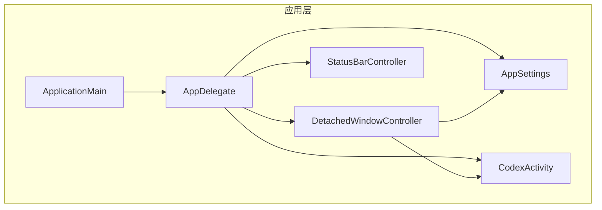
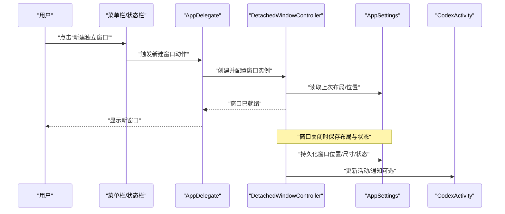
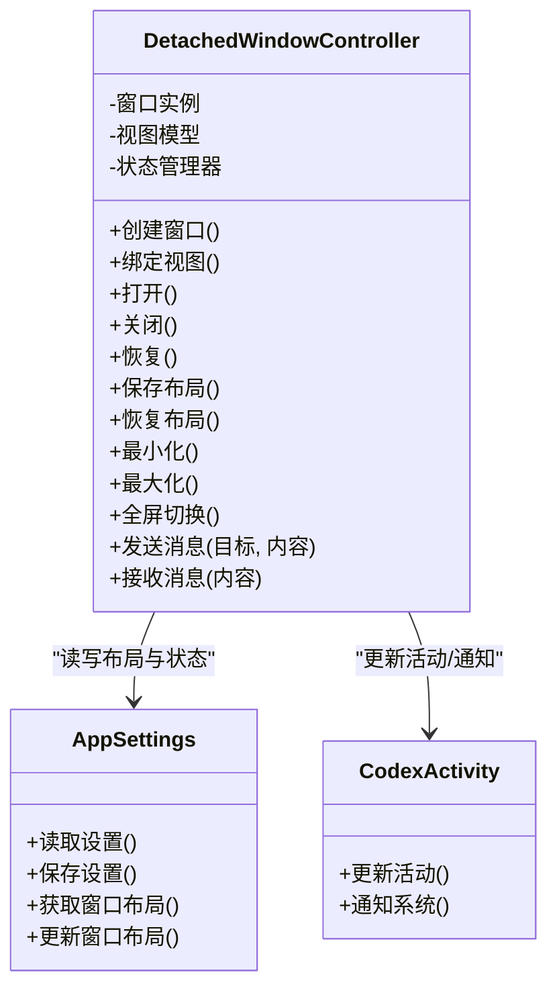
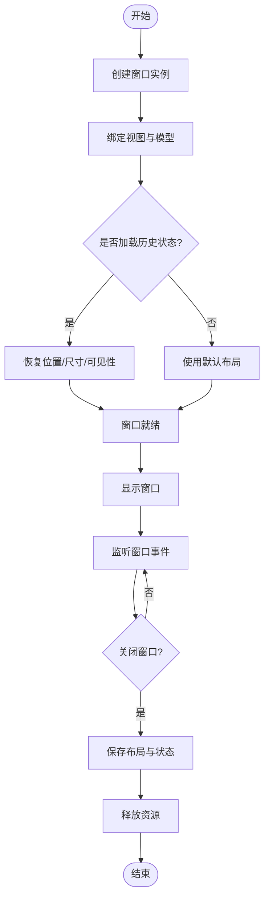
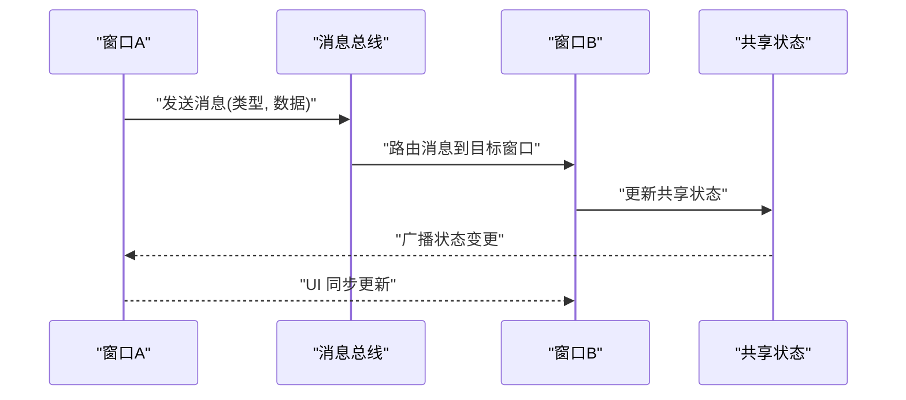
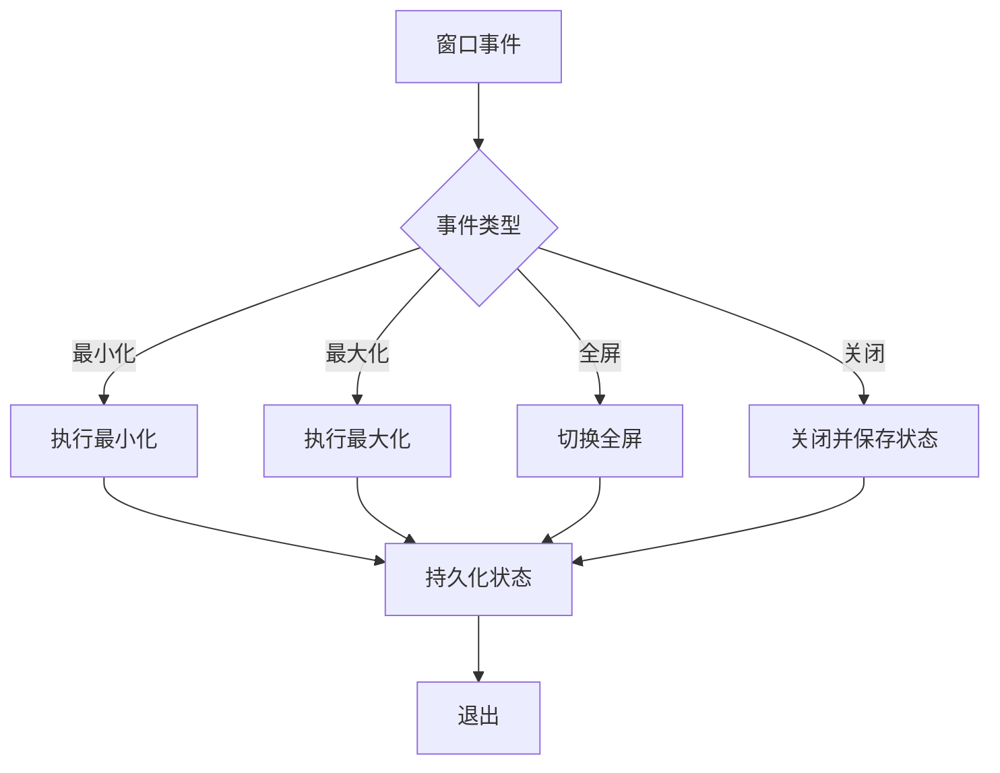
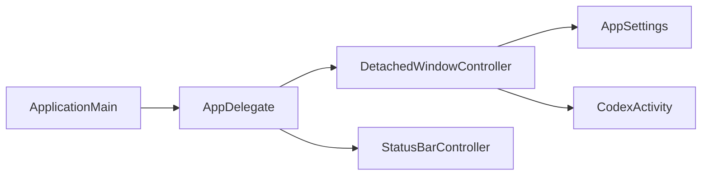

# 窗口管理

<cite>
**本文档引用的文件**   
- [DetachedWindowController.swift](file://app/Tomo/Sources/Tomo/DetachedWindowController.swift)
- [AppDelegate.swift](file://app/Tomo/Sources/Tomo/AppDelegate.swift)
- [ApplicationMain.swift](file://app/Tomo/Sources/Tomo/ApplicationMain.swift)
- [StatusBarController.swift](file://app/Tomo/Sources/Tomo/StatusBarController.swift)
- [AppSettings.swift](file://app/Tomo/Sources/Tomo/AppSettings.swift)
- [CodexActivity.swift](file://app/Tomo/Sources/Tomo/CodexActivity.swift)
- [Package.swift](file://app/Tomo/Package.swift)
</cite>

## 目录
1. [简介](#简介)
2. [项目结构](#项目结构)
3. [核心组件](#核心组件)
4. [架构总览](#架构总览)
5. [详细组件分析](#详细组件分析)
6. [依赖关系分析](#依赖关系分析)
7. [性能考虑](#性能考虑)
8. [故障排查指南](#故障排查指南)
9. [结论](#结论)
10. [附录](#附录)

## 简介
本文件面向 Tomo 的窗口子系统，重点围绕 DetachedWindowController 的窗口创建、生命周期与状态保持机制展开，并系统阐述多窗口支持、窗口间通信与数据同步策略。同时覆盖窗口布局管理、最小化/最大化行为、全屏模式处理、权限管理与沙箱安全、系统集成能力，以及性能优化、内存泄漏检测与调试技巧。文档力求在技术深度与可读性之间取得平衡，帮助开发者快速上手并高效扩展窗口功能。

## 项目结构
Tomo 的 macOS 应用采用 Swift 开发，窗口相关逻辑集中在 app/Tomo/Sources/Tomo 目录下：
- AppDelegate 负责应用级初始化与入口协调
- ApplicationMain 提供应用启动主流程
- DetachedWindowController 负责独立窗口的创建、生命周期与状态管理
- StatusBarController 负责菜单栏状态栏集成
- AppSettings 负责应用设置持久化（可能包含窗口布局等）
- CodexActivity 用于与系统活动或后台任务交互（可能与窗口状态联动）

图表来源
- [ApplicationMain.swift](file://app/Tomo/Sources/Tomo/ApplicationMain.swift)
- [AppDelegate.swift](file://app/Tomo/Sources/Tomo/AppDelegate.swift)
- [DetachedWindowController.swift](file://app/Tomo/Sources/Tomo/DetachedWindowController.swift)
- [StatusBarController.swift](file://app/Tomo/Sources/Tomo/StatusBarController.swift)
- [AppSettings.swift](file://app/Tomo/Sources/Tomo/AppSettings.swift)
- [CodexActivity.swift](file://app/Tomo/Sources/Tomo/CodexActivity.swift)

章节来源
- [ApplicationMain.swift](file://app/Tomo/Sources/Tomo/ApplicationMain.swift)
- [AppDelegate.swift](file://app/Tomo/Sources/Tomo/AppDelegate.swift)
- [DetachedWindowController.swift](file://app/Tomo/Sources/Tomo/DetachedWindowController.swift)
- [AppSettings.swift](file://app/Tomo/Sources/Tomo/AppSettings.swift)
- [StatusBarController.swift](file://app/Tomo/Sources/Tomo/StatusBarController.swift)
- [CodexActivity.swift](file://app/Tomo/Sources/Tomo/CodexActivity.swift)

## 核心组件
- DetachedWindowController：独立窗口控制器，负责创建 NSWindow、绑定视图、管理窗口生命周期（打开/关闭/恢复）、保存/恢复窗口位置与尺寸、处理最小化/最大化/全屏切换，以及与全局状态或消息总线进行通信。
- AppDelegate：应用代理，负责应用生命周期事件（如启动、退出、前台/后台切换），协调窗口控制器与菜单/状态栏、设置与活动服务。
- ApplicationMain：应用主入口，配置运行环境并启动应用。
- StatusBarController：菜单栏状态栏集成，提供快捷入口触发窗口显示/隐藏或新建独立窗口。
- AppSettings：应用设置存储，可能包含窗口布局、最近窗口列表、用户偏好等。
- CodexActivity：系统活动或后台任务接口，可能用于与外部服务或系统特性交互。

章节来源
- [DetachedWindowController.swift](file://app/Tomo/Sources/Tomo/DetachedWindowController.swift)
- [AppDelegate.swift](file://app/Tomo/Sources/Tomo/AppDelegate.swift)
- [ApplicationMain.swift](file://app/Tomo/Sources/Tomo/ApplicationMain.swift)
- [StatusBarController.swift](file://app/Tomo/Sources/Tomo/StatusBarController.swift)
- [AppSettings.swift](file://app/Tomo/Sources/Tomo/AppSettings.swift)
- [CodexActivity.swift](file://app/Tomo/Sources/Tomo/CodexActivity.swift)

## 架构总览
下图展示了窗口子系统与应用其他模块的交互关系，包括窗口创建、状态同步、设置持久化与系统集成。

图表来源
- [AppDelegate.swift](file://app/Tomo/Sources/Tomo/AppDelegate.swift)
- [DetachedWindowController.swift](file://app/Tomo/Sources/Tomo/DetachedWindowController.swift)
- [AppSettings.swift](file://app/Tomo/Sources/Tomo/AppSettings.swift)
- [CodexActivity.swift](file://app/Tomo/Sources/Tomo/CodexActivity.swift)

## 详细组件分析

### DetachedWindowController 组件分析
该组件是窗口子系统的核心，承担以下职责：
- 窗口创建与视图绑定：根据模板或配置创建 NSWindow，并挂载对应的 SwiftUI/UIKit 视图。
- 生命周期管理：监听窗口打开、关闭、恢复、销毁等事件，确保资源正确释放。
- 状态保持：保存/恢复窗口位置、尺寸、可见性与层级；必要时持久化窗口内业务状态。
- 多窗口支持：维护窗口实例集合，支持并发操作与隔离状态。
- 窗口间通信：通过事件总线或回调机制实现跨窗口消息传递与数据同步。
- 布局与行为：处理最小化、最大化、全屏切换，响应系统窗口事件。
- 权限与安全：遵循沙箱限制，按需请求权限（如屏幕录制、辅助功能）。
- 系统集成：与菜单栏、Dock、通知中心、活动服务等交互。

图表来源
- [DetachedWindowController.swift](file://app/Tomo/Sources/Tomo/DetachedWindowController.swift)
- [AppSettings.swift](file://app/Tomo/Sources/Tomo/AppSettings.swift)
- [CodexActivity.swift](file://app/Tomo/Sources/Tomo/CodexActivity.swift)

章节来源
- [DetachedWindowController.swift](file://app/Tomo/Sources/Tomo/DetachedWindowController.swift)
- [AppSettings.swift](file://app/Tomo/Sources/Tomo/AppSettings.swift)
- [CodexActivity.swift](file://app/Tomo/Sources/Tomo/CodexActivity.swift)

#### 窗口创建与生命周期流程

图表来源
- [DetachedWindowController.swift](file://app/Tomo/Sources/Tomo/DetachedWindowController.swift)
- [AppSettings.swift](file://app/Tomo/Sources/Tomo/AppSettings.swift)

章节来源
- [DetachedWindowController.swift](file://app/Tomo/Sources/Tomo/DetachedWindowController.swift)
- [AppSettings.swift](file://app/Tomo/Sources/Tomo/AppSettings.swift)

#### 多窗口支持与窗口间通信
- 多窗口支持：维护一个窗口实例集合，每个窗口拥有独立的视图模型与状态；通过唯一标识区分不同窗口。
- 窗口间通信：建议使用事件总线或集中式消息通道，避免强耦合；消息可携带目标窗口标识与数据类型。
- 数据同步：对共享数据采用单例或集中式 Store，订阅变更并广播到所有窗口；对窗口私有数据保持隔离。

图表来源
- [DetachedWindowController.swift](file://app/Tomo/Sources/Tomo/DetachedWindowController.swift)
- [AppSettings.swift](file://app/Tomo/Sources/Tomo/AppSettings.swift)

章节来源
- [DetachedWindowController.swift](file://app/Tomo/Sources/Tomo/DetachedWindowController.swift)
- [AppSettings.swift](file://app/Tomo/Sources/Tomo/AppSettings.swift)

#### 窗口布局管理与行为
- 布局管理：记录窗口位置、尺寸、层级与可见性；在应用重启后恢复。
- 最小化/最大化：响应系统事件，切换窗口状态并持久化。
- 全屏模式：进入/退出全屏时调整视图内容与工具栏显示。

图表来源
- [DetachedWindowController.swift](file://app/Tomo/Sources/Tomo/DetachedWindowController.swift)
- [AppSettings.swift](file://app/Tomo/Sources/Tomo/AppSettings.swift)

章节来源
- [DetachedWindowController.swift](file://app/Tomo/Sources/Tomo/DetachedWindowController.swift)
- [AppSettings.swift](file://app/Tomo/Sources/Tomo/AppSettings.swift)

#### 权限管理与沙箱安全
- 权限申请：按需提供屏幕录制、辅助功能、通知等权限，并在未授权时给出友好提示。
- 沙箱限制：遵守文件系统访问、网络请求、进程间通信等限制，避免越权操作。
- 数据安全：敏感信息加密存储，避免日志泄露。

章节来源
- [DetachedWindowController.swift](file://app/Tomo/Sources/Tomo/DetachedWindowController.swift)
- [AppSettings.swift](file://app/Tomo/Sources/Tomo/AppSettings.swift)

#### 系统集成与状态栏
- 菜单栏集成：提供快捷入口触发窗口显示/隐藏或新建独立窗口。
- Dock 集成：控制应用图标与窗口关联。
- 通知中心：推送重要事件或提醒。

章节来源
- [StatusBarController.swift](file://app/Tomo/Sources/Tomo/StatusBarController.swift)
- [AppDelegate.swift](file://app/Tomo/Sources/Tomo/AppDelegate.swift)

### AppDelegate 与 ApplicationMain
- AppDelegate：协调窗口控制器、设置、活动服务与系统事件；处理应用生命周期。
- ApplicationMain：配置运行环境并启动应用，确保窗口子系统可用。

章节来源
- [AppDelegate.swift](file://app/Tomo/Sources/Tomo/AppDelegate.swift)
- [ApplicationMain.swift](file://app/Tomo/Sources/Tomo/ApplicationMain.swift)

## 依赖关系分析
窗口子系统依赖设置存储与活动服务，并与菜单栏集成。整体依赖如下：

图表来源
- [ApplicationMain.swift](file://app/Tomo/Sources/Tomo/ApplicationMain.swift)
- [AppDelegate.swift](file://app/Tomo/Sources/Tomo/AppDelegate.swift)
- [DetachedWindowController.swift](file://app/Tomo/Sources/Tomo/DetachedWindowController.swift)
- [StatusBarController.swift](file://app/Tomo/Sources/Tomo/StatusBarController.swift)
- [AppSettings.swift](file://app/Tomo/Sources/Tomo/AppSettings.swift)
- [CodexActivity.swift](file://app/Tomo/Sources/Tomo/CodexActivity.swift)

章节来源
- [Package.swift](file://app/Tomo/Package.swift)
- [ApplicationMain.swift](file://app/Tomo/Sources/Tomo/ApplicationMain.swift)
- [AppDelegate.swift](file://app/Tomo/Sources/Tomo/AppDelegate.swift)
- [DetachedWindowController.swift](file://app/Tomo/Sources/Tomo/DetachedWindowController.swift)
- [AppSettings.swift](file://app/Tomo/Sources/Tomo/AppSettings.swift)
- [CodexActivity.swift](file://app/Tomo/Sources/Tomo/CodexActivity.swift)

## 性能考虑
- 窗口创建优化：延迟加载视图与模型，减少首次启动开销。
- 内存管理：及时释放不再使用的窗口实例与观察者，避免循环引用。
- 事件节流：对频繁窗口事件（如拖动、缩放）进行节流或合并处理。
- 渲染优化：避免在主线程执行重计算，使用异步队列处理复杂逻辑。
- 持久化优化：批量写入设置，减少磁盘 I/O。

## 故障排查指南
- 窗口无法创建：检查权限申请与沙箱限制；确认视图绑定成功。
- 状态未恢复：验证设置存储路径与格式；检查恢复逻辑是否正确。
- 窗口间通信失败：确认消息路由与订阅关系；检查数据类型与序列化。
- 内存泄漏：使用 Instruments 检测 retain cycles；清理观察者与定时器。
- 性能问题：定位 CPU/内存热点；优化事件处理与渲染路径。

章节来源
- [DetachedWindowController.swift](file://app/Tomo/Sources/Tomo/DetachedWindowController.swift)
- [AppSettings.swift](file://app/Tomo/Sources/Tomo/AppSettings.swift)
- [AppDelegate.swift](file://app/Tomo/Sources/Tomo/AppDelegate.swift)

## 结论
DetachedWindowController 作为窗口子系统的核心，提供了完整的窗口创建、生命周期与状态管理能力，并通过与设置存储和活动服务的协作，实现了多窗口支持、窗口间通信与系统集成。遵循本文档的最佳实践与优化建议，可构建稳定高效的窗口体验。

## 附录
- 自定义窗口示例：参考 DetachedWindowController 的窗口创建与视图绑定方法，扩展新的窗口类型。
- 窗口间消息传递：基于事件总线或集中式 Store 实现跨窗口数据同步。
- 权限与安全：按需申请权限，遵循沙箱限制，保护用户数据。