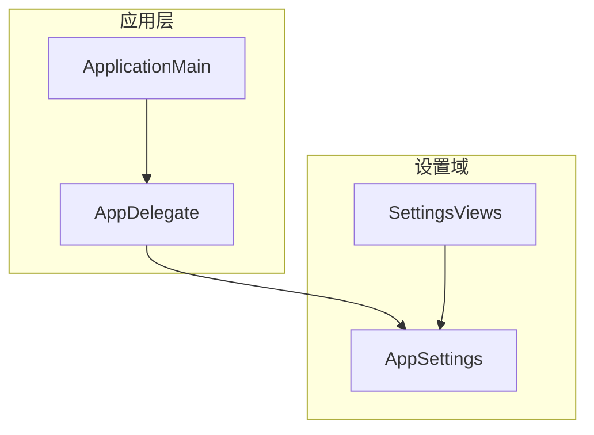
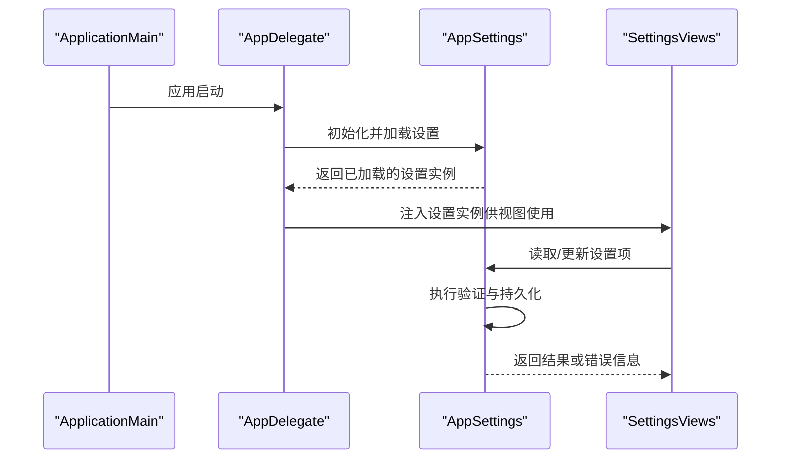
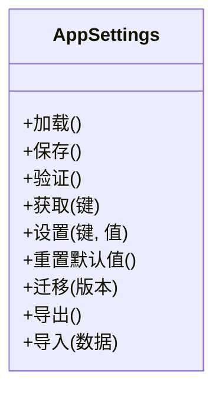
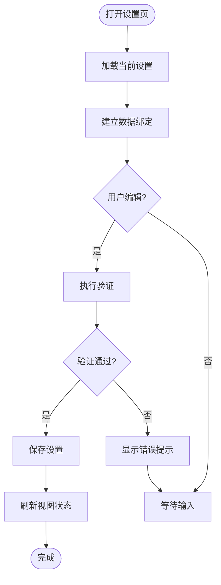
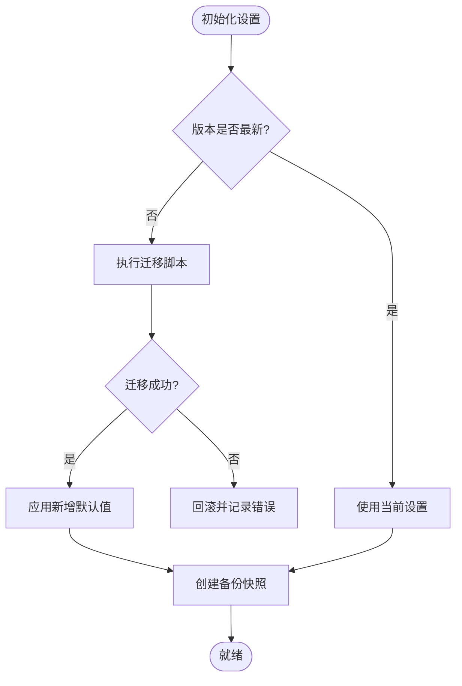
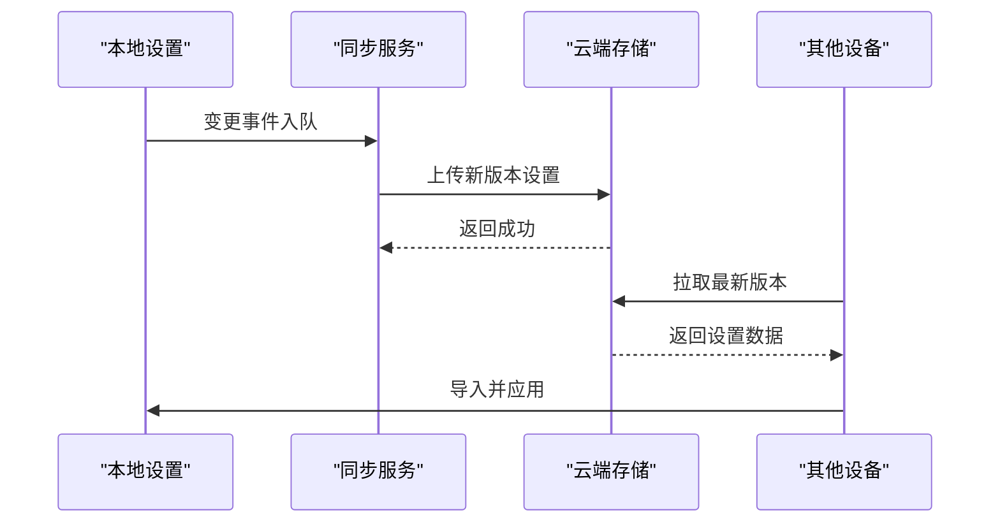
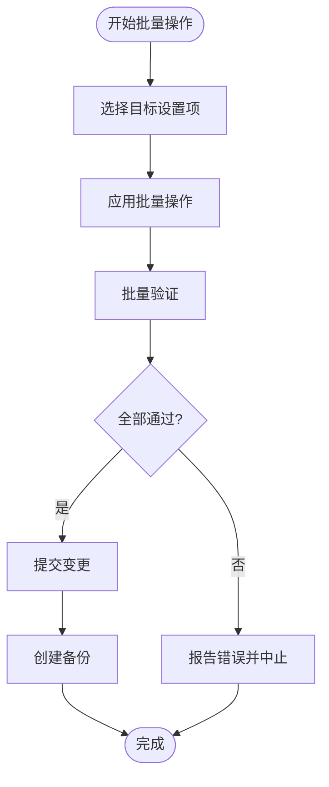
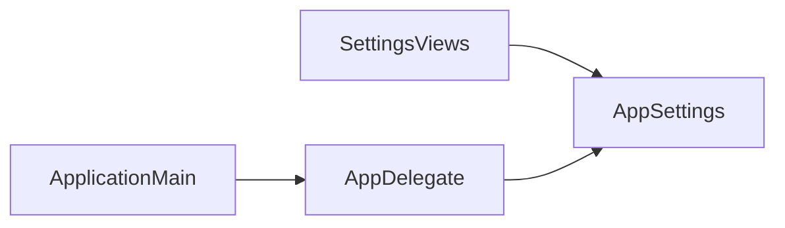

# 设置管理系统

<cite>
**本文引用的文件**   
- [AppSettings.swift](file://app/Tomo/Sources/Tomo/AppSettings.swift)
- [SettingsViews.swift](file://app/Tomo/Sources/Tomo/SettingsViews.swift)
- [AppDelegate.swift](file://app/Tomo/Sources/Tomo/AppDelegate.swift)
- [ApplicationMain.swift](file://app/Tomo/Sources/Tomo/ApplicationMain.swift)
</cite>

## 目录
1. [简介](#简介)
2. [项目结构](#项目结构)
3. [核心组件](#核心组件)
4. [架构总览](#架构总览)
5. [详细组件分析](#详细组件分析)
6. [依赖关系分析](#依赖关系分析)
7. [性能考虑](#性能考虑)
8. [故障排查指南](#故障排查指南)
9. [结论](#结论)
10. [附录](#附录)

## 简介
本文件为 Tomo 的设置管理系统提供系统化文档，覆盖数据模型、持久化与验证、视图与交互、默认值管理、版本迁移、备份与同步、导入导出与批量操作等主题。目标读者包括开发者与维护者，力求在保持技术深度的同时，让非专业用户也能理解整体设计与使用方法。

## 项目结构
设置相关代码主要位于应用 Swift 模块中：
- AppSettings.swift：定义设置的数据模型、默认值、持久化与验证逻辑。
- SettingsViews.swift：实现设置界面的 SwiftUI 视图与用户交互。
- AppDelegate.swift / ApplicationMain.swift：应用生命周期入口，负责初始化设置系统并在启动时加载/保存设置。

图表来源
- [ApplicationMain.swift](file://app/Tomo/Sources/Tomo/ApplicationMain.swift)
- [AppDelegate.swift](file://app/Tomo/Sources/Tomo/AppDelegate.swift)
- [AppSettings.swift](file://app/Tomo/Sources/Tomo/AppSettings.swift)
- [SettingsViews.swift](file://app/Tomo/Sources/Tomo/SettingsViews.swift)

章节来源
- [AppSettings.swift](file://app/Tomo/Sources/Tomo/AppSettings.swift)
- [SettingsViews.swift](file://app/Tomo/Sources/Tomo/SettingsViews.swift)
- [AppDelegate.swift](file://app/Tomo/Sources/Tomo/AppDelegate.swift)
- [ApplicationMain.swift](file://app/Tomo/Sources/Tomo/ApplicationMain.swift)

## 核心组件
- 数据模型与默认值
  - 集中定义所有设置项及其类型、约束与默认值。
  - 提供访问器与更新方法，确保读写一致性与类型安全。
- 持久化存储
  - 将设置序列化为本地文件（如 JSON）进行持久化。
  - 支持读取、写入、校验与回滚机制。
- 验证机制
  - 对输入值进行范围、格式与业务规则校验。
  - 提供错误聚合与提示，阻止非法状态进入持久化。
- 视图与交互
  - 使用 SwiftUI 构建设置界面，双向绑定到 AppSettings。
  - 实时预览与即时反馈，支持撤销/确认流程。
- 默认值与迁移
  - 首次运行或版本升级时自动应用默认值与迁移脚本。
  - 兼容旧版数据结构，避免破坏性变更。
- 备份与同步
  - 提供导出/导入功能，便于备份与跨设备共享。
  - 可选云端同步（预留接口），支持冲突解决策略。

章节来源
- [AppSettings.swift](file://app/Tomo/Sources/Tomo/AppSettings.swift)
- [SettingsViews.swift](file://app/Tomo/Sources/Tomo/SettingsViews.swift)

## 架构总览
设置系统采用分层设计：视图层通过绑定访问设置模型；模型层封装数据、验证与持久化；应用层负责生命周期内的初始化与加载。

图表来源
- [ApplicationMain.swift](file://app/Tomo/Sources/Tomo/ApplicationMain.swift)
- [AppDelegate.swift](file://app/Tomo/Sources/Tomo/AppDelegate.swift)
- [AppSettings.swift](file://app/Tomo/Sources/Tomo/AppSettings.swift)
- [SettingsViews.swift](file://app/Tomo/Sources/Tomo/SettingsViews.swift)

## 详细组件分析

### AppSettings 数据模型、持久化与验证
- 数据模型
  - 以结构体/类形式组织设置项，包含字段名、类型、默认值与约束描述。
  - 提供只读快照与可写副本，保证并发安全与一致性。
- 持久化
  - 序列化到本地文件，支持增量写入与原子替换。
  - 读取失败时回退到默认值或上次有效快照。
- 验证
  - 内置基础类型校验（范围、长度、格式）。
  - 可扩展自定义校验器，统一收集错误并生成用户可读消息。

图表来源
- [AppSettings.swift](file://app/Tomo/Sources/Tomo/AppSettings.swift)

章节来源
- [AppSettings.swift](file://app/Tomo/Sources/Tomo/AppSettings.swift)

### 设置界面视图与数据绑定
- 视图组件
  - 基于 SwiftUI 的表单控件，按分组展示设置项。
  - 支持开关、滑块、文本框、下拉选择等控件类型。
- 数据绑定
  - 视图与 AppSettings 建立双向绑定，修改即触发验证与保存。
  - 提供“暂存”和“应用”两种模式，避免频繁持久化。
- 用户交互
  - 实时校验反馈，错误高亮与提示。
  - 支持撤销最近更改与恢复默认值。

图表来源
- [SettingsViews.swift](file://app/Tomo/Sources/Tomo/SettingsViews.swift)
- [AppSettings.swift](file://app/Tomo/Sources/Tomo/AppSettings.swift)

章节来源
- [SettingsViews.swift](file://app/Tomo/Sources/Tomo/SettingsViews.swift)
- [AppSettings.swift](file://app/Tomo/Sources/Tomo/AppSettings.swift)

### 默认值管理、版本迁移与数据备份
- 默认值管理
  - 首次运行或检测到缺失字段时，自动填充默认值。
  - 提供“恢复默认值”能力，支持部分或全部重置。
- 版本迁移
  - 维护版本号与迁移脚本，按顺序执行兼容性转换。
  - 迁移失败时保留原数据并记录日志，允许重试。
- 数据备份
  - 导出为结构化文件（如 JSON），包含元数据与时间戳。
  - 导入时进行完整性校验与冲突检测，支持合并策略。

图表来源
- [AppSettings.swift](file://app/Tomo/Sources/Tomo/AppSettings.swift)

章节来源
- [AppSettings.swift](file://app/Tomo/Sources/Tomo/AppSettings.swift)

### 设置同步、云端备份与跨设备共享
- 同步机制
  - 本地优先，变更事件入队，后台队列异步同步。
  - 支持冲突检测与合并策略（最后写入优先或手动合并）。
- 云端备份
  - 提供加密上传与下载接口，支持断点续传。
  - 多设备间保持一致性，必要时引入版本号与哈希校验。
- 跨设备共享
  - 导出文件可在不同设备间导入，导入前进行兼容性检查。
  - 支持选择性导入（仅特定分组或字段）。

图表来源
- [AppSettings.swift](file://app/Tomo/Sources/Tomo/AppSettings.swift)

章节来源
- [AppSettings.swift](file://app/Tomo/Sources/Tomo/AppSettings.swift)

### 设置导入导出、批量操作与批量验证
- 导入导出
  - 导出包含完整结构与元数据，便于归档与分享。
  - 导入支持校验、冲突处理与回滚。
- 批量操作
  - 支持批量更新多个设置项，事务性提交。
  - 提供批量禁用/启用某组设置的快捷方式。
- 批量验证
  - 一次性校验多项设置，汇总错误并定位问题。
  - 支持按分组或关键字过滤验证范围。

图表来源
- [AppSettings.swift](file://app/Tomo/Sources/Tomo/AppSettings.swift)

章节来源
- [AppSettings.swift](file://app/Tomo/Sources/Tomo/AppSettings.swift)

### 如何添加新的设置项与验证规则（示例步骤）
- 在数据模型中添加新字段，指定类型、默认值与约束描述。
- 在验证器中补充对应规则，确保非法值被拦截。
- 在视图中新增控件并绑定到新字段，提供用户友好的标签与提示。
- 如需迁移，编写迁移脚本以兼容旧数据。
- 测试导入导出、批量操作与同步流程，确保一致性。

章节来源
- [AppSettings.swift](file://app/Tomo/Sources/Tomo/AppSettings.swift)
- [SettingsViews.swift](file://app/Tomo/Sources/Tomo/SettingsViews.swift)

## 依赖关系分析
- 视图依赖设置模型，不直接访问文件系统。
- 设置模型封装持久化与验证细节，对外暴露稳定接口。
- 应用层仅在启动时初始化设置，运行时由视图与模型协作。

图表来源
- [SettingsViews.swift](file://app/Tomo/Sources/Tomo/SettingsViews.swift)
- [AppSettings.swift](file://app/Tomo/Sources/Tomo/AppSettings.swift)
- [AppDelegate.swift](file://app/Tomo/Sources/Tomo/AppDelegate.swift)
- [ApplicationMain.swift](file://app/Tomo/Sources/Tomo/ApplicationMain.swift)

章节来源
- [SettingsViews.swift](file://app/Tomo/Sources/Tomo/SettingsViews.swift)
- [AppSettings.swift](file://app/Tomo/Sources/Tomo/AppSettings.swift)
- [AppDelegate.swift](file://app/Tomo/Sources/Tomo/AppDelegate.swift)
- [ApplicationMain.swift](file://app/Tomo/Sources/Tomo/ApplicationMain.swift)

## 性能考虑
- 延迟加载与按需读取，减少启动开销。
- 批量操作使用事务与最小化磁盘写入次数。
- 验证缓存与增量校验，避免重复计算。
- 异步同步与队列限流，防止阻塞主线程。

## 故障排查指南
- 常见错误
  - 文件格式损坏：尝试从备份恢复或使用导入校验。
  - 验证失败：检查字段范围与格式，查看错误聚合消息。
  - 迁移失败：核对版本号与迁移脚本，查看日志定位问题。
- 调试建议
  - 启用详细日志，记录关键节点的状态与耗时。
  - 使用单元测试覆盖验证与迁移路径。
  - 在导入导出前后对比哈希值，确保一致性。

章节来源
- [AppSettings.swift](file://app/Tomo/Sources/Tomo/AppSettings.swift)

## 结论
Tomo 的设置管理系统以清晰的分层与稳定的接口为核心，结合完善的验证、迁移与备份机制，提供了可靠的本地与云端管理能力。通过模块化设计与扩展点，开发者可以便捷地添加新设置项与规则，并确保跨设备的一致性与用户体验。

## 附录
- 术语表
  - 设置项：单个配置参数，具有类型、默认值与约束。
  - 迁移：将旧数据结构转换为新结构的脚本。
  - 备份：导出的结构化数据，用于恢复或共享。
- 最佳实践
  - 始终提供默认值与迁移脚本，保证向前兼容。
  - 对用户可见的错误信息进行本地化与友好提示。
  - 对敏感数据进行加密与权限控制。