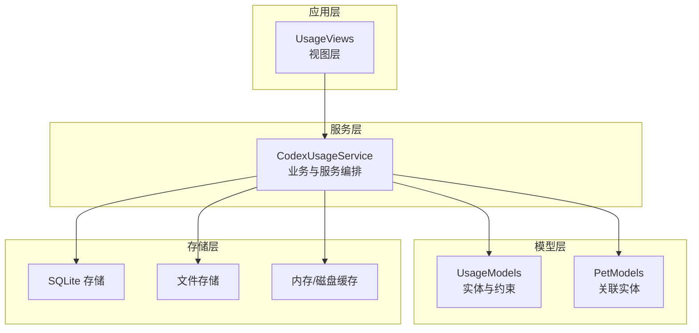
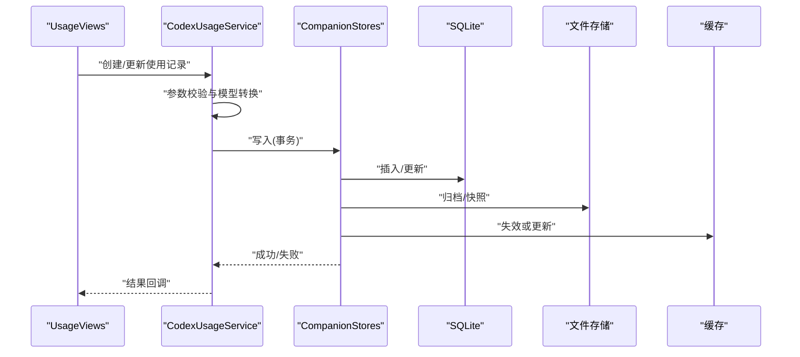
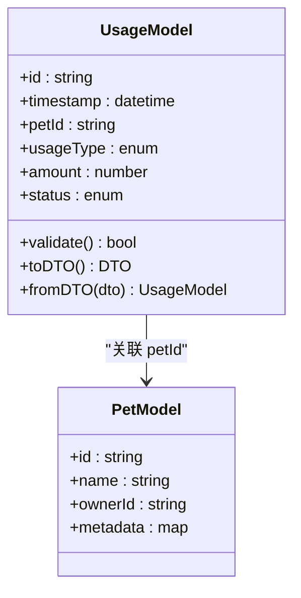
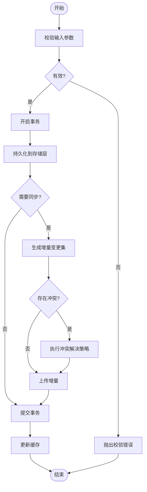
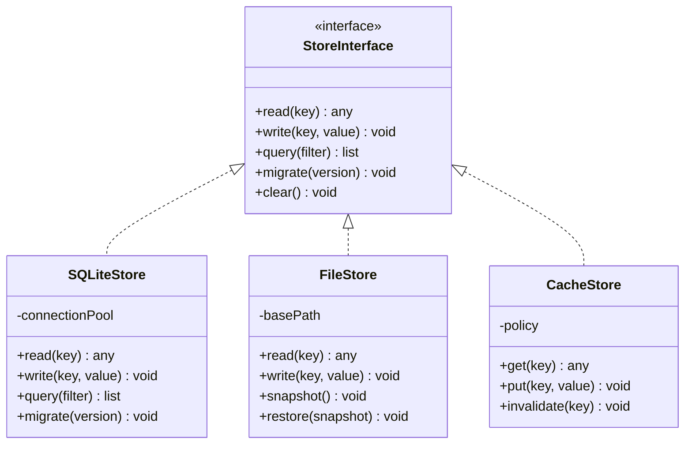
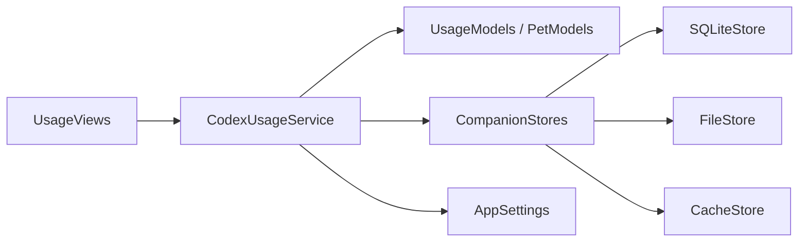

# 使用数据存储

<cite>
**本文引用的文件**   
- [UsageModels.swift](file://app/Tomo/Sources/Tomo/UsageModels.swift)
- [CodexUsageService.swift](file://app/Tomo/Sources/Tomo/CodexUsageService.swift)
- [CompanionStores.swift](file://app/Tomo/Sources/Tomo/CompanionStores.swift)
- [AppSettings.swift](file://app/Tomo/Sources/Tomo/AppSettings.swift)
- [PetModels.swift](file://app/Tomo/Sources/Tomo/PetModels.swift)
- [UsageViews.swift](file://app/Tomo/Sources/Tomo/UsageViews.swift)
</cite>

## 目录
1. [简介](#简介)
2. [项目结构](#项目结构)
3. [核心组件](#核心组件)
4. [架构总览](#架构总览)
5. [详细组件分析](#详细组件分析)
6. [依赖关系分析](#依赖关系分析)
7. [性能考虑](#性能考虑)
8. [故障排查指南](#故障排查指南)
9. [结论](#结论)
10. [附录](#附录)

## 简介
本技术文档围绕“使用数据存储”主题，聚焦于 UsageModels 中的实体定义、关系映射与约束规则；本地存储实现（SQLite 与文件存储策略、缓存机制）；数据同步（增量同步、冲突解决、离线管理）；备份与恢复（自动备份、迁移与版本兼容）；查询接口（复杂查询构建、索引优化、性能调优）；以及数据安全（加密存储、访问控制、完整性校验）。文档旨在帮助开发者快速理解并高效扩展该存储子系统。

## 项目结构
与数据存储相关的代码主要位于 app/Tomo/Sources/Tomo 目录下：
- UsageModels.swift：定义使用场景的数据模型与关系约束
- CodexUsageService.swift：封装使用数据的增删改查、同步与持久化逻辑
- CompanionStores.swift：提供本地存储后端（SQLite、文件、缓存）的抽象与实现
- AppSettings.swift：应用配置项（如存储路径、同步开关、加密开关等）
- PetModels.swift：宠物相关数据模型（可能作为关联实体参与关系映射）
- UsageViews.swift：UI 层对使用数据的展示与交互入口

图表来源
- [UsageModels.swift](file://app/Tomo/Sources/Tomo/UsageModels.swift)
- [CodexUsageService.swift](file://app/Tomo/Sources/Tomo/CodexUsageService.swift)
- [CompanionStores.swift](file://app/Tomo/Sources/Tomo/CompanionStores.swift)
- [AppSettings.swift](file://app/Tomo/Sources/Tomo/AppSettings.swift)
- [PetModels.swift](file://app/Tomo/Sources/Tomo/PetModels.swift)
- [UsageViews.swift](file://app/Tomo/Sources/Tomo/UsageViews.swift)

章节来源
- [UsageModels.swift](file://app/Tomo/Sources/Tomo/UsageModels.swift)
- [CodexUsageService.swift](file://app/Tomo/Sources/Tomo/CodexUsageService.swift)
- [CompanionStores.swift](file://app/Tomo/Sources/Tomo/CompanionStores.swift)
- [AppSettings.swift](file://app/Tomo/Sources/Tomo/AppSettings.swift)
- [PetModels.swift](file://app/Tomo/Sources/Tomo/PetModels.swift)
- [UsageViews.swift](file://app/Tomo/Sources/Tomo/UsageViews.swift)

## 核心组件
- UsageModels：集中定义使用场景的核心实体、字段类型、必填约束与关系映射（如一对一、一对多），并提供序列化/反序列化工具方法。
- CodexUsageService：对外暴露统一的数据访问 API，协调模型与存储后端，处理事务、并发、错误与重试。
- CompanionStores：抽象存储后端，提供 SQLite、文件与缓存的统一接口，支持按需切换与组合。
- AppSettings：集中管理存储路径、同步策略、加密开关、日志级别等配置。
- PetModels：宠物相关实体，常与使用数据存在关联关系，用于跨域查询与统计。
- UsageViews：将使用数据以可视化方式呈现，驱动用户操作并触发服务调用。

章节来源
- [UsageModels.swift](file://app/Tomo/Sources/Tomo/UsageModels.swift)
- [CodexUsageService.swift](file://app/Tomo/Sources/Tomo/CodexUsageService.swift)
- [CompanionStores.swift](file://app/Tomo/Sources/Tomo/CompanionStores.swift)
- [AppSettings.swift](file://app/Tomo/Sources/Tomo/AppSettings.swift)
- [PetModels.swift](file://app/Tomo/Sources/Tomo/PetModels.swift)
- [UsageViews.swift](file://app/Tomo/Sources/Tomo/UsageViews.swift)

## 架构总览
系统采用分层架构：视图层通过服务层访问数据，服务层基于模型进行业务编排，最终由存储层完成持久化与缓存。关键流程包括：
- 数据写入：视图触发 -> 服务校验与转换 -> 存储层写入（SQLite/文件）-> 缓存更新
- 数据读取：视图请求 -> 服务组装查询 -> 存储层检索（优先缓存）-> 返回结果
- 同步流程：本地变更收集 -> 增量上传/下载 -> 冲突检测与合并 -> 状态回写

图表来源
- [UsageViews.swift](file://app/Tomo/Sources/Tomo/UsageViews.swift)
- [CodexUsageService.swift](file://app/Tomo/Sources/Tomo/CodexUsageService.swift)
- [CompanionStores.swift](file://app/Tomo/Sources/Tomo/CompanionStores.swift)

## 详细组件分析

### UsageModels：实体定义、关系映射与约束
- 实体设计：包含主键、时间戳、外键、枚举与可选字段，确保可序列化与幂等性。
- 关系映射：定义与 PetModels 的一对一/一对多关系，便于联合查询与统计。
- 约束规则：非空校验、唯一性约束、范围校验（如用量上限）、时间顺序约束（开始不晚于结束）。
- 版本兼容：通过版本号字段与迁移钩子，支持向后兼容与平滑升级。

图表来源
- [UsageModels.swift](file://app/Tomo/Sources/Tomo/UsageModels.swift)
- [PetModels.swift](file://app/Tomo/Sources/Tomo/PetModels.swift)

章节来源
- [UsageModels.swift](file://app/Tomo/Sources/Tomo/UsageModels.swift)
- [PetModels.swift](file://app/Tomo/Sources/Tomo/PetModels.swift)

### CodexUsageService：数据访问与同步编排
- 统一 API：提供 create/update/delete/query/batchUpsert/sync 等方法。
- 事务与并发：读写分离、锁粒度控制、重试与退避策略。
- 同步机制：增量拉取/推送、断点续传、冲突检测（基于时间戳与版本号）、合并策略（最后写入胜出或自定义合并器）。
- 错误处理：分类异常（网络、IO、校验）、降级与回滚、审计日志。

图表来源
- [CodexUsageService.swift](file://app/Tomo/Sources/Tomo/CodexUsageService.swift)
- [CompanionStores.swift](file://app/Tomo/Sources/Tomo/CompanionStores.swift)

章节来源
- [CodexUsageService.swift](file://app/Tomo/Sources/Tomo/CodexUsageService.swift)
- [CompanionStores.swift](file://app/Tomo/Sources/Tomo/CompanionStores.swift)

### CompanionStores：本地存储实现（SQLite、文件、缓存）
- 抽象接口：定义统一的 read/write/query/migrate/clear 接口，屏蔽底层差异。
- SQLite 实现：连接池、预编译语句、事务批处理、索引维护、PRAGMA 优化。
- 文件存储：结构化 JSON/二进制归档、原子写入、快照与回滚。
- 缓存机制：LRU/LFU 策略、过期时间、一致性保证（失效与回填）。

图表来源
- [CompanionStores.swift](file://app/Tomo/Sources/Tomo/CompanionStores.swift)

章节来源
- [CompanionStores.swift](file://app/Tomo/Sources/Tomo/CompanionStores.swift)

### AppSettings：配置与策略
- 存储路径：数据库文件、归档目录、缓存目录。
- 同步策略：增量开关、冲突策略、重试次数、超时设置。
- 安全选项：加密开关、密钥来源、完整性校验算法。
- 日志与监控：日志级别、采样率、指标上报。

章节来源
- [AppSettings.swift](file://app/Tomo/Sources/Tomo/AppSettings.swift)

### UsageViews：数据查询与展示
- 查询构建：支持按时间范围、类型、宠物 ID、状态过滤，分页与排序。
- 性能优化：懒加载、虚拟滚动、批量渲染。
- 交互反馈：加载态、错误提示、重试按钮。

章节来源
- [UsageViews.swift](file://app/Tomo/Sources/Tomo/UsageViews.swift)

## 依赖关系分析
- 视图层依赖服务层，服务层依赖模型与存储抽象，存储层依赖具体实现（SQLite/文件/缓存）。
- 配置中心化管理，避免硬编码，提升可测试性与可移植性。
- 潜在循环依赖：服务不应直接依赖视图；模型不应依赖存储实现。

图表来源
- [UsageViews.swift](file://app/Tomo/Sources/Tomo/UsageViews.swift)
- [CodexUsageService.swift](file://app/Tomo/Sources/Tomo/CodexUsageService.swift)
- [UsageModels.swift](file://app/Tomo/Sources/Tomo/UsageModels.swift)
- [PetModels.swift](file://app/Tomo/Sources/Tomo/PetModels.swift)
- [CompanionStores.swift](file://app/Tomo/Sources/Tomo/CompanionStores.swift)
- [AppSettings.swift](file://app/Tomo/Sources/Tomo/AppSettings.swift)

章节来源
- [UsageViews.swift](file://app/Tomo/Sources/Tomo/UsageViews.swift)
- [CodexUsageService.swift](file://app/Tomo/Sources/Tomo/CodexUsageService.swift)
- [UsageModels.swift](file://app/Tomo/Sources/Tomo/UsageModels.swift)
- [PetModels.swift](file://app/Tomo/Sources/Tomo/PetModels.swift)
- [CompanionStores.swift](file://app/Tomo/Sources/Tomo/CompanionStores.swift)
- [AppSettings.swift](file://app/Tomo/Sources/Tomo/AppSettings.swift)

## 性能考虑
- 查询优化：合理使用索引（时间戳、外键、常用过滤字段），避免全表扫描；分页与投影减少数据传输。
- 事务批处理：合并多次写入为单次事务，降低 IO 开销。
- 缓存策略：热点数据入缓存，设置合理 TTL；读写穿透时回填。
- 连接池：复用数据库连接，避免频繁创建销毁。
- 异步与背压：大查询与同步任务异步化，限制并发度防止阻塞。

[本节为通用指导，无需特定文件引用]

## 故障排查指南
- 常见问题
  - 数据库锁定：检查事务未提交或长事务；增加超时与重试。
  - 同步失败：确认网络连通与权限；查看增量日志与冲突记录。
  - 缓存不一致：强制失效并重新加载；检查失效策略。
  - 数据损坏：启用完整性校验与备份恢复；从快照回滚。
- 诊断步骤
  - 打开详细日志，定位错误堆栈与 SQL 语句。
  - 验证模型校验与约束是否通过。
  - 对比本地与远端时间戳/版本号，识别冲突点。
  - 检查存储路径权限与磁盘空间。

章节来源
- [CodexUsageService.swift](file://app/Tomo/Sources/Tomo/CodexUsageService.swift)
- [CompanionStores.swift](file://app/Tomo/Sources/Tomo/CompanionStores.swift)
- [AppSettings.swift](file://app/Tomo/Sources/Tomo/AppSettings.swift)

## 结论
本存储子系统以清晰的层次划分与抽象接口，实现了高内聚、低耦合的数据访问能力。通过 UsageModels 的严谨建模、CodexUsageService 的稳健编排、CompanionStores 的多后端支持与 AppSettings 的可配置化，系统在可靠性、可扩展性与安全性方面具备良好基础。建议在生产环境启用加密与完整性校验，结合监控与告警持续优化性能与稳定性。

[本节为总结性内容，无需特定文件引用]

## 附录
- 数据备份与恢复
  - 自动备份：定时快照、增量归档、异地副本。
  - 数据迁移：版本化迁移脚本、灰度发布与回滚。
  - 兼容性：向后兼容字段、弃用标记与清理计划。
- 数据安全
  - 加密存储：字段级/文件级加密，密钥轮换。
  - 访问控制：最小权限原则、角色与令牌。
  - 完整性校验：哈希校验、签名验证。
- 查询接口使用指南
  - 复杂查询：多条件组合、聚合与分组、窗口函数。
  - 索引优化：覆盖索引、复合索引、选择性评估。
  - 性能调优：EXPLAIN 分析、慢查询捕获、缓存命中率。

[本节为补充信息，无需特定文件引用]