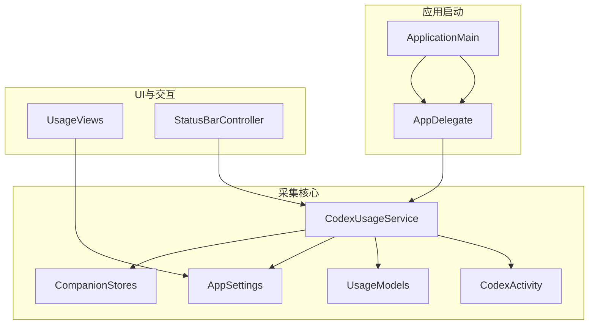
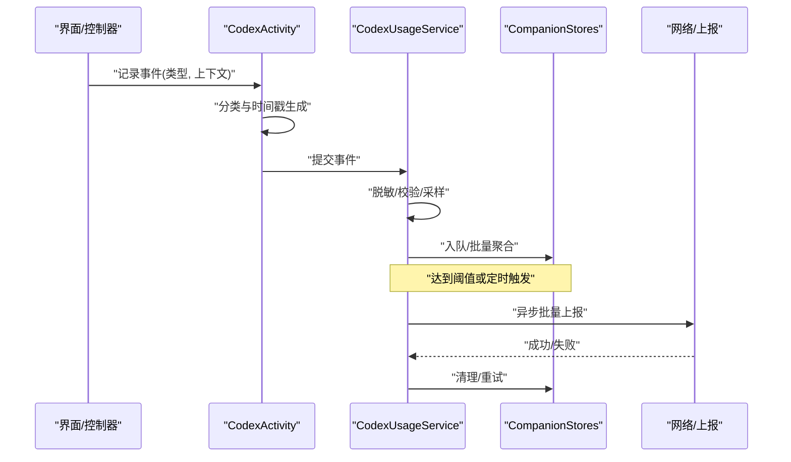
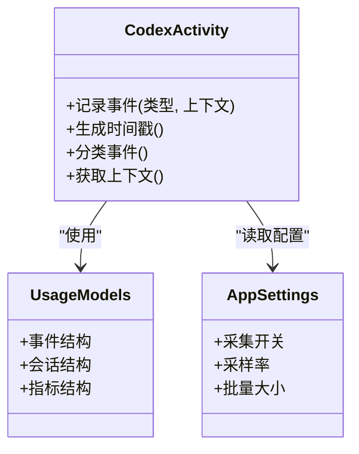
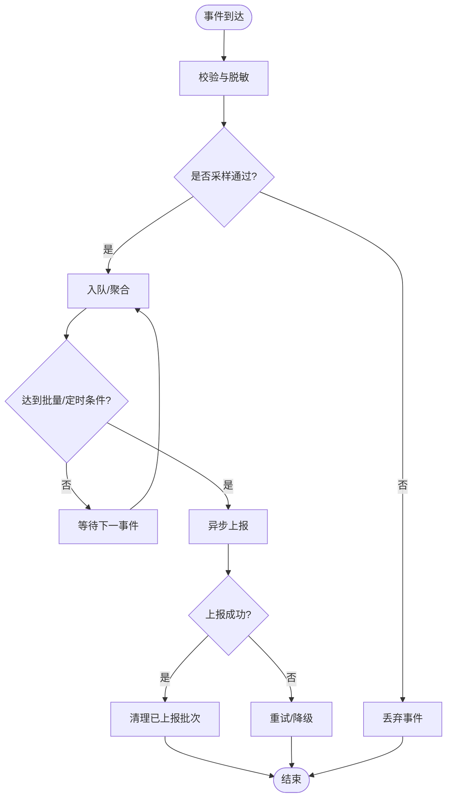
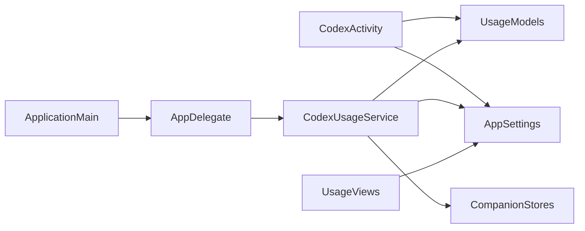

# 使用数据采集

<cite>
**本文引用的文件**   
- [CodexActivity.swift](file://app/Tomo/Sources/Tomo/CodexActivity.swift)
- [CodexUsageService.swift](file://app/Tomo/Sources/Tomo/CodexUsageService.swift)
- [AppSettings.swift](file://app/Tomo/Sources/Tomo/AppSettings.swift)
- [AppDelegate.swift](file://app/Tomo/Sources/Tomo/AppDelegate.swift)
- [ApplicationMain.swift](file://app/Tomo/Sources/Tomo/ApplicationMain.swift)
- [UsageModels.swift](file://app/Tomo/Sources/Tomo/UsageModels.swift)
- [UsageViews.swift](file://app/Tomo/Sources/Tomo/UsageViews.swift)
- [CompanionStores.swift](file://app/Tomo/Sources/Tomo/CompanionStores.swift)
- [StatusBarController.swift](file://app/Tomo/Sources/Tomo/StatusBarController.swift)
</cite>

## 目录
1. [简介](#简介)
2. [项目结构](#项目结构)
3. [核心组件](#核心组件)
4. [架构总览](#架构总览)
5. [详细组件分析](#详细组件分析)
6. [依赖关系分析](#依赖关系分析)
7. [性能考虑](#性能考虑)
8. [故障排查指南](#故障排查指南)
9. [结论](#结论)
10. [附录](#附录)

## 简介
本技术文档面向“使用数据采集”子系统，聚焦用户行为数据的采集机制、活动跟踪实现、隐私保护策略、数据格式规范、配置与自定义埋点方法，以及性能优化建议。文档以代码级分析为基础，结合可视化图示帮助读者快速理解系统设计与落地实践。

## 项目结构
本项目为 macOS 应用（Swift），数据采集相关能力集中在 app/Tomo/Sources/Tomo 目录下：
- CodexActivity.swift：活动跟踪核心类，负责事件分类、时间戳管理与上报编排。
- CodexUsageService.swift：采集服务层，统一入口、调度与持久化/上报。
- AppSettings.swift：采集开关、采样率、批量大小等配置项。
- UsageModels.swift：数据模型定义（事件、会话、指标等）。
- UsageViews.swift：设置界面，暴露采集开关与参数调节。
- AppDelegate.swift / ApplicationMain.swift：应用生命周期集成，初始化采集服务。
- CompanionStores.swift：状态存储，用于本地缓存与队列管理。
- StatusBarController.swift：菜单栏状态展示，可能包含采集统计或开关。

图表来源
- [ApplicationMain.swift](file://app/Tomo/Sources/Tomo/ApplicationMain.swift)
- [AppDelegate.swift](file://app/Tomo/Sources/Tomo/AppDelegate.swift)
- [CodexUsageService.swift](file://app/Tomo/Sources/Tomo/CodexUsageService.swift)
- [CodexActivity.swift](file://app/Tomo/Sources/Tomo/CodexActivity.swift)
- [UsageModels.swift](file://app/Tomo/Sources/Tomo/UsageModels.swift)
- [AppSettings.swift](file://app/Tomo/Sources/Tomo/AppSettings.swift)
- [CompanionStores.swift](file://app/Tomo/Sources/Tomo/CompanionStores.swift)
- [UsageViews.swift](file://app/Tomo/Sources/Tomo/UsageViews.swift)
- [StatusBarController.swift](file://app/Tomo/Sources/Tomo/StatusBarController.swift)

章节来源
- [ApplicationMain.swift](file://app/Tomo/Sources/Tomo/ApplicationMain.swift)
- [AppDelegate.swift](file://app/Tomo/Sources/Tomo/AppDelegate.swift)
- [CodexUsageService.swift](file://app/Tomo/Sources/Tomo/CodexUsageService.swift)
- [CodexActivity.swift](file://app/Tomo/Sources/Tomo/CodexActivity.swift)
- [UsageModels.swift](file://app/Tomo/Sources/Tomo/UsageModels.swift)
- [AppSettings.swift](file://app/Tomo/Sources/Tomo/AppSettings.swift)
- [CompanionStores.swift](file://app/Tomo/Sources/Tomo/CompanionStores.swift)
- [UsageViews.swift](file://app/Tomo/Sources/Tomo/UsageViews.swift)
- [StatusBarController.swift](file://app/Tomo/Sources/Tomo/StatusBarController.swift)

## 核心组件
- 活动跟踪类（CodexActivity）
  - 职责：定义事件分类体系、生成时间戳、封装事件上下文、提供统一的记录接口。
  - 关键点：事件类型枚举、时间戳精度、上下文字段（如页面、模块、操作对象）、去重与过滤规则。
- 采集服务（CodexUsageService）
  - 职责：接收事件、执行脱敏与校验、入队/批量聚合、异步上报、失败重试与降级。
  - 关键点：线程安全、背压控制、批处理策略、网络错误处理、本地持久化。
- 配置（AppSettings）
  - 职责：集中管理采集开关、采样率、批量大小、保留时长、敏感词过滤列表等。
  - 关键点：运行时热更新、默认值与覆盖策略、权限检查。
- 数据模型（UsageModels）
  - 职责：定义事件、会话、指标的结构与约束。
  - 关键点：必填字段、长度限制、枚举值、版本兼容。
- UI 与状态（UsageViews、CompanionStores、StatusBarController）
  - 职责：提供采集开关与参数调节界面；维护本地队列与统计；在菜单栏展示状态。

章节来源
- [CodexActivity.swift](file://app/Tomo/Sources/Tomo/CodexActivity.swift)
- [CodexUsageService.swift](file://app/Tomo/Sources/Tomo/CodexUsageService.swift)
- [AppSettings.swift](file://app/Tomo/Sources/Tomo/AppSettings.swift)
- [UsageModels.swift](file://app/Tomo/Sources/Tomo/UsageModels.swift)
- [UsageViews.swift](file://app/Tomo/Sources/Tomo/UsageViews.swift)
- [CompanionStores.swift](file://app/Tomo/Sources/Tomo/CompanionStores.swift)
- [StatusBarController.swift](file://app/Tomo/Sources/Tomo/StatusBarController.swift)

## 架构总览
下图展示了从事件触发到上报的端到端流程，包括事件分类、时间戳管理、脱敏校验、批量聚合与异步上报。

图表来源
- [CodexActivity.swift](file://app/Tomo/Sources/Tomo/CodexActivity.swift)
- [CodexUsageService.swift](file://app/Tomo/Sources/Tomo/CodexUsageService.swift)
- [CompanionStores.swift](file://app/Tomo/Sources/Tomo/CompanionStores.swift)

章节来源
- [CodexActivity.swift](file://app/Tomo/Sources/Tomo/CodexActivity.swift)
- [CodexUsageService.swift](file://app/Tomo/Sources/Tomo/CodexUsageService.swift)
- [CompanionStores.swift](file://app/Tomo/Sources/Tomo/CompanionStores.swift)

## 详细组件分析

### CodexActivity 类分析
- 功能要点
  - 事件分类体系：按模块/页面/动作维度划分，便于后续分析与归因。
  - 时间戳管理：统一生成高精度时间戳，支持时区与序列号避免重复。
  - 上下文封装：附加页面、模块、操作对象、设备信息等元数据。
  - 埋点接口：提供轻量 API，供各模块调用。
- 设计模式
  - 单例/全局访问：确保事件入口一致性与配置共享。
  - 观察者/回调：可选的事件监听扩展点。
- 复杂度与性能
  - 事件构造 O(1)，时间戳生成 O(1)。
  - 上下文字段按需填充，避免不必要开销。

图表来源
- [CodexActivity.swift](file://app/Tomo/Sources/Tomo/CodexActivity.swift)
- [UsageModels.swift](file://app/Tomo/Sources/Tomo/UsageModels.swift)
- [AppSettings.swift](file://app/Tomo/Sources/Tomo/AppSettings.swift)

章节来源
- [CodexActivity.swift](file://app/Tomo/Sources/Tomo/CodexActivity.swift)
- [UsageModels.swift](file://app/Tomo/Sources/Tomo/UsageModels.swift)
- [AppSettings.swift](file://app/Tomo/Sources/Tomo/AppSettings.swift)

### CodexUsageService 服务分析
- 职责边界
  - 接收来自 CodexActivity 的事件，进行脱敏、校验、采样。
  - 将事件入队并批量聚合，触发异步上报。
  - 处理网络错误、重试与降级策略。
- 关键流程
  - 事件入队：线程安全队列，防止阻塞主线程。
  - 批量策略：按数量或时间窗口触发上报。
  - 失败重试：指数退避与最大重试次数。
- 内存与并发
  - 使用环形缓冲或限流队列控制内存占用。
  - 后台任务调度，避免 UI 卡顿。

图表来源
- [CodexUsageService.swift](file://app/Tomo/Sources/Tomo/CodexUsageService.swift)
- [CompanionStores.swift](file://app/Tomo/Sources/Tomo/CompanionStores.swift)

章节来源
- [CodexUsageService.swift](file://app/Tomo/Sources/Tomo/CodexUsageService.swift)
- [CompanionStores.swift](file://app/Tomo/Sources/Tomo/CompanionStores.swift)

### 数据模型与格式规范（UsageModels）
- 事件模型
  - 字段：事件类型、时间戳、会话ID、模块、页面、操作对象、额外属性。
  - 验证：必填字段校验、长度限制、枚举值白名单。
- 会话模型
  - 字段：会话ID、开始时间、结束时间、设备信息、应用版本。
  - 生命周期：首次启动创建，退出或超时关闭。
- 指标模型
  - 字段：指标名称、数值、单位、维度标签。
  - 用途：性能与可用性度量。
- 版本兼容
  - 字段可演进，旧客户端忽略未知字段。

章节来源
- [UsageModels.swift](file://app/Tomo/Sources/Tomo/UsageModels.swift)

### 配置与自定义埋点（AppSettings、UsageViews）
- 配置项
  - 采集开关：全局启用/禁用。
  - 采样率：按比例随机采样，降低负载。
  - 批量大小：单次上报事件数。
  - 保留时长：本地缓存过期策略。
  - 敏感词过滤：黑名单与正则替换。
- 自定义埋点
  - 在业务模块调用 CodexActivity 记录事件。
  - 通过 UsageViews 动态调整参数，无需重启。
  - 事件类型需在白名单内，避免滥用。

章节来源
- [AppSettings.swift](file://app/Tomo/Sources/Tomo/AppSettings.swift)
- [UsageViews.swift](file://app/Tomo/Sources/Tomo/UsageViews.swift)

### 应用集成（AppDelegate、ApplicationMain）
- 启动初始化
  - 加载配置、初始化采集服务、注册生命周期回调。
- 生命周期事件
  - 前台/后台切换、应用退出时触发会话结束与数据落盘。
- 状态栏集成
  - 显示采集状态、快速开关与统计概览。

章节来源
- [AppDelegate.swift](file://app/Tomo/Sources/Tomo/AppDelegate.swift)
- [ApplicationMain.swift](file://app/Tomo/Sources/Tomo/ApplicationMain.swift)
- [StatusBarController.swift](file://app/Tomo/Sources/Tomo/StatusBarController.swift)

## 依赖关系分析
- 组件耦合
  - CodexActivity 依赖 UsageModels 与 AppSettings。
  - CodexUsageService 依赖 UsageModels、AppSettings、CompanionStores。
  - UI 层（UsageViews）仅依赖 AppSettings 与少量状态。
- 外部依赖
  - 网络库（上报）、文件系统（本地缓存）、系统框架（生命周期）。
- 潜在循环依赖
  - 通过服务层解耦，避免直接双向引用。

图表来源
- [CodexActivity.swift](file://app/Tomo/Sources/Tomo/CodexActivity.swift)
- [CodexUsageService.swift](file://app/Tomo/Sources/Tomo/CodexUsageService.swift)
- [UsageModels.swift](file://app/Tomo/Sources/Tomo/UsageModels.swift)
- [AppSettings.swift](file://app/Tomo/Sources/Tomo/AppSettings.swift)
- [CompanionStores.swift](file://app/Tomo/Sources/Tomo/CompanionStores.swift)
- [AppDelegate.swift](file://app/Tomo/Sources/Tomo/AppDelegate.swift)
- [ApplicationMain.swift](file://app/Tomo/Sources/Tomo/ApplicationMain.swift)

章节来源
- [CodexActivity.swift](file://app/Tomo/Sources/Tomo/CodexActivity.swift)
- [CodexUsageService.swift](file://app/Tomo/Sources/Tomo/CodexUsageService.swift)
- [UsageModels.swift](file://app/Tomo/Sources/Tomo/UsageModels.swift)
- [AppSettings.swift](file://app/Tomo/Sources/Tomo/AppSettings.swift)
- [CompanionStores.swift](file://app/Tomo/Sources/Tomo/CompanionStores.swift)
- [AppDelegate.swift](file://app/Tomo/Sources/Tomo/AppDelegate.swift)
- [ApplicationMain.swift](file://app/Tomo/Sources/Tomo/ApplicationMain.swift)

## 性能考虑
- 批量采集
  - 按数量或时间窗口聚合，减少网络请求与序列化开销。
- 异步处理
  - 所有 IO 与网络操作置于后台队列，避免阻塞 UI。
- 内存管理
  - 使用有界队列与环形缓冲，限制峰值内存。
  - 及时释放临时对象，避免 retain cycle。
- 采样与降采样
  - 高频率事件采用概率采样，降低整体负载。
- 失败重试与降级
  - 指数退避、最大重试次数、离线缓存与延迟上报。
- 监控与诊断
  - 记录队列长度、丢弃率、上报成功率，辅助定位瓶颈。

[本节为通用指导，不直接分析具体文件]

## 故障排查指南
- 常见问题
  - 事件未上报：检查采集开关、采样率、网络状态与队列积压。
  - 数据缺失：确认时间戳生成与上下文字段填充逻辑。
  - 性能抖动：观察队列长度与 CPU 使用率，调整批量大小与采样率。
- 调试手段
  - 开启详细日志，追踪事件生命周期。
  - 使用状态栏查看实时统计与开关状态。
  - 模拟网络失败，验证重试与降级路径。

章节来源
- [CodexUsageService.swift](file://app/Tomo/Sources/Tomo/CodexUsageService.swift)
- [StatusBarController.swift](file://app/Tomo/Sources/Tomo/StatusBarController.swift)

## 结论
本数据采集系统以 CodexActivity 与 CodexUsageService 为核心，配合清晰的模型与配置，实现了稳定、可扩展且隐私友好的用户行为采集。通过批量与异步策略、严格的脱敏与校验、完善的监控与降级，系统在性能与可靠性之间取得平衡。建议在新增埋点时遵循白名单与最小必要原则，持续优化采样与批量策略，保障用户体验与数据安全。

[本节为总结性内容，不直接分析具体文件]

## 附录
- 事件分类建议
  - 模块维度：登录、设置、聊天、宠物管理等。
  - 页面维度：首页、仪表盘、设置页等。
  - 动作维度：点击、输入、切换、导出等。
- 隐私保护措施
  - 匿名化：移除或哈希用户标识。
  - 敏感信息过滤：基于黑名单与正则替换。
  - 数据脱敏：对文本与路径进行掩码处理。
- 数据字段示例（概念性）
  - 事件类型、时间戳、会话ID、模块、页面、操作对象、额外属性。
  - 会话ID、开始/结束时间、设备信息、应用版本。
  - 指标名称、数值、单位、维度标签。

[本节为概念性补充，不直接分析具体文件]