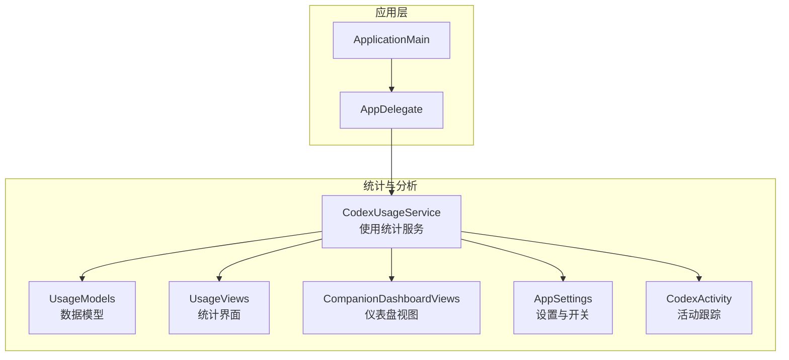
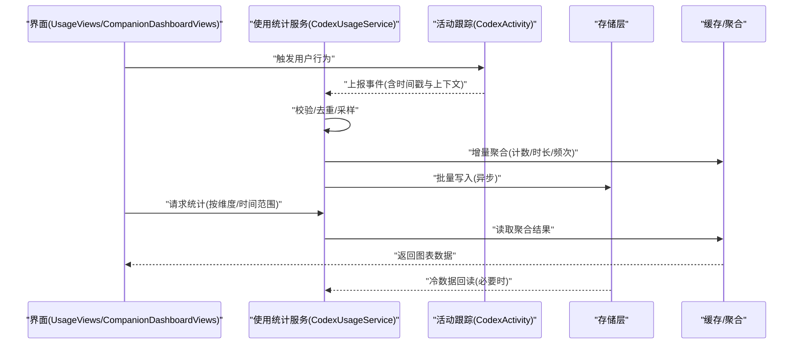
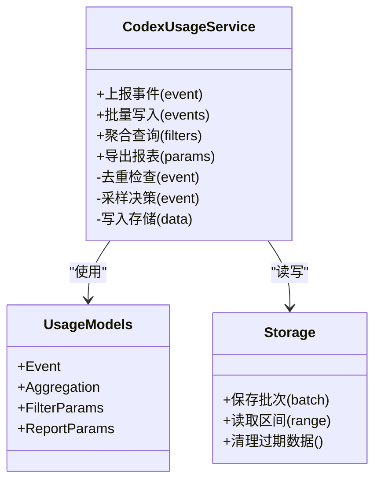
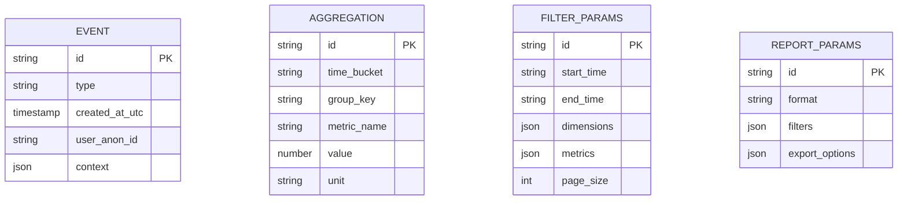
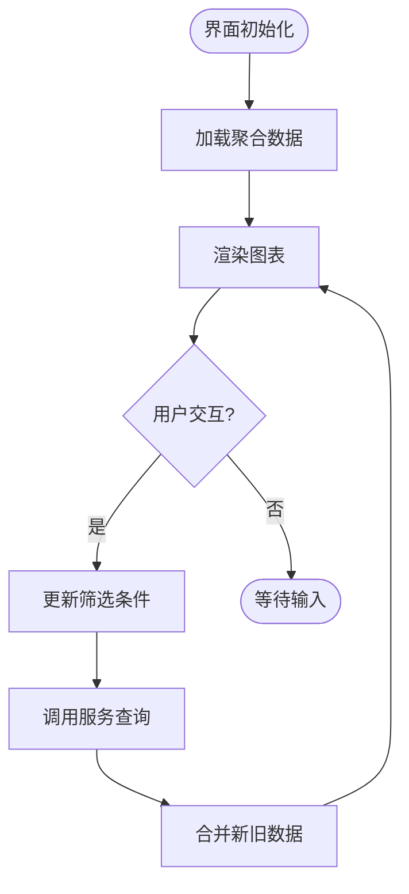
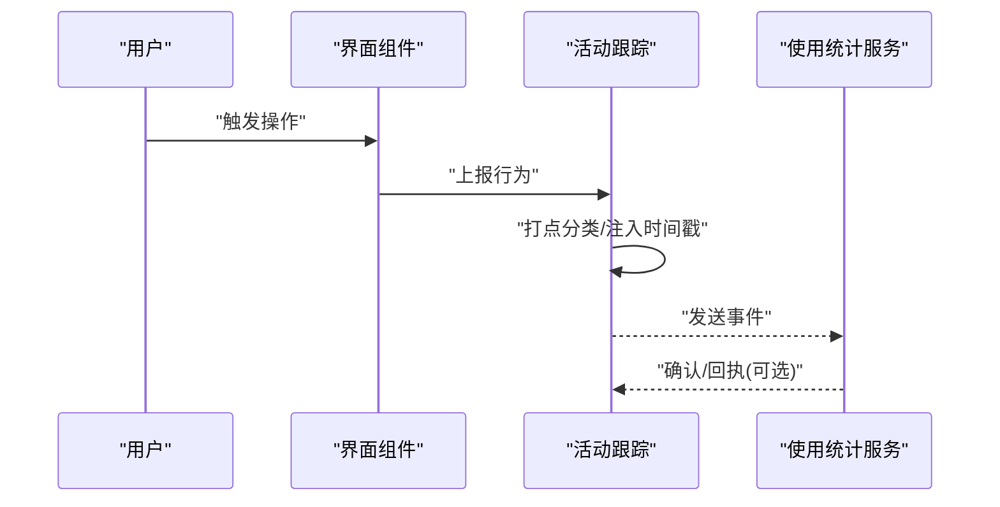
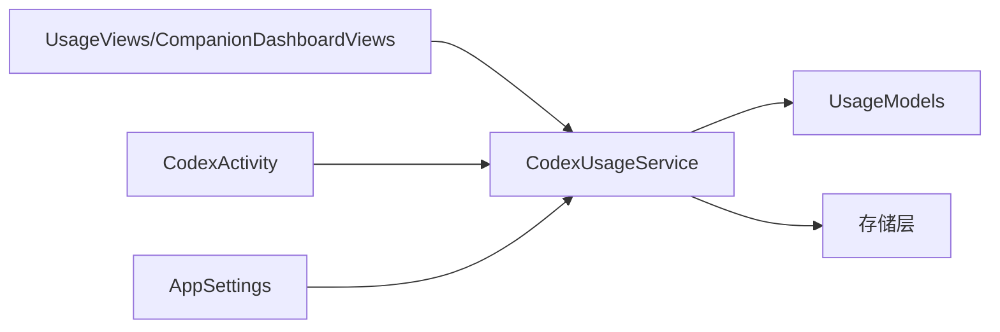

# 使用统计与分析

<cite>
**本文档引用的文件**   
- [CodexUsageService.swift](file://app/Tomo/Sources/Tomo/CodexUsageService.swift)
- [UsageModels.swift](file://app/Tomo/Sources/Tomo/UsageModels.swift)
- [UsageViews.swift](file://app/Tomo/Sources/Tomo/UsageViews.swift)
- [CompanionDashboardViews.swift](file://app/Tomo/Sources/Tomo/CompanionDashboardViews.swift)
- [AppSettings.swift](file://app/Tomo/Sources/Tomo/AppSettings.swift)
- [CodexActivity.swift](file://app/Tomo/Sources/Tomo/CodexActivity.swift)
- [README.md](file://README.md)
- [PROJECT.md](file://PROJECT.md)
</cite>

## 目录
1. [简介](#简介)
2. [项目结构](#项目结构)
3. [核心组件](#核心组件)
4. [架构总览](#架构总览)
5. [详细组件分析](#详细组件分析)
6. [依赖关系分析](#依赖关系分析)
7. [性能考虑](#性能考虑)
8. [故障排查指南](#故障排查指南)
9. [结论](#结论)
10. [附录](#附录)

## 简介
本技术文档围绕“使用统计与分析系统”展开，聚焦以下目标：
- 使用数据的收集机制、存储格式与分析算法
- 活动跟踪系统的实现（用户行为记录、事件分类与时间戳管理）
- 使用统计界面的数据可视化（图表渲染、实时更新与交互）
- 数据隐私保护、匿名化处理与安全存储策略
- 数据分析接口使用指南（查询统计数据、生成报告、自定义分析维度）
- 性能优化建议、大数据量处理与离线数据同步最佳实践

该文档旨在帮助开发者快速理解并扩展系统能力，同时为产品与运营人员提供可操作的分析与报表方法。

## 项目结构
本项目采用 Swift 应用为主，配套 Next.js 着陆页。与“使用统计与分析”直接相关的代码位于 app/Tomo/Sources/Tomo 目录下，包括服务层、模型层与视图层。

**图示来源**
- [CodexUsageService.swift](file://app/Tomo/Sources/Tomo/CodexUsageService.swift)
- [UsageModels.swift](file://app/Tomo/Sources/Tomo/UsageModels.swift)
- [UsageViews.swift](file://app/Tomo/Sources/Tomo/UsageViews.swift)
- [CompanionDashboardViews.swift](file://app/Tomo/Sources/Tomo/CompanionDashboardViews.swift)
- [AppSettings.swift](file://app/Tomo/Sources/Tomo/AppSettings.swift)
- [CodexActivity.swift](file://app/Tomo/Sources/Tomo/CodexActivity.swift)

**章节来源**
- [README.md](file://README.md)
- [PROJECT.md](file://PROJECT.md)

## 核心组件
- 使用统计服务（CodexUsageService）
  - 职责：采集使用事件、聚合指标、持久化存储、对外暴露查询接口、驱动界面更新
  - 关键能力：事件队列、批处理写入、增量聚合、缓存与去重、错误重试与降级
- 数据模型（UsageModels）
  - 职责：定义事件结构、指标实体、聚合结果、分页与过滤参数
  - 关键设计：不可变值对象、序列化友好、可扩展字段
- 统计界面（UsageViews / CompanionDashboardViews）
  - 职责：渲染图表、展示趋势与分布、支持筛选与钻取、实时刷新
  - 关键能力：响应式状态、增量更新、交互反馈
- 设置与开关（AppSettings）
  - 职责：控制数据采集开关、隐私选项、采样率、本地存储路径
- 活动跟踪（CodexActivity）
  - 职责：捕获用户行为、打点分类、时间戳与上下文信息注入

**章节来源**
- [CodexUsageService.swift](file://app/Tomo/Sources/Tomo/CodexUsageService.swift)
- [UsageModels.swift](file://app/Tomo/Sources/Tomo/UsageModels.swift)
- [UsageViews.swift](file://app/Tomo/Sources/Tomo/UsageViews.swift)
- [CompanionDashboardViews.swift](file://app/Tomo/Sources/Tomo/CompanionDashboardViews.swift)
- [AppSettings.swift](file://app/Tomo/Sources/Tomo/AppSettings.swift)
- [CodexActivity.swift](file://app/Tomo/Sources/Tomo/CodexActivity.swift)

## 架构总览
整体架构遵循“采集—聚合—存储—可视化—分析”的链路，强调低耦合与高内聚：
- 采集层：通过活动跟踪模块捕获用户行为，统一事件格式与时间戳
- 服务层：负责事件入队、批处理、聚合计算、去重与异常恢复
- 存储层：本地持久化（如键值或轻量数据库），支持加密与压缩
- 展示层：图表渲染、实时更新、交互筛选
- 分析层：提供查询接口与报表生成，支持自定义维度

**图示来源**
- [CodexUsageService.swift](file://app/Tomo/Sources/Tomo/CodexUsageService.swift)
- [UsageModels.swift](file://app/Tomo/Sources/Tomo/UsageModels.swift)
- [UsageViews.swift](file://app/Tomo/Sources/Tomo/UsageViews.swift)
- [CompanionDashboardViews.swift](file://app/Tomo/Sources/Tomo/CompanionDashboardViews.swift)
- [CodexActivity.swift](file://app/Tomo/Sources/Tomo/CodexActivity.swift)

## 详细组件分析

### 使用统计服务（CodexUsageService）
- 功能要点
  - 事件采集：接收来自活动跟踪的事件，进行格式标准化与必填字段校验
  - 事件队列：内存队列缓冲，避免阻塞主线程；支持优先级与重试
  - 批处理写入：定时或阈值触发批量落盘，降低 I/O 压力
  - 聚合计算：按日/周/月、功能模块、用户角色等维度进行计数与时序聚合
  - 去重策略：基于事件 ID 与时间窗口去重，防止重复统计
  - 错误处理：失败重试、降级策略（仅内存缓存）、告警日志
  - 接口暴露：提供查询 API（按时间范围、维度、指标）
- 数据结构
  - 事件模型：包含类型、时间戳、上下文、可选指纹
  - 聚合模型：时间序列、分组键、指标值
- 性能优化
  - 异步写入、批量合并、内存池复用、惰性加载
  - 采样与降采样策略，减少高频事件的存储压力

**图示来源**
- [CodexUsageService.swift](file://app/Tomo/Sources/Tomo/CodexUsageService.swift)
- [UsageModels.swift](file://app/Tomo/Sources/Tomo/UsageModels.swift)

**章节来源**
- [CodexUsageService.swift](file://app/Tomo/Sources/Tomo/CodexUsageService.swift)
- [UsageModels.swift](file://app/Tomo/Sources/Tomo/UsageModels.swift)

### 数据模型（UsageModels）
- 事件模型
  - 字段：事件类型、时间戳、用户标识（匿名化）、设备信息、上下文键值对
  - 约束：时间戳必须为 UTC，事件类型需白名单校验
- 聚合模型
  - 字段：时间粒度、分组键、指标名称、数值、单位
  - 用途：支撑折线图、柱状图、热力图等
- 过滤与报表参数
  - 字段：时间范围、维度列表、指标集合、分页大小
  - 用途：统一查询入口，便于扩展新维度

**图示来源**
- [UsageModels.swift](file://app/Tomo/Sources/Tomo/UsageModels.swift)

**章节来源**
- [UsageModels.swift](file://app/Tomo/Sources/Tomo/UsageModels.swift)

### 统计界面（UsageViews / CompanionDashboardViews）
- 图表渲染
  - 折线图：趋势与对比（日/周/月）
  - 柱状图：分类统计（功能模块、用户角色）
  - 热力图：时段活跃度
- 实时更新
  - 增量订阅：监听服务层聚合变更，局部刷新
  - 防抖与节流：避免频繁重绘
- 交互功能
  - 时间范围选择、维度切换、下钻详情
  - 导出 CSV/JSON、分享快照

**图示来源**
- [UsageViews.swift](file://app/Tomo/Sources/Tomo/UsageViews.swift)
- [CompanionDashboardViews.swift](file://app/Tomo/Sources/Tomo/CompanionDashboardViews.swift)
- [CodexUsageService.swift](file://app/Tomo/Sources/Tomo/CodexUsageService.swift)

**章节来源**
- [UsageViews.swift](file://app/Tomo/Sources/Tomo/UsageViews.swift)
- [CompanionDashboardViews.swift](file://app/Tomo/Sources/Tomo/CompanionDashboardViews.swift)

### 活动跟踪（CodexActivity）
- 行为记录
  - 捕获点击、页面切换、功能使用、错误发生等
  - 注入时间戳（UTC）、会话 ID、设备指纹（脱敏）
- 事件分类
  - 基础操作、业务功能、系统事件、错误与异常
- 时间戳管理
  - 统一时钟源，跨时区一致性
  - 延迟上报时的时间校正

**图示来源**
- [CodexActivity.swift](file://app/Tomo/Sources/Tomo/CodexActivity.swift)
- [CodexUsageService.swift](file://app/Tomo/Sources/Tomo/CodexUsageService.swift)

**章节来源**
- [CodexActivity.swift](file://app/Tomo/Sources/Tomo/CodexActivity.swift)

### 设置与开关（AppSettings）
- 数据采集开关：全局启用/禁用、按模块细粒度控制
- 隐私选项：匿名化级别、是否允许设备信息、是否允许网络上报
- 采样率：高频事件采样比例，平衡精度与开销
- 存储路径：本地目录、加密标志、压缩策略

**章节来源**
- [AppSettings.swift](file://app/Tomo/Sources/Tomo/AppSettings.swift)

## 依赖关系分析
- 组件耦合
  - 使用统计服务依赖活动跟踪与存储层，解耦于界面层
  - 界面层仅依赖服务提供的查询接口，不关心存储细节
- 外部依赖
  - 可能涉及加密库、序列化库、图表渲染库
- 潜在循环依赖
  - 确保服务与模型之间单向依赖，避免界面与服务双向引用

**图示来源**
- [CodexUsageService.swift](file://app/Tomo/Sources/Tomo/CodexUsageService.swift)
- [UsageModels.swift](file://app/Tomo/Sources/Tomo/UsageModels.swift)
- [UsageViews.swift](file://app/Tomo/Sources/Tomo/UsageViews.swift)
- [CompanionDashboardViews.swift](file://app/Tomo/Sources/Tomo/CompanionDashboardViews.swift)
- [CodexActivity.swift](file://app/Tomo/Sources/Tomo/CodexActivity.swift)
- [AppSettings.swift](file://app/Tomo/Sources/Tomo/AppSettings.swift)

**章节来源**
- [CodexUsageService.swift](file://app/Tomo/Sources/Tomo/CodexUsageService.swift)
- [UsageModels.swift](file://app/Tomo/Sources/Tomo/UsageModels.swift)
- [UsageViews.swift](file://app/Tomo/Sources/Tomo/UsageViews.swift)
- [CompanionDashboardViews.swift](file://app/Tomo/Sources/Tomo/CompanionDashboardViews.swift)
- [CodexActivity.swift](file://app/Tomo/Sources/Tomo/CodexActivity.swift)
- [AppSettings.swift](file://app/Tomo/Sources/Tomo/AppSettings.swift)

## 性能考虑
- 采集阶段
  - 事件去重与采样，避免热点事件风暴
  - 异步队列与背压控制，防止内存溢出
- 聚合阶段
  - 增量聚合与滚动窗口，减少全量计算
  - 预聚合与物化视图，加速常见查询
- 存储阶段
  - 批量写入、压缩与分片，提升 I/O 吞吐
  - 冷热数据分离，归档历史数据
- 展示阶段
  - 增量更新与虚拟滚动，降低渲染压力
  - 按需加载与懒解析，减少首屏耗时
- 大数据处理
  - 分桶与分区，支持水平扩展
  - 流式处理与批处理结合，兼顾实时性与准确性

[本节为通用指导，无需具体文件来源]

## 故障排查指南
- 常见问题定位
  - 事件丢失：检查队列积压、去重逻辑、采样配置
  - 数据不一致：核对时间戳来源、时区转换、聚合窗口
  - 界面卡顿：关注渲染频率、数据合并策略、内存占用
- 日志与监控
  - 关键路径埋点：入队、写入、聚合、查询
  - 错误码与告警：I/O 失败、序列化异常、超时
- 恢复策略
  - 重试与补偿：失败事件重放、幂等写入
  - 降级模式：仅内存缓存、关闭非关键采集

**章节来源**
- [CodexUsageService.swift](file://app/Tomo/Sources/Tomo/CodexUsageService.swift)
- [UsageModels.swift](file://app/Tomo/Sources/Tomo/UsageModels.swift)
- [UsageViews.swift](file://app/Tomo/Sources/Tomo/UsageViews.swift)

## 结论
本系统以清晰的分层与模块化设计，实现了从采集到可视化的完整闭环。通过严格的隐私保护与匿名化策略，保障数据安全；借助批处理、增量聚合与缓存机制，满足高性能与大数据场景需求。建议在后续迭代中持续完善指标体系、扩展分析维度，并引入更强大的离线同步与跨端一致性方案。

[本节为总结性内容，无需具体文件来源]

## 附录
- 数据分析接口使用指南
  - 查询统计数据：按时间范围、维度与指标组合查询，支持分页与排序
  - 生成报告：选择模板与导出格式，支持定时任务与邮件推送
  - 自定义分析维度：新增维度字段与聚合规则，保持向后兼容
- 数据隐私与安全存储
  - 匿名化：移除可直接识别信息，哈希化用户标识
  - 加密存储：敏感字段加密，传输层 TLS
  - 访问控制：最小权限原则，审计日志
- 离线数据同步最佳实践
  - 冲突解决：最后写入优先或合并策略
  - 断点续传：分块上传与校验
  - 一致性校验：摘要比对与回滚机制

[本节为补充说明，无需具体文件来源]