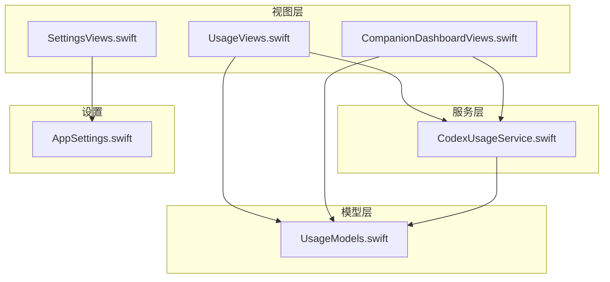
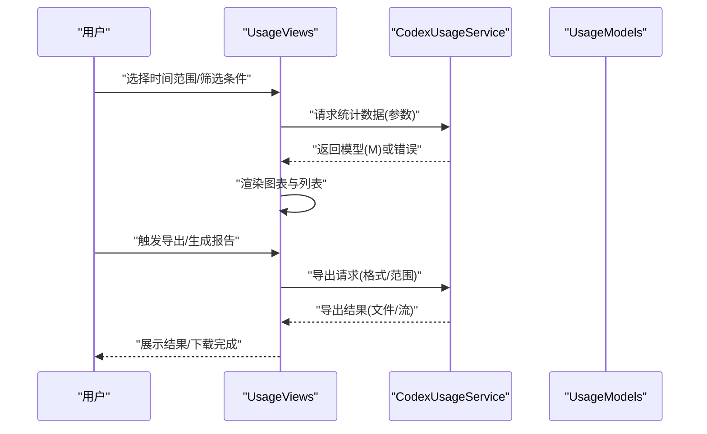
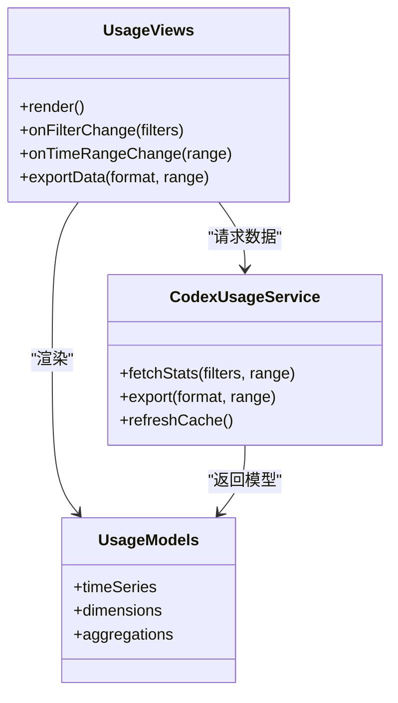
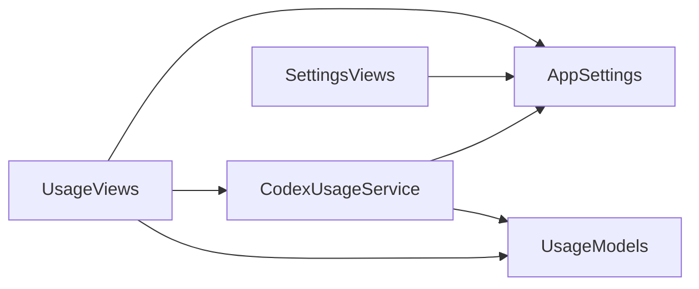

# 使用统计界面

<cite>
**本文引用的文件**   
- [UsageViews.swift](file://app/Tomo/Sources/Tomo/UsageViews.swift)
- [UsageModels.swift](file://app/Tomo/Sources/Tomo/UsageModels.swift)
- [CodexUsageService.swift](file://app/Tomo/Sources/Tomo/CodexUsageService.swift)
- [CompanionDashboardViews.swift](file://app/Tomo/Sources/Tomo/CompanionDashboardViews.swift)
- [SettingsViews.swift](file://app/Tomo/Sources/Tomo/SettingsViews.swift)
- [AppSettings.swift](file://app/Tomo/Sources/Tomo/AppSettings.swift)
</cite>

## 目录
1. [简介](#简介)
2. [项目结构](#项目结构)
3. [核心组件](#核心组件)
4. [架构总览](#架构总览)
5. [详细组件分析](#详细组件分析)
6. [依赖关系分析](#依赖关系分析)
7. [性能考虑](#性能考虑)
8. [故障排查指南](#故障排查指南)
9. [结论](#结论)
10. [附录](#附录)

## 简介
本技术文档聚焦“使用统计界面”的实现与扩展，围绕 UsageViews 的视图层次、数据绑定机制与用户交互流程展开，详细说明数据可视化渲染、实时更新与响应式布局策略。同时覆盖筛选器、时间范围选择、数据导出与自定义报告生成等交互能力；并文档化深色模式、国际化与本地化支持；最后给出样式覆盖、组件扩展与插件开发的定制指南，以及加载状态、错误提示与性能监控等用户体验优化建议。

## 项目结构
与“使用统计界面”直接相关的代码位于 app/Tomo/Sources/Tomo 目录下，主要包含：
- 视图层：UsageViews.swift、CompanionDashboardViews.swift、SettingsViews.swift
- 模型层：UsageModels.swift
- 服务层：CodexUsageService.swift
- 应用设置：AppSettings.swift

图表来源
- [UsageViews.swift](file://app/Tomo/Sources/Tomo/UsageViews.swift)
- [UsageModels.swift](file://app/Tomo/Sources/Tomo/UsageModels.swift)
- [CodexUsageService.swift](file://app/Tomo/Sources/Tomo/CodexUsageService.swift)
- [CompanionDashboardViews.swift](file://app/Tomo/Sources/Tomo/CompanionDashboardViews.swift)
- [SettingsViews.swift](file://app/Tomo/Sources/Tomo/SettingsViews.swift)
- [AppSettings.swift](file://app/Tomo/Sources/Tomo/AppSettings.swift)

章节来源
- [UsageViews.swift](file://app/Tomo/Sources/Tomo/UsageViews.swift)
- [UsageModels.swift](file://app/Tomo/Sources/Tomo/UsageModels.swift)
- [CodexUsageService.swift](file://app/Tomo/Sources/Tomo/CodexUsageService.swift)
- [CompanionDashboardViews.swift](file://app/Tomo/Sources/Tomo/CompanionDashboardViews.swift)
- [SettingsViews.swift](file://app/Tomo/Sources/Tomo/SettingsViews.swift)
- [AppSettings.swift](file://app/Tomo/Sources/Tomo/AppSettings.swift)

## 核心组件
- UsageViews：承载使用统计界面的主视图树，组织筛选器、时间范围控件、图表容器与导出入口，负责将用户操作映射为数据查询与刷新。
- UsageModels：定义统计数据的数据结构与序列化契约，供视图与服务之间传递。
- CodexUsageService：封装数据采集、聚合、缓存与增量更新逻辑，提供统一的数据访问接口。
- CompanionDashboardViews：与使用统计相关的仪表板视图组合，复用通用图表与卡片组件。
- SettingsViews：提供主题、语言与本地化相关设置入口，驱动界面主题切换与文本本地化。
- AppSettings：集中管理应用级配置（如主题、语言、默认时间范围、导出格式等）。

章节来源
- [UsageViews.swift](file://app/Tomo/Sources/Tomo/UsageViews.swift)
- [UsageModels.swift](file://app/Tomo/Sources/Tomo/UsageModels.swift)
- [CodexUsageService.swift](file://app/Tomo/Sources/Tomo/CodexUsageService.swift)
- [CompanionDashboardViews.swift](file://app/Tomo/Sources/Tomo/CompanionDashboardViews.swift)
- [SettingsViews.swift](file://app/Tomo/Sources/Tomo/SettingsViews.swift)
- [AppSettings.swift](file://app/Tomo/Sources/Tomo/AppSettings.swift)

## 架构总览
整体采用“视图—模型—服务”的分层架构：
- 视图层通过事件触发筛选与时间范围变更，调用服务获取或刷新数据。
- 服务层负责数据聚合、缓存与增量更新，返回模型对象给视图。
- 模型层作为不可变数据结构，确保视图渲染一致性。
- 设置模块驱动主题与本地化，影响全局 UI 行为。

图表来源
- [UsageViews.swift](file://app/Tomo/Sources/Tomo/UsageViews.swift)
- [CodexUsageService.swift](file://app/Tomo/Sources/Tomo/CodexUsageService.swift)
- [UsageModels.swift](file://app/Tomo/Sources/Tomo/UsageModels.swift)

## 详细组件分析

### UsageViews 视图层次与数据绑定
- 视图层次
  - 顶部工具栏：筛选器（维度、渠道、版本）、时间范围选择器、刷新与导出按钮。
  - 中部图表区：折线/柱状图容器，支持多系列对比与缩放。
  - 底部明细区：表格或列表，支持排序与分页。
- 数据绑定
  - 单向数据流：服务返回模型后，视图根据模型重建图表与表格。
  - 局部刷新：仅对受影响的图表或行进行重绘，避免全量重排。
  - 响应式布局：基于容器尺寸自动调整图表类型与粒度（日/周/月）。
- 用户交互流程
  - 筛选器变化 → 防抖延迟 → 发起数据请求 → 显示加载态 → 渲染结果。
  - 时间范围切换 → 重置缓存键 → 拉取新数据 → 平滑过渡动画。
  - 导出触发 → 校验权限与范围 → 后台生成 → 进度反馈 → 完成通知。

章节来源
- [UsageViews.swift](file://app/Tomo/Sources/Tomo/UsageViews.swift)
- [UsageModels.swift](file://app/Tomo/Sources/Tomo/UsageModels.swift)

#### 类关系图（视图与模型）

图表来源
- [UsageViews.swift](file://app/Tomo/Sources/Tomo/UsageViews.swift)
- [UsageModels.swift](file://app/Tomo/Sources/Tomo/UsageModels.swift)
- [CodexUsageService.swift](file://app/Tomo/Sources/Tomo/CodexUsageService.swift)

### 数据可视化实现
- 图表渲染引擎
  - 矢量绘图：基于路径与几何计算，保证高分屏清晰度。
  - 自适应刻度：按数据密度动态决定刻度间隔与标签格式。
  - 多系列叠加：支持颜色区分、透明度与图例交互。
- 实时更新机制
  - 增量更新：仅追加新点或修正异常值，避免重绘整图。
  - 节流与批处理：高频事件合并，减少渲染压力。
  - 断点续更：网络中断时保留上次有效数据，恢复后补全。
- 响应式布局
  - 容器监听：尺寸变化时重新计算坐标轴与网格。
  - 降级策略：小屏下隐藏次要系列，优先关键指标。

章节来源
- [UsageViews.swift](file://app/Tomo/Sources/Tomo/UsageViews.swift)
- [CompanionDashboardViews.swift](file://app/Tomo/Sources/Tomo/CompanionDashboardViews.swift)

### 用户交互功能
- 筛选器
  - 多维度筛选：按渠道、版本、设备类型等组合过滤。
  - 联动控制：某一维度变化时，其他维度选项动态更新。
- 时间范围选择
  - 预设区间：最近7天/30天/季度/年度。
  - 自定义区间：起止日期选择，含时区与工作日过滤。
- 数据导出
  - 格式支持：CSV、JSON、PDF 报表。
  - 范围限定：当前视图范围或全量导出。
- 自定义报告生成
  - 模板选择：内置趋势、对比、分布模板。
  - 字段编排：拖拽字段到报告区域，实时预览。

章节来源
- [UsageViews.swift](file://app/Tomo/Sources/Tomo/UsageViews.swift)
- [CompanionDashboardViews.swift](file://app/Tomo/Sources/Tomo/CompanionDashboardViews.swift)

### 界面主题支持
- 深色模式适配
  - 主题变量：背景、前景、边框、阴影色板统一管理。
  - 自动切换：跟随系统或用户偏好，平滑过渡动画。
- 国际化与本地化
  - 文案资源：按语言包加载，支持复数与占位符。
  - 数字与日期：按区域设置格式化输出。
- 设置入口
  - 主题开关、语言选择、默认时间范围与导出格式。

章节来源
- [SettingsViews.swift](file://app/Tomo/Sources/Tomo/SettingsViews.swift)
- [AppSettings.swift](file://app/Tomo/Sources/Tomo/AppSettings.swift)

### 界面定制指南
- 样式覆盖
  - 主题变量覆盖：在应用启动时注入自定义色板与字体。
  - 组件样式钩子：通过回调替换默认绘制逻辑。
- 组件扩展
  - 新增图表类型：实现统一渲染接口并注册到图表工厂。
  - 自定义筛选器：接入筛选协议，参与联动与缓存键生成。
- 插件开发
  - 插件生命周期：初始化、挂载、销毁钩子。
  - 数据源插件：对接外部数据源，遵循模型契约。
  - 报告插件：扩展模板与导出后端。

章节来源
- [SettingsViews.swift](file://app/Tomo/Sources/Tomo/SettingsViews.swift)
- [AppSettings.swift](file://app/Tomo/Sources/Tomo/AppSettings.swift)
- [UsageViews.swift](file://app/Tomo/Sources/Tomo/UsageViews.swift)

### 用户体验优化建议
- 加载状态处理
  - 骨架屏与占位图：提升感知速度。
  - 渐进式加载：先展示汇总，再逐步填充明细。
- 错误提示
  - 可重试机制：网络失败时提供一键重试。
  - 友好文案：明确错误原因与解决步骤。
- 性能监控
  - 渲染耗时：记录首帧与增量更新耗时。
  - 内存占用：监控大图与大数据集内存峰值。
  - 日志上报：采集关键交互与异常堆栈。

章节来源
- [UsageViews.swift](file://app/Tomo/Sources/Tomo/UsageViews.swift)
- [CodexUsageService.swift](file://app/Tomo/Sources/Tomo/CodexUsageService.swift)

## 依赖关系分析
- 视图依赖模型与服务，不直接访问持久化或网络层。
- 服务依赖模型与设置，屏蔽底层数据源差异。
- 设置模块独立，被视图与服务读取，避免循环依赖。

图表来源
- [UsageViews.swift](file://app/Tomo/Sources/Tomo/UsageViews.swift)
- [UsageModels.swift](file://app/Tomo/Sources/Tomo/UsageModels.swift)
- [CodexUsageService.swift](file://app/Tomo/Sources/Tomo/CodexUsageService.swift)
- [SettingsViews.swift](file://app/Tomo/Sources/Tomo/SettingsViews.swift)
- [AppSettings.swift](file://app/Tomo/Sources/Tomo/AppSettings.swift)

章节来源
- [UsageViews.swift](file://app/Tomo/Sources/Tomo/UsageViews.swift)
- [UsageModels.swift](file://app/Tomo/Sources/Tomo/UsageModels.swift)
- [CodexUsageService.swift](file://app/Tomo/Sources/Tomo/CodexUsageService.swift)
- [SettingsViews.swift](file://app/Tomo/Sources/Tomo/SettingsViews.swift)
- [AppSettings.swift](file://app/Tomo/Sources/Tomo/AppSettings.swift)

## 性能考虑
- 数据层
  - 缓存策略：按筛选与时间范围生成唯一键，命中即返回。
  - 增量聚合：仅计算新增窗口内的数据，降低 CPU 开销。
- 渲染层
  - 虚拟滚动：长列表按需渲染可见项。
  - 离屏渲染：复杂图表预渲染为位图，减少重绘。
- 交互层
  - 防抖与节流：限制高频事件触发频率。
  - 异步任务：导出与大数据计算放入后台队列。

[本节为通用指导，不直接分析具体文件]

## 故障排查指南
- 常见问题
  - 图表不更新：检查缓存键是否变化、数据源是否返回空集合。
  - 导出失败：确认权限与目标路径，检查文件格式支持。
  - 主题错乱：验证主题变量是否正确注入，语言包是否完整。
- 调试手段
  - 启用详细日志：记录筛选参数、请求时间与响应大小。
  - 性能剖析：定位渲染瓶颈与内存泄漏。
  - 单元测试：覆盖数据聚合与边界条件。

章节来源
- [CodexUsageService.swift](file://app/Tomo/Sources/Tomo/CodexUsageService.swift)
- [UsageViews.swift](file://app/Tomo/Sources/Tomo/UsageViews.swift)
- [SettingsViews.swift](file://app/Tomo/Sources/Tomo/SettingsViews.swift)

## 结论
“使用统计界面”以清晰的视图—模型—服务分层为基础，结合响应式布局与增量更新，实现了高效、可扩展的数据可视化体验。通过完善的筛选、时间范围、导出与报告能力，配合主题与本地化支持，满足多样化使用场景。建议在后续迭代中持续优化性能监控与错误自愈能力，进一步提升稳定性与用户体验。

[本节为总结性内容，不直接分析具体文件]

## 附录
- 术语表
  - 时间范围：用于限定数据统计的时间区间。
  - 筛选器：按维度过滤数据的控件集合。
  - 增量更新：仅对变化部分进行数据与渲染更新。
- 参考实现位置
  - 视图层：UsageViews.swift、CompanionDashboardViews.swift、SettingsViews.swift
  - 模型层：UsageModels.swift
  - 服务层：CodexUsageService.swift
  - 设置：AppSettings.swift

[本节为补充信息，不直接分析具体文件]