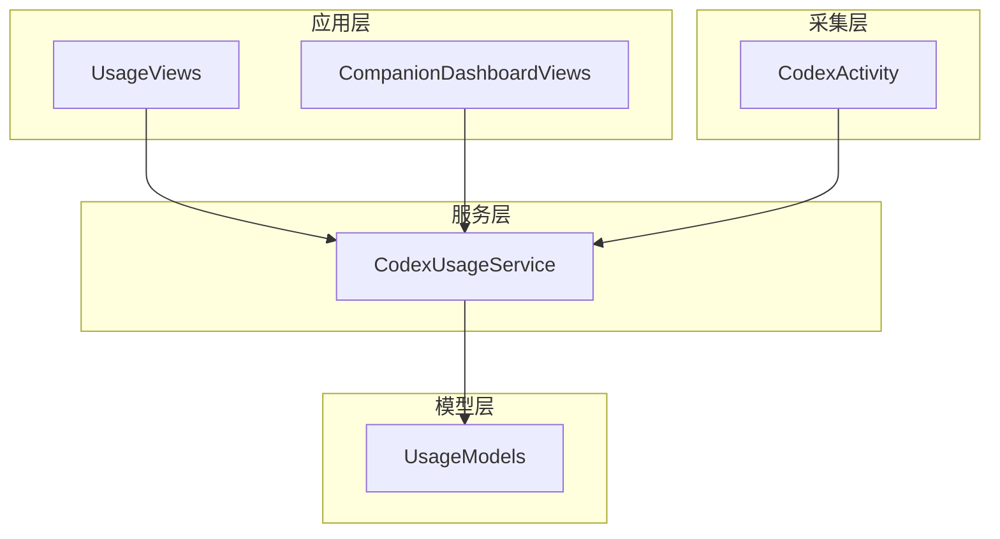
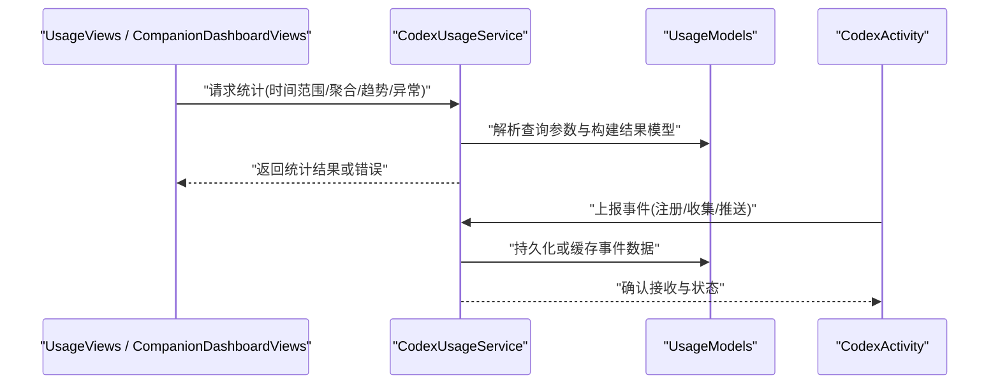
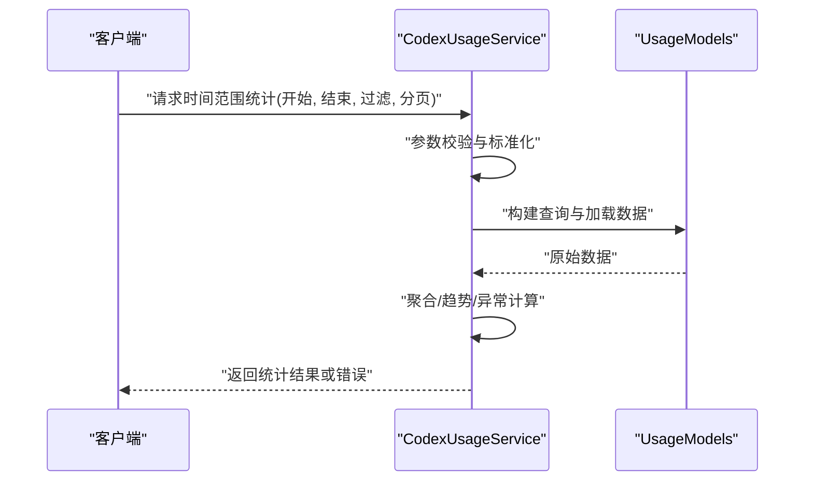
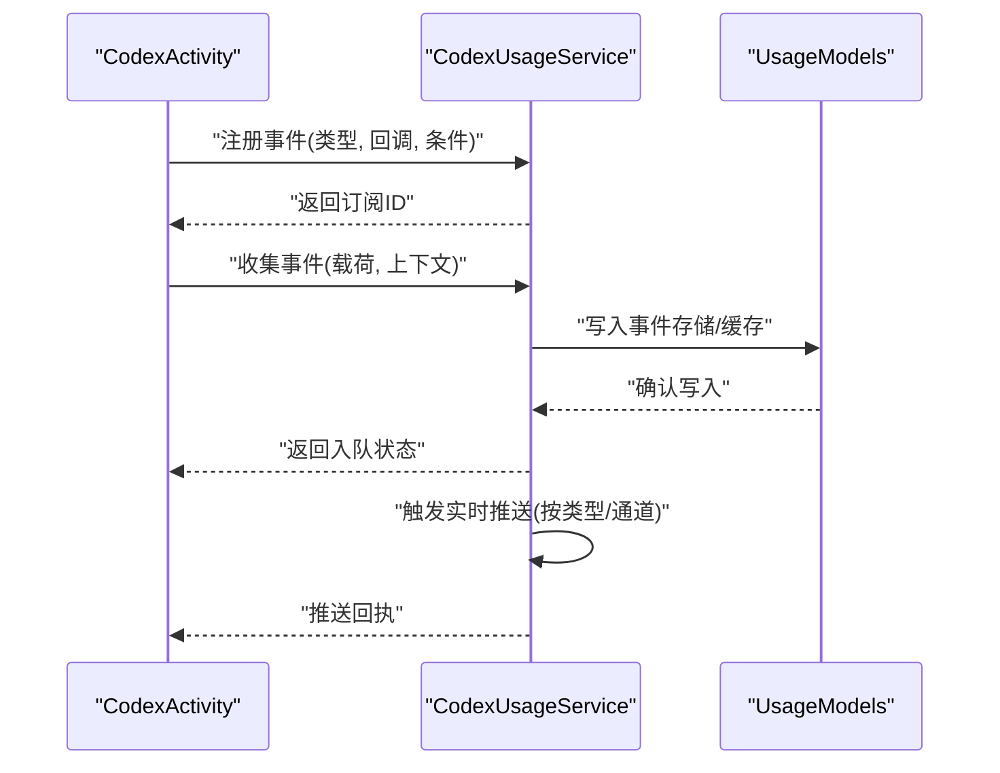
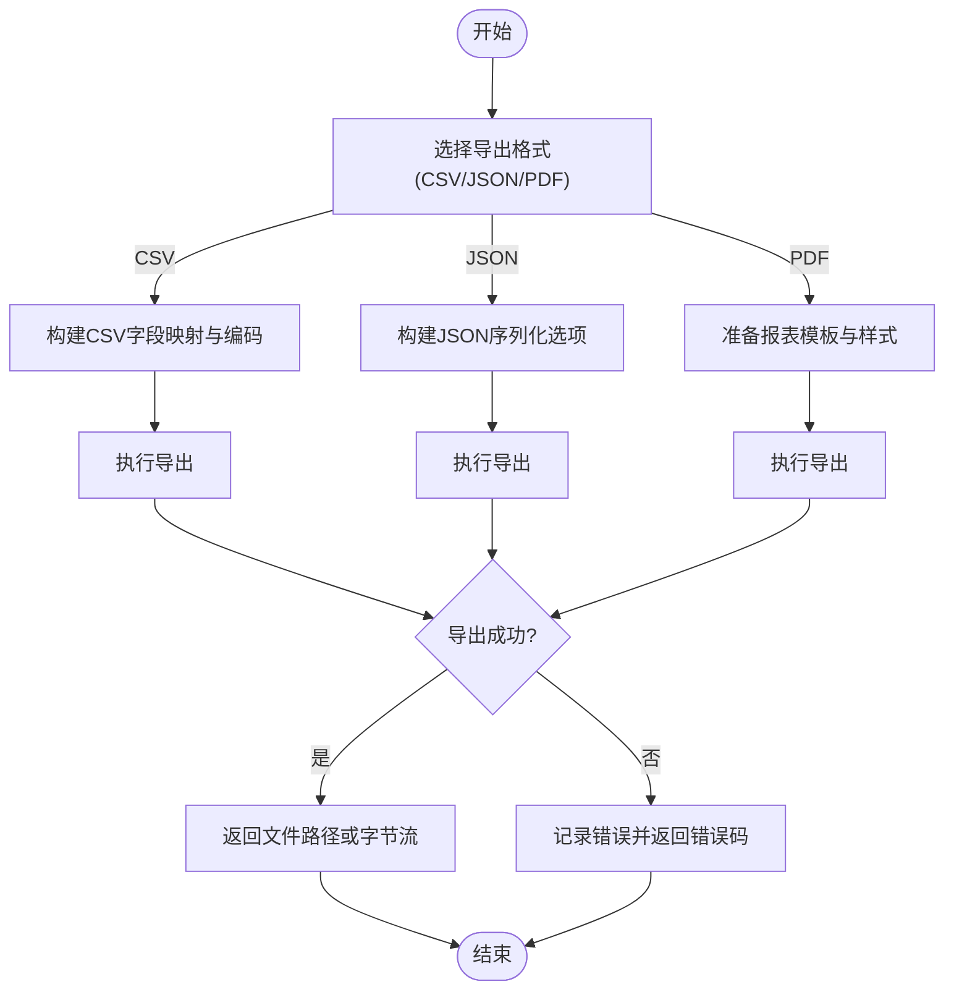
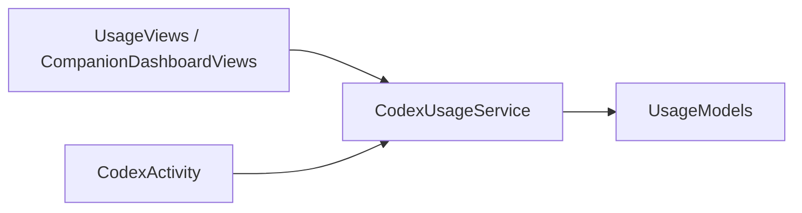

# 分析API参考

<cite>
**本文档引用的文件**
- [CodexUsageService.swift](file://app/Tomo/Sources/Tomo/CodexUsageService.swift)
- [UsageModels.swift](file://app/Tomo/Sources/Tomo/UsageModels.swift)
- [UsageViews.swift](file://app/Tomo/Sources/Tomo/UsageViews.swift)
- [CompanionDashboardViews.swift](file://app/Tomo/Sources/Tomo/CompanionDashboardViews.swift)
- [CodexActivity.swift](file://app/Tomo/Sources/Tomo/CodexActivity.swift)
</cite>

## 目录
1. [简介](#简介)
2. [项目结构](#项目结构)
3. [核心组件](#核心组件)
4. [架构总览](#架构总览)
5. [详细组件分析](#详细组件分析)
6. [依赖分析](#依赖分析)
7. [性能考虑](#性能考虑)
8. [故障排查指南](#故障排查指南)
9. [结论](#结论)
10. [附录](#附录)

## 简介
本参考文档面向使用统计API的开发者与集成者，聚焦于 CodexUsageService 类的公共接口与数据流。文档覆盖以下方面：
- 数据查询API：时间范围查询、聚合统计、趋势分析与异常检测
- 事件管理API：事件注册、数据采集与实时推送
- 数据导出API：CSV、JSON、PDF格式支持
- 常见使用场景的代码示例（以路径引用方式提供）
- 错误处理指南：异常类型、错误码与重试机制
- 性能指标：响应时间、内存占用与并发处理能力

## 项目结构
与使用统计相关的核心代码位于 app/Tomo/Sources/Tomo 目录下，关键文件包括：
- CodexUsageService.swift：服务层实现，暴露统计查询、事件管理与导出能力
- UsageModels.swift：统计相关的数据模型定义
- UsageViews.swift：统计视图与交互逻辑
- CompanionDashboardViews.swift：仪表盘视图，消费统计服务
- CodexActivity.swift：活动追踪与事件上报

图表来源
- [CodexUsageService.swift](file://app/Tomo/Sources/Tomo/CodexUsageService.swift)
- [UsageModels.swift](file://app/Tomo/Sources/Tomo/UsageModels.swift)
- [UsageViews.swift](file://app/Tomo/Sources/Tomo/UsageViews.swift)
- [CompanionDashboardViews.swift](file://app/Tomo/Sources/Tomo/CompanionDashboardViews.swift)
- [CodexActivity.swift](file://app/Tomo/Sources/Tomo/CodexActivity.swift)

章节来源
- [CodexUsageService.swift](file://app/Tomo/Sources/Tomo/CodexUsageService.swift)
- [UsageModels.swift](file://app/Tomo/Sources/Tomo/UsageModels.swift)
- [UsageViews.swift](file://app/Tomo/Sources/Tomo/UsageViews.swift)
- [CompanionDashboardViews.swift](file://app/Tomo/Sources/Tomo/CompanionDashboardViews.swift)
- [CodexActivity.swift](file://app/Tomo/Sources/Tomo/CodexActivity.swift)

## 核心组件
- CodexUsageService：对外暴露统计查询、事件管理与导出能力的统一入口
- UsageModels：定义统计数据、事件、导出格式等数据结构
- UsageViews：基于服务的UI展示与用户交互
- CompanionDashboardViews：仪表盘页面，聚合展示多维度统计
- CodexActivity：负责采集活动与事件并上报至服务

章节来源
- [CodexUsageService.swift](file://app/Tomo/Sources/Tomo/CodexUsageService.swift)
- [UsageModels.swift](file://app/Tomo/Sources/Tomo/UsageModels.swift)
- [UsageViews.swift](file://app/Tomo/Sources/Tomo/UsageViews.swift)
- [CompanionDashboardViews.swift](file://app/Tomo/Sources/Tomo/CompanionDashboardViews.swift)
- [CodexActivity.swift](file://app/Tomo/Sources/Tomo/CodexActivity.swift)

## 架构总览
下图展示了从采集到展示的整体流程，以及服务在其中的职责边界。

图表来源
- [CodexUsageService.swift](file://app/Tomo/Sources/Tomo/CodexUsageService.swift)
- [UsageModels.swift](file://app/Tomo/Sources/Tomo/UsageModels.swift)
- [UsageViews.swift](file://app/Tomo/Sources/Tomo/UsageViews.swift)
- [CompanionDashboardViews.swift](file://app/Tomo/Sources/Tomo/CompanionDashboardViews.swift)
- [CodexActivity.swift](file://app/Tomo/Sources/Tomo/CodexActivity.swift)

## 详细组件分析

### CodexUsageService 类概览
- 职责
  - 提供统一的统计查询接口（时间范围、聚合、趋势、异常）
  - 管理事件生命周期（注册、采集、推送）
  - 导出数据（CSV、JSON、PDF）
- 设计要点
  - 输入参数校验与标准化
  - 异步任务编排与错误回传
  - 可插拔的数据源与导出器

章节来源
- [CodexUsageService.swift](file://app/Tomo/Sources/Tomo/CodexUsageService.swift)

#### 公共接口与方法签名说明
- 时间范围查询
  - 方法名：按时间段获取统计
  - 参数：开始时间、结束时间、维度过滤（可选）、分页参数（可选）
  - 返回值：时间段内聚合后的统计条目列表
- 聚合统计
  - 方法名：执行聚合计算
  - 参数：聚合键（如功能模块、用户角色）、度量项（调用次数、耗时等）、分组条件
  - 返回值：聚合结果集（含计数、均值、分位数等）
- 趋势分析
  - 方法名：计算趋势
  - 参数：时间粒度（日/周/月）、指标名称、窗口大小
  - 返回值：趋势序列（时间点与对应指标值）
- 异常检测
  - 方法名：检测异常点
  - 参数：指标序列、阈值策略（固定阈值/动态基线）、置信度
  - 返回值：异常点集合（含异常类型与严重等级）
- 事件管理
  - 方法名：注册事件
  - 参数：事件类型、回调处理器、订阅条件
  - 返回值：订阅ID
  - 方法名：收集事件
  - 参数：事件载荷、上下文信息
  - 返回值：是否成功入队
  - 方法名：实时推送
  - 参数：事件类型、目标通道（本地/网络）
  - 返回值：推送状态与回执
- 数据导出
  - 方法名：导出为CSV
  - 参数：数据集、字段映射、编码格式
  - 返回值：文件路径或字节流
  - 方法名：导出为JSON
  - 参数：数据集、序列化选项（压缩、格式化）
  - 返回值：文件路径或字节流
  - 方法名：导出为PDF
  - 参数：报表模板、数据源、样式配置
  - 返回值：文件路径或字节流

章节来源
- [CodexUsageService.swift](file://app/Tomo/Sources/Tomo/CodexUsageService.swift)

#### 数据模型（UsageModels）
- 统计条目：包含时间戳、指标名、数值、单位、来源标识
- 聚合结果：包含分组键、度量汇总、统计摘要
- 趋势序列：包含时间点数组与对应指标值数组
- 异常点：包含时间戳、指标名、异常类型、严重等级、建议动作
- 事件载荷：包含事件类型、业务键、扩展字段、上下文

章节来源
- [UsageModels.swift](file://app/Tomo/Sources/Tomo/UsageModels.swift)

#### 视图层（UsageViews / CompanionDashboardViews）
- UsageViews：渲染统计表格、折线图、柱状图；处理用户筛选与分页
- CompanionDashboardViews：聚合多源数据，展示全局KPI与趋势对比

章节来源
- [UsageViews.swift](file://app/Tomo/Sources/Tomo/UsageViews.swift)
- [CompanionDashboardViews.swift](file://app/Tomo/Sources/Tomo/CompanionDashboardViews.swift)

#### 采集层（CodexActivity）
- 负责捕获用户操作与应用行为，生成事件并上报至服务
- 支持批量上报与去重策略

章节来源
- [CodexActivity.swift](file://app/Tomo/Sources/Tomo/CodexActivity.swift)

### 数据查询API时序

图表来源
- [CodexUsageService.swift](file://app/Tomo/Sources/Tomo/CodexUsageService.swift)
- [UsageModels.swift](file://app/Tomo/Sources/Tomo/UsageModels.swift)

### 事件管理API时序

图表来源
- [CodexUsageService.swift](file://app/Tomo/Sources/Tomo/CodexUsageService.swift)
- [UsageModels.swift](file://app/Tomo/Sources/Tomo/UsageModels.swift)
- [CodexActivity.swift](file://app/Tomo/Sources/Tomo/CodexActivity.swift)

### 数据导出流程图

图表来源
- [CodexUsageService.swift](file://app/Tomo/Sources/Tomo/CodexUsageService.swift)

## 依赖分析
- 组件耦合
  - CodexUsageService 依赖 UsageModels 进行数据建模
  - UsageViews 与 CompanionDashboardViews 依赖 CodexUsageService 提供数据
  - CodexActivity 依赖 CodexUsageService 进行事件上报
- 外部依赖
  - 文件系统（导出CSV/JSON/PDF）
  - 序列化库（JSON）
  - 报表引擎（PDF）

图表来源
- [CodexUsageService.swift](file://app/Tomo/Sources/Tomo/CodexUsageService.swift)
- [UsageModels.swift](file://app/Tomo/Sources/Tomo/UsageModels.swift)
- [UsageViews.swift](file://app/Tomo/Sources/Tomo/UsageViews.swift)
- [CompanionDashboardViews.swift](file://app/Tomo/Sources/Tomo/CompanionDashboardViews.swift)
- [CodexActivity.swift](file://app/Tomo/Sources/Tomo/CodexActivity.swift)

章节来源
- [CodexUsageService.swift](file://app/Tomo/Sources/Tomo/CodexUsageService.swift)
- [UsageModels.swift](file://app/Tomo/Sources/Tomo/UsageModels.swift)
- [UsageViews.swift](file://app/Tomo/Sources/Tomo/UsageViews.swift)
- [CompanionDashboardViews.swift](file://app/Tomo/Sources/Tomo/CompanionDashboardViews.swift)
- [CodexActivity.swift](file://app/Tomo/Sources/Tomo/CodexActivity.swift)

## 性能考虑
- 响应时间
  - 时间范围查询：建议对常用维度建立索引，避免全表扫描
  - 聚合统计：采用预聚合与物化视图降低计算开销
  - 趋势分析：滑动窗口与增量更新减少重复计算
  - 异常检测：阈值策略优先，动态基线按需启用
- 内存占用
  - 大数据集分页读取与流式处理
  - 导出时采用分块写入，避免一次性加载全部数据
- 并发能力
  - 读写分离：查询走只读副本，写入走主库
  - 限流与背压：在高并发下保护后端资源
  - 连接池：数据库与外部服务连接复用

[本节为通用指导，不直接分析具体文件]

## 故障排查指南
- 常见异常类型
  - 参数校验失败：检查时间范围、分页与过滤条件
  - 数据源不可用：检查连接与权限
  - 导出失败：检查文件格式与模板有效性
- 错误码约定
  - 4xx：客户端错误（参数非法、权限不足）
  - 5xx：服务端错误（内部异常、资源耗尽）
- 重试机制
  - 幂等性：确保重复提交不会造成副作用
  - 退避策略：指数退避与抖动
  - 熔断降级：在持续失败时快速失败并返回默认值

章节来源
- [CodexUsageService.swift](file://app/Tomo/Sources/Tomo/CodexUsageService.swift)

## 结论
CodexUsageService 作为使用统计的核心服务，提供了完整的查询、事件管理与导出能力。通过合理的模型设计与分层架构，系统具备良好的可扩展性与可维护性。建议在集成时遵循参数校验、错误处理与性能优化最佳实践，以确保稳定高效的运行。

[本节为总结性内容，不直接分析具体文件]

## 附录
- 常见使用场景示例（以路径引用方式）
  - 时间范围查询：参见 [CodexUsageService.swift](file://app/Tomo/Sources/Tomo/CodexUsageService.swift)
  - 聚合统计：参见 [CodexUsageService.swift](file://app/Tomo/Sources/Tomo/CodexUsageService.swift)
  - 趋势分析：参见 [CodexUsageService.swift](file://app/Tomo/Sources/Tomo/CodexUsageService.swift)
  - 异常检测：参见 [CodexUsageService.swift](file://app/Tomo/Sources/Tomo/CodexUsageService.swift)
  - 事件注册与收集：参见 [CodexUsageService.swift](file://app/Tomo/Sources/Tomo/CodexUsageService.swift)、[CodexActivity.swift](file://app/Tomo/Sources/Tomo/CodexActivity.swift)
  - 实时推送：参见 [CodexUsageService.swift](file://app/Tomo/Sources/Tomo/CodexUsageService.swift)
  - 导出CSV/JSON/PDF：参见 [CodexUsageService.swift](file://app/Tomo/Sources/Tomo/CodexUsageService.swift)
  - 视图展示与交互：参见 [UsageViews.swift](file://app/Tomo/Sources/Tomo/UsageViews.swift)、[CompanionDashboardViews.swift](file://app/Tomo/Sources/Tomo/CompanionDashboardViews.swift)

[本节为补充信息，不直接分析具体文件]