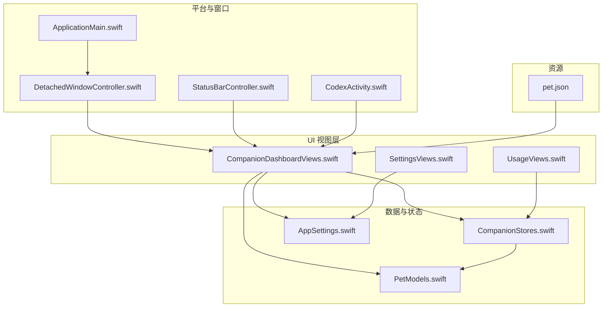
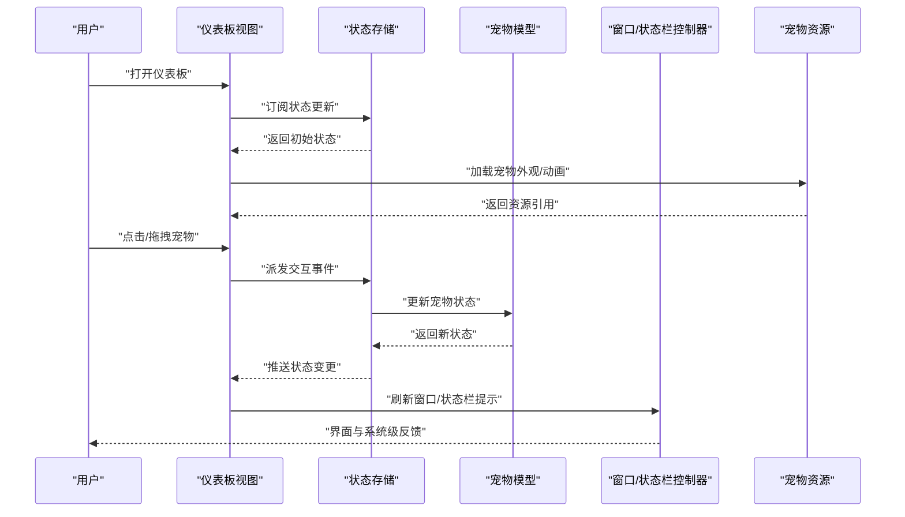
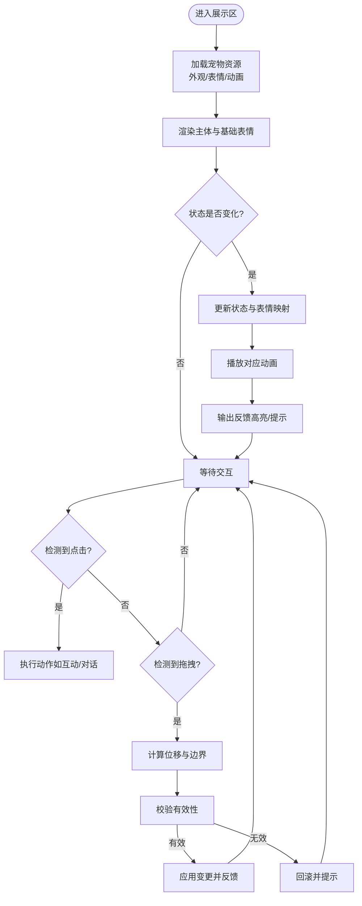
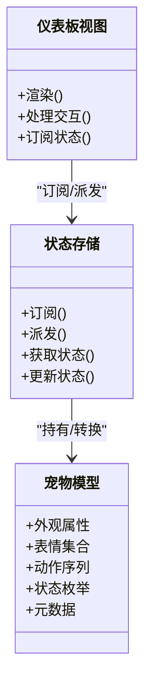
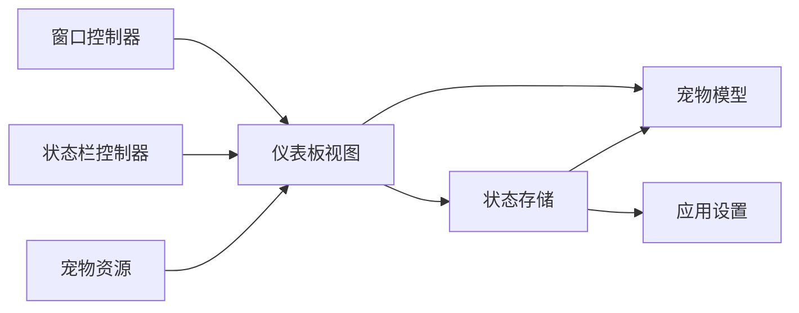

# 伴侣仪表板界面

<cite>
**本文引用的文件**   
- [CompanionDashboardViews.swift](file://app/Tomo/Sources/Tomo/CompanionDashboardViews.swift)
- [PetModels.swift](file://app/Tomo/Sources/Tomo/PetModels.swift)
- [CompanionStores.swift](file://app/Tomo/Sources/Tomo/CompanionStores.swift)
- [AppSettings.swift](file://app/Tomo/Sources/Tomo/AppSettings.swift)
- [UsageViews.swift](file://app/Tomo/Sources/Tomo/UsageViews.swift)
- [SettingsViews.swift](file://app/Tomo/Sources/Tomo/SettingsViews.swift)
- [StatusBarController.swift](file://app/Tomo/Sources/Tomo/StatusBarController.swift)
- [DetachedWindowController.swift](file://app/Tomo/Sources/Tomo/DetachedWindowController.swift)
- [ApplicationMain.swift](file://app/Tomo/Sources/Tomo/ApplicationMain.swift)
- [CodexActivity.swift](file://app/Tomo/Sources/Tomo/CodexActivity.swift)
- [CodexUsageService.swift](file://app/Tomo/Sources/Tomo/CodexUsageService.swift)
- [pet.json](file://app/Tomo/Resources/Pets/Tomo/pet.json)
</cite>

## 目录
1. [简介](#简介)
2. [项目结构](#项目结构)
3. [核心组件](#核心组件)
4. [架构总览](#架构总览)
5. [详细组件分析](#详细组件分析)
6. [依赖关系分析](#依赖关系分析)
7. [性能考虑](#性能考虑)
8. [故障排查指南](#故障排查指南)
9. [结论](#结论)
10. [附录](#附录)

## 简介
本文件为“伴侣仪表板”界面的详细 UI 组件文档，聚焦于 SwiftUI 视图实现与交互逻辑。内容涵盖主仪表板布局、宠物展示区域、用户交互元素、动画与表情变化、响应式适配策略、主题定制（颜色与字体）、无障碍访问以及多语言本地化等关键方面。读者可据此快速理解并扩展伴侣仪表板的界面行为与视觉表现。

## 项目结构
本项目采用模块化组织方式，UI 层以 SwiftUI 为主，数据模型与状态管理分离，平台窗口与菜单栏由 macOS 控制器协调。与伴侣仪表板相关的核心文件包括：
- CompanionDashboardViews.swift：SwiftUI 视图定义与布局
- PetModels.swift：宠物数据模型与状态枚举
- CompanionStores.swift：UI 状态与业务数据绑定
- AppSettings.swift：应用设置（含主题、字体、显示选项）
- UsageViews.swift / SettingsViews.swift：相关视图与设置入口
- StatusBarController.swift / DetachedWindowController.swift：窗口与状态栏集成
- ApplicationMain.swift / CodexActivity.swift：应用启动与后台活动
- pet.json：宠物资源描述（如外观、表情、动画片段）

图表来源
- [CompanionDashboardViews.swift](file://app/Tomo/Sources/Tomo/CompanionDashboardViews.swift)
- [PetModels.swift](file://app/Tomo/Sources/Tomo/PetModels.swift)
- [CompanionStores.swift](file://app/Tomo/Sources/Tomo/CompanionStores.swift)
- [AppSettings.swift](file://app/Tomo/Sources/Tomo/AppSettings.swift)
- [UsageViews.swift](file://app/Tomo/Sources/Tomo/UsageViews.swift)
- [SettingsViews.swift](file://app/Tomo/Sources/Tomo/SettingsViews.swift)
- [DetachedWindowController.swift](file://app/Tomo/Sources/Tomo/DetachedWindowController.swift)
- [StatusBarController.swift](file://app/Tomo/Sources/Tomo/StatusBarController.swift)
- [ApplicationMain.swift](file://app/Tomo/Sources/Tomo/ApplicationMain.swift)
- [CodexActivity.swift](file://app/Tomo/Sources/Tomo/CodexActivity.swift)
- [pet.json](file://app/Tomo/Resources/Pets/Tomo/pet.json)

章节来源
- [CompanionDashboardViews.swift](file://app/Tomo/Sources/Tomo/CompanionDashboardViews.swift)
- [PetModels.swift](file://app/Tomo/Sources/Tomo/PetModels.swift)
- [CompanionStores.swift](file://app/Tomo/Sources/Tomo/CompanionStores.swift)
- [AppSettings.swift](file://app/Tomo/Sources/Tomo/AppSettings.swift)
- [UsageViews.swift](file://app/Tomo/Sources/Tomo/UsageViews.swift)
- [SettingsViews.swift](file://app/Tomo/Sources/Tomo/SettingsViews.swift)
- [DetachedWindowController.swift](file://app/Tomo/Sources/Tomo/DetachedWindowController.swift)
- [StatusBarController.swift](file://app/Tomo/Sources/Tomo/StatusBarController.swift)
- [ApplicationMain.swift](file://app/Tomo/Sources/Tomo/ApplicationMain.swift)
- [CodexActivity.swift](file://app/Tomo/Sources/Tomo/CodexActivity.swift)
- [pet.json](file://app/Tomo/Resources/Pets/Tomo/pet.json)

## 核心组件
- 主仪表板视图：负责整体布局、分区与导航入口，承载宠物展示区、操作面板与状态指示器。
- 宠物展示区：渲染宠物形象、表情与动画，支持点击、拖拽等手势，反馈当前状态。
- 交互元素：按钮、滑块、开关等控件，用于触发宠物动作、切换主题或调整显示参数。
- 状态与数据绑定：通过 Store 将 UI 状态与业务数据同步，确保视图与模型一致。
- 主题与样式：集中管理颜色、字体、间距与动效配置，支持明暗主题与自定义配色。
- 平台集成：窗口控制器与状态栏控制器负责窗口生命周期、停靠与可见性控制。

章节来源
- [CompanionDashboardViews.swift](file://app/Tomo/Sources/Tomo/CompanionDashboardViews.swift)
- [PetModels.swift](file://app/Tomo/Sources/Tomo/PetModels.swift)
- [CompanionStores.swift](file://app/Tomo/Sources/Tomo/CompanionStores.swift)
- [AppSettings.swift](file://app/Tomo/Sources/Tomo/AppSettings.swift)

## 架构总览
下图展示了伴侣仪表板在 SwiftUI 中的分层与交互流程：视图层从 Store 读取状态，Store 维护宠物模型与用户设置；平台控制器负责窗口与状态栏；资源文件提供宠物外观与动画素材。

图表来源
- [CompanionDashboardViews.swift](file://app/Tomo/Sources/Tomo/CompanionDashboardViews.swift)
- [CompanionStores.swift](file://app/Tomo/Sources/Tomo/CompanionStores.swift)
- [PetModels.swift](file://app/Tomo/Sources/Tomo/PetModels.swift)
- [DetachedWindowController.swift](file://app/Tomo/Sources/Tomo/DetachedWindowController.swift)
- [StatusBarController.swift](file://app/Tomo/Sources/Tomo/StatusBarController.swift)
- [pet.json](file://app/Tomo/Resources/Pets/Tomo/pet.json)

## 详细组件分析

### 主仪表板布局
- 布局结构：顶部标题与状态指示、中部宠物展示区、底部操作面板与快捷入口。
- 响应式策略：基于 SwiftUI 的自适应布局，使用弹性容器与比例约束，在不同屏幕尺寸下保持可读性与可用性。
- 主题接入：通过统一的颜色与字体变量注入到各子视图，支持明暗模式切换。
- 无障碍：为关键控件添加语义标签与辅助文本，确保读屏软件正确朗读。

章节来源
- [CompanionDashboardViews.swift](file://app/Tomo/Sources/Tomo/CompanionDashboardViews.swift)
- [AppSettings.swift](file://app/Tomo/Sources/Tomo/AppSettings.swift)

### 宠物展示区
- 视觉呈现：根据宠物模型渲染主体图像、表情与动画序列；状态变化驱动表情切换与动作播放。
- 动画效果：入场动画、呼吸/摆动循环、点击反馈缩放与弹跳；通过过渡与缓动曲线提升体验。
- 状态反馈：高亮边框、气泡提示、进度条或图标变化，反映当前任务或情绪状态。
- 交互处理：点击触发动作、长按弹出菜单、拖拽改变位置或触发特殊事件；手势冲突时按优先级处理。

图表来源
- [CompanionDashboardViews.swift](file://app/Tomo/Sources/Tomo/CompanionDashboardViews.swift)
- [PetModels.swift](file://app/Tomo/Sources/Tomo/PetModels.swift)
- [pet.json](file://app/Tomo/Resources/Pets/Tomo/pet.json)

章节来源
- [CompanionDashboardViews.swift](file://app/Tomo/Sources/Tomo/CompanionDashboardViews.swift)
- [PetModels.swift](file://app/Tomo/Sources/Tomo/PetModels.swift)
- [pet.json](file://app/Tomo/Resources/Pets/Tomo/pet.json)

### 用户交互元素
- 按钮与开关：触发宠物动作、切换主题、开启/关闭通知与动画。
- 滑块与选择器：调节音量、透明度、动画速度、字体大小等。
- 手势识别：点击、双击、长按、拖拽、捏合缩放；对冲突进行消解与优先级排序。
- 反馈机制：即时视觉反馈（缩放、阴影、颜色变化）、触觉反馈（macOS 震动/提示音）。

章节来源
- [CompanionDashboardViews.swift](file://app/Tomo/Sources/Tomo/CompanionDashboardViews.swift)
- [UsageViews.swift](file://app/Tomo/Sources/Tomo/UsageViews.swift)
- [SettingsViews.swift](file://app/Tomo/Sources/Tomo/SettingsViews.swift)

### 状态管理与数据流
- Store 职责：集中管理宠物状态、用户偏好与 UI 状态；提供订阅与派发接口。
- 模型映射：宠物模型包含外观、表情、动作、状态枚举与元数据；Store 将其转换为视图可消费的数据结构。
- 数据一致性：通过不可变更新与单向数据流避免竞态条件，保证视图与模型同步。

图表来源
- [PetModels.swift](file://app/Tomo/Sources/Tomo/PetModels.swift)
- [CompanionStores.swift](file://app/Tomo/Sources/Tomo/CompanionStores.swift)
- [CompanionDashboardViews.swift](file://app/Tomo/Sources/Tomo/CompanionDashboardViews.swift)

章节来源
- [PetModels.swift](file://app/Tomo/Sources/Tomo/PetModels.swift)
- [CompanionStores.swift](file://app/Tomo/Sources/Tomo/CompanionStores.swift)
- [CompanionDashboardViews.swift](file://app/Tomo/Sources/Tomo/CompanionDashboardViews.swift)

### 主题定制与样式
- 颜色方案：定义主色、强调色、背景与文字对比度，支持明暗主题切换。
- 字体配置：全局字体族、字号、行距与粗细；提供可读性增强选项。
- 动效风格：统一的缓动曲线与时长，确保一致的交互节奏。
- 扩展点：通过配置对象注入新主题与字体，无需修改视图代码。

章节来源
- [AppSettings.swift](file://app/Tomo/Sources/Tomo/AppSettings.swift)
- [CompanionDashboardViews.swift](file://app/Tomo/Sources/Tomo/CompanionDashboardViews.swift)

### 平台集成与窗口管理
- 窗口控制器：负责独立窗口的创建、显示、隐藏与生命周期管理。
- 状态栏控制器：在系统状态栏显示宠物状态、通知与快捷操作。
- 应用启动：初始化 Store、加载资源、注册活动与监听系统事件。

章节来源
- [DetachedWindowController.swift](file://app/Tomo/Sources/Tomo/DetachedWindowController.swift)
- [StatusBarController.swift](file://app/Tomo/Sources/Tomo/StatusBarController.swift)
- [ApplicationMain.swift](file://app/Tomo/Sources/Tomo/ApplicationMain.swift)
- [CodexActivity.swift](file://app/Tomo/Sources/Tomo/CodexActivity.swift)

### 无障碍访问与多语言本地化
- 无障碍：为所有交互元素添加语义标签、辅助描述与键盘导航；确保焦点顺序合理。
- 本地化：字符串资源外置，支持多语言切换；日期、时间与数字格式遵循区域设置。
- 测试建议：使用辅助工具验证读屏与键盘可达性；对不同语言进行 UI 宽度与换行测试。

章节来源
- [CompanionDashboardViews.swift](file://app/Tomo/Sources/Tomo/CompanionDashboardViews.swift)
- [AppSettings.swift](file://app/Tomo/Sources/Tomo/AppSettings.swift)

## 依赖关系分析
- 视图依赖 Store 与模型，避免直接耦合业务逻辑。
- Store 依赖模型与设置，统一管理状态与配置。
- 平台控制器依赖视图与资源，负责窗口与状态栏集成。
- 资源文件被视图与动画模块共享，确保一致性。

图表来源
- [CompanionDashboardViews.swift](file://app/Tomo/Sources/Tomo/CompanionDashboardViews.swift)
- [CompanionStores.swift](file://app/Tomo/Sources/Tomo/CompanionStores.swift)
- [PetModels.swift](file://app/Tomo/Sources/Tomo/PetModels.swift)
- [AppSettings.swift](file://app/Tomo/Sources/Tomo/AppSettings.swift)
- [DetachedWindowController.swift](file://app/Tomo/Sources/Tomo/DetachedWindowController.swift)
- [StatusBarController.swift](file://app/Tomo/Sources/Tomo/StatusBarController.swift)
- [pet.json](file://app/Tomo/Resources/Pets/Tomo/pet.json)

章节来源
- [CompanionDashboardViews.swift](file://app/Tomo/Sources/Tomo/CompanionDashboardViews.swift)
- [CompanionStores.swift](file://app/Tomo/Sources/Tomo/CompanionStores.swift)
- [PetModels.swift](file://app/Tomo/Sources/Tomo/PetModels.swift)
- [AppSettings.swift](file://app/Tomo/Sources/Tomo/AppSettings.swift)
- [DetachedWindowController.swift](file://app/Tomo/Sources/Tomo/DetachedWindowController.swift)
- [StatusBarController.swift](file://app/Tomo/Sources/Tomo/StatusBarController.swift)
- [pet.json](file://app/Tomo/Resources/Pets/Tomo/pet.json)

## 性能考虑
- 懒加载与缓存：宠物资源按需加载，常用表情与动画预缓存以减少卡顿。
- 渲染优化：减少不必要的重绘，使用不可变更新与最小化状态变更。
- 动画节流：限制高频动画帧率，避免 CPU/GPU 过载。
- 内存管理：及时释放不再使用的资源，避免内存泄漏。

[本节为通用指导，不直接分析具体文件]

## 故障排查指南
- 视图不更新：检查 Store 是否正确派发状态变更；确认订阅是否生效。
- 动画异常：验证资源路径与帧序列；检查缓动曲线与时长配置。
- 交互无响应：确认手势识别器优先级与冲突处理；检查事件冒泡与拦截。
- 主题失效：核对颜色与字体变量注入；检查明暗模式切换逻辑。
- 窗口问题：检查窗口控制器生命周期与可见性状态；确认状态栏更新逻辑。

章节来源
- [CompanionDashboardViews.swift](file://app/Tomo/Sources/Tomo/CompanionDashboardViews.swift)
- [CompanionStores.swift](file://app/Tomo/Sources/Tomo/CompanionStores.swift)
- [DetachedWindowController.swift](file://app/Tomo/Sources/Tomo/DetachedWindowController.swift)
- [StatusBarController.swift](file://app/Tomo/Sources/Tomo/StatusBarController.swift)

## 结论
伴侣仪表板界面以 SwiftUI 为核心，结合清晰的层次结构与状态管理，实现了丰富的宠物展示与交互体验。通过主题定制、无障碍支持与本地化，界面具备良好的可访问性与国际化能力。建议在后续迭代中持续优化动画性能与资源管理，完善错误处理与日志记录，以提升稳定性与用户体验。

[本节为总结，不直接分析具体文件]

## 附录
- 术语表：Store、模型、视图、平台控制器、资源文件等。
- 最佳实践：单向数据流、不可变更新、资源懒加载、手势冲突消解。
- 参考链接：项目内相关文档与脚本（如构建与发布脚本）。

[本节为补充信息，不直接分析具体文件]