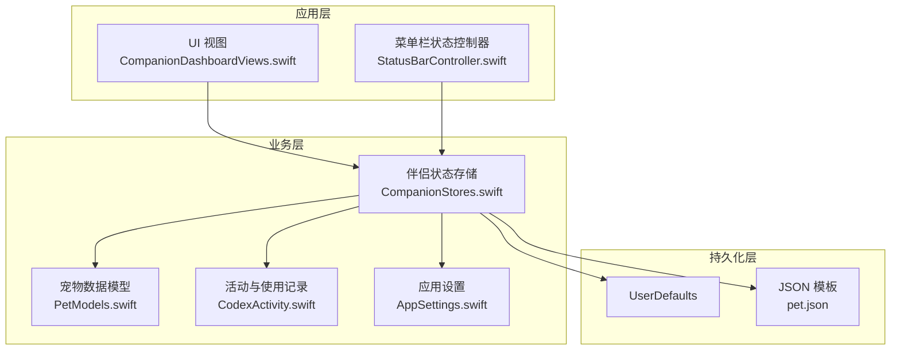
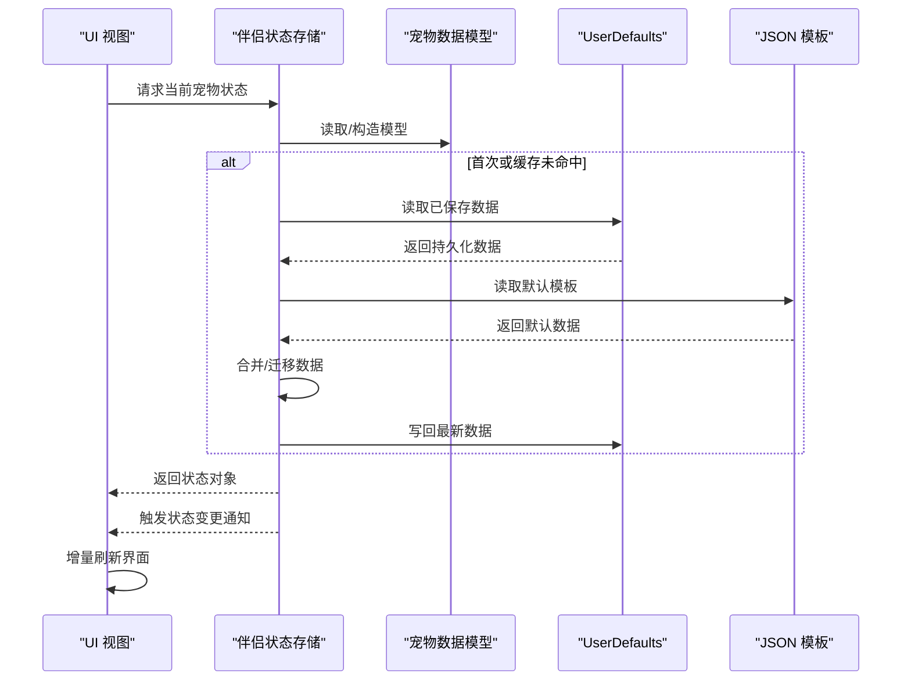
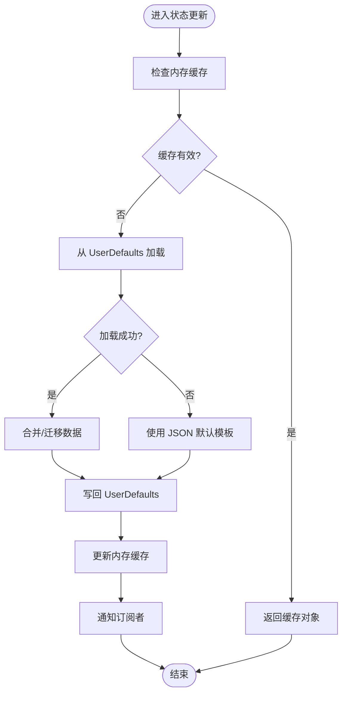
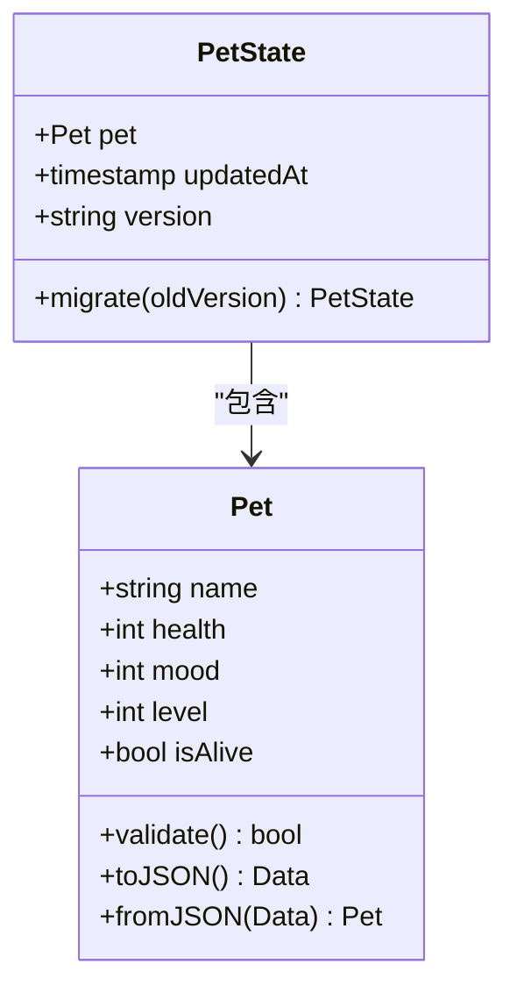
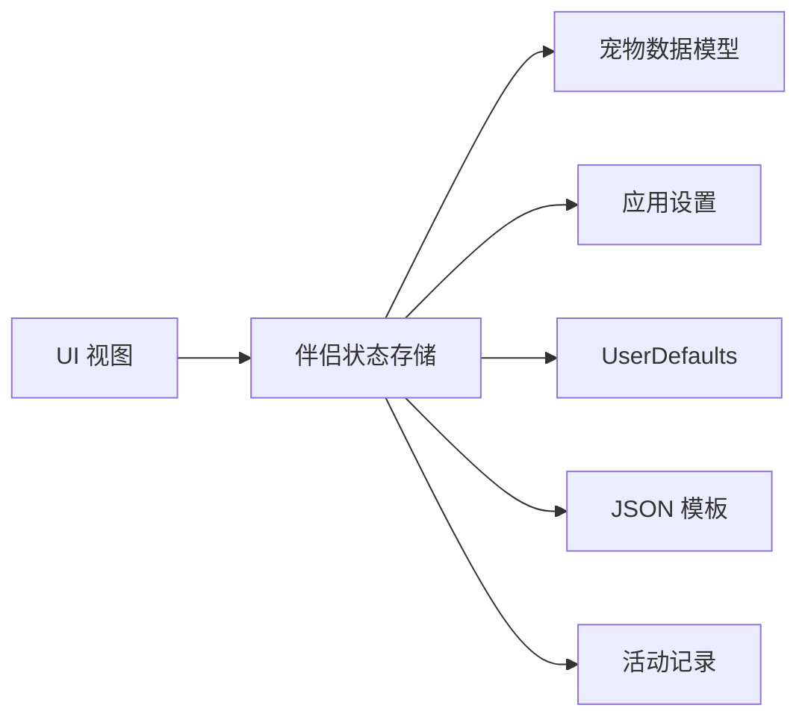

# 伴侣状态管理

<cite>
**本文档引用的文件**   
- [CompanionStores.swift](file://app/Tomo/Sources/Tomo/CompanionStores.swift)
- [PetModels.swift](file://app/Tomo/Sources/Tomo/PetModels.swift)
- [AppSettings.swift](file://app/Tomo/Sources/Tomo/AppSettings.swift)
- [CodexActivity.swift](file://app/Tomo/Sources/Tomo/CodexActivity.swift)
- [CompanionDashboardViews.swift](file://app/Tomo/Sources/Tomo/CompanionDashboardViews.swift)
- [StatusBarController.swift](file://app/Tomo/Sources/Tomo/StatusBarController.swift)
- [pet.json](file://app/Tomo/Resources/Pets/Tomo/pet.json)
</cite>

## 目录
1. [简介](#简介)
2. [项目结构](#项目结构)
3. [核心组件](#核心组件)
4. [架构总览](#架构总览)
5. [详细组件分析](#详细组件分析)
6. [依赖关系分析](#依赖关系分析)
7. [性能考虑](#性能考虑)
8. [故障排查指南](#故障排查指南)
9. [结论](#结论)
10. [附录](#附录)

## 简介
本技术文档围绕“伴侣状态管理系统”展开，重点解析 CompanionStores.swift 中的数据持久化与状态管理机制，说明宠物的数据存储方案（含 UserDefaults 的使用、数据迁移策略与版本兼容性处理），并文档化 UI 与数据的状态同步机制。同时覆盖宠物状态的更新流程、事件处理与回调机制，提供状态管理的最佳实践（内存优化、性能监控、数据备份恢复）以及错误处理策略和调试工具使用方法。

## 项目结构
本项目采用 Swift 应用结构，核心代码位于 app/Tomo/Sources/Tomo 下，资源文件位于 Resources 目录。与伴侣状态管理直接相关的文件包括：
- 状态存储与持久化：CompanionStores.swift
- 宠物数据模型：PetModels.swift
- 应用设置与偏好：AppSettings.swift
- 活动与行为记录：CodexActivity.swift
- UI 展示层：CompanionDashboardViews.swift、StatusBarController.swift
- 初始宠物模板：pet.json

图表来源
- [CompanionStores.swift](file://app/Tomo/Sources/Tomo/CompanionStores.swift)
- [PetModels.swift](file://app/Tomo/Sources/Tomo/PetModels.swift)
- [AppSettings.swift](file://app/Tomo/Sources/Tomo/AppSettings.swift)
- [CodexActivity.swift](file://app/Tomo/Sources/Tomo/CodexActivity.swift)
- [CompanionDashboardViews.swift](file://app/Tomo/Sources/Tomo/CompanionDashboardViews.swift)
- [StatusBarController.swift](file://app/Tomo/Sources/Tomo/StatusBarController.swift)
- [pet.json](file://app/Tomo/Resources/Pets/Tomo/pet.json)

章节来源
- [CompanionStores.swift](file://app/Tomo/Sources/Tomo/CompanionStores.swift)
- [PetModels.swift](file://app/Tomo/Sources/Tomo/PetModels.swift)
- [AppSettings.swift](file://app/Tomo/Sources/Tomo/AppSettings.swift)
- [CodexActivity.swift](file://app/Tomo/Sources/Tomo/CodexActivity.swift)
- [CompanionDashboardViews.swift](file://app/Tomo/Sources/Tomo/CompanionDashboardViews.swift)
- [StatusBarController.swift](file://app/Tomo/Sources/Tomo/StatusBarController.swift)
- [pet.json](file://app/Tomo/Resources/Pets/Tomo/pet.json)

## 核心组件
- 伴侣状态存储（CompanionStores.swift）
  - 负责宠物状态数据的加载、缓存、变更通知与持久化到 UserDefaults。
  - 提供统一的读写接口，确保 UI 与数据的一致性。
  - 实现数据迁移与版本兼容逻辑，保证历史数据在新版本中可用。
- 宠物数据模型（PetModels.swift）
  - 定义宠物的数据结构与序列化/反序列化规则。
  - 提供默认值与校验逻辑，确保数据完整性。
- 应用设置（AppSettings.swift）
  - 管理全局配置项，如是否启用自动保存、备份路径等。
- 活动与使用记录（CodexActivity.swift）
  - 记录用户交互与宠物状态变化，用于分析与诊断。
- UI 展示层（CompanionDashboardViews.swift、StatusBarController.swift）
  - 订阅状态变化并刷新界面，保持 UI 与数据一致。

章节来源
- [CompanionStores.swift](file://app/Tomo/Sources/Tomo/CompanionStores.swift)
- [PetModels.swift](file://app/Tomo/Sources/Tomo/PetModels.swift)
- [AppSettings.swift](file://app/Tomo/Sources/Tomo/AppSettings.swift)
- [CodexActivity.swift](file://app/Tomo/Sources/Tomo/CodexActivity.swift)
- [CompanionDashboardViews.swift](file://app/Tomo/Sources/Tomo/CompanionDashboardViews.swift)
- [StatusBarController.swift](file://app/Tomo/Sources/Tomo/StatusBarController.swift)

## 架构总览
伴侣状态管理采用“存储驱动 + 观察者模式”的架构：
- 存储层（CompanionStores.swift）集中管理宠物状态数据，提供发布/订阅接口。
- 模型层（PetModels.swift）定义数据契约，确保跨模块一致性。
- UI 层通过订阅状态变化进行增量更新，避免全量重绘。
- 持久化层通过 UserDefaults 与 JSON 模板协同工作，支持初始化、迁移与备份。

图表来源
- [CompanionStores.swift](file://app/Tomo/Sources/Tomo/CompanionStores.swift)
- [PetModels.swift](file://app/Tomo/Sources/Tomo/PetModels.swift)
- [AppSettings.swift](file://app/Tomo/Sources/Tomo/AppSettings.swift)
- [pet.json](file://app/Tomo/Resources/Pets/Tomo/pet.json)

## 详细组件分析

### 伴侣状态存储（CompanionStores.swift）
- 职责
  - 维护宠物状态单例或共享实例，提供线程安全的读写访问。
  - 监听 UserDefaults 键值变化，触发状态更新与 UI 刷新。
  - 实现数据迁移策略，根据版本号对旧数据进行转换。
- 关键机制
  - 缓存策略：在内存中缓存最近一次的状态对象，减少频繁 I/O。
  - 变更通知：基于观察者模式，向订阅者广播状态变更事件。
  - 持久化：将状态序列化为 JSON 后写入 UserDefaults，支持批量写入与原子替换。
  - 版本兼容：通过版本号字段判断是否需要迁移，并提供向后兼容逻辑。
- 错误处理
  - 捕获序列化/反序列化异常，回退到默认模板。
  - 记录失败原因与上下文信息，便于调试与日志分析。
- 性能优化
  - 延迟加载：仅在首次访问时加载数据。
  - 批量更新：合并多次变更，减少 UserDefaults 写入次数。
  - 异步持久化：在非主线程执行 I/O，避免阻塞 UI。

图表来源
- [CompanionStores.swift](file://app/Tomo/Sources/Tomo/CompanionStores.swift)
- [PetModels.swift](file://app/Tomo/Sources/Tomo/PetModels.swift)
- [pet.json](file://app/Tomo/Resources/Pets/Tomo/pet.json)

章节来源
- [CompanionStores.swift](file://app/Tomo/Sources/Tomo/CompanionStores.swift)

### 宠物数据模型（PetModels.swift）
- 职责
  - 定义宠物的属性集合（如名称、健康值、情绪、等级等）。
  - 提供默认值与校验方法，确保数据合法性。
  - 实现 Codable 协议，支持 JSON 序列化与反序列化。
- 设计要点
  - 使用可选字段与默认值，增强版本兼容性。
  - 提供只读视图与可变副本，防止外部意外修改。
  - 定义枚举与常量，统一状态表示。

图表来源
- [PetModels.swift](file://app/Tomo/Sources/Tomo/PetModels.swift)

章节来源
- [PetModels.swift](file://app/Tomo/Sources/Tomo/PetModels.swift)

### 应用设置（AppSettings.swift）
- 职责
  - 管理全局开关（如自动保存、备份频率、调试模式）。
  - 提供类型安全的键值访问接口。
- 与状态存储集成
  - 读取设置以决定持久化策略（如是否启用压缩、是否启用增量备份）。
  - 在调试模式下输出详细日志。

章节来源
- [AppSettings.swift](file://app/Tomo/Sources/Tomo/AppSettings.swift)

### 活动与使用记录（CodexActivity.swift）
- 职责
  - 记录用户操作与状态变更事件，用于分析与问题定位。
  - 支持导出与上传日志，便于远程调试。
- 与状态存储集成
  - 在状态变更时追加事件记录，不阻塞主流程。

章节来源
- [CodexActivity.swift](file://app/Tomo/Sources/Tomo/CodexActivity.swift)

### UI 展示层（CompanionDashboardViews.swift、StatusBarController.swift）
- 职责
  - 订阅状态变更事件，增量更新界面元素。
  - 提供用户交互入口（如调整宠物状态、触发活动）。
- 与状态存储集成
  - 调用存储接口获取最新状态，避免直接访问 UserDefaults。
  - 在用户操作后触发状态更新，确保数据一致性。

章节来源
- [CompanionDashboardViews.swift](file://app/Tomo/Sources/Tomo/CompanionDashboardViews.swift)
- [StatusBarController.swift](file://app/Tomo/Sources/Tomo/StatusBarController.swift)

## 依赖关系分析
- 低耦合高内聚
  - 存储层独立于 UI 与模型，仅依赖基础类型与 UserDefaults。
  - 模型层定义清晰的数据契约，便于测试与替换。
- 外部依赖
  - UserDefaults：系统级键值存储，适合轻量级配置与状态。
  - JSON 模板：用于初始化与回退数据，确保可恢复性。
- 潜在循环依赖
  - 通过接口抽象与单向依赖避免循环引用。

图表来源
- [CompanionStores.swift](file://app/Tomo/Sources/Tomo/CompanionStores.swift)
- [PetModels.swift](file://app/Tomo/Sources/Tomo/PetModels.swift)
- [AppSettings.swift](file://app/Tomo/Sources/Tomo/AppSettings.swift)
- [CodexActivity.swift](file://app/Tomo/Sources/Tomo/CodexActivity.swift)
- [CompanionDashboardViews.swift](file://app/Tomo/Sources/Tomo/CompanionDashboardViews.swift)
- [StatusBarController.swift](file://app/Tomo/Sources/Tomo/StatusBarController.swift)
- [pet.json](file://app/Tomo/Resources/Pets/Tomo/pet.json)

章节来源
- [CompanionStores.swift](file://app/Tomo/Sources/Tomo/CompanionStores.swift)
- [PetModels.swift](file://app/Tomo/Sources/Tomo/PetModels.swift)
- [AppSettings.swift](file://app/Tomo/Sources/Tomo/AppSettings.swift)
- [CodexActivity.swift](file://app/Tomo/Sources/Tomo/CodexActivity.swift)
- [CompanionDashboardViews.swift](file://app/Tomo/Sources/Tomo/CompanionDashboardViews.swift)
- [StatusBarController.swift](file://app/Tomo/Sources/Tomo/StatusBarController.swift)
- [pet.json](file://app/Tomo/Resources/Pets/Tomo/pet.json)

## 性能考虑
- 内存优化
  - 使用弱引用避免循环引用导致的内存泄漏。
  - 及时释放不再使用的缓存对象，限制最大缓存大小。
- 性能监控
  - 记录关键操作的耗时（如加载、迁移、持久化）。
  - 在调试模式下输出性能指标，便于分析瓶颈。
- 数据备份恢复
  - 定期备份 UserDefaults 中的状态数据为 JSON 文件。
  - 支持导入备份文件，快速恢复状态。
- I/O 优化
  - 批量写入减少 UserDefaults 调用次数。
  - 使用异步队列避免阻塞主线程。

[本节为通用指导，无需特定文件来源]

## 故障排查指南
- 常见问题
  - 数据加载失败：检查 UserDefaults 键是否存在，验证 JSON 模板格式。
  - 状态不同步：确认观察者是否正确注册，检查通知分发逻辑。
  - 迁移失败：核对版本号字段与迁移脚本，确保向后兼容。
- 调试工具
  - 启用调试模式，输出详细日志与堆栈信息。
  - 导出活动记录与状态快照，辅助问题定位。
- 错误处理策略
  - 捕获并记录异常，提供用户友好的提示。
  - 实现回退机制，确保应用稳定性。

章节来源
- [CompanionStores.swift](file://app/Tomo/Sources/Tomo/CompanionStores.swift)
- [CodexActivity.swift](file://app/Tomo/Sources/Tomo/CodexActivity.swift)

## 结论
伴侣状态管理系统通过清晰的架构设计与严格的错误处理策略，实现了可靠的数据持久化与状态同步。CompanionStores.swift 作为核心组件，协调模型、设置、UI 与持久化层，确保数据一致性与用户体验。建议在生产环境中启用性能监控与日志导出，持续优化系统稳定性与可维护性。

[本节为总结性内容，无需特定文件来源]

## 附录
- 术语表
  - UserDefaults：系统级键值存储，适用于轻量级配置与状态。
  - 观察者模式：一种行为设计模式，允许对象间松耦合通信。
  - 数据迁移：将旧版本数据结构转换为新版本的过程。
- 参考文件
  - [CompanionStores.swift](file://app/Tomo/Sources/Tomo/CompanionStores.swift)
  - [PetModels.swift](file://app/Tomo/Sources/Tomo/PetModels.swift)
  - [AppSettings.swift](file://app/Tomo/Sources/Tomo/AppSettings.swift)
  - [CodexActivity.swift](file://app/Tomo/Sources/Tomo/CodexActivity.swift)
  - [CompanionDashboardViews.swift](file://app/Tomo/Sources/Tomo/CompanionDashboardViews.swift)
  - [StatusBarController.swift](file://app/Tomo/Sources/Tomo/StatusBarController.swift)
  - [pet.json](file://app/Tomo/Resources/Pets/Tomo/pet.json)