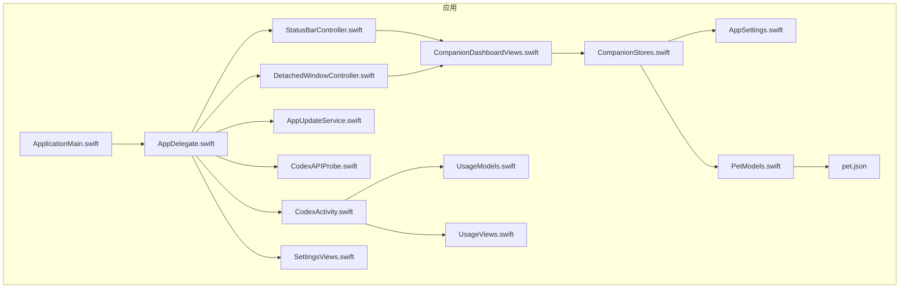
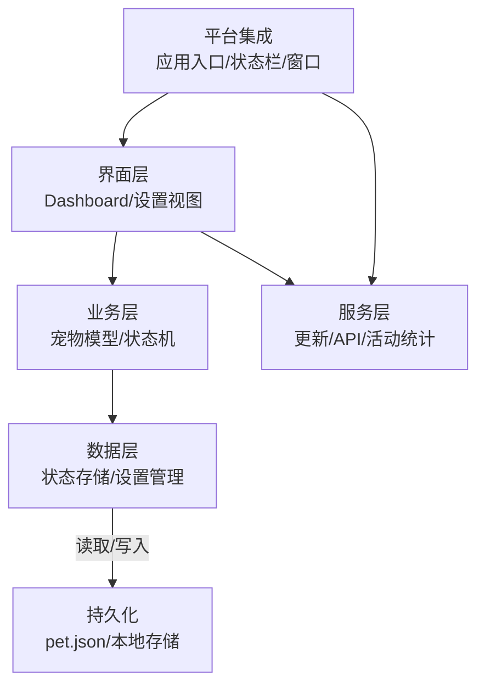
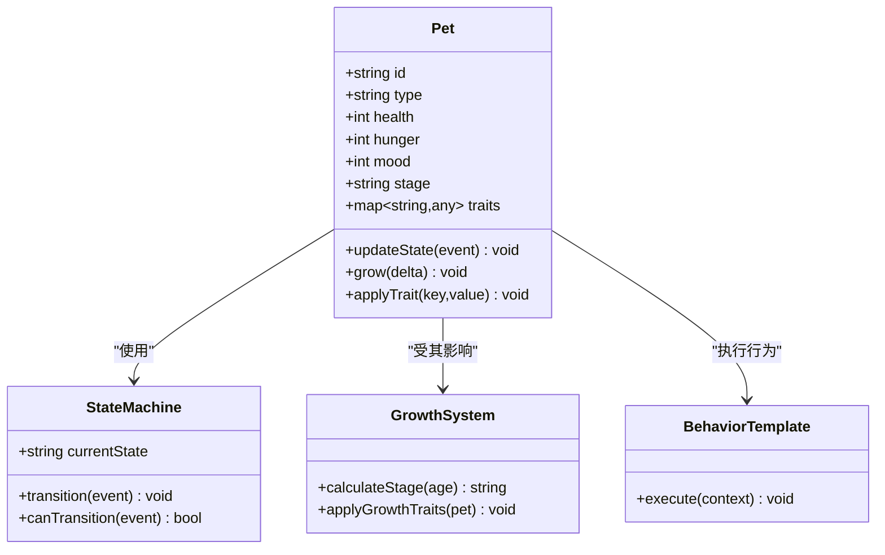
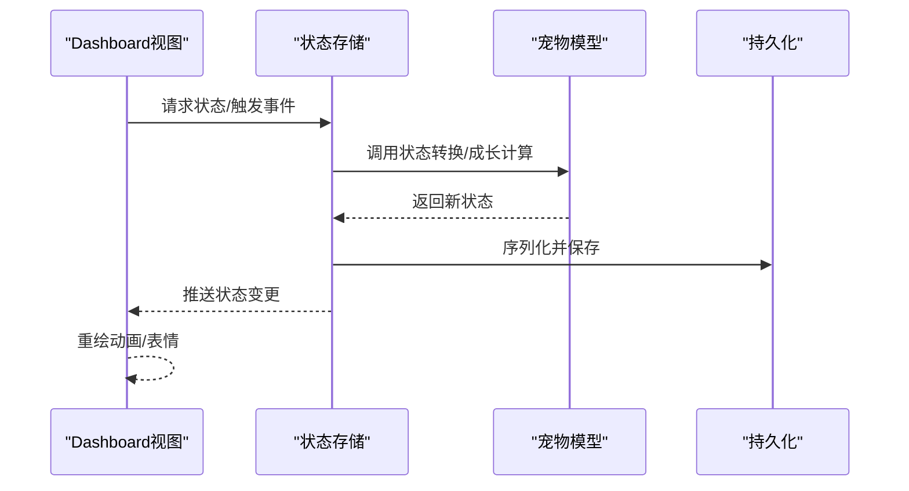
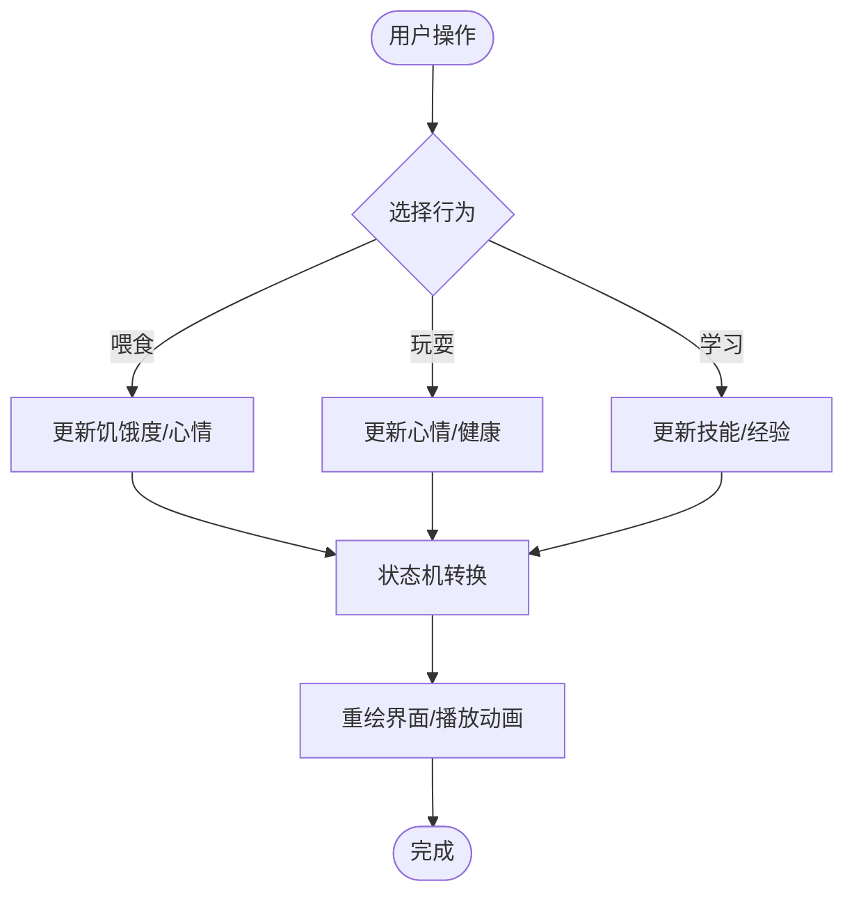
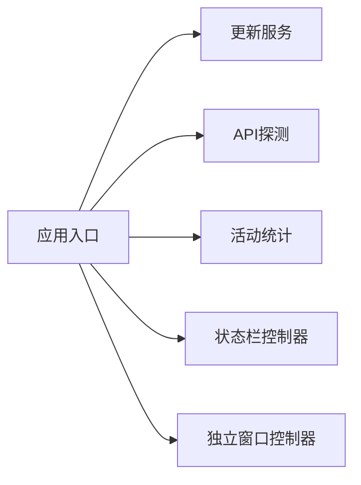
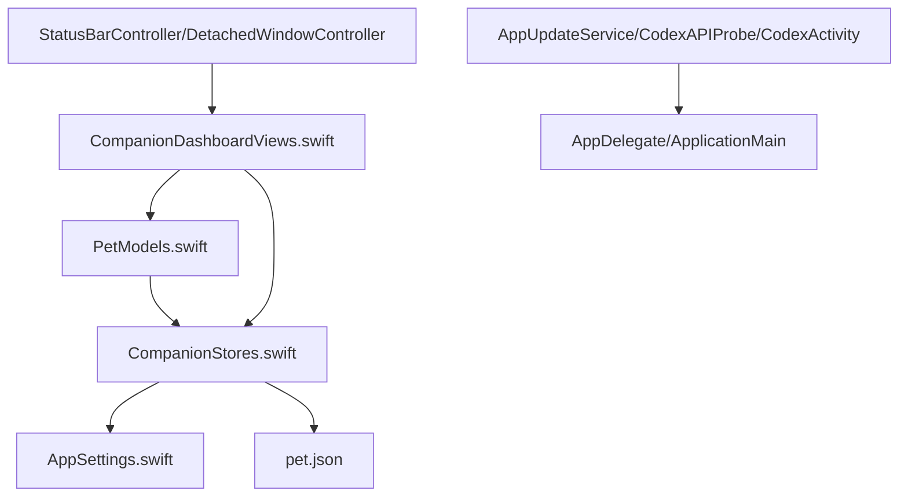

# 宠物伴侣系统

<cite>
**本文引用的文件**   
- [PetModels.swift](file://app/Tomo/Sources/Tomo/PetModels.swift)
- [CompanionDashboardViews.swift](file://app/Tomo/Sources/Tomo/CompanionDashboardViews.swift)
- [CompanionStores.swift](file://app/Tomo/Sources/Tomo/CompanionStores.swift)
- [AppSettings.swift](file://app/Tomo/Sources/Tomo/AppSettings.swift)
- [pet.json](file://app/Tomo/Resources/AppIcon.iconset/Pets/Tomo/pet.json)
- [AppDelegate.swift](file://app/Tomo/Sources/Tomo/AppDelegate.swift)
- [ApplicationMain.swift](file://app/Tomo/Sources/Tomo/ApplicationMain.swift)
- [StatusBarController.swift](file://app/Tomo/Sources/Tomo/StatusBarController.swift)
- [CodexActivity.swift](file://app/Tomo/Sources/Tomo/CodexActivity.swift)
- [UsageModels.swift](file://app/Tomo/Sources/Tomo/UsageModels.swift)
- [UsageViews.swift](file://app/Tomo/Sources/Tomo/UsageViews.swift)
- [DetachedWindowController.swift](file://app/Tomo/Sources/Tomo/DetachedWindowController.swift)
- [AppUpdateService.swift](file://app/Tomo/Sources/Tomo/AppUpdateService.swift)
- [CodexAPIProbe.swift](file://app/Tomo/Sources/Tomo/CodexAPIProbe.swift)
- [SettingsViews.swift](file://app/Tomo/Sources/Tomo/SettingsViews.swift)
- [package_app.sh](file://app/Tomo/package_app.sh)
- [rebuild_and_run.sh](file://app/Tomo/rebuild_and_run.sh)
- [release_app.sh](file://app/Tomo/release_app.sh)
- [Package.swift](file://app/Tomo/Package.swift)
- [README.md](file://README.md)
- [PROJECT.md](file://PROJECT.md)
- [docs/pet-companion-state-plan.md](file://docs/pet-companion-state-plan.md)
- [docs/dashboard-orientation.md](file://docs/dashboard-orientation.md)
- [docs/ui-refresh-implementation-plan.md](file://docs/ui-refresh-implementation-plan.md)
</cite>

## 目录
1. [简介](#简介)
2. [项目结构](#项目结构)
3. [核心组件](#核心组件)
4. [架构总览](#架构总览)
5. [详细组件分析](#详细组件分析)
6. [依赖关系分析](#依赖关系分析)
7. [性能考虑](#性能考虑)
8. [故障排查指南](#故障排查指南)
9. [结论](#结论)
10. [附录](#附录)

## 简介
本技术文档面向“宠物伴侣系统”，聚焦以下目标：
- 深入解释宠物模型的数据结构设计、状态管理机制与用户界面实现。
- 详细描述宠物 Dashboard 的视觉设计与交互逻辑，包括动画、表情变化与状态反馈。
- 说明数据存储方案、持久化策略与状态同步机制。
- 文档化宠物的生命周期管理、成长系统与个性化设置。
- 提供扩展指南：如何添加新的宠物类型与自定义行为。
- 给出性能优化建议、内存管理与用户体验改进的最佳实践。

本项目为 macOS 应用（Swift Package + AppKit），包含资源包、主入口、状态存储、UI 视图、设置与更新服务等模块。

## 项目结构
- 应用主体位于 app/Tomo，采用 Swift Package 组织代码与资源。
- 核心源码在 Sources/Tomo，涵盖应用入口、设置、状态存储、UI 视图、活动跟踪等。
- 资源位于 Resources，包含图标与宠物定义数据 pet.json。
- 文档位于 docs，包含状态计划、Dashboard 方向与 UI 刷新计划。
- 脚本位于根目录与 app/Tomo/scripts，用于构建、打包与发布。

图表来源
- [ApplicationMain.swift](file://app/Tomo/Sources/Tomo/ApplicationMain.swift)
- [AppDelegate.swift](file://app/Tomo/Sources/Tomo/AppDelegate.swift)
- [StatusBarController.swift](file://app/Tomo/Sources/Tomo/StatusBarController.swift)
- [DetachedWindowController.swift](file://app/Tomo/Sources/Tomo/DetachedWindowController.swift)
- [CompanionDashboardViews.swift](file://app/Tomo/Sources/Tomo/CompanionDashboardViews.swift)
- [CompanionStores.swift](file://app/Tomo/Sources/Tomo/CompanionStores.swift)
- [AppSettings.swift](file://app/Tomo/Sources/Tomo/AppSettings.swift)
- [PetModels.swift](file://app/Tomo/Sources/Tomo/PetModels.swift)
- [pet.json](file://app/Tomo/Resources/AppIcon.iconset/Pets/Tomo/pet.json)
- [AppUpdateService.swift](file://app/Tomo/Sources/Tomo/AppUpdateService.swift)
- [CodexAPIProbe.swift](file://app/Tomo/Sources/Tomo/CodexAPIProbe.swift)
- [CodexActivity.swift](file://app/Tomo/Sources/Tomo/CodexActivity.swift)
- [UsageModels.swift](file://app/Tomo/Sources/Tomo/UsageModels.swift)
- [UsageViews.swift](file://app/Tomo/Sources/Tomo/UsageViews.swift)
- [SettingsViews.swift](file://app/Tomo/Sources/Tomo/SettingsViews.swift)

章节来源
- [README.md](file://README.md)
- [PROJECT.md](file://PROJECT.md)
- [Package.swift](file://app/Tomo/Package.swift)

## 核心组件
- 宠物模型层：定义宠物数据结构、属性与行为接口，支撑状态机与成长系统。
- 状态存储层：集中管理宠物状态、配置与持久化，提供读写与同步能力。
- 界面展示层：Dashboard 视图负责渲染宠物动画、表情与状态反馈。
- 应用服务层：更新检查、API 探测、活动统计与设置管理等。
- 窗口与菜单栏集成：通过状态栏控制器与独立窗口控制器承载 UI。

章节来源
- [PetModels.swift](file://app/Tomo/Sources/Tomo/PetModels.swift)
- [CompanionStores.swift](file://app/Tomo/Sources/Tomo/CompanionStores.swift)
- [CompanionDashboardViews.swift](file://app/Tomo/Sources/Tomo/CompanionDashboardViews.swift)
- [AppSettings.swift](file://app/Tomo/Sources/Tomo/AppSettings.swift)
- [AppUpdateService.swift](file://app/Tomo/Sources/Tomo/AppUpdateService.swift)
- [CodexAPIProbe.swift](file://app/Tomo/Sources/Tomo/CodexAPIProbe.swift)
- [CodexActivity.swift](file://app/Tomo/Sources/Tomo/CodexActivity.swift)
- [UsageModels.swift](file://app/Tomo/Sources/Tomo/UsageModels.swift)
- [UsageViews.swift](file://app/Tomo/Sources/Tomo/UsageViews.swift)
- [SettingsViews.swift](file://app/Tomo/Sources/Tomo/SettingsViews.swift)
- [StatusBarController.swift](file://app/Tomo/Sources/Tomo/StatusBarController.swift)
- [DetachedWindowController.swift](file://app/Tomo/Sources/Tomo/DetachedWindowController.swift)

## 架构总览
系统采用分层架构：
- 表现层：Dashboard 视图与设置视图，处理用户交互与渲染。
- 业务层：宠物模型与状态机，封装生命周期、成长与行为规则。
- 数据层：状态存储与设置管理，负责持久化与同步。
- 服务层：更新检查、API 探测、活动统计等横切关注点。
- 平台集成：应用入口、状态栏与窗口控制器。

图表来源
- [CompanionDashboardViews.swift](file://app/Tomo/Sources/Tomo/CompanionDashboardViews.swift)
- [PetModels.swift](file://app/Tomo/Sources/Tomo/PetModels.swift)
- [CompanionStores.swift](file://app/Tomo/Sources/Tomo/CompanionStores.swift)
- [AppSettings.swift](file://app/Tomo/Sources/Tomo/AppSettings.swift)
- [AppUpdateService.swift](file://app/Tomo/Sources/Tomo/AppUpdateService.swift)
- [CodexAPIProbe.swift](file://app/Tomo/Sources/Tomo/CodexAPIProbe.swift)
- [CodexActivity.swift](file://app/Tomo/Sources/Tomo/CodexActivity.swift)
- [pet.json](file://app/Tomo/Resources/AppIcon.iconset/Pets/Tomo/pet.json)

## 详细组件分析

### 宠物模型与状态机
- 数据结构：定义宠物类型、外观、属性（如健康值、饥饿度、心情）、成长阶段、技能与行为模板。
- 状态机：基于事件驱动的状态转换，支持休眠、玩耍、进食、学习、休息等状态。
- 生命周期：从孵化到成熟再到衰老的阶段管理，结合成长系统与个性化设置影响属性增长曲线。
- 行为扩展：通过行为模板与策略模式，新增宠物类型或自定义行为无需改动核心逻辑。

图表来源
- [PetModels.swift](file://app/Tomo/Sources/Tomo/PetModels.swift)

章节来源
- [PetModels.swift](file://app/Tomo/Sources/Tomo/PetModels.swift)
- [docs/pet-companion-state-plan.md](file://docs/pet-companion-state-plan.md)

### 状态存储与持久化
- 存储设计：集中式 Store 管理宠物状态、配置与缓存，提供原子更新与订阅通知。
- 持久化策略：将关键状态序列化至本地文件或偏好设置，确保重启后一致性。
- 同步机制：多视图订阅状态变更，自动刷新；后台任务定期同步与校验。
- 冲突解决：合并策略与版本控制，避免并发写入导致的数据不一致。

图表来源
- [CompanionStores.swift](file://app/Tomo/Sources/Tomo/CompanionStores.swift)
- [PetModels.swift](file://app/Tomo/Sources/Tomo/PetModels.swift)
- [pet.json](file://app/Tomo/Resources/AppIcon.iconset/Pets/Tomo/pet.json)

章节来源
- [CompanionStores.swift](file://app/Tomo/Sources/Tomo/CompanionStores.swift)
- [AppSettings.swift](file://app/Tomo/Sources/Tomo/AppSettings.swift)
- [pet.json](file://app/Tomo/Resources/AppIcon.iconset/Pets/Tomo/pet.json)

### Dashboard 界面与交互
- 视觉设计：以卡片布局展示宠物形象、状态条（健康、饥饿、心情）、成长阶段指示器。
- 动画与表情：根据状态机事件切换动画帧与表情贴图，平滑过渡提升体验。
- 交互逻辑：点击触发喂食、玩耍、学习等行为，实时更新状态并反馈。
- 响应式适配：在不同窗口尺寸下保持布局一致，支持独立窗口与状态栏小部件。

图表来源
- [CompanionDashboardViews.swift](file://app/Tomo/Sources/Tomo/CompanionDashboardViews.swift)
- [PetModels.swift](file://app/Tomo/Sources/Tomo/PetModels.swift)

章节来源
- [CompanionDashboardViews.swift](file://app/Tomo/Sources/Tomo/CompanionDashboardViews.swift)
- [docs/dashboard-orientation.md](file://docs/dashboard-orientation.md)

### 应用服务与平台集成
- 更新检查：定期检查新版本并提示用户，支持静默下载与安装。
- API 探测：检测外部服务可用性，动态调整功能开关。
- 活动统计：记录用户使用行为，生成报表辅助优化。
- 窗口与状态栏：通过控制器管理独立窗口与菜单栏图标，提供快捷入口。

图表来源
- [ApplicationMain.swift](file://app/Tomo/Sources/Tomo/ApplicationMain.swift)
- [AppDelegate.swift](file://app/Tomo/Sources/Tomo/AppDelegate.swift)
- [AppUpdateService.swift](file://app/Tomo/Sources/Tomo/AppUpdateService.swift)
- [CodexAPIProbe.swift](file://app/Tomo/Sources/Tomo/CodexAPIProbe.swift)
- [CodexActivity.swift](file://app/Tomo/Sources/Tomo/CodexActivity.swift)
- [StatusBarController.swift](file://app/Tomo/Sources/Tomo/StatusBarController.swift)
- [DetachedWindowController.swift](file://app/Tomo/Sources/Tomo/DetachedWindowController.swift)

章节来源
- [ApplicationMain.swift](file://app/Tomo/Sources/Tomo/ApplicationMain.swift)
- [AppDelegate.swift](file://app/Tomo/Sources/Tomo/AppDelegate.swift)
- [AppUpdateService.swift](file://app/Tomo/Sources/Tomo/AppUpdateService.swift)
- [CodexAPIProbe.swift](file://app/Tomo/Sources/Tomo/CodexAPIProbe.swift)
- [CodexActivity.swift](file://app/Tomo/Sources/Tomo/CodexActivity.swift)
- [StatusBarController.swift](file://app/Tomo/Sources/Tomo/StatusBarController.swift)
- [DetachedWindowController.swift](file://app/Tomo/Sources/Tomo/DetachedWindowController.swift)

### 扩展指南：新增宠物类型与自定义行为
- 新增宠物类型：
  - 在模型层定义新类型枚举与默认属性。
  - 在 pet.json 中添加资源描述（外观、初始状态）。
  - 在行为模板中注册新行为的执行逻辑。
- 自定义行为：
  - 实现行为接口，注入上下文（宠物状态、用户设置）。
  - 在状态机中定义事件与转换规则。
  - 通过 Store 暴露 API 供 UI 调用。
- 测试与验证：
  - 编写单元测试覆盖状态转换与边界条件。
  - 使用 UI 自动化测试验证交互流程。

章节来源
- [PetModels.swift](file://app/Tomo/Sources/Tomo/PetModels.swift)
- [pet.json](file://app/Tomo/Resources/AppIcon.iconset/Pets/Tomo/pet.json)
- [CompanionStores.swift](file://app/Tomo/Sources/Tomo/CompanionStores.swift)

## 依赖关系分析
- 低耦合高内聚：模型、存储、视图职责清晰，通过接口通信。
- 直接依赖：Dashboard 视图依赖 Store 与 Model；Store 依赖 Settings 与持久化。
- 间接依赖：服务层通过应用入口初始化，不直接耦合 UI。
- 潜在循环：避免 Store 与 Model 相互引用，使用单向数据流。

图表来源
- [PetModels.swift](file://app/Tomo/Sources/Tomo/PetModels.swift)
- [CompanionStores.swift](file://app/Tomo/Sources/Tomo/CompanionStores.swift)
- [AppSettings.swift](file://app/Tomo/Sources/Tomo/AppSettings.swift)
- [pet.json](file://app/Tomo/Resources/AppIcon.iconset/Pets/Tomo/pet.json)
- [CompanionDashboardViews.swift](file://app/Tomo/Sources/Tomo/CompanionDashboardViews.swift)
- [AppUpdateService.swift](file://app/Tomo/Sources/Tomo/AppUpdateService.swift)
- [CodexAPIProbe.swift](file://app/Tomo/Sources/Tomo/CodexAPIProbe.swift)
- [CodexActivity.swift](file://app/Tomo/Sources/Tomo/CodexActivity.swift)
- [AppDelegate.swift](file://app/Tomo/Sources/Tomo/AppDelegate.swift)
- [ApplicationMain.swift](file://app/Tomo/Sources/Tomo/ApplicationMain.swift)
- [StatusBarController.swift](file://app/Tomo/Sources/Tomo/StatusBarController.swift)
- [DetachedWindowController.swift](file://app/Tomo/Sources/Tomo/DetachedWindowController.swift)

章节来源
- [Package.swift](file://app/Tomo/Package.swift)

## 性能考虑
- 渲染优化：
  - 使用离屏渲染与图像缓存减少重复绘制。
  - 动画帧率控制在 60fps，必要时降级为关键帧。
- 内存管理：
  - 及时释放不再使用的资源，避免强引用循环。
  - 大对象池化与懒加载，降低峰值内存占用。
- 数据同步：
  - 批量更新与防抖，减少频繁持久化写入。
  - 增量同步与差异合并，提高网络与磁盘效率。
- 用户体验：
  - 异步加载与进度反馈，避免阻塞主线程。
  - 错误恢复与重试机制，提升稳定性。

[本节为通用指导，不直接分析具体文件]

## 故障排查指南
- 常见问题：
  - 状态不同步：检查 Store 的订阅与广播机制，确认事件顺序。
  - 持久化失败：验证 JSON 格式与权限，回滚到备份。
  - 动画卡顿：分析渲染路径，启用 GPU 加速。
- 调试工具：
  - 日志级别与采样，定位热点与异常。
  - 内存分析器与性能计数器，识别泄漏与瓶颈。
- 恢复策略：
  - 重置宠物状态与配置，重新初始化。
  - 清理缓存与临时文件，修复损坏数据。

章节来源
- [CompanionStores.swift](file://app/Tomo/Sources/Tomo/CompanionStores.swift)
- [AppSettings.swift](file://app/Tomo/Sources/Tomo/AppSettings.swift)
- [CompanionDashboardViews.swift](file://app/Tomo/Sources/Tomo/CompanionDashboardViews.swift)

## 结论
宠物伴侣系统通过清晰的层次架构与模块化设计，实现了灵活的宠物模型、稳健的状态管理与直观的 Dashboard 界面。借助可扩展的行为模板与状态机，系统能够轻松支持新宠物类型与自定义行为。在性能与用户体验方面，提供了渲染优化、内存管理与错误恢复的最佳实践。建议持续迭代状态同步与动画效果，进一步提升整体质量。

[本节为总结性内容，不直接分析具体文件]

## 附录
- 构建与发布：
  - 使用脚本进行构建、打包与发布，确保环境一致。
  - 版本号与签名管理，保障安全与可追溯性。
- 文档与规范：
  - 遵循代码风格与注释规范，提升可读性。
  - 维护变更日志与迁移指南，便于升级。

章节来源
- [package_app.sh](file://app/Tomo/package_app.sh)
- [rebuild_and_run.sh](file://app/Tomo/rebuild_and_run.sh)
- [release_app.sh](file://app/Tomo/release_app.sh)
- [docs/ui-refresh-implementation-plan.md](file://docs/ui-refresh-implementation-plan.md)