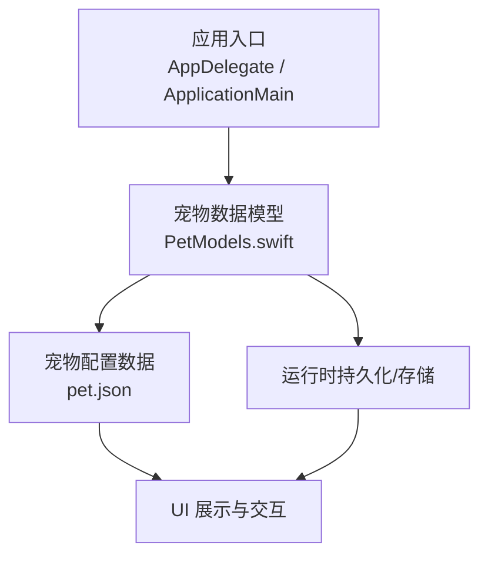
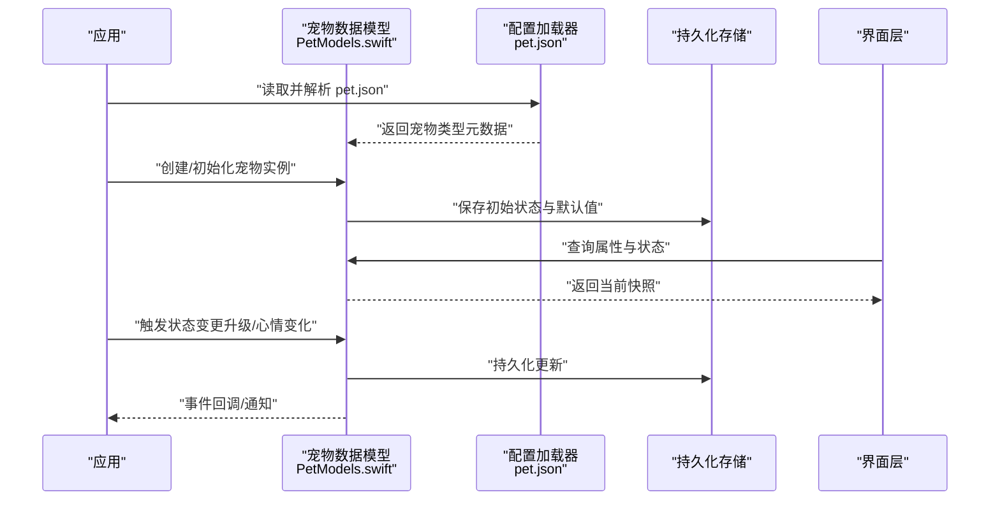
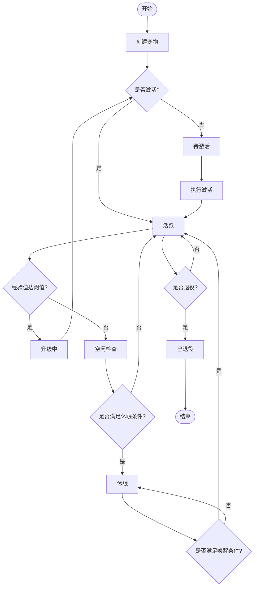
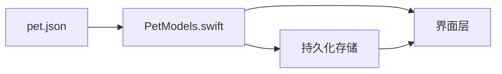

# 宠物数据模型

<cite>
**本文引用的文件**   
- [PetModels.swift](file://app/Tomo/Sources/Tomo/PetModels.swift)
- [pet.json](file://app/Tomo/Resources/Pets/Tomo/pet.json)
</cite>

## 目录
1. [简介](#简介)
2. [项目结构](#项目结构)
3. [核心组件](#核心组件)
4. [架构总览](#架构总览)
5. [详细组件分析](#详细组件分析)
6. [依赖关系分析](#依赖关系分析)
7. [性能考虑](#性能考虑)
8. [故障排查指南](#故障排查指南)
9. [结论](#结论)
10. [附录](#附录) 

## 简介
本技术文档聚焦于宠物数据模型，围绕 PetModels.swift 中的数据结构设计与 pet.json 配置格式展开。内容涵盖宠物的属性定义、状态枚举与生命周期管理、序列化/反序列化策略、验证规则与默认值设置，以及扩展机制（如何添加新宠物类型与自定义属性）。目标是帮助开发者快速理解并安全地扩展宠物系统的数据层。

## 项目结构
- 应用代码位于 app/Tomo/Sources/Tomo/ 下，其中 PetModels.swift 承载宠物数据模型的核心实现。
- 宠物资源配置文件位于 app/Tomo/Resources/Pets/Tomo/pet.json，用于描述不同宠物类型的元数据与行为参数。

图表来源 
- [PetModels.swift](file://app/Tomo/Sources/Tomo/PetModels.swift)
- [pet.json](file://app/Tomo/Resources/Pets/Tomo/pet.json)

章节来源
- [PetModels.swift](file://app/Tomo/Sources/Tomo/PetModels.swift)
- [pet.json](file://app/Tomo/Resources/Pets/Tomo/pet.json)

## 核心组件
本节概述宠物数据模型的关键组成：
- 宠物实体：包含名称、类型、等级、经验值、心情状态等核心属性。
- 状态枚举：定义宠物在不同生命周期的可能状态及转换约束。
- 配置驱动：通过 pet.json 为不同宠物类型提供差异化参数与扩展点。
- 序列化/反序列化：确保 JSON 配置与内存对象之间的稳定映射。
- 验证与默认值：保证数据完整性与健壮性。

章节来源
- [PetModels.swift](file://app/Tomo/Sources/Tomo/PetModels.swift)
- [pet.json](file://app/Tomo/Resources/Pets/Tomo/pet.json)

## 架构总览
下图展示了从配置到运行时的数据流与关键交互点。

图表来源 
- [PetModels.swift](file://app/Tomo/Sources/Tomo/PetModels.swift)
- [pet.json](file://app/Tomo/Resources/Pets/Tomo/pet.json)

## 详细组件分析

### 宠物实体与属性
- 名称：字符串类型，唯一标识宠物个体。
- 类型：引用 pet.json 中定义的宠物类型键名，决定基础能力与成长曲线。
- 等级：整数或浮点数，表示成长阶段；通常与经验值阈值关联。
- 经验值：数值型，累积增长以驱动升级逻辑。
- 心情状态：枚举类型，反映当前情绪区间，影响交互表现与行为权重。
- 其他扩展属性：允许在 pet.json 中为特定类型注入额外字段，如技能、外观、偏好等。

说明：
- 所有属性应具备合理的默认值，确保未配置时仍可正常运行。
- 对关键字段（名称、类型）应进行非空与合法性校验。

章节来源
- [PetModels.swift](file://app/Tomo/Sources/Tomo/PetModels.swift)
- [pet.json](file://app/Tomo/Resources/Pets/Tomo/pet.json)

### 状态枚举与生命周期管理
- 常见状态包括：待激活、活跃、休眠、生病、升级中、已退役等（具体以实现为准）。
- 状态转换需满足前置条件与约束，例如：
  - 活跃→休眠：当经验值达到升级阈值或外部事件触发。
  - 休眠→活跃：需要满足恢复条件（如时间间隔、道具使用）。
  - 活跃→升级中：经验值累计超过阈值后进入过渡态。
  - 升级中→活跃：完成升级流程后回到活跃态。
- 生命周期事件：创建、激活、升级、休眠、恢复、退役等，每个事件可触发副作用（如 UI 刷新、统计上报）。

建议：
- 将状态转换封装为有向图或规则表，便于扩展与维护。
- 对非法转换抛出明确错误，避免状态不一致。

章节来源
- [PetModels.swift](file://app/Tomo/Sources/Tomo/PetModels.swift)

### 配置驱动：pet.json 数据格式与扩展机制
- 顶层结构：包含多个宠物类型条目，每个条目由键名标识。
- 字段含义（示例类别，具体以实际实现为准）：
  - 基础信息：名称、图标、描述、稀有度等。
  - 成长参数：经验曲线、升级阈值、属性加成系数。
  - 行为参数：心情衰减率、互动响应权重、随机事件概率。
  - 扩展字段：任意键值对，供上层逻辑按需读取。
- 扩展机制：
  - 新增宠物类型：在配置中添加新条目，并在模型层注册对应处理逻辑。
  - 自定义属性：在条目内追加字段，模型层按类型解析并赋予默认值。
  - 版本兼容：保留向后兼容的默认分支，避免旧配置崩溃。

章节来源
- [pet.json](file://app/Tomo/Resources/Pets/Tomo/pet.json)

### 序列化/反序列化与默认值
- 序列化：将内存中的宠物对象转换为 JSON，用于持久化或网络传输。
- 反序列化：从 JSON 构建对象，缺失字段采用默认值，未知字段忽略或记录日志。
- 默认值策略：
  - 数值型：零或合理基线值。
  - 布尔型：false。
  - 枚举：安全默认态（如“活跃”或“待激活”）。
  - 集合：空集合。
- 兼容性：
  - 支持字段增删的渐进式迁移。
  - 对废弃字段提供降级路径。

章节来源
- [PetModels.swift](file://app/Tomo/Sources/Tomo/PetModels.swift)
- [pet.json](file://app/Tomo/Resources/Pets/Tomo/pet.json)

### 验证规则与约束
- 必填字段校验：名称、类型不可为空。
- 取值范围校验：等级、经验值、心情值应在合理区间。
- 一致性校验：类型与配置条目必须存在且匹配。
- 业务约束：状态转换必须符合预定义规则，禁止非法跳转。
- 异常处理：校验失败时返回结构化错误，便于上层提示与修复。

章节来源
- [PetModels.swift](file://app/Tomo/Sources/Tomo/PetModels.swift)

### 添加新宠物类型与自定义属性的步骤
- 在 pet.json 中新增类型条目，填写必要字段与扩展属性。
- 在模型层注册该类型，定义默认值与特殊处理逻辑。
- 若涉及状态或行为差异，补充状态转换规则与事件处理。
- 编写单元测试覆盖新增类型的解析、验证与序列化。
- 逐步灰度发布，监控异常与性能指标。

章节来源
- [pet.json](file://app/Tomo/Resources/Pets/Tomo/pet.json)
- [PetModels.swift](file://app/Tomo/Sources/Tomo/PetModels.swift)

### 状态转换流程图（概念示意）

[本图为概念性流程示意，不直接映射具体源码文件]

## 依赖关系分析
- 模型与配置：PetModels.swift 依赖 pet.json 提供的类型元数据，形成“代码+配置”的解耦结构。
- 模型与存储：宠物实例的状态变更需持久化，避免重启丢失。
- 模型与 UI：UI 层订阅状态变化，渲染最新快照。
- 潜在循环依赖：应避免 UI 或存储模块反向依赖模型细节，保持单向依赖。

图表来源 
- [PetModels.swift](file://app/Tomo/Sources/Tomo/PetModels.swift)
- [pet.json](file://app/Tomo/Resources/Pets/Tomo/pet.json)

章节来源
- [PetModels.swift](file://app/Tomo/Sources/Tomo/PetModels.swift)
- [pet.json](file://app/Tomo/Resources/Pets/Tomo/pet.json)

## 性能考虑
- 配置加载：启动时一次性加载 pet.json，缓存结果，避免重复 IO。
- 序列化优化：批量更新时合并写入，减少 I/O 次数。
- 状态计算：升级与心情衰减可采用惰性计算与增量更新。
- 内存占用：大对象池与对象复用，降低 GC 压力。
- 并发安全：读写锁保护共享状态，避免竞态条件。

[本节为通用指导，不直接分析具体文件]

## 故障排查指南
- 配置解析失败：
  - 检查 pet.json 语法与字段命名是否与模型一致。
  - 查看缺失必填字段与类型不匹配的日志。
- 状态转换异常：
  - 确认前置条件是否满足，是否存在非法转换。
  - 打印状态机当前状态与目标状态，定位问题。
- 序列化/反序列化错误：
  - 核对默认值策略与兼容分支。
  - 对未知字段进行白名单或忽略处理。
- 性能问题：
  - 监控配置加载耗时与频繁 I/O 调用。
  - 分析状态变更频率与批量更新策略。

章节来源
- [PetModels.swift](file://app/Tomo/Sources/Tomo/PetModels.swift)
- [pet.json](file://app/Tomo/Resources/Pets/Tomo/pet.json)

## 结论
宠物数据模型通过“代码+配置”的方式实现了高内聚、低耦合的设计。PetModels.swift 定义了清晰的实体结构与状态机，pet.json 提供了灵活的扩展点。遵循验证规则、默认值策略与序列化规范，可确保系统的稳定性与可维护性。新增宠物类型与自定义属性时，建议遵循既定流程并进行充分测试。

[本节为总结性内容，不直接分析具体文件]

## 附录
- 术语表：
  - 宠物实体：代表一只宠物的完整数据集合。
  - 状态枚举：描述宠物在生命周期中的离散状态。
  - 配置驱动：通过外部配置文件控制行为与参数。
- 最佳实践：
  - 优先使用强类型与枚举，减少魔法值。
  - 配置与代码分离，便于热更新与灰度发布。
  - 对关键路径增加断言与日志，提升可观测性。

[本节为补充信息，不直接分析具体文件]