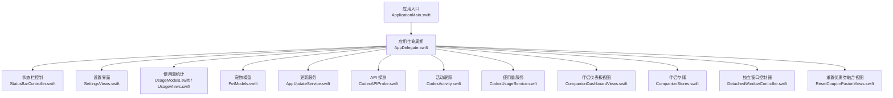
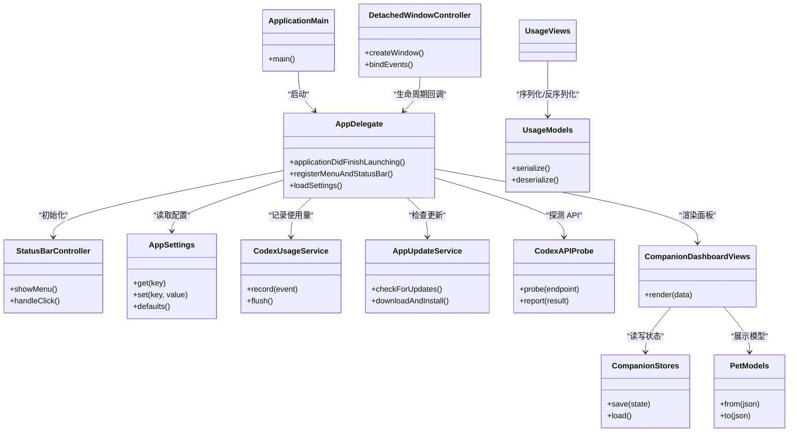
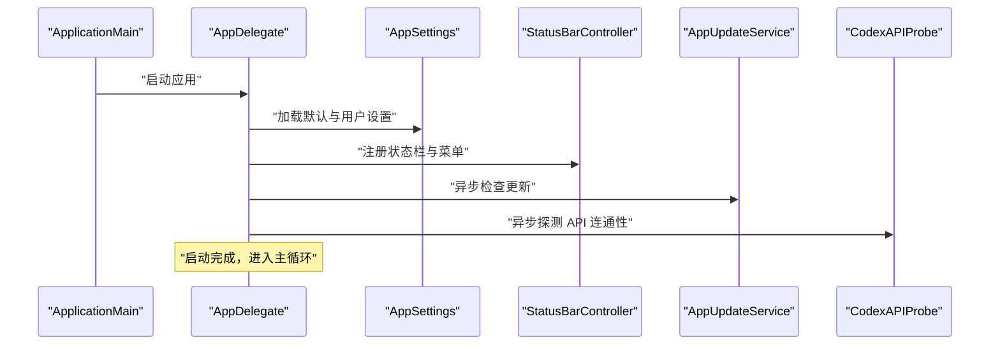
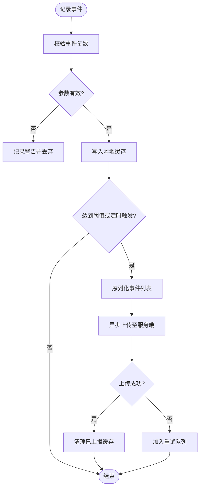
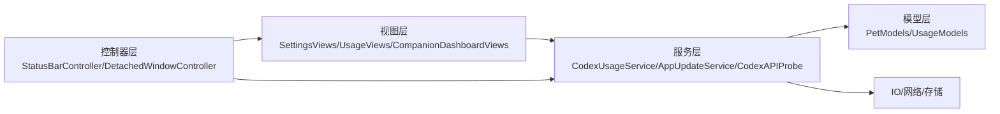

# 代码规范

<cite>
**本文引用的文件**   
- [AppDelegate.swift](file://app/Tomo/Sources/Tomo/AppDelegate.swift)
- [AppSettings.swift](file://app/Tomo/Sources/Tomo/AppSettings.swift)
- [AppUpdateService.swift](file://app/Tomo/Sources/Tomo/AppUpdateService.swift)
- [ApplicationMain.swift](file://app/Tomo/Sources/Tomo/ApplicationMain.swift)
- [CodexAPIProbe.swift](file://app/Tomo/Sources/Tomo/CodexAPIProbe.swift)
- [CodexActivity.swift](file://app/Tomo/Sources/Tomo/CodexActivity.swift)
- [CodexUsageService.swift](file://app/Tomo/Sources/Tomo/CodexUsageService.swift)
- [CompanionDashboardViews.swift](file://app/Tomo/Sources/Tomo/CompanionDashboardViews.swift)
- [CompanionStores.swift](file://app/Tomo/Sources/Tomo/CompanionStores.swift)
- [DetachedWindowController.swift](file://app/Tomo/Sources/Tomo/DetachedWindowController.swift)
- [PetModels.swift](file://app/Tomo/Sources/Tomo/PetModels.swift)
- [ResetCouponFusionViews.swift](file://app/Tomo/Sources/Tomo/ResetCouponFusionViews.swift)
- [SettingsViews.swift](file://app/Tomo/Sources/Tomo/SettingsViews.swift)
- [StatusBarController.swift](file://app/Tomo/Sources/Tomo/StatusBarController.swift)
- [UsageModels.swift](file://app/Tomo/Sources/Tomo/UsageModels.swift)
- [UsageViews.swift](file://app/Tomo/Sources/Tomo/UsageViews.swift)
- [Package.swift](file://app/Tomo/Package.swift)
</cite>

## 目录
1. [简介](#简介)
2. [项目结构](#项目结构)
3. [核心组件](#核心组件)
4. [架构总览](#架构总览)
5. [详细组件分析](#详细组件分析)
6. [依赖关系分析](#依赖关系分析)
7. [性能考量](#性能考量)
8. [故障排查指南](#故障排查指南)
9. [结论](#结论)
10. [附录](#附录)

## 简介
本规范面向 Swift 端（macOS App）开发与维护，目标是统一代码风格、命名与注释约定，明确架构设计原则与模块化边界，定义接口设计规范，并给出错误处理、日志与调试策略。同时提供性能优化建议、内存管理最佳实践与安全编码规范，以及代码审查清单和质量检查工具配置，帮助团队高效协作、稳定交付。

## 项目结构
本项目采用 macOS App 的 Swift Package 组织方式，应用入口位于 app/Tomo 目录下，包含：
- Sources/Tomo：Swift 源代码，按功能域划分多个源文件（如 UI、服务、模型、窗口控制器等）。
- Tests/TomoTests：单元测试。
- Resources：资源文件（图标、JSON 数据等）。
- scripts：构建与发布脚本。
- Package.swift：包描述与依赖声明。

**图示来源** 
- [ApplicationMain.swift](file://app/Tomo/Sources/Tomo/ApplicationMain.swift)
- [AppDelegate.swift](file://app/Tomo/Sources/Tomo/AppDelegate.swift)
- [StatusBarController.swift](file://app/Tomo/Sources/Tomo/StatusBarController.swift)
- [SettingsViews.swift](file://app/Tomo/Sources/Tomo/SettingsViews.swift)
- [UsageModels.swift](file://app/Tomo/Sources/Tomo/UsageModels.swift)
- [UsageViews.swift](file://app/Tomo/Sources/Tomo/UsageViews.swift)
- [PetModels.swift](file://app/Tomo/Sources/Tomo/PetModels.swift)
- [AppUpdateService.swift](file://app/Tomo/Sources/Tomo/AppUpdateService.swift)
- [CodexAPIProbe.swift](file://app/Tomo/Sources/Tomo/CodexAPIProbe.swift)
- [CodexActivity.swift](file://app/Tomo/Sources/Tomo/CodexActivity.swift)
- [CodexUsageService.swift](file://app/Tomo/Sources/Tomo/CodexUsageService.swift)
- [CompanionDashboardViews.swift](file://app/Tomo/Sources/Tomo/CompanionDashboardViews.swift)
- [CompanionStores.swift](file://app/Tomo/Sources/Tomo/CompanionStores.swift)
- [DetachedWindowController.swift](file://app/Tomo/Sources/Tomo/DetachedWindowController.swift)
- [ResetCouponFusionViews.swift](file://app/Tomo/Sources/Tomo/ResetCouponFusionViews.swift)

**章节来源**
- [Package.swift](file://app/Tomo/Package.swift)

## 核心组件
- 应用入口与生命周期：负责初始化系统环境、注册菜单与状态栏、加载设置与关键服务。
- 状态栏控制器：管理菜单栏状态项的显示、点击行为与上下文菜单。
- 设置与偏好：集中管理用户配置，提供持久化与默认值回退。
- 使用量统计：采集与上报使用情况，支持本地缓存与批量提交。
- API 探测与更新服务：对外部 API 连通性检测与版本更新流程封装。
- 伴侣面板与存储：UI 展示与数据持久化（如 UserDefaults 或文件系统）。
- 模型层：领域对象与 JSON 映射（如宠物模型、使用量模型）。
- 窗口控制器：管理独立窗口的创建、生命周期与事件绑定。

**章节来源**
- [AppDelegate.swift](file://app/Tomo/Sources/Tomo/AppDelegate.swift)
- [StatusBarController.swift](file://app/Tomo/Sources/Tomo/StatusBarController.swift)
- [AppSettings.swift](file://app/Tomo/Sources/Tomo/AppSettings.swift)
- [CodexUsageService.swift](file://app/Tomo/Sources/Tomo/CodexUsageService.swift)
- [AppUpdateService.swift](file://app/Tomo/Sources/Tomo/AppUpdateService.swift)
- [CodexAPIProbe.swift](file://app/Tomo/Sources/Tomo/CodexAPIProbe.swift)
- [CompanionDashboardViews.swift](file://app/Tomo/Sources/Tomo/CompanionDashboardViews.swift)
- [CompanionStores.swift](file://app/Tomo/Sources/Tomo/CompanionStores.swift)
- [PetModels.swift](file://app/Tomo/Sources/Tomo/PetModels.swift)
- [UsageModels.swift](file://app/Tomo/Sources/Tomo/UsageModels.swift)
- [DetachedWindowController.swift](file://app/Tomo/Sources/Tomo/DetachedWindowController.swift)

## 架构总览
整体采用“入口-控制器-服务-模型”的分层结构：
- 入口层：ApplicationMain 启动应用，AppDelegate 处理生命周期事件。
- 控制器层：StatusBarController、DetachedWindowController 负责 UI 交互与窗口管理。
- 服务层：AppUpdateService、CodexUsageService、CodexAPIProbe 封装业务逻辑与外部交互。
- 模型层：PetModels、UsageModels 定义数据结构与序列化规则。
- 视图层：SettingsViews、UsageViews、CompanionDashboardViews、ResetCouponFusionViews 负责展示与用户输入。

**图示来源** 
- [ApplicationMain.swift](file://app/Tomo/Sources/Tomo/ApplicationMain.swift)
- [AppDelegate.swift](file://app/Tomo/Sources/Tomo/AppDelegate.swift)
- [StatusBarController.swift](file://app/Tomo/Sources/Tomo/StatusBarController.swift)
- [AppSettings.swift](file://app/Tomo/Sources/Tomo/AppSettings.swift)
- [CodexUsageService.swift](file://app/Tomo/Sources/Tomo/CodexUsageService.swift)
- [AppUpdateService.swift](file://app/Tomo/Sources/Tomo/AppUpdateService.swift)
- [CodexAPIProbe.swift](file://app/Tomo/Sources/Tomo/CodexAPIProbe.swift)
- [CompanionDashboardViews.swift](file://app/Tomo/Sources/Tomo/CompanionDashboardViews.swift)
- [CompanionStores.swift](file://app/Tomo/Sources/Tomo/CompanionStores.swift)
- [PetModels.swift](file://app/Tomo/Sources/Tomo/PetModels.swift)
- [UsageModels.swift](file://app/Tomo/Sources/Tomo/UsageModels.swift)
- [DetachedWindowController.swift](file://app/Tomo/Sources/Tomo/DetachedWindowController.swift)

## 详细组件分析

### 应用入口与生命周期（ApplicationMain、AppDelegate）
- 职责：初始化运行环境、注册菜单与状态栏、加载设置、启动关键服务。
- 关键点：避免在启动阶段执行耗时操作；将网络请求与 IO 延迟到后台队列；对异常进行捕获与降级。
- 错误处理：对不可恢复的错误进行弹窗提示与退出；可恢复错误记录日志并继续运行。
- 日志：统一日志门面，区分级别（info/warn/error），输出时间与模块名。

**图示来源** 
- [ApplicationMain.swift](file://app/Tomo/Sources/Tomo/ApplicationMain.swift)
- [AppDelegate.swift](file://app/Tomo/Sources/Tomo/AppDelegate.swift)
- [AppSettings.swift](file://app/Tomo/Sources/Tomo/AppSettings.swift)
- [StatusBarController.swift](file://app/Tomo/Sources/Tomo/StatusBarController.swift)
- [AppUpdateService.swift](file://app/Tomo/Sources/Tomo/AppUpdateService.swift)
- [CodexAPIProbe.swift](file://app/Tomo/Sources/Tomo/CodexAPIProbe.swift)

**章节来源**
- [ApplicationMain.swift](file://app/Tomo/Sources/Tomo/ApplicationMain.swift)
- [AppDelegate.swift](file://app/Tomo/Sources/Tomo/AppDelegate.swift)

### 状态栏控制器（StatusBarController）
- 职责：创建与管理菜单栏状态项，响应点击事件，弹出上下文菜单。
- 交互：菜单项应短小清晰，避免阻塞主线程；对需要网络的操作放入后台队列。
- 错误处理：菜单操作失败时给出轻量提示（如 toast 或状态栏提示）。

**章节来源**
- [StatusBarController.swift](file://app/Tomo/Sources/Tomo/StatusBarController.swift)

### 设置与偏好（AppSettings）
- 职责：集中管理配置键值，提供默认值与类型安全访问。
- 最佳实践：所有配置键集中定义；读写通过统一接口；变更触发必要的通知或回调。
- 错误处理：对非法值进行回退到默认值并记录警告。

**章节来源**
- [AppSettings.swift](file://app/Tomo/Sources/Tomo/AppSettings.swift)

### 使用量统计（CodexUsageService、UsageModels、UsageViews）
- 职责：采集使用事件，本地缓存，定时批量上报；提供可视化展示。
- 数据处理：使用幂等事件 ID 去重；支持离线缓存与重试；上报失败不阻断主流程。
- 隐私与安全：仅采集必要信息，脱敏敏感字段；遵守最小化原则。

**图示来源** 
- [CodexUsageService.swift](file://app/Tomo/Sources/Tomo/CodexUsageService.swift)
- [UsageModels.swift](file://app/Tomo/Sources/Tomo/UsageModels.swift)
- [UsageViews.swift](file://app/Tomo/Sources/Tomo/UsageViews.swift)

**章节来源**
- [CodexUsageService.swift](file://app/Tomo/Sources/Tomo/CodexUsageService.swift)
- [UsageModels.swift](file://app/Tomo/Sources/Tomo/UsageModels.swift)
- [UsageViews.swift](file://app/Tomo/Sources/Tomo/UsageViews.swift)

### API 探测与更新服务（CodexAPIProbe、AppUpdateService）
- 职责：检测外部 API 连通性与可用性；检查新版本并引导安装。
- 网络策略：超时与重试机制；失败时降级为本地可用模式；结果可观察。
- 错误处理：区分网络错误与服务端错误；对用户可见的错误提供友好提示。

**章节来源**
- [CodexAPIProbe.swift](file://app/Tomo/Sources/Tomo/CodexAPIProbe.swift)
- [AppUpdateService.swift](file://app/Tomo/Sources/Tomo/AppUpdateService.swift)

### 伴侣面板与存储（CompanionDashboardViews、CompanionStores）
- 职责：渲染仪表盘 UI；持久化面板状态与用户选择。
- 数据流：从 Stores 读取状态，渲染视图；用户操作写回 Stores。
- 错误处理：读写失败时回滚或提示；保证 UI 一致性。

**章节来源**
- [CompanionDashboardViews.swift](file://app/Tomo/Sources/Tomo/CompanionDashboardViews.swift)
- [CompanionStores.swift](file://app/Tomo/Sources/Tomo/CompanionStores.swift)

### 模型层（PetModels、UsageModels）
- 职责：定义领域对象与 JSON 映射；提供序列化工具方法。
- 设计要点：只读属性优先；可变状态集中在服务层；避免在模型中执行副作用。
- 错误处理：解析失败返回可选值或错误枚举，调用方决定处理方式。

**章节来源**
- [PetModels.swift](file://app/Tomo/Sources/Tomo/PetModels.swift)
- [UsageModels.swift](file://app/Tomo/Sources/Tomo/UsageModels.swift)

### 窗口控制器（DetachedWindowController）
- 职责：创建独立窗口，绑定事件与生命周期回调。
- 最佳实践：避免持有强引用导致循环引用；释放时清理观察者与定时器。
- 错误处理：窗口创建失败时回退到默认窗口或提示用户。

**章节来源**
- [DetachedWindowController.swift](file://app/Tomo/Sources/Tomo/DetachedWindowController.swift)

### 其他视图（SettingsViews、ResetCouponFusionViews）
- 职责：设置页面与特定业务流程的 UI 实现。
- 交互规范：表单验证即时反馈；提交前二次确认高风险操作。
- 错误处理：输入错误高亮字段；网络失败允许重试。

**章节来源**
- [SettingsViews.swift](file://app/Tomo/Sources/Tomo/SettingsViews.swift)
- [ResetCouponFusionViews.swift](file://app/Tomo/Sources/Tomo/ResetCouponFusionViews.swift)

## 依赖关系分析
- 低耦合：控制器依赖服务，服务依赖模型；视图仅依赖模型与 Store。
- 单向依赖：避免视图直接调用底层网络或 IO；通过服务抽象。
- 外部依赖：网络请求、文件系统、UserDefaults 等通过协议或服务封装，便于替换与测试。

**图示来源** 
- [SettingsViews.swift](file://app/Tomo/Sources/Tomo/SettingsViews.swift)
- [UsageViews.swift](file://app/Tomo/Sources/Tomo/UsageViews.swift)
- [CompanionDashboardViews.swift](file://app/Tomo/Sources/Tomo/CompanionDashboardViews.swift)
- [CodexUsageService.swift](file://app/Tomo/Sources/Tomo/CodexUsageService.swift)
- [AppUpdateService.swift](file://app/Tomo/Sources/Tomo/AppUpdateService.swift)
- [CodexAPIProbe.swift](file://app/Tomo/Sources/Tomo/CodexAPIProbe.swift)
- [PetModels.swift](file://app/Tomo/Sources/Tomo/PetModels.swift)
- [UsageModels.swift](file://app/Tomo/Sources/Tomo/UsageModels.swift)
- [StatusBarController.swift](file://app/Tomo/Sources/Tomo/StatusBarController.swift)
- [DetachedWindowController.swift](file://app/Tomo/Sources/Tomo/DetachedWindowController.swift)

**章节来源**
- [Package.swift](file://app/Tomo/Package.swift)

## 性能考量
- 启动优化：延迟非关键初始化；避免在主线程执行 IO 与网络请求。
- 并发策略：使用合适的队列与任务调度；避免过度并行导致资源竞争。
- 内存管理：弱引用避免循环引用；及时释放观察者与定时器；大对象池化复用。
- 缓存策略：对频繁读取的数据进行缓存；合理设置过期与失效策略。
- UI 渲染：减少不必要的重绘；批量更新视图状态。

[本节为通用指导，无需具体文件来源]

## 故障排查指南
- 日志规范：统一日志门面，包含时间、模块、级别与上下文；避免打印敏感信息。
- 错误分类：区分可恢复与不可恢复错误；提供用户友好的提示与降级路径。
- 调试技巧：启用详细日志；使用断点与变量监视；隔离问题模块进行复现。
- 常见问题：网络超时、权限不足、磁盘空间不足、配置文件损坏等。

**章节来源**
- [CodexUsageService.swift](file://app/Tomo/Sources/Tomo/CodexUsageService.swift)
- [AppUpdateService.swift](file://app/Tomo/Sources/Tomo/AppUpdateService.swift)
- [CodexAPIProbe.swift](file://app/Tomo/Sources/Tomo/CodexAPIProbe.swift)

## 结论
本规范明确了 Swift 端的代码风格、命名与注释约定，定义了分层架构与模块化边界，提供了错误处理、日志与调试策略，以及性能优化、内存管理与安全编码的最佳实践。配合代码审查清单与质量检查工具，可有效提升代码质量与团队协作效率。

[本节为总结性内容，无需具体文件来源]

## 附录

### Swift 代码风格与命名约定
- 文件与类型命名：使用帕斯卡命名法（如 AppSettings、UsageModels）。
- 方法与变量命名：使用驼峰命名法（如 loadSettings、fetchData）。
- 常量与枚举：常量使用全大写加下划线（如 MAX_RETRY_COUNT）；枚举成员使用驼峰。
- 布尔属性：以 is/has/can 开头，语义清晰（如 isConnected、hasPermission）。
- 闭包参数：使用简洁明确的名称，避免单字母除非上下文清晰。

### 注释标准
- 公共 API：必须提供清晰的文档注释，说明用途、参数、返回值与异常。
- 复杂逻辑：在关键分支与算法处添加行内注释，解释意图而非重复代码。
- 废弃标记：使用废弃注解并说明替代方案。

### 架构设计原则
- 单一职责：每个模块聚焦一个功能域，避免跨层调用。
- 依赖倒置：高层模块不依赖低层细节，通过协议抽象。
- 可测试性：服务与控制器可被 Mock 与注入。

### 模块化要求
- 包内模块划分：按功能域拆分（UI、服务、模型、工具）。
- 接口契约：模块间通过协议或公开 API 通信，隐藏内部实现。
- 资源管理：静态资源集中管理，避免硬编码路径。

### 接口设计规范
- 输入校验：对所有外部输入进行校验与清洗。
- 错误返回：使用 Result 或可选类型表达失败；避免隐式崩溃。
- 异步接口：统一使用回调或 async/await；提供取消与超时机制。

### 错误处理策略
- 分类与传播：区分可恢复与不可恢复错误；在合适层级处理。
- 用户反馈：对影响用户体验的错误提供明确提示。
- 降级与容错：关键功能失败时提供降级路径。

### 日志记录与调试技巧
- 日志级别：debug/info/warn/error 分级使用。
- 上下文信息：记录关键标识（如用户 ID、会话 ID）以便追踪。
- 调试开关：提供运行时开关控制详细日志。

### 性能优化建议
- 避免主线程阻塞：网络与 IO 放后台；UI 更新在主线程。
- 减少对象分配：复用对象与缓冲；避免频繁字符串拼接。
- 缓存热点数据：合理设置 TTL 与失效策略。

### 内存管理最佳实践
- 弱引用：避免循环引用（delegate、观察者、闭包捕获）。
- 及时释放：移除观察者、取消定时器、释放大对象。
- 监控泄漏：使用 Instruments 定位内存泄漏。

### 安全编码规范
- 输入验证：严格校验与白名单过滤。
- 敏感数据：加密存储与传输；避免日志泄露。
- 权限控制：最小权限原则；动态申请必要权限。

### 代码审查清单
- 命名是否清晰一致？
- 是否有未处理的错误路径？
- 是否存在潜在内存泄漏？
- 是否对敏感信息进行脱敏？
- 是否添加了必要的文档注释？
- 是否覆盖了关键用例的测试？

### 质量检查工具配置
- SwiftLint：统一代码风格与常见错误检查。
- Xcode Build Settings：开启严格编译选项（如 -Werror、-strict-concurrency）。
- CI 集成：在流水线中执行 lint 与测试，阻止不合格代码合并。

[本节为通用指导，无需具体文件来源]