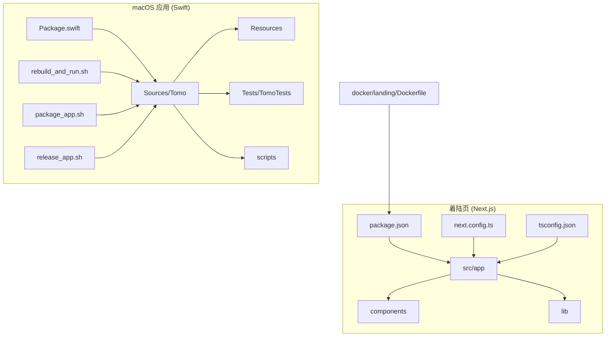
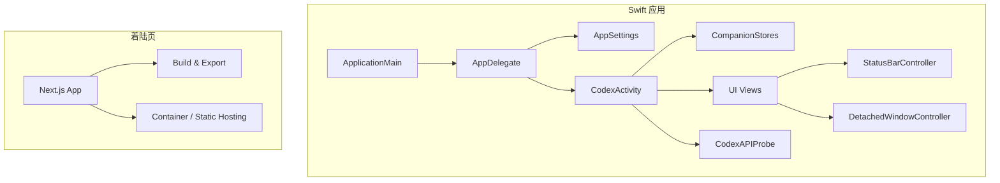
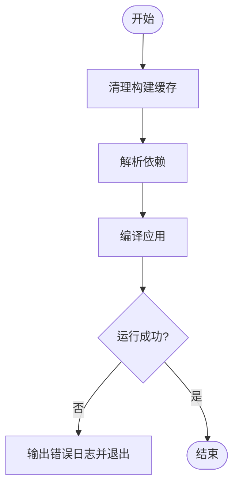
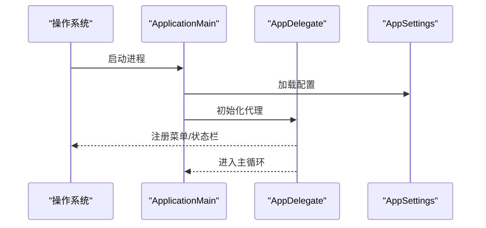
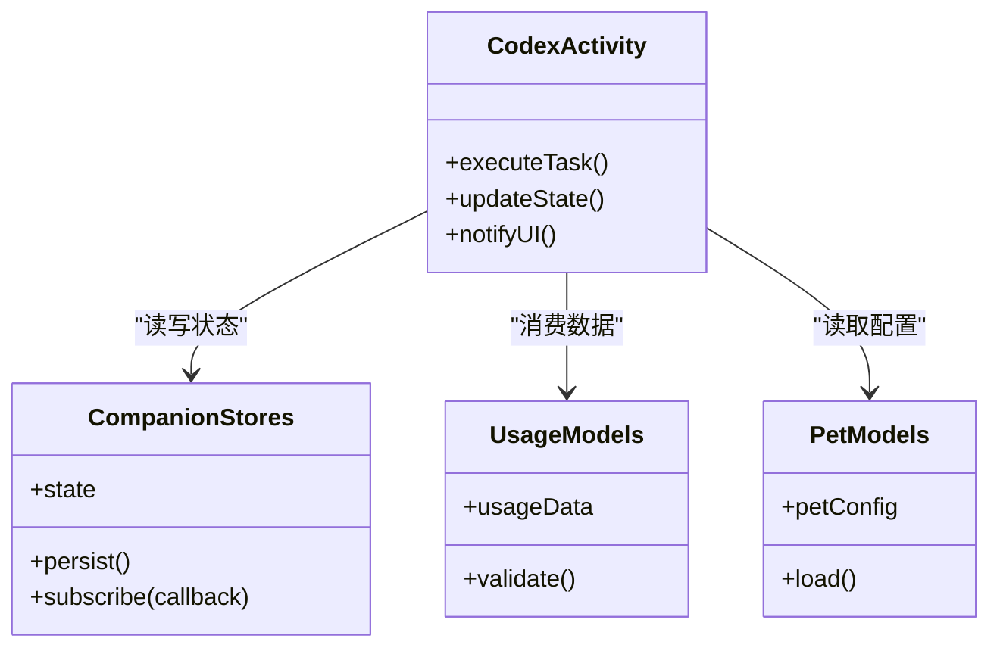
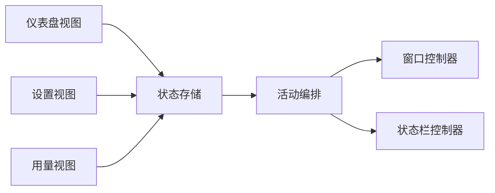
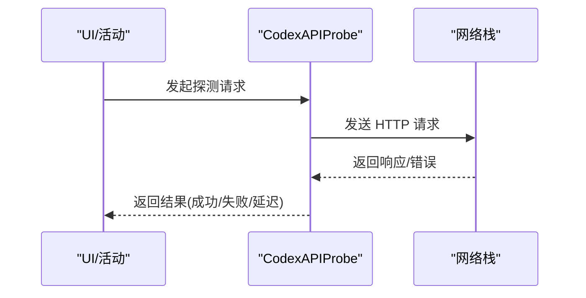
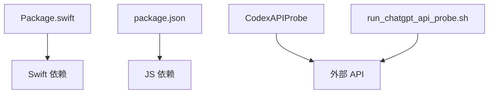

# 开发指南

<cite>
**本文引用的文件**   
- [Package.swift](file://app/Tomo/Package.swift)
- [rebuild_and_run.sh](file://app/Tomo/rebuild_and_run.sh)
- [package_app.sh](file://app/Tomo/package_app.sh)
- [release_app.sh](file://app/Tomo/release_app.sh)
- [run_chatgpt_api_probe.sh](file://app/Tomo/scripts/run_chatgpt_api_probe.sh)
- [ApplicationMain.swift](file://app/Tomo/Sources/Tomo/ApplicationMain.swift)
- [AppDelegate.swift](file://app/Tomo/Sources/Tomo/AppDelegate.swift)
- [AppSettings.swift](file://app/Tomo/Sources/Tomo/AppSettings.swift)
- [CodexActivity.swift](file://app/Tomo/Sources/Tomo/CodexActivity.swift)
- [CodexAPIProbe.swift](file://app/Tomo/Sources/Tomo/CodexAPIProbe.swift)
- [CompanionDashboardViews.swift](file://app/Tomo/Sources/Tomo/CompanionDashboardViews.swift)
- [CompanionStores.swift](file://app/Tomo/Sources/Tomo/CompanionStores.swift)
- [DetachedWindowController.swift](file://app/Tomo/Sources/Tomo/DetachedWindowController.swift)
- [PetModels.swift](file://app/Tomo/Sources/Tomo/PetModels.swift)
- [ResetCouponFusionViews.swift](file://app/Tomo/Sources/Tomo/ResetCouponFusionViews.swift)
- [SettingsViews.swift](file://app/Tomo/Sources/Tomo/SettingsViews.swift)
- [StatusBarController.swift](file://app/Tomo/Sources/Tomo/StatusBarController.swift)
- [UsageModels.swift](file://app/Tomo/Sources/Tomo/UsageModels.swift)
- [UsageViews.swift](file://app/Tomo/Sources/Tomo/UsageViews.swift)
- [TomoTests.swift](file://app/Tomo/Tests/TomoTests/TomoTests.swift)
- [Info.plist](file://app/Tomo/Resources/Info.plist)
- [pet.json](file://app/Tomo/Resources/Pets/Tomo/pet.json)
- [package.json](file://app/landing/package.json)
- [next.config.ts](file://app/landing/next.config.ts)
- [tsconfig.json](file://app/landing/tsconfig.json)
- [Dockerfile](file://docker/landing/Dockerfile)
- [README.md](file://README.md)
- [PROJECT.md](file://PROJECT.md)
</cite>

## 目录
1. [简介](#简介)
2. [项目结构](#项目结构)
3. [核心组件](#核心组件)
4. [架构总览](#架构总览)
5. [详细组件分析](#详细组件分析)
6. [依赖分析](#依赖分析)
7. [性能考虑](#性能考虑)
8. [故障排查指南](#故障排查指南)
9. [结论](#结论)
10. [附录](#附录)

## 简介
本指南面向开发者，覆盖 Tomo 的构建系统、依赖管理、开发环境配置、Swift Package Manager 配置与项目组织、开发脚本使用（重建运行、打包发布、自动化构建）、代码规范、测试策略、持续集成建议、调试技巧、性能分析与常见问题解决方案，以及贡献流程、代码审查与版本发布管理。目标是帮助你在本地高效开发、稳定构建与可靠发布。

## 项目结构
项目由两个主要子应用组成：
- macOS 原生应用（Swift）：位于 app/Tomo，包含 Swift 源码、资源、测试与脚本。
- 着陆页网站（Next.js）：位于 app/landing，用于产品落地页与下载入口。

图表来源
- [Package.swift:1-200](file://app/Tomo/Package.swift#L1-L200)
- [rebuild_and_run.sh:1-200](file://app/Tomo/rebuild_and_run.sh#L1-L200)
- [package_app.sh:1-200](file://app/Tomo/package_app.sh#L1-L200)
- [release_app.sh:1-200](file://app/Tomo/release_app.sh#L1-L200)
- [package.json:1-200](file://app/landing/package.json#L1-L200)
- [next.config.ts:1-200](file://app/landing/next.config.ts#L1-L200)
- [tsconfig.json:1-200](file://app/landing/tsconfig.json#L1-L200)
- [Dockerfile:1-200](file://docker/landing/Dockerfile#L1-L200)

章节来源
- [README.md:1-200](file://README.md#L1-L200)
- [PROJECT.md:1-200](file://PROJECT.md#L1-L200)

## 核心组件
- Swift 应用入口与生命周期
  - ApplicationMain.swift：应用主入口与启动流程。
  - AppDelegate.swift：应用代理，处理生命周期事件与全局状态。
  - AppSettings.swift：应用设置与偏好存储。
- UI 与交互
  - CompanionDashboardViews.swift、SettingsViews.swift、UsageViews.swift：主要界面视图。
  - DetachedWindowController.swift：独立窗口控制器。
  - StatusBarController.swift：菜单栏状态栏控制。
- 业务逻辑与数据
  - CodexActivity.swift：活动与任务编排。
  - CodexAPIProbe.swift：API 探测与连通性检查。
  - CompanionStores.swift：状态与数据持久化。
  - PetModels.swift、UsageModels.swift：领域模型定义。
  - ResetCouponFusionViews.swift：特定功能视图。
- 测试
  - TomoTests.swift：单元测试用例集合。
- 资源
  - Info.plist：应用元信息与权限声明。
  - pet.json：宠物相关静态数据。

章节来源
- [ApplicationMain.swift:1-200](file://app/Tomo/Sources/Tomo/ApplicationMain.swift#L1-L200)
- [AppDelegate.swift:1-200](file://app/Tomo/Sources/Tomo/AppDelegate.swift#L1-L200)
- [AppSettings.swift:1-200](file://app/Tomo/Sources/Tomo/AppSettings.swift#L1-L200)
- [CompanionDashboardViews.swift:1-200](file://app/Tomo/Sources/Tomo/CompanionDashboardViews.swift#L1-L200)
- [SettingsViews.swift:1-200](file://app/Tomo/Sources/Tomo/SettingsViews.swift#1-L200)
- [UsageViews.swift:1-200](file://app/Tomo/Sources/Tomo/UsageViews.swift#L1-L200)
- [DetachedWindowController.swift:1-200](file://app/Tomo/Sources/Tomo/DetachedWindowController.swift#L1-L200)
- [StatusBarController.swift:1-200](file://app/Tomo/Sources/Tomo/StatusBarController.swift#L1-L200)
- [CodexActivity.swift:1-200](file://app/Tomo/Sources/Tomo/CodexActivity.swift#L1-L200)
- [CodexAPIProbe.swift:1-200](file://app/Tomo/Sources/Tomo/CodexAPIProbe.swift#L1-L200)
- [CompanionStores.swift:1-200](file://app/Tomo/Sources/Tomo/CompanionStores.swift#L1-L200)
- [PetModels.swift:1-200](file://app/Tomo/Sources/Tomo/PetModels.swift#L1-L200)
- [UsageModels.swift:1-200](file://app/Tomo/Sources/Tomo/UsageModels.swift#L1-L200)
- [ResetCouponFusionViews.swift:1-200](file://app/Tomo/Sources/Tomo/ResetCouponFusionViews.swift#L1-L200)
- [TomoTests.swift:1-200](file://app/Tomo/Tests/TomoTests/TomoTests.swift#L1-L200)
- [Info.plist:1-200](file://app/Tomo/Resources/Info.plist#L1-L200)
- [pet.json:1-200](file://app/Tomo/Resources/Pets/Tomo/pet.json#L1-L200)

## 架构总览
整体采用“Swift 桌面应用 + Next.js 着陆页”的双端结构。Swift 应用通过 SPM 管理依赖，提供菜单、状态栏、窗口与业务逻辑；Next.js 站点负责产品展示与下载入口，可容器化部署。

图表来源
- [ApplicationMain.swift:1-200](file://app/Tomo/Sources/Tomo/ApplicationMain.swift#L1-L200)
- [AppDelegate.swift:1-200](file://app/Tomo/Sources/Tomo/AppDelegate.swift#L1-L200)
- [AppSettings.swift:1-200](file://app/Tomo/Sources/Tomo/AppSettings.swift#L1-L200)
- [CodexActivity.swift:1-200](file://app/Tomo/Sources/Tomo/CodexActivity.swift#L1-L200)
- [CompanionStores.swift:1-200](file://app/Tomo/Sources/Tomo/CompanionStores.swift#L1-L200)
- [CompanionDashboardViews.swift:1-200](file://app/Tomo/Sources/Tomo/CompanionDashboardViews.swift#L1-L200)
- [SettingsViews.swift:1-200](file://app/Tomo/Sources/Tomo/SettingsViews.swift#L1-L200)
- [UsageViews.swift:1-200](file://app/Tomo/Sources/Tomo/UsageViews.swift#L1-L200)
- [DetachedWindowController.swift:1-200](file://app/Tomo/Sources/Tomo/DetachedWindowController.swift#L1-L200)
- [StatusBarController.swift:1-200](file://app/Tomo/Sources/Tomo/StatusBarController.swift#L1-L200)
- [CodexAPIProbe.swift:1-200](file://app/Tomo/Sources/Tomo/CodexAPIProbe.swift#L1-L200)
- [package.json:1-200](file://app/landing/package.json#L1-L200)
- [next.config.ts:1-200](file://app/landing/next.config.ts#L1-L200)

## 详细组件分析

### Swift 包与构建系统（SPM）
- 包定义与目标：Package.swift 定义了应用目标、资源与依赖。确保模块划分清晰，避免循环依赖。
- 资源与清单：Info.plist 声明应用元数据与权限；pet.json 为静态资源。
- 构建与运行：rebuild_and_run.sh 封装了清理、编译与运行的完整流程，便于快速迭代。

图表来源
- [Package.swift:1-200](file://app/Tomo/Package.swift#L1-L200)
- [rebuild_and_run.sh:1-200](file://app/Tomo/rebuild_and_run.sh#L1-L200)
- [Info.plist:1-200](file://app/Tomo/Resources/Info.plist#L1-L200)
- [pet.json:1-200](file://app/Tomo/Resources/Pets/Tomo/pet.json#L1-L200)

章节来源
- [Package.swift:1-200](file://app/Tomo/Package.swift#L1-L200)
- [rebuild_and_run.sh:1-200](file://app/Tomo/rebuild_and_run.sh#L1-L200)

### 应用入口与生命周期
- ApplicationMain.swift：初始化应用上下文、加载配置、启动主循环。
- AppDelegate.swift：处理应用生命周期事件（如启动、前台/后台切换、退出），注册菜单与状态栏。
- AppSettings.swift：读写用户偏好，保证跨会话一致性。

图表来源
- [ApplicationMain.swift:1-200](file://app/Tomo/Sources/Tomo/ApplicationMain.swift#L1-L200)
- [AppDelegate.swift:1-200](file://app/Tomo/Sources/Tomo/AppDelegate.swift#L1-L200)
- [AppSettings.swift:1-200](file://app/Tomo/Sources/Tomo/AppSettings.swift#L1-L200)

章节来源
- [ApplicationMain.swift:1-200](file://app/Tomo/Sources/Tomo/ApplicationMain.swift#L1-L200)
- [AppDelegate.swift:1-200](file://app/Tomo/Sources/Tomo/AppDelegate.swift#L1-L200)
- [AppSettings.swift:1-200](file://app/Tomo/Sources/Tomo/AppSettings.swift#L1-L200)

### 业务编排与数据流
- CodexActivity.swift：协调任务执行、状态更新与 UI 刷新。
- CompanionStores.swift：集中管理状态与持久化，提供响应式更新。
- UsageModels.swift、PetModels.swift：领域模型，约束数据结构与校验规则。

图表来源
- [CodexActivity.swift:1-200](file://app/Tomo/Sources/Tomo/CodexActivity.swift#L1-L200)
- [CompanionStores.swift:1-200](file://app/Tomo/Sources/Tomo/CompanionStores.swift#L1-L200)
- [UsageModels.swift:1-200](file://app/Tomo/Sources/Tomo/UsageModels.swift#L1-L200)
- [PetModels.swift:1-200](file://app/Tomo/Sources/Tomo/PetModels.swift#L1-L200)

章节来源
- [CodexActivity.swift:1-200](file://app/Tomo/Sources/Tomo/CodexActivity.swift#L1-L200)
- [CompanionStores.swift:1-200](file://app/Tomo/Sources/Tomo/CompanionStores.swift#L1-L200)
- [UsageModels.swift:1-200](file://app/Tomo/Sources/Tomo/UsageModels.swift#L1-L200)
- [PetModels.swift:1-200](file://app/Tomo/Sources/Tomo/PetModels.swift#L1-L200)

### UI 与窗口管理
- 视图层：CompanionDashboardViews.swift、SettingsViews.swift、UsageViews.swift 分别承载仪表盘、设置与用量展示。
- 窗口与状态栏：DetachedWindowController.swift 管理独立窗口；StatusBarController.swift 控制菜单栏图标与菜单项。

图表来源
- [CompanionDashboardViews.swift:1-200](file://app/Tomo/Sources/Tomo/CompanionDashboardViews.swift#L1-L200)
- [SettingsViews.swift:1-200](file://app/Tomo/Sources/Tomo/SettingsViews.swift#L1-L200)
- [UsageViews.swift:1-200](file://app/Tomo/Sources/Tomo/UsageViews.swift#L1-L200)
- [CompanionStores.swift:1-200](file://app/Tomo/Sources/Tomo/CompanionStores.swift#L1-L200)
- [DetachedWindowController.swift:1-200](file://app/Tomo/Sources/Tomo/DetachedWindowController.swift#L1-L200)
- [StatusBarController.swift:1-200](file://app/Tomo/Sources/Tomo/StatusBarController.swift#L1-L200)

章节来源
- [CompanionDashboardViews.swift:1-200](file://app/Tomo/Sources/Tomo/CompanionDashboardViews.swift#L1-L200)
- [SettingsViews.swift:1-200](file://app/Tomo/Sources/Tomo/SettingsViews.swift#L1-L200)
- [UsageViews.swift:1-200](file://app/Tomo/Sources/Tomo/UsageViews.swift#L1-L200)
- [DetachedWindowController.swift:1-200](file://app/Tomo/Sources/Tomo/DetachedWindowController.swift#L1-L200)
- [StatusBarController.swift:1-200](file://app/Tomo/Sources/Tomo/StatusBarController.swift#L1-L200)

### API 探测与网络健康检查
- CodexAPIProbe.swift：封装网络探测逻辑，返回连通性与延迟信息，供 UI 或活动编排使用。
- scripts/run_chatgpt_api_probe.sh：命令行工具，便于在 CI 或本地快速验证外部服务可达性。

图表来源
- [CodexAPIProbe.swift:1-200](file://app/Tomo/Sources/Tomo/CodexAPIProbe.swift#L1-L200)
- [run_chatgpt_api_probe.sh:1-200](file://app/Tomo/scripts/run_chatgpt_api_probe.sh#L1-L200)

章节来源
- [CodexAPIProbe.swift:1-200](file://app/Tomo/Sources/Tomo/CodexAPIProbe.swift#L1-L200)
- [run_chatgpt_api_probe.sh:1-200](file://app/Tomo/scripts/run_chatgpt_api_probe.sh#L1-L200)

### 测试策略
- 单测框架：基于 XCTest（由 SPM 与 Xcode 支持）。
- 用例组织：TomoTests.swift 中按功能模块分组，优先覆盖关键路径与边界条件。
- 运行方式：通过 SPM 或 Xcode 运行，建议在提交前本地跑通。

章节来源
- [TomoTests.swift:1-200](file://app/Tomo/Tests/TomoTests/TomoTests.swift#L1-L200)

### 着陆页（Next.js）
- 包管理与脚本：package.json 定义依赖与脚本命令（安装、开发、构建、导出）。
- 构建配置：next.config.ts 与 tsconfig.json 控制构建行为与类型检查。
- 容器化：docker/landing/Dockerfile 提供镜像构建与部署基础。

章节来源
- [package.json:1-200](file://app/landing/package.json#L1-L200)
- [next.config.ts:1-200](file://app/landing/next.config.ts#L1-L200)
- [tsconfig.json:1-200](file://app/landing/tsconfig.json#L1-L200)
- [Dockerfile:1-200](file://docker/landing/Dockerfile#L1-L200)

## 依赖分析
- Swift 依赖：通过 Package.swift 声明，建议使用最小必要依赖，避免引入重型库。
- JS 依赖：通过 package.json 管理，锁定版本（pnpm-lock.yaml）确保可重复构建。
- 外部服务：API 探测脚本与模块用于验证第三方服务可用性。

图表来源
- [Package.swift:1-200](file://app/Tomo/Package.swift#L1-L200)
- [package.json:1-200](file://app/landing/package.json#L1-L200)
- [CodexAPIProbe.swift:1-200](file://app/Tomo/Sources/Tomo/CodexAPIProbe.swift#L1-L200)
- [run_chatgpt_api_probe.sh:1-200](file://app/Tomo/scripts/run_chatgpt_api_probe.sh#L1-L200)

章节来源
- [Package.swift:1-200](file://app/Tomo/Package.swift#L1-L200)
- [package.json:1-200](file://app/landing/package.json#L1-L200)

## 性能考虑
- 启动优化：延迟加载非关键模块，减少主线程阻塞。
- 内存管理：合理使用值类型与引用类型，避免强引用循环。
- I/O 与网络：批量请求、超时与重试策略，缓存热点数据。
- UI 渲染：避免频繁重绘，使用惰性加载与分页。
- 构建时间：增量构建、并行编译与缓存依赖。

[本节为通用指导，不直接分析具体文件]

## 故障排查指南
- 构建失败
  - 清理缓存后重试：使用 rebuild_and_run.sh 自动执行清理与构建。
  - 检查依赖解析：确认网络与镜像源可用。
- 运行时崩溃
  - 启用调试日志：在关键路径添加日志输出。
  - 使用 Instruments：定位内存泄漏与 CPU 热点。
- 网络问题
  - 使用 run_chatgpt_api_probe.sh 验证外部服务可达性。
  - 检查代理与防火墙设置。
- 着陆页构建异常
  - 清理 node_modules 与 pnpm 缓存后重装。
  - 检查环境变量与 next.config.ts 配置。

章节来源
- [rebuild_and_run.sh:1-200](file://app/Tomo/rebuild_and_run.sh#L1-L200)
- [run_chatgpt_api_probe.sh:1-200](file://app/Tomo/scripts/run_chatgpt_api_probe.sh#L1-L200)
- [package.json:1-200](file://app/landing/package.json#L1-L200)

## 结论
本指南梳理了 Tomo 的开发环境与构建体系，明确了 Swift 与 Next.js 的职责边界与协作方式。遵循本文的流程与最佳实践，可有效提升开发效率与交付质量。

[本节为总结性内容，不直接分析具体文件]

## 附录

### 开发脚本使用方法
- 重建并运行 Swift 应用
  - 执行 rebuild_and_run.sh，自动完成清理、依赖解析、编译与运行。
- 打包应用
  - 执行 package_app.sh，生成可分发的应用包。
- 发布应用
  - 执行 release_app.sh，完成签名、归档与发布准备。
- API 探测
  - 执行 scripts/run_chatgpt_api_probe.sh，验证外部服务连通性。

章节来源
- [rebuild_and_run.sh:1-200](file://app/Tomo/rebuild_and_run.sh#L1-L200)
- [package_app.sh:1-200](file://app/Tomo/package_app.sh#L1-L200)
- [release_app.sh:1-200](file://app/Tomo/release_app.sh#L1-L200)
- [run_chatgpt_api_probe.sh:1-200](file://app/Tomo/scripts/run_chatgpt_api_probe.sh#L1-L200)

### 代码规范与提交约定
- Swift
  - 遵循 Apple 官方风格指南，保持命名一致、注释简洁。
  - 模块化设计，单一职责，避免过深嵌套。
- JavaScript/TypeScript
  - 使用 ESLint 与 TypeScript 严格模式，统一格式与类型安全。
- 提交信息
  - 使用语义化提交（feat、fix、docs、chore 等），描述变更影响范围。

[本节为通用指导，不直接分析具体文件]

### 测试策略与覆盖率
- 单元与集成测试并重，优先覆盖核心路径与边界条件。
- 在 CI 中自动运行测试，失败阻断合并。
- 逐步提升覆盖率，关注关键模块。

[本节为通用指导，不直接分析具体文件]

### 持续集成建议
- 触发条件：push、PR、标签发布。
- 步骤：安装依赖、构建 Swift 与 Next.js、运行测试、生成产物。
- 缓存：依赖与构建缓存加速流水线。
- 报告：上传测试结果与覆盖率报告。

[本节为通用指导，不直接分析具体文件]

### 贡献指南与代码审查
- Fork 仓库，创建特性分支，提交小步快跑的变更。
- 编写或更新测试，确保本地通过。
- 提交 PR，附上变更说明与截图（如涉及 UI）。
- 审查要点：正确性、可读性、性能、安全性与兼容性。

[本节为通用指导，不直接分析具体文件]

### 版本发布管理
- 版本号：语义化版本（主.次.修订）。
- 标签：git tag 标记发布版本，关联 Release 说明。
- 产物：应用包与着陆页静态资源分别归档。
- 回滚：保留历史版本与制品，便于快速回退。

[本节为通用指导，不直接分析具体文件]

### 如何添加新功能
- 明确需求与边界，拆分任务。
- 新增模块或扩展现有模块，保持低耦合。
- 补充测试与文档，更新 README 或内联注释。
- 自测通过后提交 PR。

[本节为通用指导，不直接分析具体文件]

### 修改现有代码的最佳实践
- 先写测试，再改实现，确保回归安全。
- 小步重构，保持提交原子性。
- 记录破坏性变更与迁移步骤。

[本节为通用指导，不直接分析具体文件]