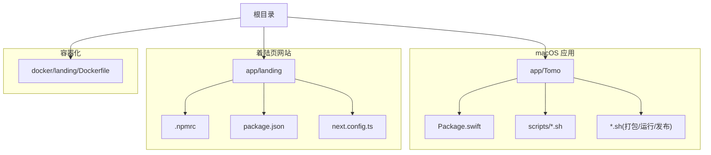
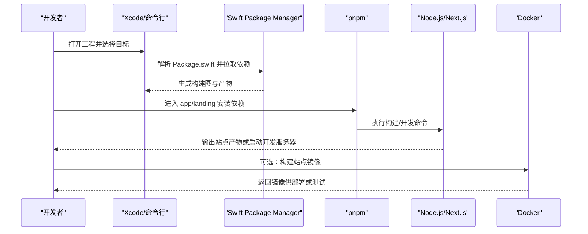
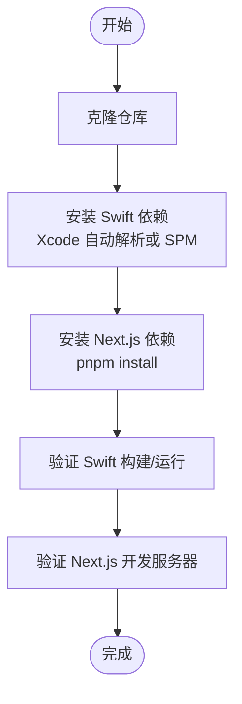
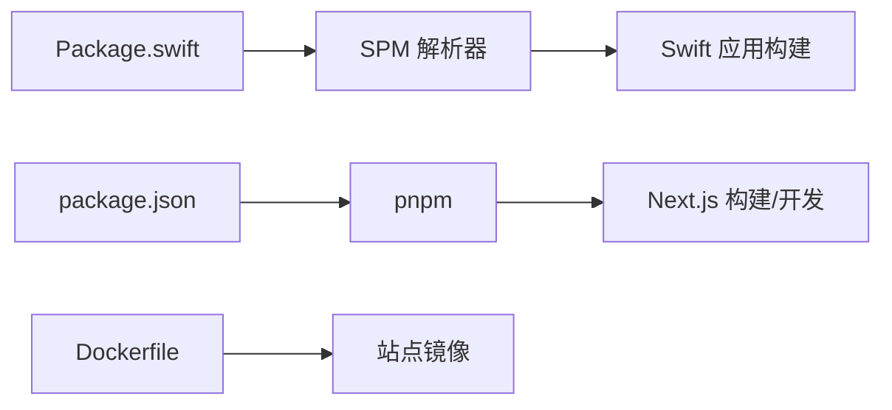

# 开发环境搭建

<cite>
**本文引用的文件**   
- [README.md](file://README.md)
- [PROJECT.md](file://PROJECT.md)
- [Package.swift](file://app/Tomo/Package.swift)
- [package_app.sh](file://app/Tomo/package_app.sh)
- [rebuild_and_run.sh](file://app/Tomo/rebuild_and_run.sh)
- [release_app.sh](file://app/Tomo/release_app.sh)
- [run_chatgpt_api_probe.sh](file://app/Tomo/scripts/run_chatgpt_api_probe.sh)
- [package.json](file://app/landing/package.json)
- [.npmrc](file://app/landing/.npmrc)
- [next.config.ts](file://app/landing/next.config.ts)
- [Dockerfile](file://docker/landing/Dockerfile)
</cite>

## 目录
1. [简介](#简介)
2. [项目结构](#项目结构)
3. [核心组件](#核心组件)
4. [架构总览](#架构总览)
5. [详细组件分析](#详细组件分析)
6. [依赖关系分析](#依赖关系分析)
7. [性能注意事项](#性能注意事项)
8. [故障排除指南](#故障排除指南)
9. [结论](#结论)
10. [附录](#附录)

## 简介
本指南面向首次参与 Tomo 项目的开发者，目标是帮助你从零开始搭建本地开发环境。内容涵盖：
- 所需开发工具与版本要求（Xcode、Swift、macOS）
- Swift Package Manager（SPM）配置与依赖管理
- Next.js 前端站点依赖与构建
- 项目初始化步骤（克隆仓库、安装依赖、验证环境）
- 常见环境问题与解决方案
- 推荐的开发工具配置与调试设置

## 项目结构
仓库包含两个主要子系统：
- macOS 应用（Swift + SPM）：位于 app/Tomo，使用 Swift Package Manager 组织源码、资源与脚本
- 着陆页网站（Next.js）：位于 app/landing，使用 pnpm 进行包管理

图表来源
- [Package.swift](file://app/Tomo/Package.swift)
- [package.json](file://app/landing/package.json)
- [.npmrc](file://app/landing/.npmrc)
- [next.config.ts](file://app/landing/next.config.ts)
- [Dockerfile](file://docker/landing/Dockerfile)

章节来源
- [README.md](file://README.md)
- [PROJECT.md](file://PROJECT.md)

## 核心组件
- Swift 应用工程与依赖定义：通过 Package.swift 声明目标、依赖与资源
- 构建与运行脚本：rebuild_and_run.sh、package_app.sh、release_app.sh 等用于快速编译、打包与发布
- 辅助脚本：scripts/run_chatgpt_api_probe.sh 用于 API 探测
- Next.js 站点：package.json 与 next.config.ts 定义依赖与构建行为；.npmrc 指定包管理器与镜像源
- Docker 镜像：docker/landing/Dockerfile 提供站点容器化构建

章节来源
- [Package.swift](file://app/Tomo/Package.swift)
- [rebuild_and_run.sh](file://app/Tomo/rebuild_and_run.sh)
- [package_app.sh](file://app/Tomo/package_app.sh)
- [release_app.sh](file://app/Tomo/release_app.sh)
- [run_chatgpt_api_probe.sh](file://app/Tomo/scripts/run_chatgpt_api_probe.sh)
- [package.json](file://app/landing/package.json)
- [.npmrc](file://app/landing/.npmrc)
- [next.config.ts](file://app/landing/next.config.ts)
- [Dockerfile](file://docker/landing/Dockerfile)

## 架构总览
下图展示了开发与构建流程中的关键角色与交互：开发者在本地通过 Xcode/命令行驱动 Swift 构建，同时使用 pnpm 管理 Next.js 依赖并构建站点；必要时通过 Docker 构建站点镜像。

图表来源
- [Package.swift](file://app/Tomo/Package.swift)
- [package.json](file://app/landing/package.json)
- [next.config.ts](file://app/landing/next.config.ts)
- [Dockerfile](file://docker/landing/Dockerfile)

## 详细组件分析

### Swift 应用与 SPM 配置
- 依赖管理：Package.swift 是 SPM 的核心配置文件，定义了应用目标、外部依赖与资源路径
- 构建与运行：rebuild_and_run.sh 通常封装了清理、编译与运行的常用流程
- 打包与发布：package_app.sh、release_app.sh 分别用于应用打包与发布流程
- 辅助工具：scripts/run_chatgpt_api_probe.sh 用于网络/API 探测与调试

建议操作要点
- 确保 Xcode 与命令行工具已正确安装，且 swift 命令可用
- 首次打开工程时，SPM 会自动解析 Package.swift 并下载依赖
- 若需手动刷新依赖，可使用 SPM 相关命令（如更新索引、清理缓存）

章节来源
- [Package.swift](file://app/Tomo/Package.swift)
- [rebuild_and_run.sh](file://app/Tomo/rebuild_and_run.sh)
- [package_app.sh](file://app/Tomo/package_app.sh)
- [release_app.sh](file://app/Tomo/release_app.sh)
- [run_chatgpt_api_probe.sh](file://app/Tomo/scripts/run_chatgpt_api_probe.sh)

### Next.js 着陆页与包管理
- 包管理器：推荐使用 pnpm（由 .npmrc 指定），也可切换为 npm/yarn
- 依赖与脚本：package.json 定义依赖项与构建/开发脚本
- 构建配置：next.config.ts 控制 Next.js 构建行为（如路径别名、环境变量注入等）
- 容器化：docker/landing/Dockerfile 提供一致的构建环境

建议操作要点
- 安装 pnpm 后，在 app/landing 目录下执行依赖安装与构建
- 如需自定义构建参数，参考 next.config.ts 的现有配置
- 使用 Docker 可避免本地 Node 版本差异导致的构建不一致

章节来源
- [.npmrc](file://app/landing/.npmrc)
- [package.json](file://app/landing/package.json)
- [next.config.ts](file://app/landing/next.config.ts)
- [Dockerfile](file://docker/landing/Dockerfile)

### 项目初始化流程
- 克隆仓库到本地
- 安装 Swift 依赖（通过 Xcode 或 SPM）
- 安装 Next.js 依赖（pnpm install）
- 验证 Swift 构建与 Next.js 开发服务器是否正常运行

[此图为概念流程图，不直接映射具体代码文件]

### 开发工具与调试环境推荐
- Xcode：建议使用最新稳定版，开启“显示所有构建设置”以便排查问题
- Swift 命令行：确保 swift、swift package、xcrun 可用
- Node.js/pnpm：建议使用长期支持版本，统一团队环境
- VS Code（可选）：安装 Swift 与 TypeScript/Next.js 扩展，提升编辑体验
- 调试：在 Xcode 中直接断点调试 Swift 应用；在浏览器开发者工具中调试 Next.js 前端

章节来源
- [Package.swift](file://app/Tomo/Package.swift)
- [package.json](file://app/landing/package.json)
- [next.config.ts](file://app/landing/next.config.ts)

## 依赖关系分析
- Swift 层：Package.swift 声明应用目标与外部依赖，SPM 负责解析与缓存
- Next.js 层：package.json 声明站点依赖，pnpm 负责锁定与安装
- 构建链路：Xcode/SPM 产出 macOS 应用；Node/Next.js 产出静态站点或开发服务器；Docker 提供站点镜像

图表来源
- [Package.swift](file://app/Tomo/Package.swift)
- [package.json](file://app/landing/package.json)
- [Dockerfile](file://docker/landing/Dockerfile)

章节来源
- [Package.swift](file://app/Tomo/Package.swift)
- [package.json](file://app/landing/package.json)
- [Dockerfile](file://docker/landing/Dockerfile)

## 性能注意事项
- 首次构建会下载依赖，后续增量构建较快；合理配置 SPM 缓存与 Xcode 并行编译
- Next.js 开发服务器启用热重载，生产构建建议开启压缩与 Tree Shaking
- Docker 构建可复用层缓存，减少重复下载与编译时间

[本节为通用指导，不直接分析具体文件]

## 故障排除指南
常见问题与解决思路
- Xcode/命令行工具未正确安装：重新安装 Xcode Command Line Tools，并确保 swift 命令可用
- SPM 依赖解析失败：检查网络代理与镜像配置；尝试清理 SPM 缓存后重试
- Next.js 依赖安装失败：确认 pnpm 版本与 Node 版本兼容；检查 .npmrc 镜像源可达性
- 构建产物缺失或路径错误：核对 Package.swift 与 next.config.ts 的路径配置
- 端口冲突：修改 Next.js 开发服务器端口或关闭占用进程

章节来源
- [Package.swift](file://app/Tomo/Package.swift)
- [package.json](file://app/landing/package.json)
- [.npmrc](file://app/landing/.npmrc)
- [next.config.ts](file://app/landing/next.config.ts)

## 结论
按照本指南完成工具安装、依赖管理与项目初始化后，即可在本地顺利构建与运行 Swift 应用与 Next.js 站点。建议在团队内统一工具版本与脚本用法，以减少环境差异带来的问题。

[本节为总结性内容，不直接分析具体文件]

## 附录
- 快速命令清单（示例）
  - Swift：打开工程、构建、运行、清理缓存
  - Next.js：安装依赖、启动开发服务器、构建生产产物
  - Docker：构建站点镜像

[本节为补充信息，不直接分析具体文件]