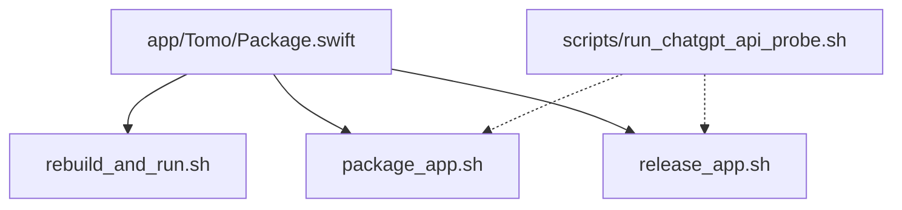
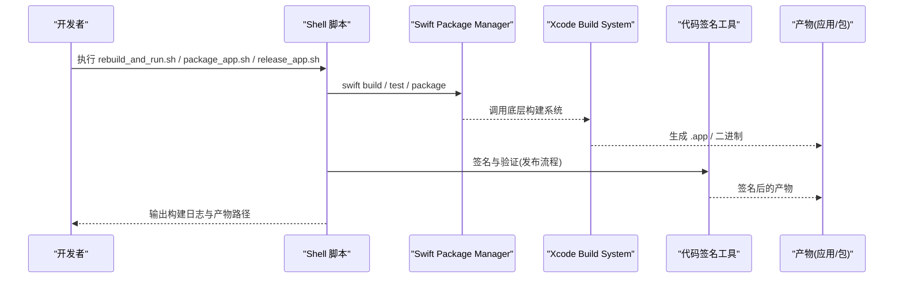
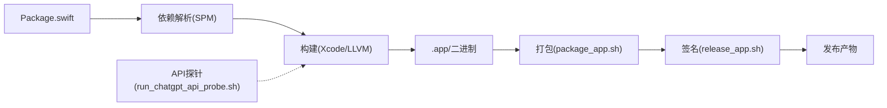

# 构建系统

<cite>
**本文引用的文件**   
- [Package.swift](file://app/Tomo/Package.swift)
- [rebuild_and_run.sh](file://app/Tomo/rebuild_and_run.sh)
- [package_app.sh](file://app/Tomo/package_app.sh)
- [release_app.sh](file://app/Tomo/release_app.sh)
- [run_chatgpt_api_probe.sh](file://app/Tomo/scripts/run_chatgpt_api_probe.sh)
</cite>

## 目录
1. [简介](#简介)
2. [项目结构](#项目结构)
3. [核心组件](#核心组件)
4. [架构总览](#架构总览)
5. [详细组件分析](#详细组件分析)
6. [依赖关系分析](#依赖关系分析)
7. [性能与优化](#性能与优化)
8. [故障排查指南](#故障排查指南)
9. [结论](#结论)
10. [附录：常用命令速查](#附录常用命令速查)

## 简介
本文件聚焦于项目的构建系统与自动化脚本，覆盖 Swift Package Manager（SPM）配置文件结构与依赖声明、各构建脚本的功能与使用方法、构建选项与编译参数、自定义构建配置，以及构建优化技巧与常见问题解决方案。目标是帮助开发者快速理解并高效使用项目的构建流程，确保本地开发、打包与发布的一致性与可重复性。

## 项目结构
与构建系统直接相关的核心位置如下：
- app/Tomo/Package.swift：SPM 包定义，描述目标、依赖、资源与平台等。
- app/Tomo/rebuild_and_run.sh：用于快速重建并运行应用的脚本。
- app/Tomo/package_app.sh：用于打包应用（生成 .app 或安装包）。
- app/Tomo/release_app.sh：用于发布流程（签名、归档、上传等）。
- app/Tomo/scripts/run_chatgpt_api_probe.sh：辅助脚本，用于探测外部 API 连通性。

图表来源
- [Package.swift](file://app/Tomo/Package.swift)
- [rebuild_and_run.sh](file://app/Tomo/rebuild_and_run.sh)
- [package_app.sh](file://app/Tomo/package_app.sh)
- [release_app.sh](file://app/Tomo/release_app.sh)
- [run_chatgpt_api_probe.sh](file://app/Tomo/scripts/run_chatgpt_api_probe.sh)

章节来源
- [Package.swift](file://app/Tomo/Package.swift)
- [rebuild_and_run.sh](file://app/Tomo/rebuild_and_run.sh)
- [package_app.sh](file://app/Tomo/package_app.sh)
- [release_app.sh](file://app/Tomo/release_app.sh)
- [run_chatgpt_api_probe.sh](file://app/Tomo/scripts/run_chatgpt_api_probe.sh)

## 核心组件
- SPM 包定义（Package.swift）
  - 定义应用目标、平台、依赖、资源与构建设置。
  - 通过 target 与 dependencies 声明模块与第三方库。
  - 通过 resources 与 plugins 扩展构建能力。
- 构建脚本
  - rebuild_and_run.sh：清理、构建、运行一体化，适合开发迭代。
  - package_app.sh：执行构建并打包为 .app 或安装包，便于分发。
  - release_app.sh：执行签名、归档、导出与发布流程。
- 辅助脚本
  - run_chatgpt_api_probe.sh：用于在构建前后探测外部服务可用性。

章节来源
- [Package.swift](file://app/Tomo/Package.swift)
- [rebuild_and_run.sh](file://app/Tomo/rebuild_and_run.sh)
- [package_app.sh](file://app/Tomo/package_app.sh)
- [release_app.sh](file://app/Tomo/release_app.sh)
- [run_chatgpt_api_probe.sh](file://app/Tomo/scripts/run_chatgpt_api_probe.sh)

## 架构总览
下图展示了从开发者触发到产物产出的整体流程，包括构建、打包与发布的关键步骤。

图表来源
- [rebuild_and_run.sh](file://app/Tomo/rebuild_and_run.sh)
- [package_app.sh](file://app/Tomo/package_app.sh)
- [release_app.sh](file://app/Tomo/release_app.sh)
- [Package.swift](file://app/Tomo/Package.swift)

## 详细组件分析

### SPM 包定义（Package.swift）
- 作用
  - 声明应用目标、平台版本、依赖项、资源与插件。
  - 控制构建行为（如测试目标、资源拷贝、编译标志）。
- 关键概念
  - target：定义可执行目标或库模块。
  - dependencies：声明外部依赖（包名、版本约束）。
  - resources：声明需要随包分发的资源文件。
  - plugins：扩展构建能力（如代码生成、资源处理）。
- 常见配置点
  - 平台限定（macOS/iOS 等）与最低版本。
  - 调试与发布模式的差异化设置。
  - 环境变量注入（例如开关特性或切换端点）。

章节来源
- [Package.swift](file://app/Tomo/Package.swift)

### 快速重建与运行（rebuild_and_run.sh）
- 功能概述
  - 清理旧构建缓存（可选），执行 swift build，随后运行生成的可执行文件。
  - 支持传入构建参数（如 --configuration debug|release）。
- 典型用法
  - 默认模式：快速构建并运行。
  - 指定配置：以 Release 模式构建以获得更快的启动与更小的体积。
- 注意事项
  - 首次构建会下载依赖，耗时较长；后续构建利用缓存。
  - 若修改了依赖或 Package.swift，需重新解析依赖。

章节来源
- [rebuild_and_run.sh](file://app/Tomo/rebuild_and_run.sh)

### 应用打包（package_app.sh）
- 功能概述
  - 执行构建后，调用打包流程生成 .app 或安装包（如 .pkg/.dmg）。
  - 可能包含资源校验、版本号读取、信息列表更新等操作。
- 典型用法
  - 本地打包：用于自测与内部分发。
  - 集成 CI：结合环境变量输出产物路径供下游任务使用。
- 注意事项
  - 打包前需确保依赖已正确解析且构建成功。
  - 资源路径与 Info.plist 需与目标一致。

章节来源
- [package_app.sh](file://app/Tomo/package_app.sh)

### 发布流程（release_app.sh）
- 功能概述
  - 执行签名、归档、导出与上传等发布相关步骤。
  - 通常依赖 Xcode 的签名证书与描述文件。
- 典型用法
  - 本地发布：用于测试签名与归档流程。
  - CI 发布：结合密钥管理与发布渠道进行自动化发布。
- 注意事项
  - 签名失败多因证书/描述文件缺失或权限不足。
  - 发布前建议先执行 package_app.sh 验证产物完整性。

章节来源
- [release_app.sh](file://app/Tomo/release_app.sh)

### 辅助脚本（run_chatgpt_api_probe.sh）
- 功能概述
  - 在构建或发布前探测外部 API 连通性，提前发现网络或服务问题。
- 典型用法
  - 作为预构建检查步骤，避免构建成功后才发现无法访问后端。
- 注意事项
  - 超时与重试策略应合理配置，避免阻塞构建。

章节来源
- [run_chatgpt_api_probe.sh](file://app/Tomo/scripts/run_chatgpt_api_probe.sh)

## 依赖关系分析
- 构建依赖
  - SPM 负责解析 Package.swift 中的依赖，并管理源码与二进制缓存。
  - 构建系统（Xcode/LLVM）负责编译与链接。
- 脚本依赖
  - rebuild_and_run.sh 依赖 swift 命令行工具。
  - package_app.sh 依赖打包工具链（可能调用 xcrun/xcodebuild）。
  - release_app.sh 依赖签名与归档工具（codesign、xcrun 等）。
- 外部依赖
  - 第三方 Swift 包（由 Package.swift 声明）。
  - 外部 API（由辅助脚本探测）。

图表来源
- [Package.swift](file://app/Tomo/Package.swift)
- [rebuild_and_run.sh](file://app/Tomo/rebuild_and_run.sh)
- [package_app.sh](file://app/Tomo/package_app.sh)
- [release_app.sh](file://app/Tomo/release_app.sh)
- [run_chatgpt_api_probe.sh](file://app/Tomo/scripts/run_chatgpt_api_probe.sh)

章节来源
- [Package.swift](file://app/Tomo/Package.swift)
- [rebuild_and_run.sh](file://app/Tomo/rebuild_and_run.sh)
- [package_app.sh](file://app/Tomo/package_app.sh)
- [release_app.sh](file://app/Tomo/release_app.sh)
- [run_chatgpt_api_probe.sh](file://app/Tomo/scripts/run_chatgpt_api_probe.sh)

## 性能与优化
- 构建加速
  - 使用 Release 模式构建以减少调试开销。
  - 启用并行构建与增量构建，充分利用缓存。
  - 定期清理不必要的中间产物，避免缓存膨胀。
- 依赖优化
  - 锁定依赖版本，减少解析与下载时间。
  - 按需引入依赖，避免不必要的模块编译。
- 打包优化
  - 仅包含必要资源，减小包体。
  - 使用合适的压缩格式与签名策略，平衡安全与速度。
- 发布优化
  - 预签名与预归档，缩短 CI 流水线时间。
  - 分阶段构建与缓存复用，提升并发效率。

[本节为通用指导，不直接分析具体文件]

## 故障排查指南
- 依赖解析失败
  - 现象：swift build 报错无法找到依赖或版本冲突。
  - 处理：检查 Package.swift 的版本约束，清理 DerivedData 后重试。
- 构建失败
  - 现象：编译错误或链接错误。
  - 处理：查看构建日志，定位具体模块与行号；确认编译器与 SDK 版本匹配。
- 打包失败
  - 现象：生成 .app 或安装包时报错。
  - 处理：检查资源路径、Info.plist 与签名配置；确认打包脚本参数正确。
- 签名失败
  - 现象：codesign 报错证书无效或缺失。
  - 处理：检查钥匙串与描述文件；确认权限与环境变量。
- API 不可达
  - 现象：构建前探测失败。
  - 处理：检查网络代理与防火墙；调整超时与重试策略。

章节来源
- [rebuild_and_run.sh](file://app/Tomo/rebuild_and_run.sh)
- [package_app.sh](file://app/Tomo/package_app.sh)
- [release_app.sh](file://app/Tomo/release_app.sh)
- [run_chatgpt_api_probe.sh](file://app/Tomo/scripts/run_chatgpt_api_probe.sh)

## 结论
本项目的构建系统以 SPM 为核心，配合 Shell 脚本实现从构建、打包到发布的完整流水线。通过合理的依赖声明与脚本组织，开发者可以在本地快速迭代，并在 CI 中稳定产出可分发的应用。遵循本文的优化建议与故障排查方法，可以显著提升构建效率与可靠性。

[本节为总结性内容，不直接分析具体文件]

## 附录：常用命令速查
- 快速重建并运行
  - 执行：rebuild_and_run.sh
  - 说明：清理、构建、运行一体化，适合开发循环。
- 打包应用
  - 执行：package_app.sh
  - 说明：生成 .app 或安装包，便于本地测试与分发。
- 发布流程
  - 执行：release_app.sh
  - 说明：签名、归档、导出与发布，适用于正式版本。
- API 连通性探测
  - 执行：scripts/run_chatgpt_api_probe.sh
  - 说明：构建前检查外部服务可用性。

章节来源
- [rebuild_and_run.sh](file://app/Tomo/rebuild_and_run.sh)
- [package_app.sh](file://app/Tomo/package_app.sh)
- [release_app.sh](file://app/Tomo/release_app.sh)
- [run_chatgpt_api_probe.sh](file://app/Tomo/scripts/run_chatgpt_api_probe.sh)