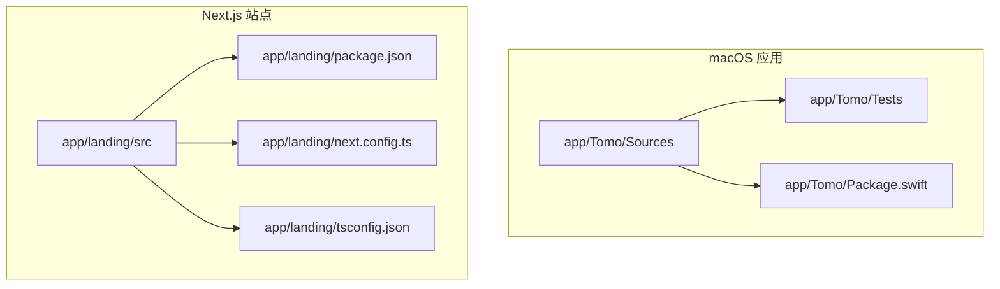
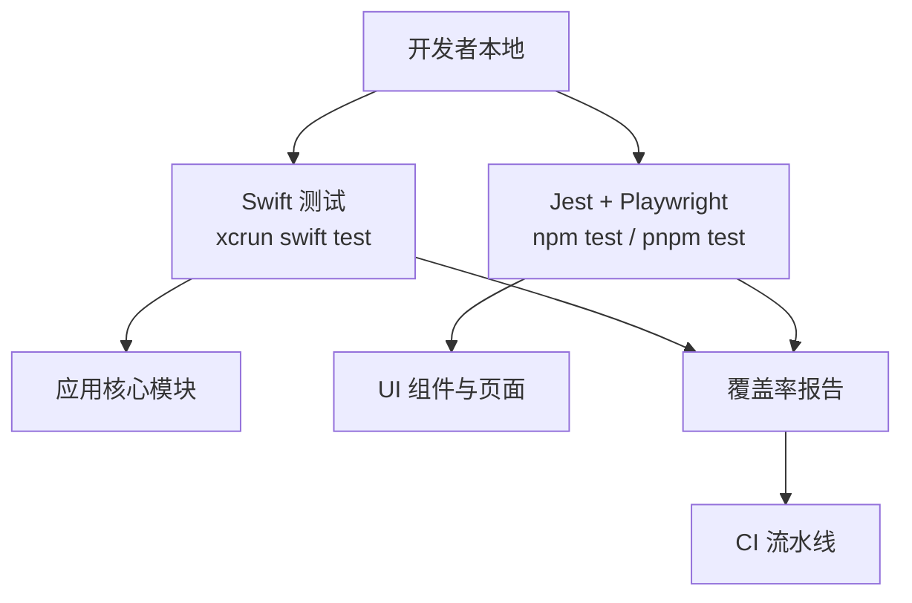
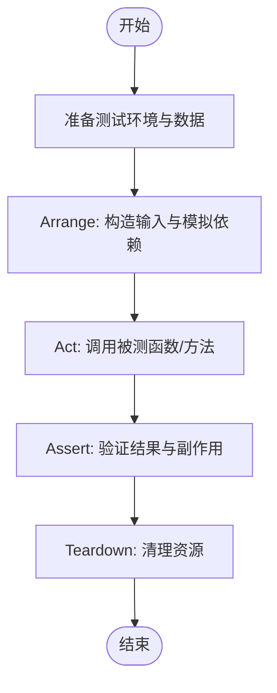
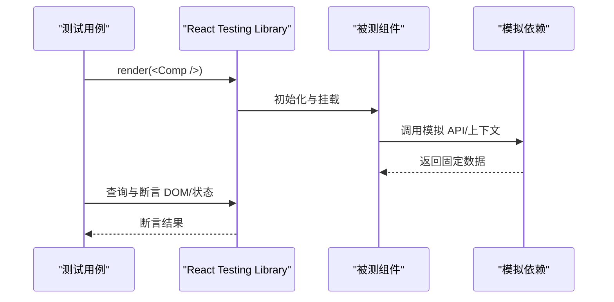
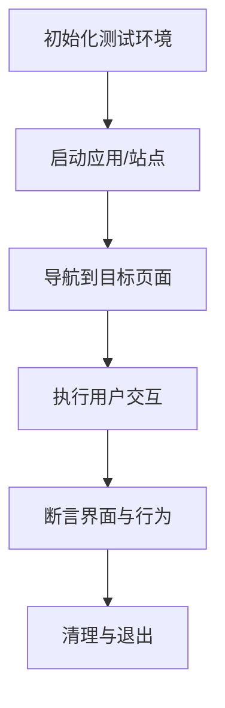
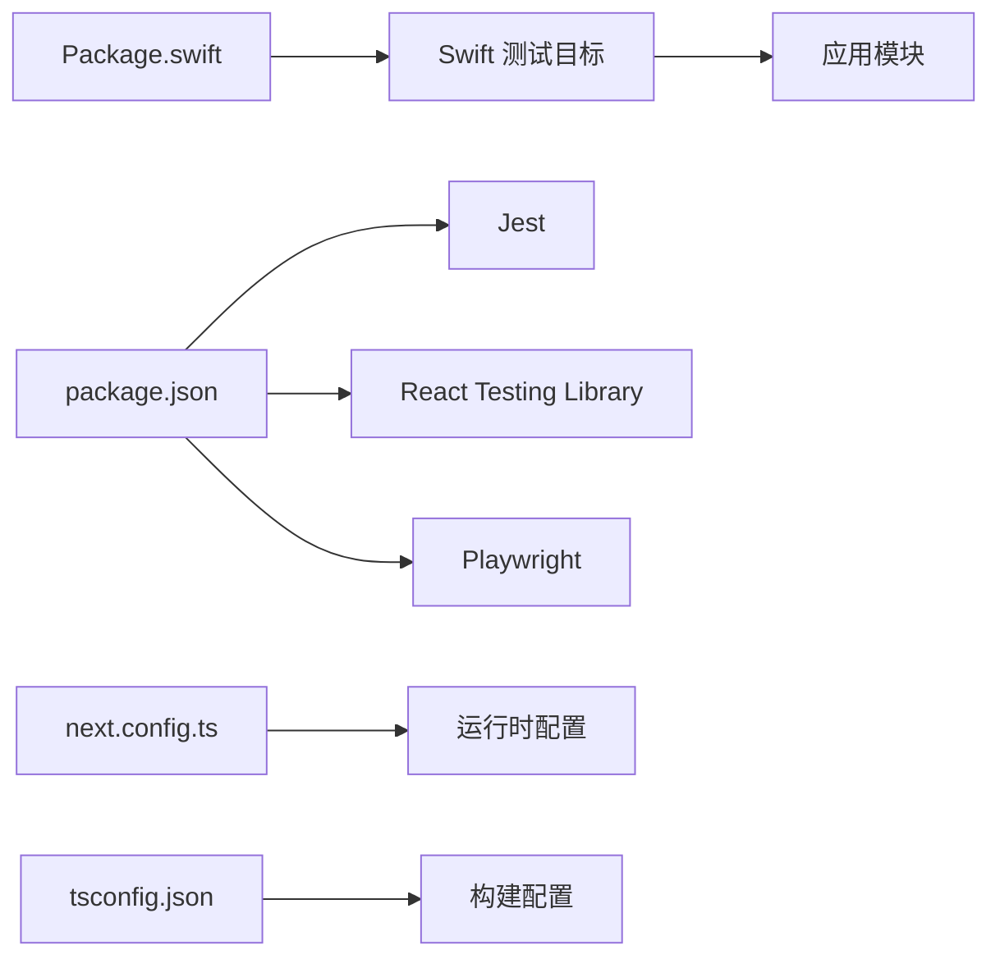

# 测试指南

<cite>
**本文引用的文件**   
- [Package.swift](file://app/Tomo/Package.swift)
- [TomoTests.swift](file://app/Tomo/Tests/TomoTests/TomoTests.swift)
- [package.json](file://app/landing/package.json)
- [next.config.ts](file://app/landing/next.config.ts)
- [tsconfig.json](file://app/landing/tsconfig.json)
- [README.md](file://README.md)
</cite>

## 目录
1. [简介](#简介)
2. [项目结构](#项目结构)
3. [核心组件](#核心组件)
4. [架构总览](#架构总览)
5. [详细组件分析](#详细组件分析)
6. [依赖分析](#依赖分析)
7. [性能考虑](#性能考虑)
8. [故障排查指南](#故障排查指南)
9. [结论](#结论)
10. [附录](#附录)

## 简介
本指南面向 Tomo 项目的开发与维护者，提供覆盖单元测试、集成测试与 UI 测试的完整策略与实现方法。文档基于仓库中现有的 Swift Package 测试结构与 Next.js 前端工程配置，给出：
- 测试框架使用方式与用例编写规范
- 模拟对象、测试数据与测试环境配置
- 覆盖率要求与持续集成中的自动化测试流程
- 常见测试场景示例与调试技巧

目标是在不侵入业务代码的前提下，建立稳定、可重复、可扩展的测试体系，确保应用质量与交付效率。

## 项目结构
本项目包含两个主要子系统：
- macOS 应用（Swift Package）：位于 app/Tomo，包含应用源码与 Xcode/SwiftPM 测试目标
- 着陆页网站（Next.js）：位于 app/landing，包含前端页面与组件

图表来源
- [Package.swift](file://app/Tomo/Package.swift)
- [package.json](file://app/landing/package.json)
- [next.config.ts](file://app/landing/next.config.ts)
- [tsconfig.json](file://app/landing/tsconfig.json)

章节来源
- [Package.swift](file://app/Tomo/Package.swift)
- [package.json](file://app/landing/package.json)
- [next.config.ts](file://app/landing/next.config.ts)
- [tsconfig.json](file://app/landing/tsconfig.json)

## 核心组件
- Swift 测试目标
  - 通过 Swift Package 管理测试目标，便于在 CI 中执行 xcrun swift test
  - 测试入口与样例位于 Tests/TomoTests/TomoTests.swift
- Next.js 前端工程
  - 使用 npm/pnpm 脚本驱动构建与测试
  - 通过 next.config.ts 与 tsconfig.json 控制编译与运行行为

章节来源
- [TomoTests.swift](file://app/Tomo/Tests/TomoTests/TomoTests.swift)
- [package.json](file://app/landing/package.json)
- [next.config.ts](file://app/landing/next.config.ts)
- [tsconfig.json](file://app/landing/tsconfig.json)

## 架构总览
下图展示测试在整体系统中的位置与交互关系：Swift 测试直接调用应用模块进行单元与集成验证；Next.js 测试覆盖组件与页面逻辑；CI 阶段统一执行两类测试并收集覆盖率。

图表来源
- [Package.swift](file://app/Tomo/Package.swift)
- [package.json](file://app/landing/package.json)

## 详细组件分析

### Swift 测试（单元测试与轻量集成测试）
- 框架与工具链
  - 使用 Swift Testing 或 XCTest（依据包定义），通过 SwiftPM 组织测试目标
  - 推荐优先采用 Swift Testing 的新特性（如异步断言、结构化日志）
- 测试目标与入口
  - 测试目标由 Package.swift 声明，测试类与用例位于 Tests/TomoTests/TomoTests.swift
- 用例编写规范
  - 每个测试聚焦单一职责，命名清晰表达意图（例如 should_... when_...）
  - 对 I/O、网络、文件系统与时间等外部依赖使用模拟或桩
  - 使用 Given-When-Then 结构组织测试步骤
- 模拟对象与测试数据
  - 为服务接口定义协议，测试中使用内存实现或伪造对象
  - 将固定测试数据放入资源文件或常量，避免硬编码到用例中
- 异步与并发
  - 对异步 API 使用 await/async 模式，设置合理的超时与重试边界
- 覆盖率与质量门禁
  - 启用 --coverage 生成覆盖率报告，设定最低阈值（建议 ≥ 80%）
  - 在 PR 中强制检查覆盖率变化，防止回退

章节来源
- [Package.swift](file://app/Tomo/Package.swift)
- [TomoTests.swift](file://app/Tomo/Tests/TomoTests/TomoTests.swift)

### Next.js 测试（组件与页面测试）
- 框架选择
  - 推荐使用 Jest 作为测试运行器，结合 React Testing Library 进行组件渲染与交互断言
  - UI 测试可使用 Playwright 或 Cypress 进行端到端流程验证
- 测试分层
  - 单元测试：组件纯逻辑、工具函数、状态机
  - 集成测试：组件组合、路由跳转、服务端渲染行为
  - UI 测试：关键用户路径（下载、主题切换、导航）
- 模拟与数据
  - 使用 jest.mock 模拟第三方库与 API
  - 使用 fixtures 管理测试数据，保证可重复性
- 覆盖率与门禁
  - 通过 Jest 的 coverage 选项输出报告，设定阈值（建议 ≥ 80%）
  - 在 CI 中阻断覆盖率低于阈值的提交

章节来源
- [package.json](file://app/landing/package.json)
- [next.config.ts](file://app/landing/next.config.ts)
- [tsconfig.json](file://app/landing/tsconfig.json)

### UI 测试（端到端）
- 工具与策略
  - 使用 Playwright 或 Cypress 编写跨浏览器/平台的端到端用例
  - 针对关键用户旅程（首页加载、下载按钮、主题切换、菜单预览）编写稳定用例
- 环境配置
  - 使用环境变量区分测试环境（如 API 基地址、Feature Flags）
  - 启动本地开发服务器或预构建产物供测试访问
- 稳定性与可维护性
  - 使用语义化选择器（data-testid、ARIA）提升稳定性
  - 将公共操作封装为 Page Object，减少重复与维护成本

[本节为概念性说明，未直接分析具体文件]

## 依赖分析
- Swift 测试依赖
  - 通过 Package.swift 声明测试目标与依赖，确保测试与生产代码解耦
  - 使用协议与依赖注入降低耦合度，便于替换真实实现为测试替身
- Next.js 测试依赖
  - package.json 中定义测试脚本与依赖（如 jest、@testing-library/react、playwright）
  - next.config.ts 与 tsconfig.json 影响编译与运行时行为，需确保测试环境一致

图表来源
- [Package.swift](file://app/Tomo/Package.swift)
- [package.json](file://app/landing/package.json)
- [next.config.ts](file://app/landing/next.config.ts)
- [tsconfig.json](file://app/landing/tsconfig.json)

章节来源
- [Package.swift](file://app/Tomo/Package.swift)
- [package.json](file://app/landing/package.json)
- [next.config.ts](file://app/landing/next.config.ts)
- [tsconfig.json](file://app/landing/tsconfig.json)

## 性能考虑
- 测试数据规模
  - 单元测试使用最小数据集，避免大对象与复杂图结构
  - 集成测试按需构造必要数据，避免全量导入
- I/O 与网络
  - 所有外部 I/O 必须被模拟或桩，禁止在单元测试中发起真实请求
  - 对超时与重试进行边界测试，确保失败路径快速失败
- 并行与缓存
  - 利用 SwiftPM 与 Jest 的并行能力加速执行
  - 合理划分测试套件，避免共享状态导致的竞争条件

[本节为通用指导，未直接分析具体文件]

## 故障排查指南
- Swift 测试常见问题
  - 找不到模块或符号：检查 Package.swift 的 target 与 import 路径
  - 异步测试挂起：确认 await/timeout 设置与事件循环
  - 覆盖率报告为空：确认 --coverage 参数与工具链版本
- Next.js 测试常见问题
  - 组件渲染失败：检查依赖 mock 是否完整，环境变量是否正确
  - 路由相关错误：确保 next.config.ts 与测试环境一致
  - 覆盖率统计异常：核对 jest.config 与 babel/TS 转换配置
- 调试技巧
  - 使用 Xcode 的测试运行器与断点调试 Swift 测试
  - 在 Jest 中启用 verbose 与 source map，定位失败用例
  - 对 UI 测试录制回放，逐步缩小问题范围

章节来源
- [Package.swift](file://app/Tomo/Package.swift)
- [package.json](file://app/landing/package.json)
- [next.config.ts](file://app/landing/next.config.ts)
- [tsconfig.json](file://app/landing/tsconfig.json)

## 结论
通过在本项目中建立清晰的测试分层（单元、集成、UI）、统一的模拟与数据管理策略、以及严格的覆盖率与 CI 门禁，可以显著提升代码质量与交付效率。建议在后续迭代中持续完善测试用例与自动化流程，确保测试体系与应用演进同步。

[本节为总结性内容，未直接分析具体文件]

## 附录
- 覆盖率目标建议
  - 行覆盖率 ≥ 80%，分支覆盖率 ≥ 70%
  - 新增代码必须达到目标，历史代码逐步提升
- 持续集成流程建议
  - 安装依赖 → 构建 → 运行 Swift 测试 → 运行 Jest/Playwright 测试 → 生成覆盖率 → 门禁检查
- 参考文档
  - 项目 README 与包配置可作为进一步参考

章节来源
- [README.md](file://README.md)
- [Package.swift](file://app/Tomo/Package.swift)
- [package.json](file://app/landing/package.json)