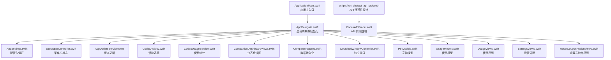
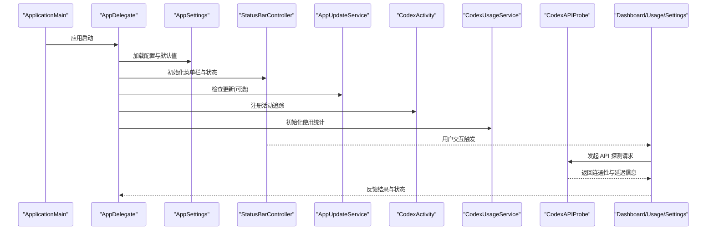
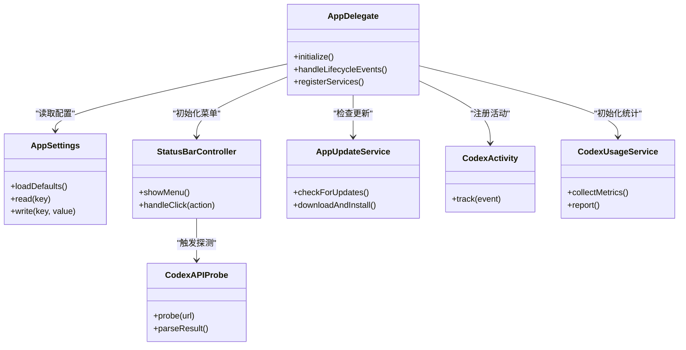

# 调试与故障排除

<cite>
**本文引用的文件**   
- [README.md](file://README.md)
- [PROJECT.md](file://PROJECT.md)
- [app/Tomo/Sources/Tomo/AppDelegate.swift](file://app/Tomo/Sources/Tomo/AppDelegate.swift)
- [app/Tomo/Sources/Tomo/AppSettings.swift](file://app/Tomo/Sources/Tomo/AppSettings.swift)
- [app/Tomo/Sources/Tomo/AppUpdateService.swift](file://app/Tomo/Sources/Tomo/AppUpdateService.swift)
- [app/Tomo/Sources/Tomo/ApplicationMain.swift](file://app/Tomo/Sources/Tomo/ApplicationMain.swift)
- [app/Tomo/Sources/Tomo/CodexAPIProbe.swift](file://app/Tomo/Sources/Tomo/CodexAPIProbe.swift)
- [app/Tomo/Sources/Tomo/CodexActivity.swift](file://app/Tomo/Sources/Tomo/CodexActivity.swift)
- [app/Tomo/Sources/Tomo/CodexUsageService.swift](file://app/Tomo/Sources/Tomo/CodexUsageService.swift)
- [app/Tomo/Sources/Tomo/CompanionDashboardViews.swift](file://app/Tomo/Sources/Tomo/CompanionDashboardViews.swift)
- [app/Tomo/Sources/Tomo/CompanionStores.swift](file://app/Tomo/Sources/Tomo/CompanionStores.swift)
- [app/Tomo/Sources/Tomo/DetachedWindowController.swift](file://app/Tomo/Sources/Tomo/DetachedWindowController.swift)
- [app/Tomo/Sources/Tomo/PetModels.swift](file://app/Tomo/Sources/Tomo/PetModels.swift)
- [app/Tomo/Sources/Tomo/ResetCouponFusionViews.swift](file://app/Tomo/Sources/Tomo/ResetCouponFusionViews.swift)
- [app/Tomo/Sources/Tomo/SettingsViews.swift](file://app/Tomo/Sources/Tomo/SettingsViews.swift)
- [app/Tomo/Sources/Tomo/StatusBarController.swift](file://app/Tomo/Sources/Tomo/StatusBarController.swift)
- [app/Tomo/Sources/Tomo/UsageModels.swift](file://app/Tomo/Sources/Tomo/UsageModels.swift)
- [app/Tomo/Sources/Tomo/UsageViews.swift](file://app/Tomo/Sources/Tomo/UsageViews.swift)
- [app/Tomo/scripts/run_chatgpt_api_probe.sh](file://app/Tomo/scripts/run_chatgpt_api_probe.sh)
- [app/Tomo/package_app.sh](file://app/Tomo/package_app.sh)
- [app/Tomo/rebuild_and_run.sh](file://app/Tomo/rebuild_and_run.sh)
- [app/Tomo/release_app.sh](file://app/Tomo/release_app.sh)
</cite>

## 目录
1. [简介](#简介)
2. [项目结构](#项目结构)
3. [核心组件](#核心组件)
4. [架构总览](#架构总览)
5. [详细组件分析](#详细组件分析)
6. [依赖关系分析](#依赖关系分析)
7. [性能考虑](#性能考虑)
8. [故障排除指南](#故障排除指南)
9. [结论](#结论)
10. [附录](#附录)

## 简介
本指南面向使用 Xcode 调试 macOS 应用 Tomo 的开发者，聚焦以下目标：
- 掌握 Xcode 调试器技巧：断点、变量检查、日志输出、崩溃堆栈分析。
- 建立可操作的日志记录策略与错误诊断方法。
- 使用 Instruments 进行性能分析与内存泄漏检测。
- 识别并解决常见问题：网络连接问题、API 调用失败、第三方服务集成异常。
- 利用内置脚本与探针工具快速定位问题。
- 提供性能监控与优化建议，提升稳定性与用户体验。

## 项目结构
Tomo 为 macOS 应用，采用 Swift 开发，包含应用入口、设置、状态栏、更新服务、API 探测与使用统计等模块；同时提供构建与运行脚本以及 API 探测 Shell 脚本，便于本地调试与网络连通性验证。

图表来源
- [app/Tomo/Sources/Tomo/ApplicationMain.swift](file://app/Tomo/Sources/Tomo/ApplicationMain.swift)
- [app/Tomo/Sources/Tomo/AppDelegate.swift](file://app/Tomo/Sources/Tomo/AppDelegate.swift)
- [app/Tomo/Sources/Tomo/AppSettings.swift](file://app/Tomo/Sources/Tomo/AppSettings.swift)
- [app/Tomo/Sources/Tomo/AppUpdateService.swift](file://app/Tomo/Sources/Tomo/AppUpdateService.swift)
- [app/Tomo/Sources/Tomo/CodexActivity.swift](file://app/Tomo/Sources/Tomo/CodexActivity.swift)
- [app/Tomo/Sources/Tomo/CodexUsageService.swift](file://app/Tomo/Sources/Tomo/CodexUsageService.swift)
- [app/Tomo/Sources/Tomo/CompanionDashboardViews.swift](file://app/Tomo/Sources/Tomo/CompanionDashboardViews.swift)
- [app/Tomo/Sources/Tomo/CompanionStores.swift](file://app/Tomo/Sources/Tomo/CompanionStores.swift)
- [app/Tomo/Sources/Tomo/DetachedWindowController.swift](file://app/Tomo/Sources/Tomo/DetachedWindowController.swift)
- [app/Tomo/Sources/Tomo/PetModels.swift](file://app/Tomo/Sources/Tomo/PetModels.swift)
- [app/Tomo/Sources/Tomo/UsageModels.swift](file://app/Tomo/Sources/Tomo/UsageModels.swift)
- [app/Tomo/Sources/Tomo/UsageViews.swift](file://app/Tomo/Sources/Tomo/UsageViews.swift)
- [app/Tomo/Sources/Tomo/SettingsViews.swift](file://app/Tomo/Sources/Tomo/SettingsViews.swift)
- [app/Tomo/Sources/Tomo/ResetCouponFusionViews.swift](file://app/Tomo/Sources/Tomo/ResetCouponFusionViews.swift)
- [app/Tomo/Sources/Tomo/CodexAPIProbe.swift](file://app/Tomo/Sources/Tomo/CodexAPIProbe.swift)
- [app/Tomo/scripts/run_chatgpt_api_probe.sh](file://app/Tomo/scripts/run_chatgpt_api_probe.sh)

章节来源
- [README.md](file://README.md)
- [PROJECT.md](file://PROJECT.md)

## 核心组件
- 应用入口与生命周期
  - ApplicationMain：应用启动入口，负责初始化运行时环境。
  - AppDelegate：处理应用生命周期事件（启动、前台/后台切换、退出），集中注册菜单、状态栏、通知与全局配置。
- 配置与设置
  - AppSettings：集中管理用户偏好与应用配置，支持读写与默认值回退。
  - SettingsViews：提供设置界面，允许用户调整关键参数（如 API 端点、超时、重试次数）。
- 状态栏与 UI
  - StatusBarController：维护菜单栏图标与菜单项，响应点击事件，触发主要操作。
  - CompanionDashboardViews / UsageViews / ResetCouponFusionViews：展示仪表盘、使用统计与重置券相关界面。
  - DetachedWindowController：管理独立窗口生命周期与布局。
- 业务服务
  - AppUpdateService：检查并安装应用更新，处理下载与校验流程。
  - CodexActivity：封装活动追踪与事件上报。
  - CodexUsageService：收集与上报使用指标，辅助性能与体验分析。
  - CodexAPIProbe：执行 API 连通性探测，返回结果供诊断与界面展示。
- 数据模型
  - PetModels / UsageModels：定义领域数据结构与序列化格式。
- 脚本与工具
  - rebuild_and_run.sh / package_app.sh / release_app.sh：构建、打包与发布流程自动化。
  - run_chatgpt_api_probe.sh：通过命令行对第三方 API 进行连通性与延迟测试。

章节来源
- [app/Tomo/Sources/Tomo/ApplicationMain.swift](file://app/Tomo/Sources/Tomo/ApplicationMain.swift)
- [app/Tomo/Sources/Tomo/AppDelegate.swift](file://app/Tomo/Sources/Tomo/AppDelegate.swift)
- [app/Tomo/Sources/Tomo/AppSettings.swift](file://app/Tomo/Sources/Tomo/AppSettings.swift)
- [app/Tomo/Sources/Tomo/SettingsViews.swift](file://app/Tomo/Sources/Tomo/SettingsViews.swift)
- [app/Tomo/Sources/Tomo/StatusBarController.swift](file://app/Tomo/Sources/Tomo/StatusBarController.swift)
- [app/Tomo/Sources/Tomo/CompanionDashboardViews.swift](file://app/Tomo/Sources/Tomo/CompanionDashboardViews.swift)
- [app/Tomo/Sources/Tomo/UsageViews.swift](file://app/Tomo/Sources/Tomo/UsageViews.swift)
- [app/Tomo/Sources/Tomo/ResetCouponFusionViews.swift](file://app/Tomo/Sources/Tomo/ResetCouponFusionViews.swift)
- [app/Tomo/Sources/Tomo/DetachedWindowController.swift](file://app/Tomo/Sources/Tomo/DetachedWindowController.swift)
- [app/Tomo/Sources/Tomo/AppUpdateService.swift](file://app/Tomo/Sources/Tomo/AppUpdateService.swift)
- [app/Tomo/Sources/Tomo/CodexActivity.swift](file://app/Tomo/Sources/Tomo/CodexActivity.swift)
- [app/Tomo/Sources/Tomo/CodexUsageService.swift](file://app/Tomo/Sources/Tomo/CodexUsageService.swift)
- [app/Tomo/Sources/Tomo/CodexAPIProbe.swift](file://app/Tomo/Sources/Tomo/CodexAPIProbe.swift)
- [app/Tomo/Sources/Tomo/PetModels.swift](file://app/Tomo/Sources/Tomo/PetModels.swift)
- [app/Tomo/Sources/Tomo/UsageModels.swift](file://app/Tomo/Sources/Tomo/UsageModels.swift)
- [app/Tomo/rebuild_and_run.sh](file://app/Tomo/rebuild_and_run.sh)
- [app/Tomo/package_app.sh](file://app/Tomo/package_app.sh)
- [app/Tomo/release_app.sh](file://app/Tomo/release_app.sh)
- [app/Tomo/scripts/run_chatgpt_api_probe.sh](file://app/Tomo/scripts/run_chatgpt_api_probe.sh)

## 架构总览
下图展示了应用启动后，各核心模块之间的交互关系与数据流向，便于理解调试切入点与错误传播路径。

图表来源
- [app/Tomo/Sources/Tomo/ApplicationMain.swift](file://app/Tomo/Sources/Tomo/ApplicationMain.swift)
- [app/Tomo/Sources/Tomo/AppDelegate.swift](file://app/Tomo/Sources/Tomo/AppDelegate.swift)
- [app/Tomo/Sources/Tomo/AppSettings.swift](file://app/Tomo/Sources/Tomo/AppSettings.swift)
- [app/Tomo/Sources/Tomo/StatusBarController.swift](file://app/Tomo/Sources/Tomo/StatusBarController.swift)
- [app/Tomo/Sources/Tomo/AppUpdateService.swift](file://app/Tomo/Sources/Tomo/AppUpdateService.swift)
- [app/Tomo/Sources/Tomo/CodexActivity.swift](file://app/Tomo/Sources/Tomo/CodexActivity.swift)
- [app/Tomo/Sources/Tomo/CodexUsageService.swift](file://app/Tomo/Sources/Tomo/CodexUsageService.swift)
- [app/Tomo/Sources/Tomo/CodexAPIProbe.swift](file://app/Tomo/Sources/Tomo/CodexAPIProbe.swift)
- [app/Tomo/Sources/Tomo/CompanionDashboardViews.swift](file://app/Tomo/Sources/Tomo/CompanionDashboardViews.swift)
- [app/Tomo/Sources/Tomo/UsageViews.swift](file://app/Tomo/Sources/Tomo/UsageViews.swift)
- [app/Tomo/Sources/Tomo/SettingsViews.swift](file://app/Tomo/Sources/Tomo/SettingsViews.swift)

## 详细组件分析

### 应用入口与生命周期（ApplicationMain、AppDelegate）
- 职责
  - ApplicationMain：创建应用实例，注入必要上下文，确保运行环境就绪。
  - AppDelegate：监听生命周期事件，完成菜单、状态栏、通知、全局配置的初始化；在后台/前台切换时恢复或暂停任务。
- 调试要点
  - 在启动阶段设置断点，观察配置加载顺序与异常抛出位置。
  - 使用 Xcode 控制台输出关键初始化步骤，确认依赖是否可用。
  - 捕获未处理异常，生成崩溃报告以便后续分析。

章节来源
- [app/Tomo/Sources/Tomo/ApplicationMain.swift](file://app/Tomo/Sources/Tomo/ApplicationMain.swift)
- [app/Tomo/Sources/Tomo/AppDelegate.swift](file://app/Tomo/Sources/Tomo/AppDelegate.swift)

### 配置与设置（AppSettings、SettingsViews）
- 职责
  - AppSettings：集中管理用户偏好（如 API 地址、超时、重试策略），提供安全读写接口。
  - SettingsViews：提供可视化设置界面，实时生效或重启后生效。
- 调试要点
  - 在读取/写入配置处设置条件断点，验证默认值与用户覆盖是否正确。
  - 针对无效输入与边界值进行测试，确保健壮性。
  - 将关键配置变更记录到日志，便于回溯。

章节来源
- [app/Tomo/Sources/Tomo/AppSettings.swift](file://app/Tomo/Sources/Tomo/AppSettings.swift)
- [app/Tomo/Sources/Tomo/SettingsViews.swift](file://app/Tomo/Sources/Tomo/SettingsViews.swift)

### 状态栏与 UI（StatusBarController、CompanionDashboardViews、UsageViews、ResetCouponFusionViews、DetachedWindowController）
- 职责
  - StatusBarController：维护菜单栏图标与菜单项，响应用户操作，触发相应服务。
  - 各类视图：展示仪表盘、使用统计、重置券融合等界面，接收用户输入并调用服务层。
  - DetachedWindowController：管理独立窗口的显示、隐藏与生命周期。
- 调试要点
  - 在 UI 事件回调中设置断点，跟踪用户交互链路。
  - 使用 View Debugger 检查视图层级与布局问题。
  - 针对窗口显示异常，检查控制器生命周期与父级关系。

章节来源
- [app/Tomo/Sources/Tomo/StatusBarController.swift](file://app/Tomo/Sources/Tomo/StatusBarController.swift)
- [app/Tomo/Sources/Tomo/CompanionDashboardViews.swift](file://app/Tomo/Sources/Tomo/CompanionDashboardViews.swift)
- [app/Tomo/Sources/Tomo/UsageViews.swift](file://app/Tomo/Sources/Tomo/UsageViews.swift)
- [app/Tomo/Sources/Tomo/ResetCouponFusionViews.swift](file://app/Tomo/Sources/Tomo/ResetCouponFusionViews.swift)
- [app/Tomo/Sources/Tomo/DetachedWindowController.swift](file://app/Tomo/Sources/Tomo/DetachedWindowController.swift)

### 业务服务（AppUpdateService、CodexActivity、CodexUsageService、CodexAPIProbe）
- 职责
  - AppUpdateService：检查新版本、下载与校验，处理失败重试与回滚。
  - CodexActivity：记录用户活动与事件，用于行为分析。
  - CodexUsageService：采集使用指标，辅助性能与体验评估。
  - CodexAPIProbe：执行 API 连通性探测，返回延迟、状态码与错误信息。
- 调试要点
  - 在服务层添加结构化日志，记录请求/响应、耗时与错误码。
  - 使用网络调试器（如 Charles、Proxyman）抓包分析 HTTP 流量。
  - 针对更新失败场景，检查签名校验、权限与磁盘空间。

章节来源
- [app/Tomo/Sources/Tomo/AppUpdateService.swift](file://app/Tomo/Sources/Tomo/AppUpdateService.swift)
- [app/Tomo/Sources/Tomo/CodexActivity.swift](file://app/Tomo/Sources/Tomo/CodexActivity.swift)
- [app/Tomo/Sources/Tomo/CodexUsageService.swift](file://app/Tomo/Sources/Tomo/CodexUsageService.swift)
- [app/Tomo/Sources/Tomo/CodexAPIProbe.swift](file://app/Tomo/Sources/Tomo/CodexAPIProbe.swift)

### 数据模型（PetModels、UsageModels）
- 职责
  - 定义领域数据结构，支持序列化与反序列化，保证数据一致性。
- 调试要点
  - 在解析 JSON 或存储前后设置断点，验证字段映射与类型转换。
  - 针对空值与非法数据增加防御性检查与降级策略。

章节来源
- [app/Tomo/Sources/Tomo/PetModels.swift](file://app/Tomo/Sources/Tomo/PetModels.swift)
- [app/Tomo/Sources/Tomo/UsageModels.swift](file://app/Tomo/Sources/Tomo/UsageModels.swift)

### 脚本与工具（rebuild_and_run.sh、package_app.sh、release_app.sh、run_chatgpt_api_probe.sh）
- 职责
  - 自动化构建、打包与发布流程，减少人为错误。
  - 提供 API 连通性探测脚本，快速验证第三方服务可达性与延迟。
- 调试要点
  - 在执行脚本时启用详细输出，定位构建或网络问题。
  - 结合系统代理与防火墙规则，排查连接失败原因。

章节来源
- [app/Tomo/rebuild_and_run.sh](file://app/Tomo/rebuild_and_run.sh)
- [app/Tomo/package_app.sh](file://app/Tomo/package_app.sh)
- [app/Tomo/release_app.sh](file://app/Tomo/release_app.sh)
- [app/Tomo/scripts/run_chatgpt_api_probe.sh](file://app/Tomo/scripts/run_chatgpt_api_probe.sh)

## 依赖关系分析
- 内部依赖
  - AppDelegate 依赖 AppSettings、StatusBarController、AppUpdateService、CodexActivity、CodexUsageService 等模块，形成松耦合的服务组合。
  - UI 层通过控制器与服务层交互，避免直接访问底层实现。
- 外部依赖
  - 网络请求依赖系统 URLSession 或第三方库（根据实际实现）。
  - 第三方 API（如 ChatGPT）通过探针脚本与代码层共同验证连通性。
- 潜在循环依赖
  - 应避免 UI 与服务层双向引用，使用协议或回调解耦。

图表来源
- [app/Tomo/Sources/Tomo/AppDelegate.swift](file://app/Tomo/Sources/Tomo/AppDelegate.swift)
- [app/Tomo/Sources/Tomo/AppSettings.swift](file://app/Tomo/Sources/Tomo/AppSettings.swift)
- [app/Tomo/Sources/Tomo/StatusBarController.swift](file://app/Tomo/Sources/Tomo/StatusBarController.swift)
- [app/Tomo/Sources/Tomo/AppUpdateService.swift](file://app/Tomo/Sources/Tomo/AppUpdateService.swift)
- [app/Tomo/Sources/Tomo/CodexActivity.swift](file://app/Tomo/Sources/Tomo/CodexActivity.swift)
- [app/Tomo/Sources/Tomo/CodexUsageService.swift](file://app/Tomo/Sources/Tomo/CodexUsageService.swift)
- [app/Tomo/Sources/Tomo/CodexAPIProbe.swift](file://app/Tomo/Sources/Tomo/CodexAPIProbe.swift)

章节来源
- [app/Tomo/Sources/Tomo/AppDelegate.swift](file://app/Tomo/Sources/Tomo/AppDelegate.swift)
- [app/Tomo/Sources/Tomo/AppSettings.swift](file://app/Tomo/Sources/Tomo/AppSettings.swift)
- [app/Tomo/Sources/Tomo/StatusBarController.swift](file://app/Tomo/Sources/Tomo/StatusBarController.swift)
- [app/Tomo/Sources/Tomo/AppUpdateService.swift](file://app/Tomo/Sources/Tomo/AppUpdateService.swift)
- [app/Tomo/Sources/Tomo/CodexActivity.swift](file://app/Tomo/Sources/Tomo/CodexActivity.swift)
- [app/Tomo/Sources/Tomo/CodexUsageService.swift](file://app/Tomo/Sources/Tomo/CodexUsageService.swift)
- [app/Tomo/Sources/Tomo/CodexAPIProbe.swift](file://app/Tomo/Sources/Tomo/CodexAPIProbe.swift)

## 性能考虑
- 启动时间优化
  - 延迟非关键初始化，优先渲染 UI。
  - 减少主线程阻塞，使用异步任务处理网络与 IO。
- 内存管理
  - 避免循环引用，使用弱引用持有观察者或回调。
  - 及时释放大对象与缓存，防止内存峰值过高。
- 网络与 I/O
  - 合理设置超时与重试策略，避免频繁失败导致资源耗尽。
  - 使用连接池与并发控制，限制并发请求数量。
- 监控与分析
  - 使用 Instruments 的 Time Profiler、Allocations、Leaks 等工具定位热点与泄漏。
  - 结合自定义埋点与使用统计，持续优化关键路径。

[本节为通用指导，不直接分析具体文件]

## 故障排除指南

### Xcode 调试器使用技巧
- 断点设置
  - 行断点：在关键函数入口与分支处设置，观察执行路径。
  - 条件断点：基于变量或表达式过滤，减少无关中断。
  - 异常断点：捕获所有 Objective-C 与 Swift 异常，快速定位崩溃点。
- 变量检查
  - 在断点处查看变量值、调用栈与内存地址。
  - 使用“打印描述”与“表达式求值”动态验证假设。
- 日志输出
  - 使用 OSLog 或自定义日志框架，按级别输出结构化日志。
  - 在 Release 模式下保留关键错误与警告日志。
- 崩溃分析
  - 生成符号化崩溃报告，定位具体文件与行号。
  - 结合设备日志与系统日志，还原崩溃前上下文。

章节来源
- [app/Tomo/Sources/Tomo/AppDelegate.swift](file://app/Tomo/Sources/Tomo/AppDelegate.swift)
- [app/Tomo/Sources/Tomo/AppSettings.swift](file://app/Tomo/Sources/Tomo/AppSettings.swift)
- [app/Tomo/Sources/Tomo/CodexAPIProbe.swift](file://app/Tomo/Sources/Tomo/CodexAPIProbe.swift)

### 日志记录策略与错误诊断
- 日志分层
  - 应用层：用户操作、UI 状态变化。
  - 服务层：网络请求、数据处理、业务逻辑。
  - 系统层：权限、文件系统、网络栈。
- 错误分类
  - 网络错误：超时、DNS 解析失败、证书校验失败。
  - API 错误：状态码、错误码、消息体。
  - 数据错误：解析失败、字段缺失、类型不匹配。
- 诊断方法
  - 使用网络抓包工具验证请求与响应。
  - 开启详细日志并复现问题，提取关键上下文。
  - 结合崩溃报告与设备日志，缩小问题范围。

章节来源
- [app/Tomo/Sources/Tomo/CodexUsageService.swift](file://app/Tomo/Sources/Tomo/CodexUsageService.swift)
- [app/Tomo/Sources/Tomo/CodexActivity.swift](file://app/Tomo/Sources/Tomo/CodexActivity.swift)
- [app/Tomo/Sources/Tomo/CodexAPIProbe.swift](file://app/Tomo/Sources/Tomo/CodexAPIProbe.swift)

### 性能分析工具与内存泄漏检测
- Instruments 使用
  - Time Profiler：识别 CPU 热点与慢函数。
  - Allocations：监控内存分配与释放，定位未释放对象。
  - Leaks：自动检测内存泄漏，提供调用栈与修复建议。
  - Energy Log：分析能耗与唤醒次数，优化电池使用。
- 内存泄漏检测
  - 关注循环引用与强引用持有者。
  - 使用 weak/self 引用打破循环。
  - 定期运行 Leak 扫描，纳入 CI 流程。

章节来源
- [app/Tomo/Sources/Tomo/AppUpdateService.swift](file://app/Tomo/Sources/Tomo/AppUpdateService.swift)
- [app/Tomo/Sources/Tomo/CompanionDashboardViews.swift](file://app/Tomo/Sources/Tomo/CompanionDashboardViews.swift)
- [app/Tomo/Sources/Tomo/UsageViews.swift](file://app/Tomo/Sources/Tomo/UsageViews.swift)

### 常见问题识别与解决方案
- 网络连接问题
  - 现象：请求超时、DNS 解析失败、SSL 握手失败。
  - 排查：检查代理与防火墙设置，验证证书链与域名解析。
  - 解决：配置正确代理、更新根证书、增加重试与退避策略。
- API 调用失败
  - 现象：HTTP 状态码非 2xx、错误码提示鉴权失败或限流。
  - 排查：核对请求头、签名、参数与速率限制。
  - 解决：修正认证信息、调整请求频率、增加错误码映射与重试。
- 内存泄漏检测
  - 现象：内存持续增长、应用卡顿或崩溃。
  - 排查：使用 Leaks 与 Allocations 定位未释放对象。
  - 解决：解除循环引用、及时释放缓存与定时器。

章节来源
- [app/Tomo/Sources/Tomo/CodexAPIProbe.swift](file://app/Tomo/Sources/Tomo/CodexAPIProbe.swift)
- [app/Tomo/Sources/Tomo/AppSettings.swift](file://app/Tomo/Sources/Tomo/AppSettings.swift)
- [app/Tomo/Sources/Tomo/AppUpdateService.swift](file://app/Tomo/Sources/Tomo/AppUpdateService.swift)

### 调试脚本使用方法
- rebuild_and_run.sh
  - 用途：清理构建缓存、编译并运行应用。
  - 用法：在终端执行脚本，观察构建输出与启动日志。
- package_app.sh / release_app.sh
  - 用途：打包应用与准备发布产物。
  - 用法：执行脚本并检查签名与资源完整性。
- run_chatgpt_api_probe.sh
  - 用途：对第三方 API 进行连通性与延迟测试。
  - 用法：传入目标 URL 与参数，输出状态码、延迟与错误信息。

章节来源
- [app/Tomo/rebuild_and_run.sh](file://app/Tomo/rebuild_and_run.sh)
- [app/Tomo/package_app.sh](file://app/Tomo/package_app.sh)
- [app/Tomo/release_app.sh](file://app/Tomo/release_app.sh)
- [app/Tomo/scripts/run_chatgpt_api_probe.sh](file://app/Tomo/scripts/run_chatgpt_api_probe.sh)

### 第三方服务集成问题排查
- 认证与授权
  - 检查 API Key、Token 与签名算法是否正确。
  - 验证令牌有效期与刷新机制。
- 网络与安全
  - 确认代理设置与证书信任链。
  - 禁用不必要的中间人代理以排除干扰。
- 限流与错误处理
  - 实现指数退避与重试策略。
  - 记录错误码与消息，便于服务端联调。

章节来源
- [app/Tomo/Sources/Tomo/CodexAPIProbe.swift](file://app/Tomo/Sources/Tomo/CodexAPIProbe.swift)
- [app/Tomo/Sources/Tomo/AppSettings.swift](file://app/Tomo/Sources/Tomo/AppSettings.swift)
- [app/Tomo/scripts/run_chatgpt_api_probe.sh](file://app/Tomo/scripts/run_chatgpt_api_probe.sh)

## 结论
通过系统化使用 Xcode 调试器、建立清晰的日志策略、结合 Instruments 进行性能分析，并利用内置脚本与探针工具快速定位问题，可以显著提升 Tomo 的稳定性与可维护性。建议在团队内推广上述实践，并将关键调试流程纳入自动化测试与发布流水线，确保问题早发现、早解决。

[本节为总结性内容，不直接分析具体文件]

## 附录
- 常用命令与快捷键
  - 条件断点：右键断点 -> 编辑断点 -> 添加条件。
  - 异常断点：Xcode -> Debug -> Always Show Exception Breakpoints。
  - 打印变量：在控制台输入变量名或使用 po 命令。
- 推荐工具
  - 网络抓包：Charles、Proxyman。
  - 性能分析：Instruments（Time Profiler、Allocations、Leaks）。
  - 日志聚合：统一日志框架与远程日志服务。

[本节为补充信息，不直接分析具体文件]