# 项目结构

<cite>
**本文引用的文件**   
- [Package.swift](file://app/Tomo/Package.swift)
- [ApplicationMain.swift](file://app/Tomo/Sources/Tomo/ApplicationMain.swift)
- [AppDelegate.swift](file://app/Tomo/Sources/Tomo/AppDelegate.swift)
- [AppSettings.swift](file://app/Tomo/Sources/Tomo/AppSettings.swift)
- [AppUpdateService.swift](file://app/Tomo/Sources/Tomo/AppUpdateService.swift)
- [CodexAPIProbe.swift](file://app/Tomo/Sources/Tomo/CodexAPIProbe.swift)
- [CodexActivity.swift](file://app/Tomo/Sources/Tomo/CodexActivity.swift)
- [CodexUsageService.swift](file://app/Tomo/Sources/Tomo/CodexUsageService.swift)
- [CompanionDashboardViews.swift](file://app/Tomo/Sources/Tomo/CompanionDashboardViews.swift)
- [CompanionStores.swift](file://app/Tomo/Sources/Tomo/CompanionStores.swift)
- [DetachedWindowController.swift](file://app/Tomo/Sources/Tomo/DetachedWindowController.swift)
- [PetModels.swift](file://app/Tomo/Sources/Tomo/PetModels.swift)
- [ResetCouponFusionViews.swift](file://app/Tomo/Sources/Tomo/ResetCouponFusionViews.swift)
- [SettingsViews.swift](file://app/Tomo/Sources/Tomo/SettingsViews.swift)
- [StatusBarController.swift](file://app/Tomo/Sources/Tomo/StatusBarController.swift)
- [UsageModels.swift](file://app/Tomo/Sources/Tomo/UsageModels.swift)
- [UsageViews.swift](file://app/Tomo/Sources/Tomo/UsageViews.swift)
- [Info.plist](file://app/Tomo/Resources/Info.plist)
- [pet.json](file://app/Tomo/Resources/Pets/Tomo/pet.json)
- [TomoTests.swift](file://app/Tomo/Tests/TomoTests/TomoTests.swift)
- [run_chatgpt_api_probe.sh](file://app/Tomo/scripts/run_chatgpt_api_probe.sh)
- [package_app.sh](file://app/Tomo/package_app.sh)
- [rebuild_and_run.sh](file://app/Tomo/rebuild_and_run.sh)
- [release_app.sh](file://app/Tomo/release_app.sh)
</cite>

## 目录与代码组织总览
本项目采用“应用 + 着陆页”的双端组织方式：
- app/Tomo：Swift macOS 应用（SPM 包），包含入口、UI、服务、设置、状态栏、使用量统计、宠物模型等。
- app/landing：Next.js 着陆页，用于展示产品与下载信息。
- assets、docker、docs：资源、容器化与文档。

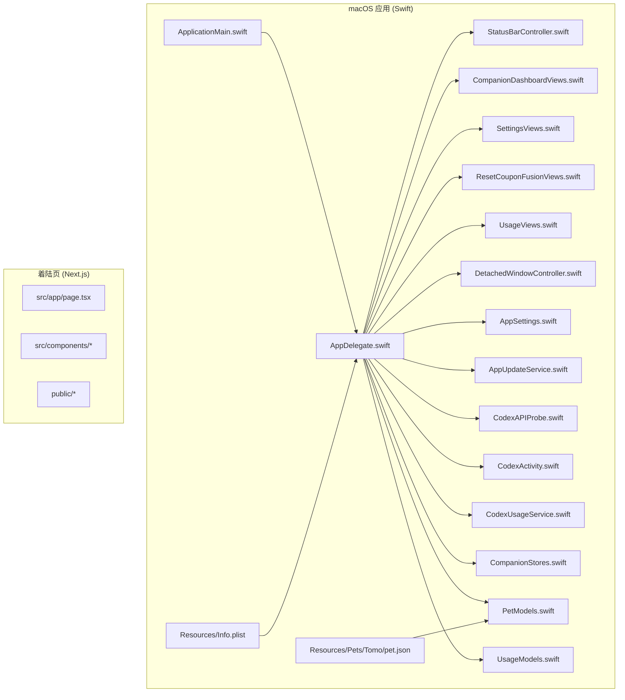

**图表来源** 
- [ApplicationMain.swift](file://app/Tomo/Sources/Tomo/ApplicationMain.swift)
- [AppDelegate.swift](file://app/Tomo/Sources/Tomo/AppDelegate.swift)
- [Info.plist](file://app/Tomo/Resources/Info.plist)
- [pet.json](file://app/Tomo/Resources/Pets/Tomo/pet.json)

**章节来源**
- [Package.swift](file://app/Tomo/Package.swift)

## 核心组件与职责划分
- 应用入口与生命周期
  - ApplicationMain：进程启动与主循环控制。
  - AppDelegate：应用生命周期事件处理、窗口与菜单初始化、全局状态协调。
- UI 层
  - CompanionDashboardViews：伴侣仪表盘视图。
  - SettingsViews：设置界面。
  - ResetCouponFusionViews：重置优惠券融合界面。
  - UsageViews：用量统计界面。
  - DetachedWindowController：独立窗口控制器。
- 服务与业务逻辑
  - AppSettings：应用设置读取与持久化。
  - AppUpdateService：应用更新检查与安装流程。
  - CodexAPIProbe：外部 API 探测与连通性检测。
  - CodexActivity：活动跟踪与事件上报。
  - CodexUsageService：用量统计与聚合。
  - CompanionStores：伴侣数据状态存储与同步。
- 数据模型
  - PetModels：宠物相关数据模型。
  - UsageModels：用量相关数据模型。
- 系统集成
  - StatusBarController：菜单栏状态图标与交互。
- 资源
  - Info.plist：应用元数据与权限声明。
  - pet.json：宠物配置数据。

**章节来源**
- [ApplicationMain.swift](file://app/Tomo/Sources/Tomo/ApplicationMain.swift)
- [AppDelegate.swift](file://app/Tomo/Sources/Tomo/AppDelegate.swift)
- [AppSettings.swift](file://app/Tomo/Sources/Tomo/AppSettings.swift)
- [AppUpdateService.swift](file://app/Tomo/Sources/Tomo/AppUpdateService.swift)
- [CodexAPIProbe.swift](file://app/Tomo/Sources/Tomo/CodexAPIProbe.swift)
- [CodexActivity.swift](file://app/Tomo/Sources/Tomo/CodexActivity.swift)
- [CodexUsageService.swift](file://app/Tomo/Sources/Tomo/CodexUsageService.swift)
- [CompanionDashboardViews.swift](file://app/Tomo/Sources/Tomo/CompanionDashboardViews.swift)
- [CompanionStores.swift](file://app/Tomo/Sources/Tomo/CompanionStores.swift)
- [DetachedWindowController.swift](file://app/Tomo/Sources/Tomo/DetachedWindowController.swift)
- [PetModels.swift](file://app/Tomo/Sources/Tomo/PetModels.swift)
- [ResetCouponFusionViews.swift](file://app/Tomo/Sources/Tomo/ResetCouponFusionViews.swift)
- [SettingsViews.swift](file://app/Tomo/Sources/Tomo/SettingsViews.swift)
- [StatusBarController.swift](file://app/Tomo/Sources/Tomo/StatusBarController.swift)
- [UsageModels.swift](file://app/Tomo/Sources/Tomo/UsageModels.swift)
- [UsageViews.swift](file://app/Tomo/Sources/Tomo/UsageViews.swift)
- [Info.plist](file://app/Tomo/Resources/Info.plist)
- [pet.json](file://app/Tomo/Resources/Pets/Tomo/pet.json)

## 架构总览
应用采用分层架构：
- 表现层（UI）：各种 Views 负责渲染与用户交互。
- 控制器层：AppDelegate、StatusBarController、DetachedWindowController 协调 UI 与系统能力。
- 服务层：AppSettings、AppUpdateService、CodexAPIProbe、CodexActivity、CodexUsageService 提供业务能力。
- 数据层：CompanionStores、PetModels、UsageModels 管理数据与状态。
- 资源层：Info.plist、pet.json 提供静态配置与数据。

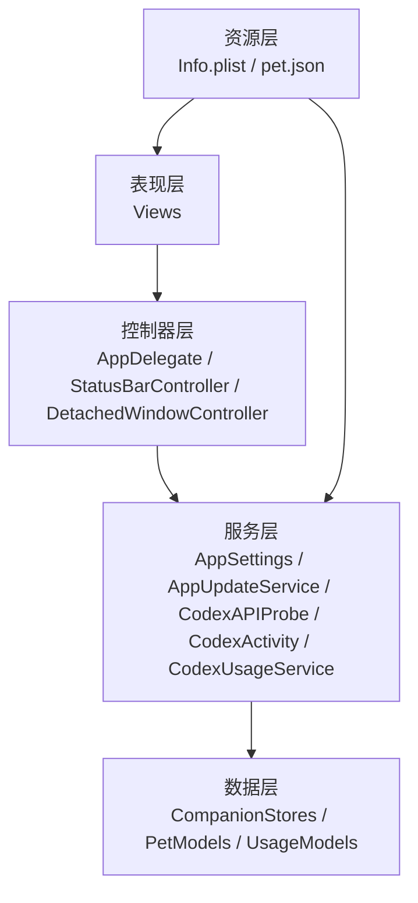

**图表来源** 
- [AppDelegate.swift](file://app/Tomo/Sources/Tomo/AppDelegate.swift)
- [StatusBarController.swift](file://app/Tomo/Sources/Tomo/StatusBarController.swift)
- [DetachedWindowController.swift](file://app/Tomo/Sources/Tomo/DetachedWindowController.swift)
- [AppSettings.swift](file://app/Tomo/Sources/Tomo/AppSettings.swift)
- [AppUpdateService.swift](file://app/Tomo/Sources/Tomo/AppUpdateService.swift)
- [CodexAPIProbe.swift](file://app/Tomo/Sources/Tomo/CodexAPIProbe.swift)
- [CodexActivity.swift](file://app/Tomo/Sources/Tomo/CodexActivity.swift)
- [CodexUsageService.swift](file://app/Tomo/Sources/Tomo/CodexUsageService.swift)
- [CompanionStores.swift](file://app/Tomo/Sources/Tomo/CompanionStores.swift)
- [PetModels.swift](file://app/Tomo/Sources/Tomo/PetModels.swift)
- [UsageModels.swift](file://app/Tomo/Sources/Tomo/UsageModels.swift)
- [Info.plist](file://app/Tomo/Resources/Info.plist)
- [pet.json](file://app/Tomo/Resources/Pets/Tomo/pet.json)

## 详细组件分析

### 应用入口与生命周期
- ApplicationMain：负责进程启动、主循环与退出。
- AppDelegate：监听应用生命周期事件，初始化菜单栏、窗口、设置与服务，并协调各模块。

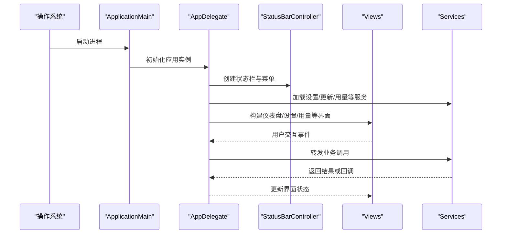

**图表来源** 
- [ApplicationMain.swift](file://app/Tomo/Sources/Tomo/ApplicationMain.swift)
- [AppDelegate.swift](file://app/Tomo/Sources/Tomo/AppDelegate.swift)
- [StatusBarController.swift](file://app/Tomo/Sources/Tomo/StatusBarController.swift)
- [CompanionDashboardViews.swift](file://app/Tomo/Sources/Tomo/CompanionDashboardViews.swift)
- [SettingsViews.swift](file://app/Tomo/Sources/Tomo/SettingsViews.swift)
- [UsageViews.swift](file://app/Tomo/Sources/Tomo/UsageViews.swift)
- [AppSettings.swift](file://app/Tomo/Sources/Tomo/AppSettings.swift)
- [AppUpdateService.swift](file://app/Tomo/Sources/Tomo/AppUpdateService.swift)
- [CodexUsageService.swift](file://app/Tomo/Sources/Tomo/CodexUsageService.swift)

**章节来源**
- [ApplicationMain.swift](file://app/Tomo/Sources/Tomo/ApplicationMain.swift)
- [AppDelegate.swift](file://app/Tomo/Sources/Tomo/AppDelegate.swift)

### 设置管理（AppSettings）
- 职责：读取与持久化应用设置，提供统一访问接口。
- 关键点：默认值、键空间隔离、读写线程安全、错误回退策略。

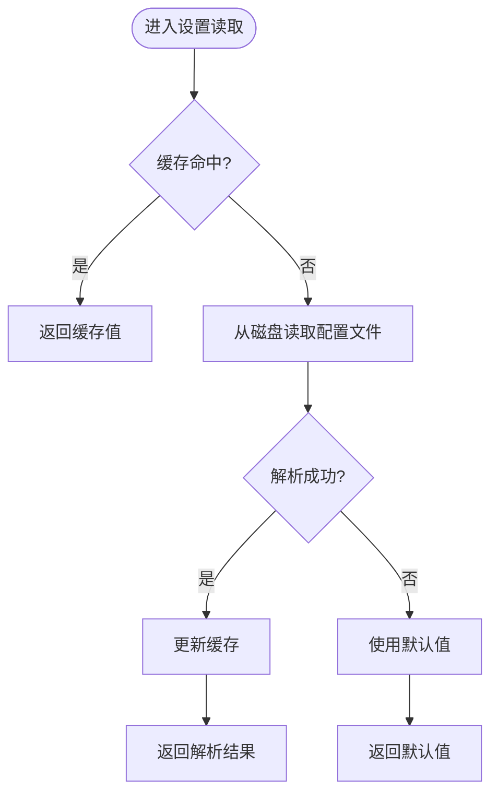

**图表来源** 
- [AppSettings.swift](file://app/Tomo/Sources/Tomo/AppSettings.swift)

**章节来源**
- [AppSettings.swift](file://app/Tomo/Sources/Tomo/AppSettings.swift)

### 更新服务（AppUpdateService）
- 职责：检查新版本、下载与安装更新。
- 关键点：版本比较、网络请求、校验签名、失败重试与降级。

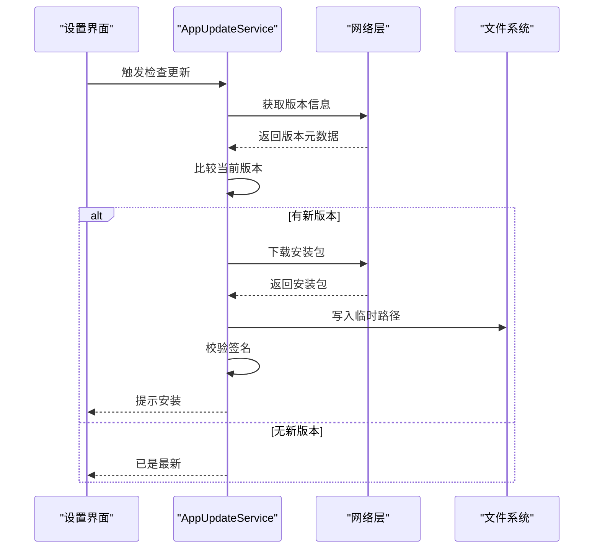

**图表来源** 
- [AppUpdateService.swift](file://app/Tomo/Sources/Tomo/AppUpdateService.swift)

**章节来源**
- [AppUpdateService.swift](file://app/Tomo/Sources/Tomo/AppUpdateService.swift)

### API 探测（CodexAPIProbe）
- 职责：对外部 API 进行连通性与可用性探测。
- 关键点：超时控制、重试策略、错误分类与日志记录。

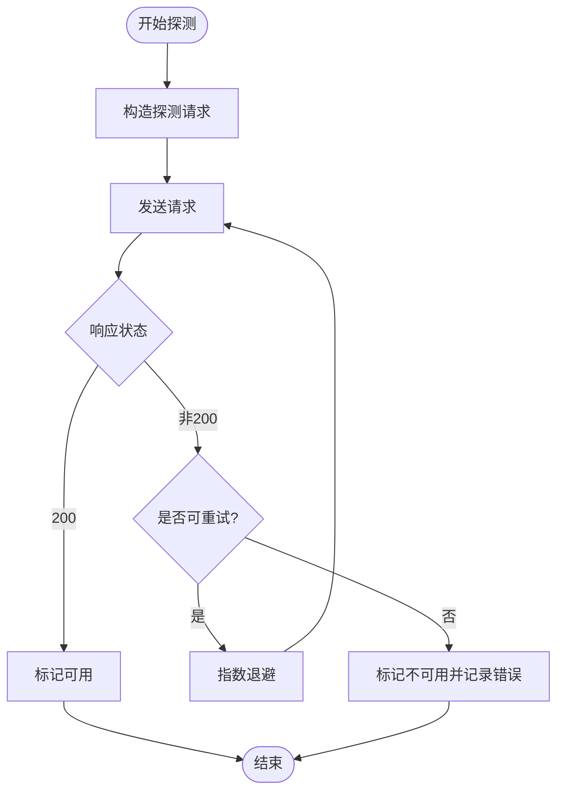

**图表来源** 
- [CodexAPIProbe.swift](file://app/Tomo/Sources/Tomo/CodexAPIProbe.swift)

**章节来源**
- [CodexAPIProbe.swift](file://app/Tomo/Sources/Tomo/CodexAPIProbe.swift)

### 活动跟踪（CodexActivity）
- 职责：采集用户行为与应用事件，支持上报与本地归档。
- 关键点：事件模型、批处理、隐私保护与去重。

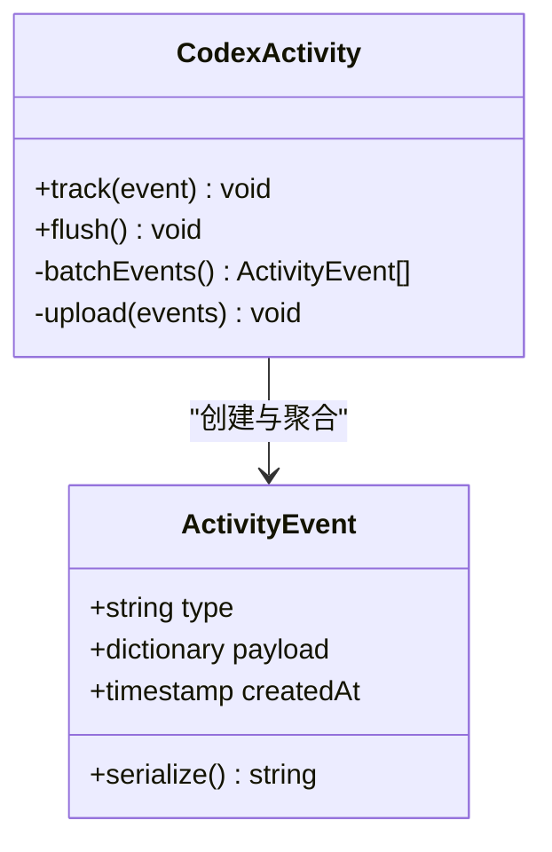

**图表来源** 
- [CodexActivity.swift](file://app/Tomo/Sources/Tomo/CodexActivity.swift)

**章节来源**
- [CodexActivity.swift](file://app/Tomo/Sources/Tomo/CodexActivity.swift)

### 用量统计（CodexUsageService）
- 职责：统计 API 调用次数、耗时、错误率等指标。
- 关键点：时间窗口聚合、内存与持久化平衡、导出格式。

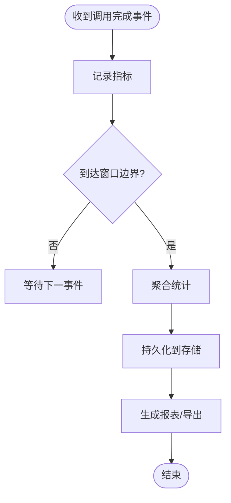

**图表来源** 
- [CodexUsageService.swift](file://app/Tomo/Sources/Tomo/CodexUsageService.swift)
- [UsageModels.swift](file://app/Tomo/Sources/Tomo/UsageModels.swift)

**章节来源**
- [CodexUsageService.swift](file://app/Tomo/Sources/Tomo/CodexUsageService.swift)
- [UsageModels.swift](file://app/Tomo/Sources/Tomo/UsageModels.swift)

### 伴侣数据与视图（CompanionStores & Dashboard）
- CompanionStores：管理伴侣状态、偏好与缓存。
- CompanionDashboardViews：渲染伴侣仪表盘，展示状态与操作入口。

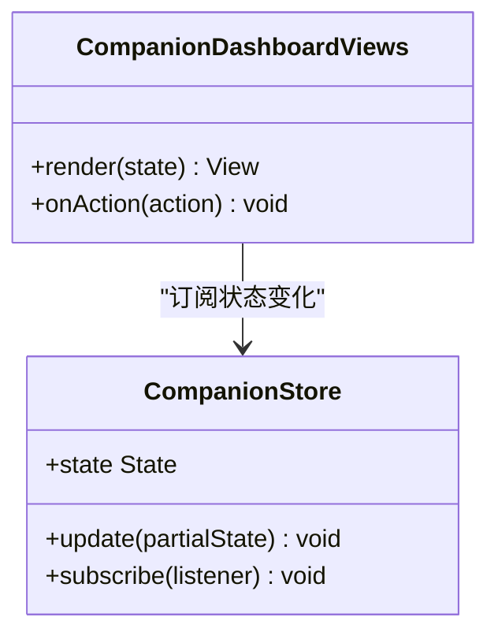

**图表来源** 
- [CompanionStores.swift](file://app/Tomo/Sources/Tomo/CompanionStores.swift)
- [CompanionDashboardViews.swift](file://app/Tomo/Sources/Tomo/CompanionDashboardViews.swift)

**章节来源**
- [CompanionStores.swift](file://app/Tomo/Sources/Tomo/CompanionStores.swift)
- [CompanionDashboardViews.swift](file://app/Tomo/Sources/Tomo/CompanionDashboardViews.swift)

### 窗口与状态栏（DetachedWindowController & StatusBarController）
- DetachedWindowController：管理独立窗口的生命周期与布局。
- StatusBarController：维护菜单栏图标、上下文菜单与快捷操作。

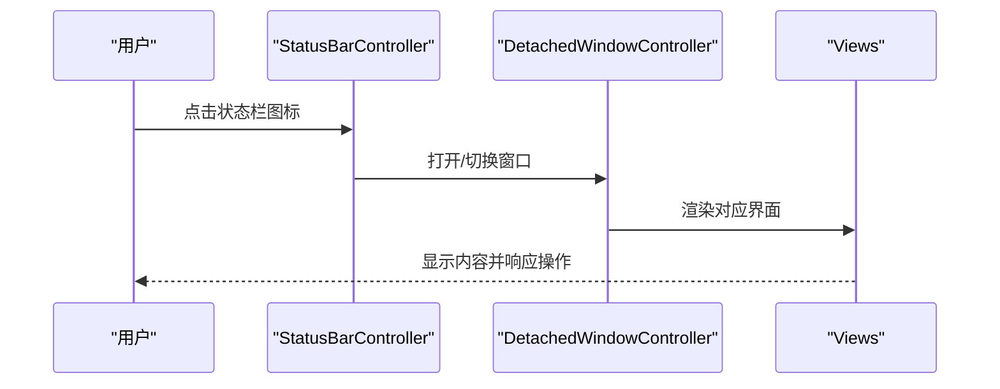

**图表来源** 
- [DetachedWindowController.swift](file://app/Tomo/Sources/Tomo/DetachedWindowController.swift)
- [StatusBarController.swift](file://app/Tomo/Sources/Tomo/StatusBarController.swift)

**章节来源**
- [DetachedWindowController.swift](file://app/Tomo/Sources/Tomo/DetachedWindowController.swift)
- [StatusBarController.swift](file://app/Tomo/Sources/Tomo/StatusBarController.swift)

### 数据模型（PetModels & UsageModels）
- PetModels：定义宠物实体、属性与序列化。
- UsageModels：定义用量指标、时间序列与聚合结构。

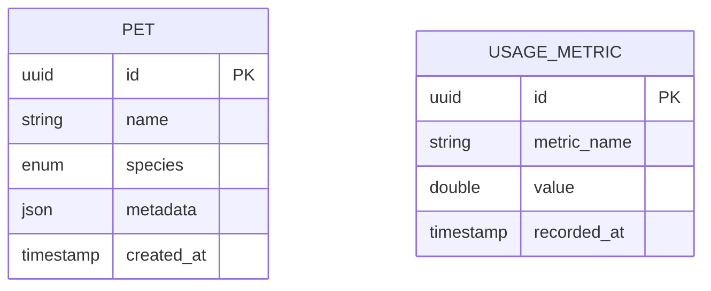

**图表来源** 
- [PetModels.swift](file://app/Tomo/Sources/Tomo/PetModels.swift)
- [UsageModels.swift](file://app/Tomo/Sources/Tomo/UsageModels.swift)

**章节来源**
- [PetModels.swift](file://app/Tomo/Sources/Tomo/PetModels.swift)
- [UsageModels.swift](file://app/Tomo/Sources/Tomo/UsageModels.swift)

### 资源文件组织与命名约定
- Resources/Info.plist：应用元数据、权限与扩展点声明。
- Resources/Pets/Tomo/pet.json：宠物配置数据，按功能域分组存放。
- 命名建议：
  - 资源文件以功能域为前缀，避免冲突。
  - JSON 配置保持最小必要字段，便于扩展。
  - Info.plist 中键名遵循 Apple 规范。

**章节来源**
- [Info.plist](file://app/Tomo/Resources/Info.plist)
- [pet.json](file://app/Tomo/Resources/Pets/Tomo/pet.json)

### 测试结构与最佳实践
- 位置：Tests/TomoTests/TomoTests.swift
- 建议：
  - 按模块划分测试用例，覆盖关键路径与异常分支。
  - 使用模拟对象隔离外部依赖（网络、文件系统）。
  - 对设置与用量统计进行断言验证。

**章节来源**
- [TomoTests.swift](file://app/Tomo/Tests/TomoTests/TomoTests.swift)

### 脚本与构建
- scripts/run_chatgpt_api_probe.sh：运行 API 探测脚本。
- package_app.sh、rebuild_and_run.sh、release_app.sh：打包、重建与发布流程。

**章节来源**
- [run_chatgpt_api_probe.sh](file://app/Tomo/scripts/run_chatgpt_api_probe.sh)
- [package_app.sh](file://app/Tomo/package_app.sh)
- [rebuild_and_run.sh](file://app/Tomo/rebuild_and_run.sh)
- [release_app.sh](file://app/Tomo/release_app.sh)

## 依赖关系分析
- 模块内聚与耦合：
  - UI 层依赖服务层提供的数据与能力，不直接访问底层存储。
  - 服务层通过数据模型与存储抽象解耦具体实现。
  - 控制器层集中处理系统事件与窗口管理，降低 UI 与系统耦合。
- 外部依赖：
  - 网络请求（更新、API 探测）。
  - 文件系统（设置、缓存、安装包）。
  - 系统框架（菜单栏、窗口、通知）。

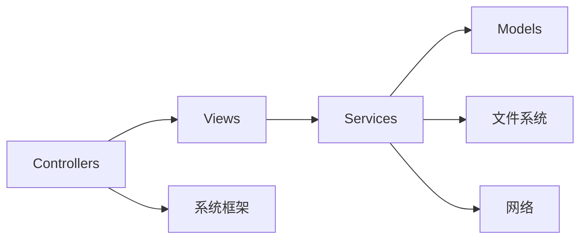

**图表来源** 
- [AppDelegate.swift](file://app/Tomo/Sources/Tomo/AppDelegate.swift)
- [AppSettings.swift](file://app/Tomo/Sources/Tomo/AppSettings.swift)
- [AppUpdateService.swift](file://app/Tomo/Sources/Tomo/AppUpdateService.swift)
- [CodexAPIProbe.swift](file://app/Tomo/Sources/Tomo/CodexAPIProbe.swift)
- [CodexUsageService.swift](file://app/Tomo/Sources/Tomo/CodexUsageService.swift)
- [PetModels.swift](file://app/Tomo/Sources/Tomo/PetModels.swift)
- [UsageModels.swift](file://app/Tomo/Sources/Tomo/UsageModels.swift)

**章节来源**
- [AppDelegate.swift](file://app/Tomo/Sources/Tomo/AppDelegate.swift)
- [AppSettings.swift](file://app/Tomo/Sources/Tomo/AppSettings.swift)
- [AppUpdateService.swift](file://app/Tomo/Sources/Tomo/AppUpdateService.swift)
- [CodexAPIProbe.swift](file://app/Tomo/Sources/Tomo/CodexAPIProbe.swift)
- [CodexUsageService.swift](file://app/Tomo/Sources/Tomo/CodexUsageService.swift)
- [PetModels.swift](file://app/Tomo/Sources/Tomo/PetModels.swift)
- [UsageModels.swift](file://app/Tomo/Sources/Tomo/UsageModels.swift)

## 性能考虑
- 设置读取：引入缓存与懒加载，减少磁盘 IO。
- 用量统计：批量聚合与异步持久化，避免阻塞 UI。
- API 探测：超时与重试策略，防止长时间阻塞。
- 窗口管理：按需创建与销毁，降低内存占用。

[本节为通用指导，无需特定文件引用]

## 故障排查指南
- 常见问题定位：
  - 设置无法加载：检查 Info.plist 权限与配置文件路径。
  - 更新失败：查看网络状态、签名校验与磁盘空间。
  - API 不可用：确认超时、重试与错误码分类。
  - 用量统计缺失：检查事件采集与持久化流程。
- 调试建议：
  - 启用详细日志，区分警告与错误级别。
  - 使用脚本快速复现问题（如 API 探测脚本）。
  - 在测试中模拟异常分支，确保健壮性。

**章节来源**
- [run_chatgpt_api_probe.sh](file://app/Tomo/scripts/run_chatgpt_api_probe.sh)
- [AppSettings.swift](file://app/Tomo/Sources/Tomo/AppSettings.swift)
- [AppUpdateService.swift](file://app/Tomo/Sources/Tomo/AppUpdateService.swift)
- [CodexAPIProbe.swift](file://app/Tomo/Sources/Tomo/CodexAPIProbe.swift)
- [CodexUsageService.swift](file://app/Tomo/Sources/Tomo/CodexUsageService.swift)

## 结论
本项目采用清晰的层次化架构与模块化组织，UI、控制器、服务与数据层职责明确，便于扩展与维护。资源与脚本分离，提升可维护性与可移植性。建议在后续迭代中继续强化错误处理、性能监控与测试覆盖率，以提升整体质量与稳定性。

[本节为总结性内容，无需特定文件引用]