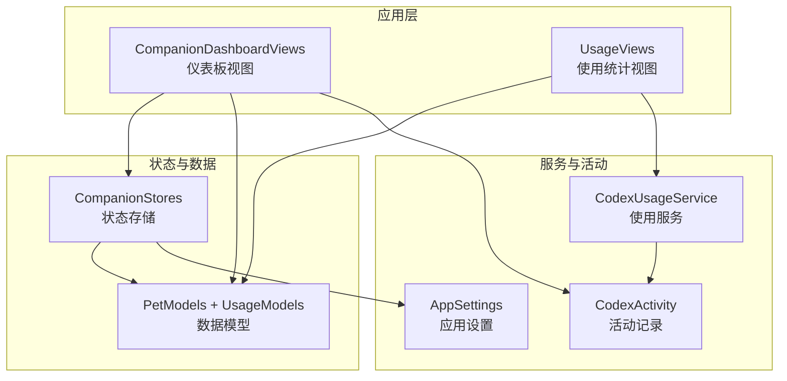
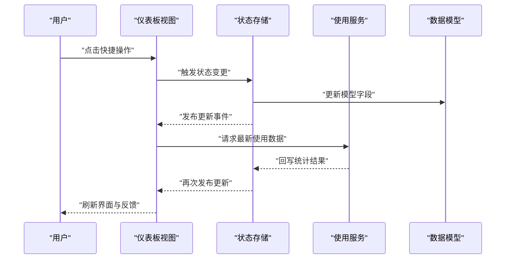
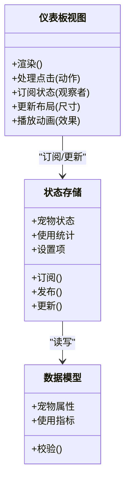
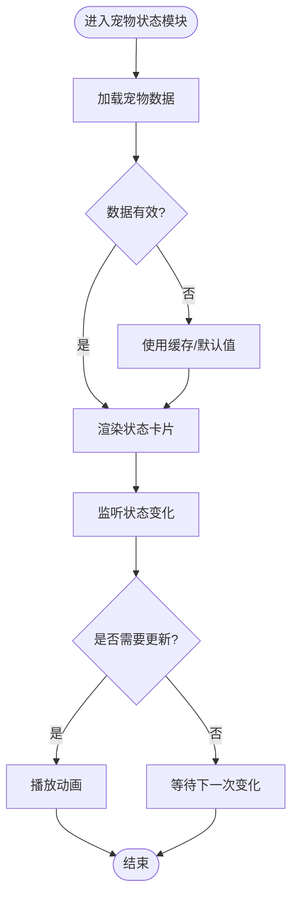
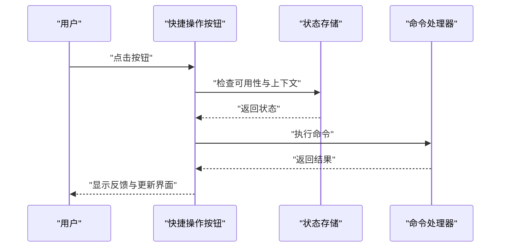
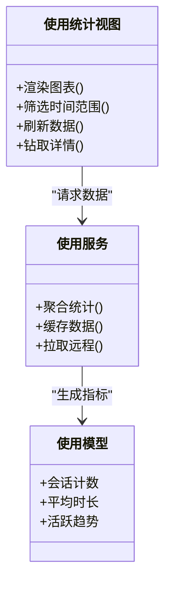
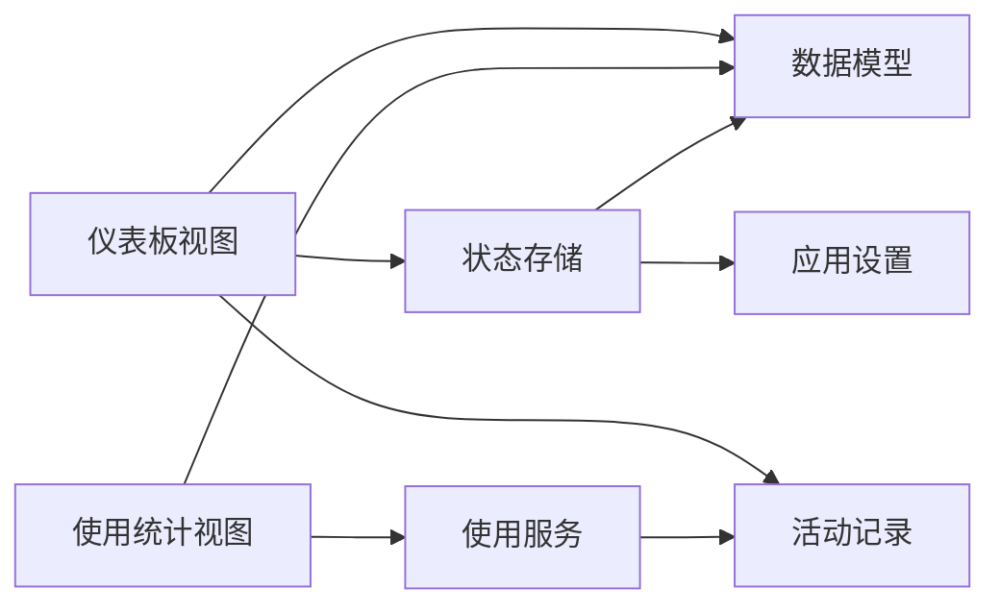

# 仪表板视图组件

<cite>
**本文档引用的文件**   
- [CompanionDashboardViews.swift](file://app/Tomo/Sources/Tomo/CompanionDashboardViews.swift)
- [CompanionStores.swift](file://app/Tomo/Sources/Tomo/CompanionStores.swift)
- [PetModels.swift](file://app/Tomo/Sources/Tomo/PetModels.swift)
- [UsageModels.swift](file://app/Tomo/Sources/Tomo/UsageModels.swift)
- [UsageViews.swift](file://app/Tomo/Sources/Tomo/UsageViews.swift)
- [CodexActivity.swift](file://app/Tomo/Sources/Tomo/CodexActivity.swift)
- [CodexUsageService.swift](file://app/Tomo/Sources/Tomo/CodexUsageService.swift)
- [AppSettings.swift](file://app/Tomo/Sources/Tomo/AppSettings.swift)
</cite>

## 目录
1. [简介](#简介)
2. [项目结构](#项目结构)
3. [核心组件](#核心组件)
4. [架构总览](#架构总览)
5. [详细组件分析](#详细组件分析)
6. [依赖关系分析](#依赖关系分析)
7. [性能考虑](#性能考虑)
8. [故障排查指南](#故障排查指南)
9. [结论](#结论)
10. [附录](#附录)

## 简介
本技术文档围绕 SwiftUI 界面组件 CompanionDashboardViews.swift，系统化阐述宠物伴侣仪表板的布局设计、数据绑定与状态管理。文档覆盖主界面的子组件（宠物状态显示、快捷操作按钮、使用统计概览等），并说明用户交互流程、事件处理机制、数据更新策略、响应式设计与动画反馈。同时提供组件复用模式与样式定制指南，帮助读者在保持可维护性的前提下快速扩展与优化仪表板。

## 项目结构
本项目采用 Swift Package 组织方式，SwiftUI 视图位于 app/Tomo/Sources/Tomo 目录下。与仪表板相关的核心文件包括：
- CompanionDashboardViews.swift：仪表板视图与交互逻辑
- CompanionStores.swift：状态存储与数据源
- PetModels.swift：宠物相关数据模型
- UsageModels.swift：使用统计相关的数据模型
- UsageViews.swift：使用统计的可视化视图
- CodexActivity.swift：活动记录与行为追踪
- CodexUsageService.swift：使用数据的采集与服务接口
- AppSettings.swift：应用设置与偏好配置

图表来源
- [CompanionDashboardViews.swift](file://app/Tomo/Sources/Tomo/CompanionDashboardViews.swift)
- [CompanionStores.swift](file://app/Tomo/Sources/Tomo/CompanionStores.swift)
- [PetModels.swift](file://app/Tomo/Sources/Tomo/PetModels.swift)
- [UsageModels.swift](file://app/Tomo/Sources/Tomo/UsageModels.swift)
- [UsageViews.swift](file://app/Tomo/Sources/Tomo/UsageViews.swift)
- [CodexActivity.swift](file://app/Tomo/Sources/Tomo/CodexActivity.swift)
- [CodexUsageService.swift](file://app/Tomo/Sources/Tomo/CodexUsageService.swift)
- [AppSettings.swift](file://app/Tomo/Sources/Tomo/AppSettings.swift)

章节来源
- [CompanionDashboardViews.swift](file://app/Tomo/Sources/Tomo/CompanionDashboardViews.swift)
- [CompanionStores.swift](file://app/Tomo/Sources/Tomo/CompanionStores.swift)
- [PetModels.swift](file://app/Tomo/Sources/Tomo/PetModels.swift)
- [UsageModels.swift](file://app/Tomo/Sources/Tomo/UsageModels.swift)
- [UsageViews.swift](file://app/Tomo/Sources/Tomo/UsageViews.swift)
- [CodexActivity.swift](file://app/Tomo/Sources/Tomo/CodexActivity.swift)
- [CodexUsageService.swift](file://app/Tomo/Sources/Tomo/CodexUsageService.swift)
- [AppSettings.swift](file://app/Tomo/Sources/Tomo/AppSettings.swift)

## 核心组件
- 仪表板视图（CompanionDashboardViews）：负责整体布局、子组件编排、用户交互与状态同步。
- 状态存储（CompanionStores）：集中管理宠物状态、使用统计、设置项等，提供响应式数据流。
- 数据模型（PetModels、UsageModels）：定义宠物属性、状态枚举、使用指标的结构与约束。
- 使用统计视图（UsageViews）：将统计数据以可视化形式呈现，支持刷新与交互。
- 活动与服务（CodexActivity、CodexUsageService）：采集与上报使用数据，驱动统计更新。
- 应用设置（AppSettings）：持久化用户偏好，影响仪表板展示与行为。

章节来源
- [CompanionDashboardViews.swift](file://app/Tomo/Sources/Tomo/CompanionDashboardViews.swift)
- [CompanionStores.swift](file://app/Tomo/Sources/Tomo/CompanionStores.swift)
- [PetModels.swift](file://app/Tomo/Sources/Tomo/PetModels.swift)
- [UsageModels.swift](file://app/Tomo/Sources/Tomo/UsageModels.swift)
- [UsageViews.swift](file://app/Tomo/Sources/Tomo/UsageViews.swift)
- [CodexActivity.swift](file://app/Tomo/Sources/Tomo/CodexActivity.swift)
- [CodexUsageService.swift](file://app/Tomo/Sources/Tomo/CodexUsageService.swift)
- [AppSettings.swift](file://app/Tomo/Sources/Tomo/AppSettings.swift)

## 架构总览
仪表板采用“视图-状态-服务”分层架构：
- 视图层：SwiftUI 组件负责渲染与交互。
- 状态层：Store 集中持有状态并提供订阅能力，保证数据一致性。
- 服务层：数据采集、计算与持久化，解耦业务逻辑与 UI。

图表来源
- [CompanionDashboardViews.swift](file://app/Tomo/Sources/Tomo/CompanionDashboardViews.swift)
- [CompanionStores.swift](file://app/Tomo/Sources/Tomo/CompanionStores.swift)
- [UsageViews.swift](file://app/Tomo/Sources/Tomo/UsageViews.swift)
- [CodexUsageService.swift](file://app/Tomo/Sources/Tomo/CodexUsageService.swift)
- [PetModels.swift](file://app/Tomo/Sources/Tomo/PetModels.swift)
- [UsageModels.swift](file://app/Tomo/Sources/Tomo/UsageModels.swift)

## 详细组件分析

### 仪表板视图（CompanionDashboardViews）
- 布局设计：采用响应式网格与分栏，适配不同窗口尺寸；顶部为标题与全局操作，中部为宠物状态卡片与快捷操作，底部为使用统计概览。
- 数据绑定：通过状态存储订阅关键字段（如宠物健康值、活跃度、最近会话数），实现自动刷新。
- 状态管理：集中变更入口，避免分散的状态更新导致不一致；支持批量更新与事务性提交。
- 用户交互：按钮点击、拖拽排序、长按菜单、键盘快捷键；统一的事件分发与错误提示。
- 动画与反馈：状态切换时提供过渡动画（淡入淡出、缩放），操作成功给出轻量提示（Toast）。

图表来源
- [CompanionDashboardViews.swift](file://app/Tomo/Sources/Tomo/CompanionDashboardViews.swift)
- [CompanionStores.swift](file://app/Tomo/Sources/Tomo/CompanionStores.swift)
- [PetModels.swift](file://app/Tomo/Sources/Tomo/PetModels.swift)
- [UsageModels.swift](file://app/Tomo/Sources/Tomo/UsageModels.swift)

章节来源
- [CompanionDashboardViews.swift](file://app/Tomo/Sources/Tomo/CompanionDashboardViews.swift)
- [CompanionStores.swift](file://app/Tomo/Sources/Tomo/CompanionStores.swift)
- [PetModels.swift](file://app/Tomo/Sources/Tomo/PetModels.swift)
- [UsageModels.swift](file://app/Tomo/Sources/Tomo/UsageModels.swift)

### 宠物状态显示
- 展示内容：健康值、情绪、活跃度、最近互动时间、任务完成度。
- 数据来源：从状态存储读取，必要时调用服务拉取最新数据。
- 更新策略：增量更新与全量刷新并存；网络失败时降级到本地缓存。
- 视觉反馈：数值变化时使用进度条或颜色渐变；异常状态高亮提示。

图表来源
- [CompanionDashboardViews.swift](file://app/Tomo/Sources/Tomo/CompanionDashboardViews.swift)
- [CompanionStores.swift](file://app/Tomo/Sources/Tomo/CompanionStores.swift)
- [PetModels.swift](file://app/Tomo/Sources/Tomo/PetModels.swift)

章节来源
- [CompanionDashboardViews.swift](file://app/Tomo/Sources/Tomo/CompanionDashboardViews.swift)
- [CompanionStores.swift](file://app/Tomo/Sources/Tomo/CompanionStores.swift)
- [PetModels.swift](file://app/Tomo/Sources/Tomo/PetModels.swift)

### 快捷操作按钮
- 功能范围：开始对话、暂停陪伴、重置状态、查看日志、打开设置。
- 事件处理：统一路由到对应命令处理器；支持组合键与手势。
- 状态联动：按钮可用性随宠物状态动态变化（如忙碌时禁用某些操作）。
- 反馈机制：操作进行中显示加载指示；完成后弹出轻量提示。

图表来源
- [CompanionDashboardViews.swift](file://app/Tomo/Sources/Tomo/CompanionDashboardViews.swift)
- [CompanionStores.swift](file://app/Tomo/Sources/Tomo/CompanionStores.swift)

章节来源
- [CompanionDashboardViews.swift](file://app/Tomo/Sources/Tomo/CompanionDashboardViews.swift)
- [CompanionStores.swift](file://app/Tomo/Sources/Tomo/CompanionStores.swift)

### 使用统计概览（UsageViews）
- 展示维度：会话次数、平均时长、活跃天数、峰值时段、错误率。
- 数据获取：通过使用服务聚合数据，支持按日/周/月筛选。
- 交互能力：点击图表钻取详情；支持下拉刷新与分页加载。
- 性能优化：懒加载与虚拟滚动；缓存热点数据减少重复计算。

图表来源
- [UsageViews.swift](file://app/Tomo/Sources/Tomo/UsageViews.swift)
- [CodexUsageService.swift](file://app/Tomo/Sources/Tomo/CodexUsageService.swift)
- [UsageModels.swift](file://app/Tomo/Sources/Tomo/UsageModels.swift)

章节来源
- [UsageViews.swift](file://app/Tomo/Sources/Tomo/UsageViews.swift)
- [CodexUsageService.swift](file://app/Tomo/Sources/Tomo/CodexUsageService.swift)
- [UsageModels.swift](file://app/Tomo/Sources/Tomo/UsageModels.swift)

### 活动记录与数据更新（CodexActivity）
- 职责：记录用户操作与系统事件，形成审计轨迹。
- 集成点：与状态存储联动，确保关键变更有迹可循。
- 输出格式：结构化日志，便于分析与调试。

章节来源
- [CodexActivity.swift](file://app/Tomo/Sources/Tomo/CodexActivity.swift)
- [CompanionStores.swift](file://app/Tomo/Sources/Tomo/CompanionStores.swift)

### 使用服务（CodexUsageService）
- 职责：采集使用数据、聚合指标、提供查询接口。
- 数据源：本地缓存与远程服务双通道；冲突时按策略合并。
- 错误处理：重试机制与降级策略，保障稳定性。

章节来源
- [CodexUsageService.swift](file://app/Tomo/Sources/Tomo/CodexUsageService.swift)
- [UsageModels.swift](file://app/Tomo/Sources/Tomo/UsageModels.swift)

### 应用设置（AppSettings）
- 职责：管理用户偏好（主题、语言、通知开关）、影响仪表板展示。
- 持久化：本地存储与云端同步；变更实时生效。
- 安全：敏感设置加密保存。

章节来源
- [AppSettings.swift](file://app/Tomo/Sources/Tomo/AppSettings.swift)
- [CompanionStores.swift](file://app/Tomo/Sources/Tomo/CompanionStores.swift)

## 依赖关系分析
- 耦合度：视图与状态存储松耦合，通过订阅机制通信；服务层独立于 UI。
- 内聚性：每个模块职责清晰，数据模型与视图分离，便于测试与维护。
- 外部依赖：使用服务可能依赖网络与文件系统；需做好离线与超时处理。

图表来源
- [CompanionDashboardViews.swift](file://app/Tomo/Sources/Tomo/CompanionDashboardViews.swift)
- [CompanionStores.swift](file://app/Tomo/Sources/Tomo/CompanionStores.swift)
- [PetModels.swift](file://app/Tomo/Sources/Tomo/PetModels.swift)
- [UsageModels.swift](file://app/Tomo/Sources/Tomo/UsageModels.swift)
- [UsageViews.swift](file://app/Tomo/Sources/Tomo/UsageViews.swift)
- [CodexActivity.swift](file://app/Tomo/Sources/Tomo/CodexActivity.swift)
- [CodexUsageService.swift](file://app/Tomo/Sources/Tomo/CodexUsageService.swift)
- [AppSettings.swift](file://app/Tomo/Sources/Tomo/AppSettings.swift)

章节来源
- [CompanionDashboardViews.swift](file://app/Tomo/Sources/Tomo/CompanionDashboardViews.swift)
- [CompanionStores.swift](file://app/Tomo/Sources/Tomo/CompanionStores.swift)
- [PetModels.swift](file://app/Tomo/Sources/Tomo/PetModels.swift)
- [UsageModels.swift](file://app/Tomo/Sources/Tomo/UsageModels.swift)
- [UsageViews.swift](file://app/Tomo/Sources/Tomo/UsageViews.swift)
- [CodexActivity.swift](file://app/Tomo/Sources/Tomo/CodexActivity.swift)
- [CodexUsageService.swift](file://app/Tomo/Sources/Tomo/CodexUsageService.swift)
- [AppSettings.swift](file://app/Tomo/Sources/Tomo/AppSettings.swift)

## 性能考虑
- 渲染优化：避免不必要的重绘，使用惰性加载与条件渲染。
- 数据更新：批量更新与防抖节流，减少频繁状态变更。
- 内存管理：及时释放不再使用的资源，避免循环引用。
- 网络请求：缓存与并发控制，降低延迟与带宽占用。

[本节为通用指导，不直接分析具体文件]

## 故障排查指南
- 常见问题：
  - 数据未更新：检查状态订阅是否正确注册，确认发布事件是否触发。
  - 界面卡顿：定位重绘热点，优化渲染路径与数据结构。
  - 网络失败：验证服务降级策略与重试机制是否生效。
- 调试建议：
  - 启用活动记录，观察关键事件序列。
  - 打印状态快照，对比变更前后的差异。
  - 使用断点与日志定位异常分支。

章节来源
- [CodexActivity.swift](file://app/Tomo/Sources/Tomo/CodexActivity.swift)
- [CompanionStores.swift](file://app/Tomo/Sources/Tomo/CompanionStores.swift)
- [CodexUsageService.swift](file://app/Tomo/Sources/Tomo/CodexUsageService.swift)

## 结论
仪表板视图组件通过清晰的层次划分与响应式数据流，实现了良好的可维护性与可扩展性。宠物状态显示、快捷操作与使用统计各司其职，配合活动记录与服务层，保证了用户体验与系统稳定性。遵循本文的复用模式与样式定制指南，可在现有基础上快速迭代与优化。

[本节为总结性内容，不直接分析具体文件]

## 附录
- 最佳实践：
  - 单一职责：每个组件只关注自身渲染与交互。
  - 状态集中：通过状态存储统一管理，避免散落状态。
  - 可测试性：为关键逻辑编写单元测试与集成测试。
- 样式定制：
  - 主题变量：集中定义颜色、字体、间距，便于全局替换。
  - 组件封装：将常用 UI 片段封装为可复用组件，提升一致性。
- 代码示例路径：
  - 仪表板布局与交互：[CompanionDashboardViews.swift](file://app/Tomo/Sources/Tomo/CompanionDashboardViews.swift)
  - 状态管理与订阅：[CompanionStores.swift](file://app/Tomo/Sources/Tomo/CompanionStores.swift)
  - 宠物数据模型：[PetModels.swift](file://app/Tomo/Sources/Tomo/PetModels.swift)
  - 使用统计模型与视图：[UsageModels.swift](file://app/Tomo/Sources/Tomo/UsageModels.swift)、[UsageViews.swift](file://app/Tomo/Sources/Tomo/UsageViews.swift)
  - 活动记录与服务：[CodexActivity.swift](file://app/Tomo/Sources/Tomo/CodexActivity.swift)、[CodexUsageService.swift](file://app/Tomo/Sources/Tomo/CodexUsageService.swift)
  - 应用设置：[AppSettings.swift](file://app/Tomo/Sources/Tomo/AppSettings.swift)