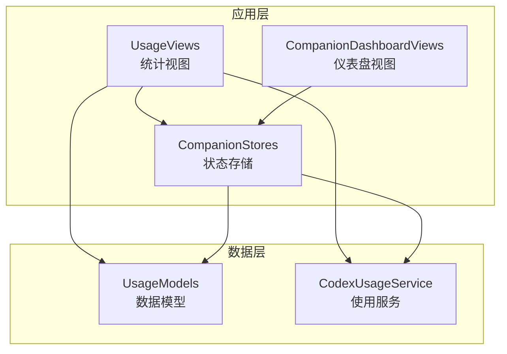
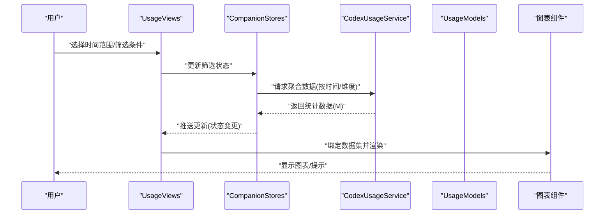
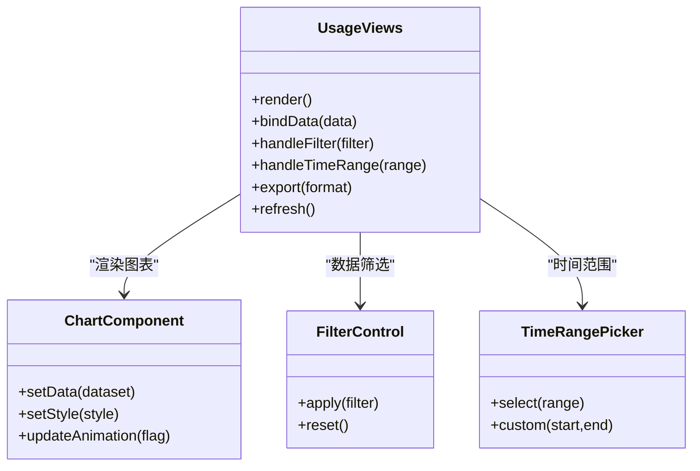
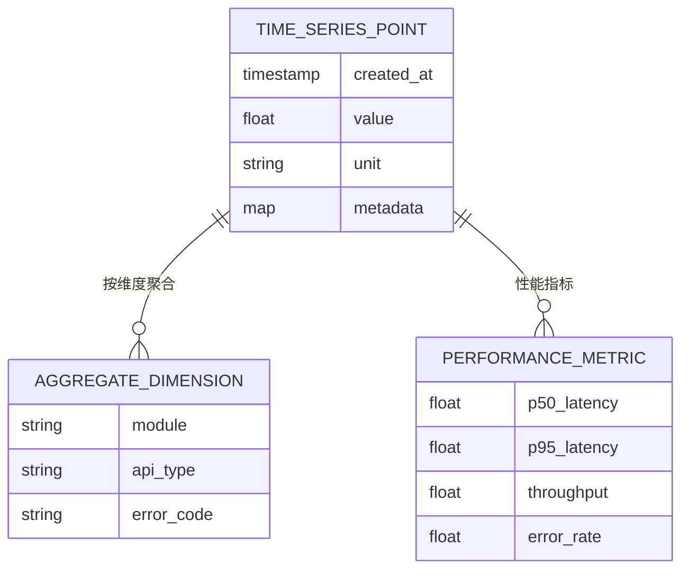
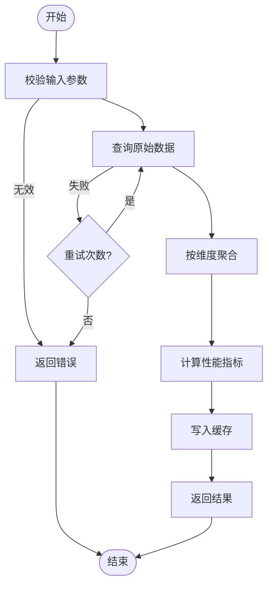
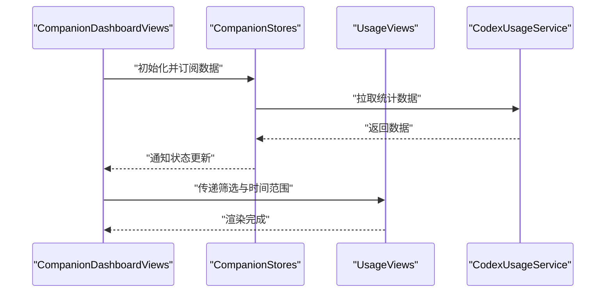
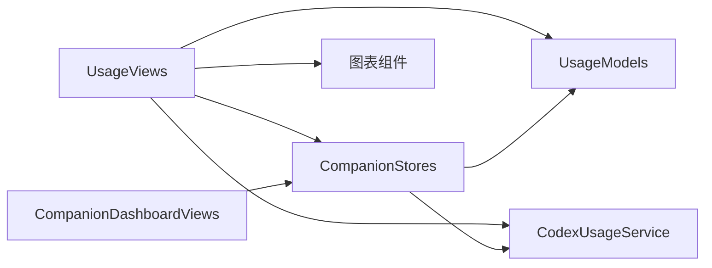

# 使用统计视图

<cite>
**本文引用的文件**   
- [UsageViews.swift](file://app/Tomo/Sources/Tomo/UsageViews.swift)
- [UsageModels.swift](file://app/Tomo/Sources/Tomo/UsageModels.swift)
- [CodexUsageService.swift](file://app/Tomo/Sources/Tomo/CodexUsageService.swift)
- [CompanionDashboardViews.swift](file://app/Tomo/Sources/Tomo/CompanionDashboardViews.swift)
- [CompanionStores.swift](file://app/Tomo/Sources/Tomo/CompanionStores.swift)
</cite>

## 目录
1. [简介](#简介)
2. [项目结构](#项目结构)
3. [核心组件](#核心组件)
4. [架构总览](#架构总览)
5. [详细组件分析](#详细组件分析)
6. [依赖分析](#依赖分析)
7. [性能考虑](#性能考虑)
8. [故障排查指南](#故障排查指南)
9. [结论](#结论)
10. [附录](#附录)

## 简介
本技术文档围绕“使用统计视图”展开，重点解析 UsageViews.swift 中实现的数据可视化界面，包括 API 使用量图表、调用统计分析与性能监控面板。文档将详细说明图表组件的实现方式、数据绑定与实时更新机制，用户交互能力（数据筛选、时间范围选择、导出等），以及图表库的使用、自定义样式与响应式布局策略。同时提供数据可视化的最佳实践，涵盖性能优化与内存管理注意事项，帮助开发者在 macOS SwiftUI 环境下构建高效、可维护的统计可视化模块。

## 项目结构
本项目采用模块化组织，与使用统计视图相关的代码主要位于 app/Tomo/Sources/Tomo 目录下：
- UsageViews.swift：负责统计视图的 UI 渲染、交互逻辑与图表展示。
- UsageModels.swift：定义统计数据模型与数据结构。
- CodexUsageService.swift：封装数据采集、聚合与查询接口。
- CompanionDashboardViews.swift：仪表盘相关视图组合与布局。
- CompanionStores.swift：状态管理与数据源订阅。

**图示来源** 
- [UsageViews.swift](file://app/Tomo/Sources/Tomo/UsageViews.swift)
- [UsageModels.swift](file://app/Tomo/Sources/Tomo/UsageModels.swift)
- [CodexUsageService.swift](file://app/Tomo/Sources/Tomo/CodexUsageService.swift)
- [CompanionDashboardViews.swift](file://app/Tomo/Sources/Tomo/CompanionDashboardViews.swift)
- [CompanionStores.swift](file://app/Tomo/Sources/Tomo/CompanionStores.swift)

**章节来源**
- [UsageViews.swift](file://app/Tomo/Sources/Tomo/UsageViews.swift)
- [UsageModels.swift](file://app/Tomo/Sources/Tomo/UsageModels.swift)
- [CodexUsageService.swift](file://app/Tomo/Sources/Tomo/CodexUsageService.swift)
- [CompanionDashboardViews.swift](file://app/Tomo/Sources/Tomo/CompanionDashboardViews.swift)
- [CompanionStores.swift](file://app/Tomo/Sources/Tomo/CompanionStores.swift)

## 核心组件
- UsageViews：统计视图的核心 UI 组件，包含图表区域、筛选控件、时间范围选择器与导出按钮。负责将模型数据映射到图表数据集，并处理用户交互事件。
- UsageModels：定义统计数据的结构，如时间序列点、指标名称、数值、单位、聚合维度等。
- CodexUsageService：提供获取使用量数据、按时间范围聚合、按维度过滤、异常检测与性能指标计算的能力。
- CompanionDashboardViews：将统计视图与其他仪表盘组件组合，形成完整的控制台页面。
- CompanionStores：集中管理统计数据的加载状态、缓存、错误信息与订阅更新。

**章节来源**
- [UsageViews.swift](file://app/Tomo/Sources/Tomo/UsageViews.swift)
- [UsageModels.swift](file://app/Tomo/Sources/Tomo/UsageModels.swift)
- [CodexUsageService.swift](file://app/Tomo/Sources/Tomo/CodexUsageService.swift)
- [CompanionDashboardViews.swift](file://app/Tomo/Sources/Tomo/CompanionDashboardViews.swift)
- [CompanionStores.swift](file://app/Tomo/Sources/Tomo/CompanionStores.swift)

## 架构总览
下图展示了从用户交互到数据渲染的整体流程：用户在 UsageViews 中进行筛选或时间范围选择，触发状态更新；CompanionStores 协调数据请求与缓存；CodexUsageService 返回聚合后的数据；UsageViews 将数据绑定至图表组件进行渲染。

**图示来源** 
- [UsageViews.swift](file://app/Tomo/Sources/Tomo/UsageViews.swift)
- [CompanionStores.swift](file://app/Tomo/Sources/Tomo/CompanionStores.swift)
- [CodexUsageService.swift](file://app/Tomo/Sources/Tomo/CodexUsageService.swift)
- [UsageModels.swift](file://app/Tomo/Sources/Tomo/UsageModels.swift)

## 详细组件分析

### UsageViews 组件分析
UsageViews 是统计视图的主入口，负责：
- 渲染图表区域（API 使用量折线/柱状图、调用成功率、延迟分布等）。
- 提供筛选控件（按功能模块、API 类型、错误码等）。
- 时间范围选择器（最近 1h/24h/7d/30d/自定义区间）。
- 导出功能（CSV/PNG）与刷新按钮。
- 响应式布局适配不同窗口尺寸。

**图示来源** 
- [UsageViews.swift](file://app/Tomo/Sources/Tomo/UsageViews.swift)

**章节来源**
- [UsageViews.swift](file://app/Tomo/Sources/Tomo/UsageViews.swift)

### UsageModels 数据模型分析
UsageModels 定义了统计数据的结构与序列化格式，确保图表组件与服务端/本地存储之间的数据一致性。关键要点：
- 时间序列点包含时间戳、指标值、单位与可选元数据。
- 聚合维度支持按模块、API、错误码分组。
- 性能指标包含延迟分位、吞吐、错误率等。

**图示来源** 
- [UsageModels.swift](file://app/Tomo/Sources/Tomo/UsageModels.swift)

**章节来源**
- [UsageModels.swift](file://app/Tomo/Sources/Tomo/UsageModels.swift)

### CodexUsageService 服务分析
CodexUsageService 提供数据访问与聚合能力：
- 按时间范围与维度查询使用量。
- 计算性能指标（延迟分位、错误率、吞吐量）。
- 支持增量更新与缓存策略。
- 错误处理与重试机制。

**图示来源** 
- [CodexUsageService.swift](file://app/Tomo/Sources/Tomo/CodexUsageService.swift)

**章节来源**
- [CodexUsageService.swift](file://app/Tomo/Sources/Tomo/CodexUsageService.swift)

### CompanionDashboardViews 与 CompanionStores 集成
- CompanionDashboardViews 将 UsageViews 与其他仪表盘组件组合，统一布局与主题。
- CompanionStores 管理数据加载状态、错误信息、缓存与订阅更新，确保视图与数据源同步。

**图示来源** 
- [CompanionDashboardViews.swift](file://app/Tomo/Sources/Tomo/CompanionDashboardViews.swift)
- [CompanionStores.swift](file://app/Tomo/Sources/Tomo/CompanionStores.swift)

**章节来源**
- [CompanionDashboardViews.swift](file://app/Tomo/Sources/Tomo/CompanionDashboardViews.swift)
- [CompanionStores.swift](file://app/Tomo/Sources/Tomo/CompanionStores.swift)

## 依赖分析
UsageViews 依赖 UsageModels 提供数据结构，依赖 CodexUsageService 获取数据，依赖 CompanionStores 管理状态。图表组件为第三方库或内部实现，用于渲染折线图、柱状图与热力图等。

**图示来源** 
- [UsageViews.swift](file://app/Tomo/Sources/Tomo/UsageViews.swift)
- [UsageModels.swift](file://app/Tomo/Sources/Tomo/UsageModels.swift)
- [CodexUsageService.swift](file://app/Tomo/Sources/Tomo/CodexUsageService.swift)
- [CompanionDashboardViews.swift](file://app/Tomo/Sources/Tomo/CompanionDashboardViews.swift)
- [CompanionStores.swift](file://app/Tomo/Sources/Tomo/CompanionStores.swift)

**章节来源**
- [UsageViews.swift](file://app/Tomo/Sources/Tomo/UsageViews.swift)
- [UsageModels.swift](file://app/Tomo/Sources/Tomo/UsageModels.swift)
- [CodexUsageService.swift](file://app/Tomo/Sources/Tomo/CodexUsageService.swift)
- [CompanionDashboardViews.swift](file://app/Tomo/Sources/Tomo/CompanionDashboardViews.swift)
- [CompanionStores.swift](file://app/Tomo/Sources/Tomo/CompanionStores.swift)

## 性能考虑
- 数据分页与懒加载：仅加载当前时间范围内的必要数据，避免一次性加载大量历史点。
- 增量更新：服务端推送或轮询时，仅更新变化部分，减少重绘开销。
- 图表渲染优化：对大数据集进行采样或降采样，启用硬件加速与离屏渲染。
- 内存管理：及时释放不再使用的数据集与缓存，避免 retain cycle。
- 防抖与节流：用户频繁操作时，合并请求与更新，降低 CPU 与网络压力。

[本节为通用指导，不直接分析具体文件]

## 故障排查指南
- 数据为空或延迟高：检查 CodexUsageService 的网络请求与缓存策略，确认时间范围与筛选条件是否合理。
- 图表不更新：验证 CompanionStores 的状态订阅是否正确触发，UsageViews 的 bindData 是否被调用。
- 内存占用过高：检查是否存在未释放的闭包引用或循环引用，清理大对象与缓存。
- 导出失败：确认文件格式与权限设置，检查磁盘空间与路径有效性。

**章节来源**
- [CodexUsageService.swift](file://app/Tomo/Sources/Tomo/CodexUsageService.swift)
- [CompanionStores.swift](file://app/Tomo/Sources/Tomo/CompanionStores.swift)
- [UsageViews.swift](file://app/Tomo/Sources/Tomo/UsageViews.swift)

## 结论
UsageViews 通过清晰的组件分层与数据流设计，实现了高效的 API 使用量可视化与性能监控。结合 UsageModels、CodexUsageService、CompanionDashboardViews 与 CompanionStores，形成了可扩展、可维护的统计视图体系。遵循本文的性能优化与内存管理建议，可在大规模数据场景下保持流畅的用户体验。

[本节为总结性内容，不直接分析具体文件]

## 附录
- 图表库选型建议：优先选择支持 SwiftUI 原生渲染的库，或基于 Metal/CoreGraphics 的高性能方案。
- 自定义样式：通过主题配置统一颜色、字体与间距，确保跨设备一致性。
- 响应式布局：使用 SwiftUI 的自适应布局特性，适配不同屏幕尺寸与方向。

[本节为补充说明，不直接分析具体文件]