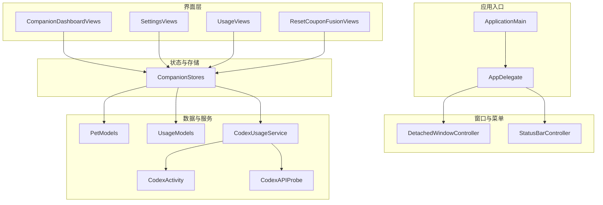
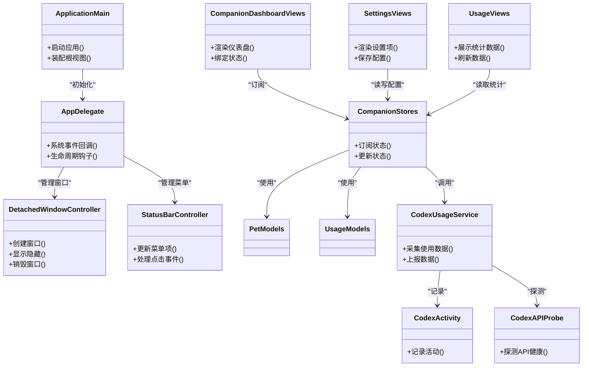
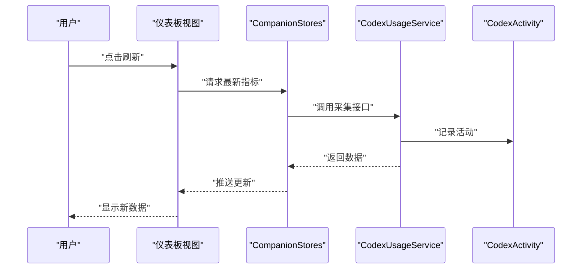
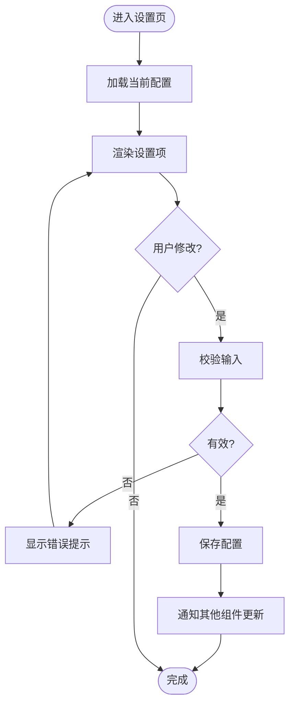
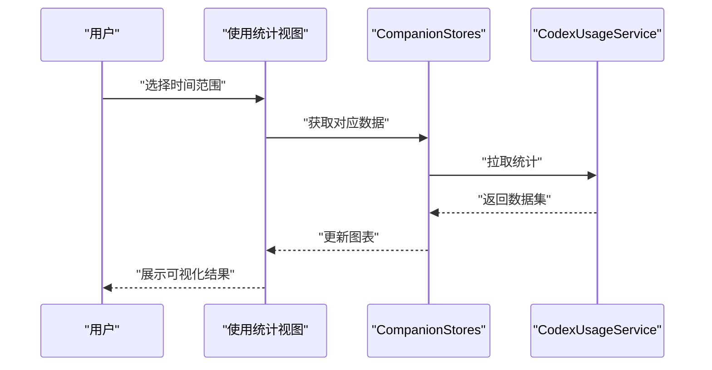
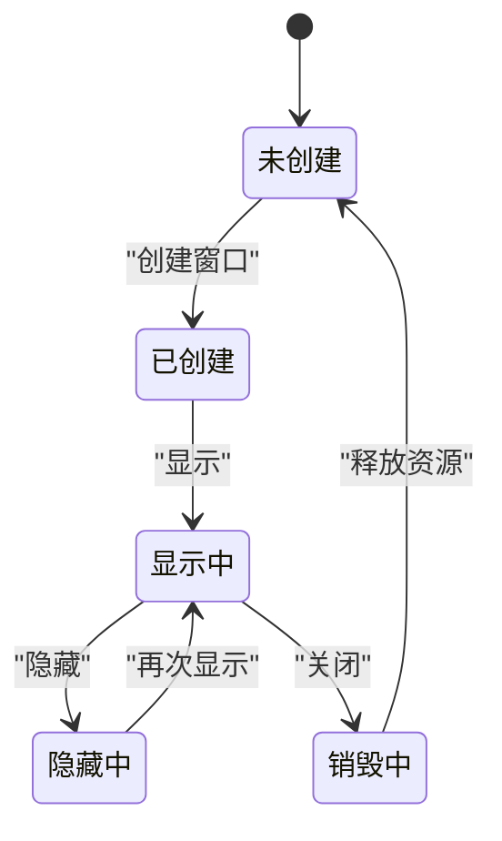
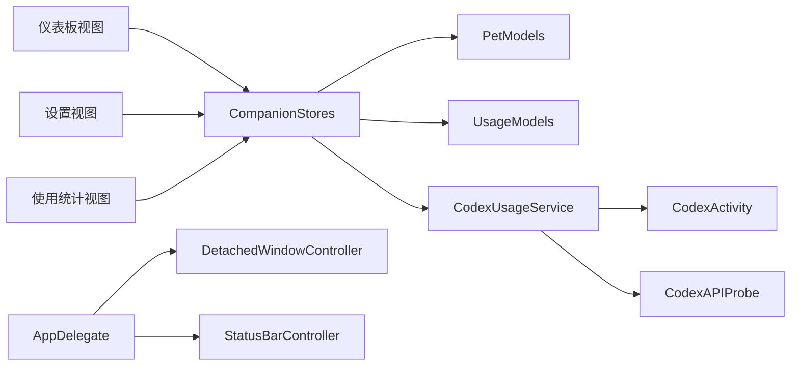

# 用户界面组件

<cite>
**本文引用的文件**   
- [AppDelegate.swift](file://app/Tomo/Sources/Tomo/AppDelegate.swift)
- [ApplicationMain.swift](file://app/Tomo/Sources/Tomo/ApplicationMain.swift)
- [AppSettings.swift](file://app/Tomo/Sources/Tomo/AppSettings.swift)
- [CompanionDashboardViews.swift](file://app/Tomo/Sources/Tomo/CompanionDashboardViews.swift)
- [CompanionStores.swift](file://app/Tomo/Sources/Tomo/CompanionStores.swift)
- [DetachedWindowController.swift](file://app/Tomo/Sources/Tomo/DetachedWindowController.swift)
- [PetModels.swift](file://app/Tomo/Sources/Tomo/PetModels.swift)
- [ResetCouponFusionViews.swift](file://app/Tomo/Sources/Tomo/ResetCouponFusionViews.swift)
- [SettingsViews.swift](file://app/Tomo/Sources/Tomo/SettingsViews.swift)
- [StatusBarController.swift](file://app/Tomo/Sources/Tomo/StatusBarController.swift)
- [UsageModels.swift](file://app/Tomo/Sources/Tomo/UsageModels.swift)
- [UsageViews.swift](file://app/Tomo/Sources/Tomo/UsageViews.swift)
- [CodexActivity.swift](file://app/Tomo/Sources/Tomo/CodexActivity.swift)
- [CodexUsageService.swift](file://app/Tomo/Sources/Tomo/CodexUsageService.swift)
- [CodexAPIProbe.swift](file://app/Tomo/Sources/Tomo/CodexAPIProbe.swift)
- [Package.swift](file://app/Tomo/Package.swift)
</cite>

## 目录
1. [简介](#简介)
2. [项目结构](#项目结构)
3. [核心组件](#核心组件)
4. [架构总览](#架构总览)
5. [详细组件分析](#详细组件分析)
6. [依赖关系分析](#依赖关系分析)
7. [性能考量](#性能考量)
8. [故障排查指南](#故障排查指南)
9. [结论](#结论)
10. [附录](#附录)

## 简介
本文件面向 SwiftUI 用户界面组件的设计与技术实现，聚焦于以下目标：
- 解释组件复用、状态管理与事件处理模式
- 详细说明仪表板视图、设置界面、使用统计视图与窗口控制器的实现要点
- 阐述响应式布局、主题适配与国际化支持策略
- 文档化样式定制、动画效果与交互反馈
- 提供 UI 扩展指南（新增组件与自定义样式）
- 覆盖无障碍访问、性能优化与跨平台兼容性最佳实践

## 项目结构
本项目采用模块化组织方式，SwiftUI 相关代码集中在 app/Tomo/Sources/Tomo 目录下。关键模块职责如下：
- 应用入口与生命周期：ApplicationMain、AppDelegate
- 窗口与菜单栏集成：DetachedWindowController、StatusBarController
- 数据模型与服务：PetModels、UsageModels、CodexUsageService、CodexActivity、CodexAPIProbe
- 状态与存储：CompanionStores
- 界面层：CompanionDashboardViews、SettingsViews、UsageViews、ResetCouponFusionViews

图表来源 
- [ApplicationMain.swift](file://app/Tomo/Sources/Tomo/ApplicationMain.swift)
- [AppDelegate.swift](file://app/Tomo/Sources/Tomo/AppDelegate.swift)
- [DetachedWindowController.swift](file://app/Tomo/Sources/Tomo/DetachedWindowController.swift)
- [StatusBarController.swift](file://app/Tomo/Sources/Tomo/StatusBarController.swift)
- [CompanionDashboardViews.swift](file://app/Tomo/Sources/Tomo/CompanionDashboardViews.swift)
- [SettingsViews.swift](file://app/Tomo/Sources/Tomo/SettingsViews.swift)
- [UsageViews.swift](file://app/Tomo/Sources/Tomo/UsageViews.swift)
- [ResetCouponFusionViews.swift](file://app/Tomo/Sources/Tomo/ResetCouponFusionViews.swift)
- [CompanionStores.swift](file://app/Tomo/Sources/Tomo/CompanionStores.swift)
- [PetModels.swift](file://app/Tomo/Sources/Tomo/PetModels.swift)
- [UsageModels.swift](file://app/Tomo/Sources/Tomo/UsageModels.swift)
- [CodexUsageService.swift](file://app/Tomo/Sources/Tomo/CodexUsageService.swift)
- [CodexActivity.swift](file://app/Tomo/Sources/Tomo/CodexActivity.swift)
- [CodexAPIProbe.swift](file://app/Tomo/Sources/Tomo/CodexAPIProbe.swift)

章节来源
- [Package.swift](file://app/Tomo/Package.swift)

## 核心组件
- 应用入口与生命周期
  - ApplicationMain：负责应用启动与根视图装配
  - AppDelegate：系统事件桥接（如后台任务、通知等）
- 窗口与菜单栏
  - DetachedWindowController：管理独立窗口的创建、显示与销毁
  - StatusBarController：菜单栏图标与菜单项的交互
- 数据与服务
  - PetModels：宠物伴侣相关的数据模型
  - UsageModels：使用统计相关的数据模型
  - CodexUsageService：聚合使用数据的采集与上报
  - CodexActivity：活动记录与追踪
  - CodexAPIProbe：外部 API 探测与健康检查
- 状态与存储
  - CompanionStores：集中化的状态容器，供各视图订阅与更新
- 界面层
  - CompanionDashboardViews：仪表盘主界面
  - SettingsViews：设置界面
  - UsageViews：使用统计视图
  - ResetCouponFusionViews：优惠券重置融合界面

章节来源
- [ApplicationMain.swift](file://app/Tomo/Sources/Tomo/ApplicationMain.swift)
- [AppDelegate.swift](file://app/Tomo/Sources/Tomo/AppDelegate.swift)
- [DetachedWindowController.swift](file://app/Tomo/Sources/Tomo/DetachedWindowController.swift)
- [StatusBarController.swift](file://app/Tomo/Sources/Tomo/StatusBarController.swift)
- [CompanionDashboardViews.swift](file://app/Tomo/Sources/Tomo/CompanionDashboardViews.swift)
- [SettingsViews.swift](file://app/Tomo/Sources/Tomo/SettingsViews.swift)
- [UsageViews.swift](file://app/Tomo/Sources/Tomo/UsageViews.swift)
- [ResetCouponFusionViews.swift](file://app/Tomo/Sources/Tomo/ResetCouponFusionViews.swift)
- [CompanionStores.swift](file://app/Tomo/Sources/Tomo/CompanionStores.swift)
- [PetModels.swift](file://app/Tomo/Sources/Tomo/PetModels.swift)
- [UsageModels.swift](file://app/Tomo/Sources/Tomo/UsageModels.swift)
- [CodexUsageService.swift](file://app/Tomo/Sources/Tomo/CodexUsageService.swift)
- [CodexActivity.swift](file://app/Tomo/Sources/Tomo/CodexActivity.swift)
- [CodexAPIProbe.swift](file://app/Tomo/Sources/Tomo/CodexAPIProbe.swift)

## 架构总览
整体采用“视图-状态-服务”分层：
- 视图层（SwiftUI Views）：声明式 UI，通过 @StateObject/@ObservedObject 订阅状态变化
- 状态层（CompanionStores）：集中管理应用状态，提供可观察的数据源
- 服务层（CodexUsageService、CodexActivity、CodexAPIProbe）：封装业务逻辑与外部交互
- 窗口与菜单（DetachedWindowController、StatusBarController）：与 macOS 系统集成

图表来源 
- [ApplicationMain.swift](file://app/Tomo/Sources/Tomo/ApplicationMain.swift)
- [AppDelegate.swift](file://app/Tomo/Sources/Tomo/AppDelegate.swift)
- [DetachedWindowController.swift](file://app/Tomo/Sources/Tomo/DetachedWindowController.swift)
- [StatusBarController.swift](file://app/Tomo/Sources/Tomo/StatusBarController.swift)
- [CompanionDashboardViews.swift](file://app/Tomo/Sources/Tomo/CompanionDashboardViews.swift)
- [SettingsViews.swift](file://app/Tomo/Sources/Tomo/SettingsViews.swift)
- [UsageViews.swift](file://app/Tomo/Sources/Tomo/UsageViews.swift)
- [CompanionStores.swift](file://app/Tomo/Sources/Tomo/CompanionStores.swift)
- [PetModels.swift](file://app/Tomo/Sources/Tomo/PetModels.swift)
- [UsageModels.swift](file://app/Tomo/Sources/Tomo/UsageModels.swift)
- [CodexUsageService.swift](file://app/Tomo/Sources/Tomo/CodexUsageService.swift)
- [CodexActivity.swift](file://app/Tomo/Sources/Tomo/CodexActivity.swift)
- [CodexAPIProbe.swift](file://app/Tomo/Sources/Tomo/CodexAPIProbe.swift)

## 详细组件分析

### 仪表板视图（CompanionDashboardViews）
- 设计要点
  - 以卡片式布局呈现关键指标与快捷操作
  - 通过状态绑定实现实时更新（如计数、进度、状态切换）
  - 响应式网格在不同屏幕尺寸下自适应排列
- 状态管理
  - 使用共享 Store 订阅核心指标，避免重复计算
  - 局部 @State 用于临时交互（如弹窗开关）
- 事件处理
  - 按钮点击触发服务调用（如刷新数据、打开设置）
  - 键盘快捷键与手势支持提升效率
- 样式与动画
  - 统一颜色与字体风格，支持深色模式
  - 过渡动画与加载指示器增强反馈
- 无障碍
  - 为关键控件添加标签与提示
  - 确保焦点顺序合理

图表来源 
- [CompanionDashboardViews.swift](file://app/Tomo/Sources/Tomo/CompanionDashboardViews.swift)
- [CompanionStores.swift](file://app/Tomo/Sources/Tomo/CompanionStores.swift)
- [CodexUsageService.swift](file://app/Tomo/Sources/Tomo/CodexUsageService.swift)
- [CodexActivity.swift](file://app/Tomo/Sources/Tomo/CodexActivity.swift)

章节来源
- [CompanionDashboardViews.swift](file://app/Tomo/Sources/Tomo/CompanionDashboardViews.swift)
- [CompanionStores.swift](file://app/Tomo/Sources/Tomo/CompanionStores.swift)
- [CodexUsageService.swift](file://app/Tomo/Sources/Tomo/CodexUsageService.swift)
- [CodexActivity.swift](file://app/Tomo/Sources/Tomo/CodexActivity.swift)

### 设置界面（SettingsViews）
- 设计要点
  - 分组展示配置项（外观、行为、网络等）
  - 实时预览与默认值恢复
- 状态管理
  - 配置项映射到持久化存储（UserDefaults/Keychain）
  - 变更即时生效或延迟提交
- 事件处理
  - 输入校验与错误提示
  - 批量导入/导出配置
- 样式与动画
  - 表单控件统一风格
  - 切换开关带动画反馈
- 无障碍
  - 每个设置项具备可读标签
  - 键盘导航友好

图表来源 
- [SettingsViews.swift](file://app/Tomo/Sources/Tomo/SettingsViews.swift)
- [AppSettings.swift](file://app/Tomo/Sources/Tomo/AppSettings.swift)

章节来源
- [SettingsViews.swift](file://app/Tomo/Sources/Tomo/SettingsViews.swift)
- [AppSettings.swift](file://app/Tomo/Sources/Tomo/AppSettings.swift)

### 使用统计视图（UsageViews）
- 设计要点
  - 图表展示趋势、分布与对比
  - 时间范围选择与数据筛选
- 状态管理
  - 缓存最近查询结果，减少重复请求
  - 分页与增量更新
- 事件处理
  - 点击图例切换系列显示
  - 导出报表功能
- 样式与动画
  - 平滑过渡与缩放动画
  - 空状态与错误状态占位
- 无障碍
  - 图表提供文本摘要
  - 高对比度与可放大

图表来源 
- [UsageViews.swift](file://app/Tomo/Sources/Tomo/UsageViews.swift)
- [CompanionStores.swift](file://app/Tomo/Sources/Tomo/CompanionStores.swift)
- [CodexUsageService.swift](file://app/Tomo/Sources/Tomo/CodexUsageService.swift)

章节来源
- [UsageViews.swift](file://app/Tomo/Sources/Tomo/UsageViews.swift)
- [UsageModels.swift](file://app/Tomo/Sources/Tomo/UsageModels.swift)
- [CompanionStores.swift](file://app/Tomo/Sources/Tomo/CompanionStores.swift)
- [CodexUsageService.swift](file://app/Tomo/Sources/Tomo/CodexUsageService.swift)

### 窗口控制器（DetachedWindowController）
- 设计要点
  - 独立窗口与主窗口解耦
  - 窗口大小与位置记忆
- 状态管理
  - 窗口可见性与层级管理
  - 事件转发至对应视图
- 事件处理
  - 关闭、最小化、全屏切换
  - 拖拽与调整大小
- 样式与动画
  - 窗口出现/消失动画
  - 阴影与圆角风格
- 无障碍
  - 窗口标题与角色描述
  - 键盘快捷键支持

图表来源 
- [DetachedWindowController.swift](file://app/Tomo/Sources/Tomo/DetachedWindowController.swift)

章节来源
- [DetachedWindowController.swift](file://app/Tomo/Sources/Tomo/DetachedWindowController.swift)

### 菜单栏控制器（StatusBarController）
- 设计要点
  - 菜单栏图标与菜单项动态更新
  - 快速操作入口（如打开设置、查看统计）
- 状态管理
  - 与 Store 同步状态（如在线/离线）
- 事件处理
  - 菜单项点击路由到相应视图
  - 快捷键绑定
- 样式与动画
  - 图标状态切换（如加载旋转）
- 无障碍
  - 菜单项标签清晰
  - 屏幕阅读器兼容

章节来源
- [StatusBarController.swift](file://app/Tomo/Sources/Tomo/StatusBarController.swift)

### 数据模型与服务（PetModels、UsageModels、CodexUsageService、CodexActivity、CodexAPIProbe）
- 设计要点
  - 模型定义清晰，便于序列化与校验
  - 服务层封装网络与本地存储
- 状态管理
  - 单例或依赖注入提供服务实例
  - 错误重试与降级策略
- 事件处理
  - 异步回调与取消机制
  - 日志与埋点
- 样式与动画
  - 无直接 UI，但影响加载态与错误态
- 无障碍
  - 错误信息可读性

章节来源
- [PetModels.swift](file://app/Tomo/Sources/Tomo/PetModels.swift)
- [UsageModels.swift](file://app/Tomo/Sources/Tomo/UsageModels.swift)
- [CodexUsageService.swift](file://app/Tomo/Sources/Tomo/CodexUsageService.swift)
- [CodexActivity.swift](file://app/Tomo/Sources/Tomo/CodexActivity.swift)
- [CodexAPIProbe.swift](file://app/Tomo/Sources/Tomo/CodexAPIProbe.swift)

### 优惠券重置融合界面（ResetCouponFusionViews）
- 设计要点
  - 多步骤流程引导用户完成重置
  - 进度指示与回退支持
- 状态管理
  - 步骤状态与中间结果缓存
- 事件处理
  - 下一步/上一步导航
  - 确认与取消
- 样式与动画
  - 页面切换动画
  - 成功/失败反馈
- 无障碍
  - 步骤说明与焦点管理

章节来源
- [ResetCouponFusionViews.swift](file://app/Tomo/Sources/Tomo/ResetCouponFusionViews.swift)

## 依赖关系分析
- 视图依赖 Store，Store 依赖模型与服务
- 服务之间通过活动记录与 API 探测进行协作
- 窗口与菜单控制器作为系统集成的桥梁，不直接耦合业务逻辑

图表来源 
- [CompanionDashboardViews.swift](file://app/Tomo/Sources/Tomo/CompanionDashboardViews.swift)
- [SettingsViews.swift](file://app/Tomo/Sources/Tomo/SettingsViews.swift)
- [UsageViews.swift](file://app/Tomo/Sources/Tomo/UsageViews.swift)
- [CompanionStores.swift](file://app/Tomo/Sources/Tomo/CompanionStores.swift)
- [PetModels.swift](file://app/Tomo/Sources/Tomo/PetModels.swift)
- [UsageModels.swift](file://app/Tomo/Sources/Tomo/UsageModels.swift)
- [CodexUsageService.swift](file://app/Tomo/Sources/Tomo/CodexUsageService.swift)
- [CodexActivity.swift](file://app/Tomo/Sources/Tomo/CodexActivity.swift)
- [CodexAPIProbe.swift](file://app/Tomo/Sources/Tomo/CodexAPIProbe.swift)
- [AppDelegate.swift](file://app/Tomo/Sources/Tomo/AppDelegate.swift)
- [DetachedWindowController.swift](file://app/Tomo/Sources/Tomo/DetachedWindowController.swift)
- [StatusBarController.swift](file://app/Tomo/Sources/Tomo/StatusBarController.swift)

章节来源
- [CompanionDashboardViews.swift](file://app/Tomo/Sources/Tomo/CompanionDashboardViews.swift)
- [SettingsViews.swift](file://app/Tomo/Sources/Tomo/SettingsViews.swift)
- [UsageViews.swift](file://app/Tomo/Sources/Tomo/UsageViews.swift)
- [CompanionStores.swift](file://app/Tomo/Sources/Tomo/CompanionStores.swift)
- [PetModels.swift](file://app/Tomo/Sources/Tomo/PetModels.swift)
- [UsageModels.swift](file://app/Tomo/Sources/Tomo/UsageModels.swift)
- [CodexUsageService.swift](file://app/Tomo/Sources/Tomo/CodexUsageService.swift)
- [CodexActivity.swift](file://app/Tomo/Sources/Tomo/CodexActivity.swift)
- [CodexAPIProbe.swift](file://app/Tomo/Sources/Tomo/CodexAPIProbe.swift)
- [AppDelegate.swift](file://app/Tomo/Sources/Tomo/AppDelegate.swift)
- [DetachedWindowController.swift](file://app/Tomo/Sources/Tomo/DetachedWindowController.swift)
- [StatusBarController.swift](file://app/Tomo/Sources/Tomo/StatusBarController.swift)

## 性能考量
- 视图层
  - 使用惰性加载与分页减少初始渲染压力
  - 避免在列表滚动时执行重计算
- 状态层
  - 合并频繁更新的状态，降低重绘频率
  - 使用只读快照避免不必要的订阅
- 服务层
  - 请求去抖与节流，防止重复调用
  - 缓存热点数据并设置过期策略
- 窗口与菜单
  - 延迟创建非关键窗口
  - 菜单项按需生成

[本节为通用指导，无需特定文件引用]

## 故障排查指南
- 常见问题定位
  - 数据不更新：检查 Store 订阅与状态派发
  - 界面卡顿：排查重绘热点与阻塞调用
  - 网络错误：查看 API 探测日志与重试策略
- 调试建议
  - 启用详细日志与埋点
  - 使用断点与内存分析工具
- 恢复策略
  - 提供重试与降级路径
  - 保留用户操作上下文以便恢复

章节来源
- [CodexAPIProbe.swift](file://app/Tomo/Sources/Tomo/CodexAPIProbe.swift)
- [CodexUsageService.swift](file://app/Tomo/Sources/Tomo/CodexUsageService.swift)
- [CompanionStores.swift](file://app/Tomo/Sources/Tomo/CompanionStores.swift)

## 结论
本项目的 SwiftUI 界面组件遵循清晰的“视图-状态-服务”分层架构，具备良好的可扩展性与可维护性。通过统一的 Store 管理状态、服务层封装业务逻辑、窗口与菜单控制器对接系统能力，实现了响应式、主题化与可无障碍访问的用户体验。建议在后续迭代中持续优化性能与用户体验，完善国际化与跨平台适配。

[本节为总结性内容，无需特定文件引用]

## 附录
- 扩展指南
  - 新增界面组件：定义视图结构，绑定 Store 状态，处理用户事件
  - 自定义样式：建立样式变量与主题切换机制
  - 动画与反馈：使用过渡与提示增强交互
  - 无障碍：为所有交互元素提供标签与提示
- 最佳实践
  - 保持组件单一职责
  - 避免深层嵌套与过度渲染
  - 使用类型安全的数据流

[本节为概念性内容，无需特定文件引用]