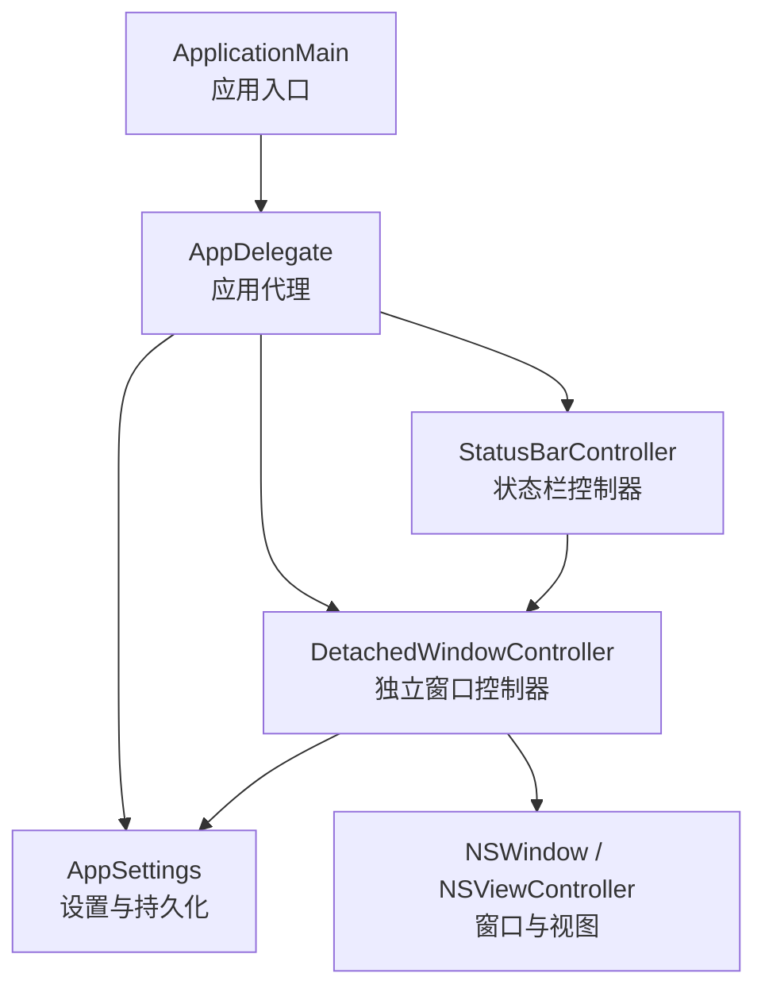
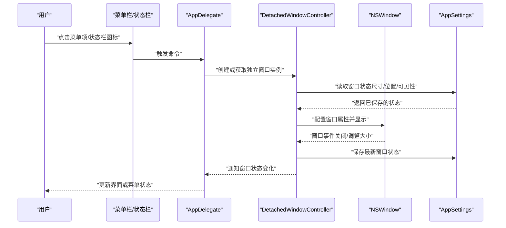
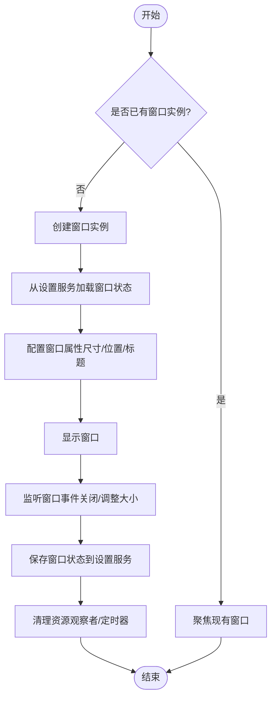
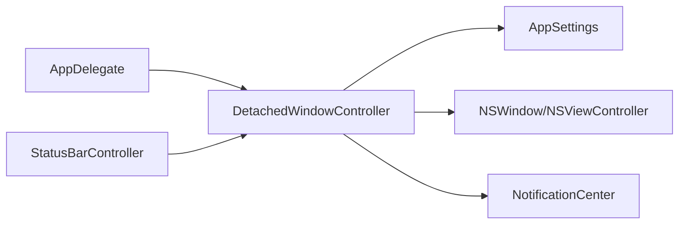

# 窗口控制器组件

<cite>
**本文引用的文件**   
- [DetachedWindowController.swift](file://app/Tomo/Sources/Tomo/DetachedWindowController.swift)
- [AppDelegate.swift](file://app/Tomo/Sources/Tomo/AppDelegate.swift)
- [ApplicationMain.swift](file://app/Tomo/Sources/Tomo/ApplicationMain.swift)
- [AppSettings.swift](file://app/Tomo/Sources/Tomo/AppSettings.swift)
- [StatusBarController.swift](file://app/Tomo/Sources/Tomo/StatusBarController.swift)
</cite>

## 目录
1. [简介](#简介)
2. [项目结构](#项目结构)
3. [核心组件](#核心组件)
4. [架构总览](#架构总览)
5. [详细组件分析](#详细组件分析)
6. [依赖关系分析](#依赖关系分析)
7. [性能考量](#性能考量)
8. [故障排查指南](#故障排查指南)
9. [结论](#结论)
10. [附录：扩展开发指南](#附录扩展开发指南)

## 简介
本技术文档聚焦于独立窗口控制器组件，围绕 DetachedWindowController.swift 所实现的独立窗口管理功能展开。内容涵盖窗口生命周期管理、窗口状态保持与恢复、多窗口协调、与主应用的通信机制（事件传递与数据共享）、窗口布局与尺寸调整、位置记忆、安全策略与权限管理、资源清理，以及新窗口类型的扩展与集成实践。目标是帮助开发者快速理解并安全地扩展该组件的能力。

## 项目结构
本项目采用 Swift 原生 macOS 应用结构，窗口控制器位于 app/Tomo/Sources/Tomo 目录下，与应用程序入口、设置、状态栏等模块并列组织。关键文件包括：
- 独立窗口控制器：负责创建、配置、管理与销毁独立窗口实例
- 应用入口与代理：负责应用启动、全局状态、菜单与通知分发
- 设置服务：持久化窗口布局、尺寸、位置等用户偏好
- 状态栏控制器：提供系统级交互入口，可能触发独立窗口打开或关闭

图表来源
- [ApplicationMain.swift](file://app/Tomo/Sources/Tomo/ApplicationMain.swift)
- [AppDelegate.swift](file://app/Tomo/Sources/Tomo/AppDelegate.swift)
- [DetachedWindowController.swift](file://app/Tomo/Sources/Tomo/DetachedWindowController.swift)
- [AppSettings.swift](file://app/Tomo/Sources/Tomo/AppSettings.swift)
- [StatusBarController.swift](file://app/Tomo/Sources/Tomo/StatusBarController.swift)

章节来源
- [ApplicationMain.swift](file://app/Tomo/Sources/Tomo/ApplicationMain.swift)
- [AppDelegate.swift](file://app/Tomo/Sources/Tomo/AppDelegate.swift)
- [DetachedWindowController.swift](file://app/Tomo/Sources/Tomo/DetachedWindowController.swift)
- [AppSettings.swift](file://app/Tomo/Sources/Tomo/AppSettings.swift)
- [StatusBarController.swift](file://app/Tomo/Sources/Tomo/StatusBarController.swift)

## 核心组件
- 独立窗口控制器（DetachedWindowController）
  - 职责：创建与管理独立窗口实例，维护窗口生命周期，处理窗口显示/隐藏、尺寸与位置记忆，响应主应用事件，协调多窗口行为。
  - 关键能力：
    - 窗口生命周期：初始化、显示、隐藏、关闭、销毁
    - 状态保持：记录窗口大小、位置、可见性、标签页或面板状态
    - 多窗口协调：避免重复创建、统一焦点管理、事件广播
    - 与主应用通信：通过通知中心或委托回调进行事件传递与数据共享
    - 布局与尺寸：支持最小/最大尺寸约束、自适应布局、屏幕适配
    - 位置记忆：基于设置服务持久化窗口坐标与尺寸
    - 安全策略：权限校验、输入验证、敏感操作确认
    - 资源清理：释放观察者、定时器、网络请求与子视图资源

- 应用代理（AppDelegate）
  - 职责：应用启动、菜单注册、全局事件分发、窗口管理器协调
  - 与窗口控制器的协作：在需要时创建或获取独立窗口实例，转发系统事件（如 Dock 点击、菜单栏命令）

- 设置服务（AppSettings）
  - 职责：读写用户偏好，持久化窗口布局、尺寸、位置、主题等
  - 与窗口控制器的协作：保存/恢复窗口状态，提供默认值

- 状态栏控制器（StatusBarController）
  - 职责：提供系统状态栏入口，触发独立窗口打开/关闭、切换模式
  - 与窗口控制器的协作：调用控制器方法以打开或聚焦特定窗口

章节来源
- [DetachedWindowController.swift](file://app/Tomo/Sources/Tomo/DetachedWindowController.swift)
- [AppDelegate.swift](file://app/Tomo/Sources/Tomo/AppDelegate.swift)
- [AppSettings.swift](file://app/Tomo/Sources/Tomo/AppSettings.swift)
- [StatusBarController.swift](file://app/Tomo/Sources/Tomo/StatusBarController.swift)

## 架构总览
独立窗口控制器作为“窗口管理层”，向上对接应用代理与状态栏控制器，向下管理 NSWindow 及其视图控制器，并通过设置服务实现状态持久化。整体遵循“单一职责 + 分层解耦”的设计原则，确保窗口逻辑与业务逻辑分离。

图表来源
- [AppDelegate.swift](file://app/Tomo/Sources/Tomo/AppDelegate.swift)
- [DetachedWindowController.swift](file://app/Tomo/Sources/Tomo/DetachedWindowController.swift)
- [AppSettings.swift](file://app/Tomo/Sources/Tomo/AppSettings.swift)

## 详细组件分析

### 独立窗口控制器（DetachedWindowController）
- 设计要点
  - 单例或工厂模式：保证同一类型窗口仅存在一个实例，避免重复创建
  - 生命周期钩子：willAppear、didAppear、willClose、didClose 等，用于状态同步与资源管理
  - 事件总线：使用通知中心或自定义事件队列，实现跨模块通信
  - 状态快照：在窗口关闭或退出前，自动保存当前布局与尺寸到设置服务
  - 多窗口协调：根据窗口类型或标签，决定显示、隐藏或聚焦已有窗口

- 关键流程
  - 窗口创建与显示：检查是否存在实例 -> 若不存在则创建并配置 -> 从设置服务加载状态 -> 显示窗口
  - 窗口关闭与销毁：触发关闭回调 -> 保存状态 -> 释放观察者与定时器 -> 置空引用以便垃圾回收
  - 尺寸与位置记忆：监听窗口调整事件 -> 计算有效区域 -> 写入设置服务
  - 与主应用通信：发送窗口状态变更通知 -> 主应用更新菜单项或状态栏

图表来源
- [DetachedWindowController.swift](file://app/Tomo/Sources/Tomo/DetachedWindowController.swift)
- [AppSettings.swift](file://app/Tomo/Sources/Tomo/AppSettings.swift)

章节来源
- [DetachedWindowController.swift](file://app/Tomo/Sources/Tomo/DetachedWindowController.swift)
- [AppSettings.swift](file://app/Tomo/Sources/Tomo/AppSettings.swift)

### 应用代理（AppDelegate）
- 职责
  - 应用启动时注册菜单项与快捷键
  - 处理系统事件（如 Dock 点击、URL Scheme）
  - 协调窗口控制器与状态栏控制器
  - 分发全局通知（如窗口状态变化、主题切换）

- 与窗口控制器的协作
  - 当用户通过菜单或状态栏触发窗口操作时，调用窗口控制器的公开接口
  - 接收窗口控制器的状态变更通知，更新 UI 或执行后续逻辑

章节来源
- [AppDelegate.swift](file://app/Tomo/Sources/Tomo/AppDelegate.swift)

### 设置服务（AppSettings）
- 职责
  - 提供统一的偏好读写接口
  - 持久化窗口布局、尺寸、位置、主题、语言等设置
  - 提供默认值与迁移逻辑

- 与窗口控制器的协作
  - 窗口控制器在显示前读取状态，在关闭或调整大小时保存状态
  - 支持批量导入/导出设置，便于备份与迁移

章节来源
- [AppSettings.swift](file://app/Tomo/Sources/Tomo/AppSettings.swift)

### 状态栏控制器（StatusBarController）
- 职责
  - 管理系统状态栏图标与菜单
  - 响应用户交互（点击、右键菜单）
  - 触发独立窗口打开/关闭、切换模式

- 与窗口控制器的协作
  - 调用窗口控制器的打开/关闭接口
  - 订阅窗口状态变更通知，更新状态栏图标或菜单项

章节来源
- [StatusBarController.swift](file://app/Tomo/Sources/Tomo/StatusBarController.swift)

## 依赖关系分析
- 组件耦合度
  - 窗口控制器依赖设置服务进行状态持久化，耦合度低且职责清晰
  - 应用代理与状态栏控制器通过公开接口与窗口控制器交互，避免直接访问内部实现
- 外部依赖
  - NSWindow、NSViewController：系统窗口与视图框架
  - UserDefaults 或类似存储：用于设置持久化
  - NotificationCenter：用于事件广播与订阅
- 潜在循环依赖
  - 应避免窗口控制器反向依赖应用代理的具体实现，建议使用协议或事件驱动

图表来源
- [AppDelegate.swift](file://app/Tomo/Sources/Tomo/AppDelegate.swift)
- [DetachedWindowController.swift](file://app/Tomo/Sources/Tomo/DetachedWindowController.swift)
- [AppSettings.swift](file://app/Tomo/Sources/Tomo/AppSettings.swift)
- [StatusBarController.swift](file://app/Tomo/Sources/Tomo/StatusBarController.swift)

章节来源
- [AppDelegate.swift](file://app/Tomo/Sources/Tomo/AppDelegate.swift)
- [DetachedWindowController.swift](file://app/Tomo/Sources/Tomo/DetachedWindowController.swift)
- [AppSettings.swift](file://app/Tomo/Sources/Tomo/AppSettings.swift)
- [StatusBarController.swift](file://app/Tomo/Sources/Tomo/StatusBarController.swift)

## 性能考量
- 窗口创建与销毁
  - 避免频繁创建/销毁窗口实例，建议复用或延迟初始化
  - 在关闭窗口时及时释放观察者与定时器，防止内存泄漏
- 状态持久化
  - 批量写入设置，减少磁盘 I/O 频率
  - 使用异步写入，避免阻塞主线程
- 事件分发
  - 合理订阅与取消订阅通知，避免不必要的回调开销
  - 对高频事件进行节流或合并处理
- 布局与渲染
  - 避免在窗口调整大小时进行复杂计算，可延迟到空闲时机
  - 使用懒加载视图，按需加载重型资源

[本节为通用性能指导，不直接分析具体文件]

## 故障排查指南
- 常见问题
  - 窗口无法显示：检查实例是否已被销毁、设置服务是否可用、权限是否允许
  - 状态未保存：确认保存逻辑是否在正确时机触发，检查设置服务的写入权限
  - 多窗口冲突：确保窗口类型唯一性，避免重复创建
  - 内存泄漏：检查观察者与定时器是否正确移除，视图控制器是否释放
- 调试技巧
  - 添加日志输出，记录窗口生命周期关键节点
  - 使用 Xcode 的内存诊断工具检测泄漏
  - 模拟异常场景（如设置损坏、权限不足），验证容错逻辑

章节来源
- [DetachedWindowController.swift](file://app/Tomo/Sources/Tomo/DetachedWindowController.swift)
- [AppSettings.swift](file://app/Tomo/Sources/Tomo/AppSettings.swift)

## 结论
独立窗口控制器组件通过清晰的分层设计与职责划分，实现了稳定的窗口生命周期管理、状态持久化与多窗口协调。结合应用代理与设置服务，形成了可扩展、易维护的窗口管理体系。遵循本文档的最佳实践与安全策略，可有效提升用户体验与系统稳定性。

[本节为总结性内容，不直接分析具体文件]

## 附录：扩展开发指南
- 新增窗口类型步骤
  - 定义新的窗口控制器类，继承或组合现有窗口控制器基类
  - 实现窗口生命周期钩子，处理显示、隐藏、关闭等事件
  - 集成设置服务，定义并持久化新窗口的专属状态
  - 在应用代理中注册新窗口的菜单项与快捷键
  - 在状态栏控制器中添加触发入口
- 集成示例
  - 创建新窗口实例：通过工厂方法或单例获取实例
  - 打开窗口：调用公开接口，传入必要参数（如窗口类型、初始数据）
  - 事件通信：使用通知中心或委托回调，向主应用或其他模块广播事件
  - 资源清理：在窗口关闭时，确保释放所有观察者、定时器与网络请求
- 最佳实践
  - 保持窗口控制器职责单一，避免混入业务逻辑
  - 使用协议抽象，提高可测试性与可替换性
  - 对用户输入进行严格校验，防止非法状态
  - 提供清晰的错误提示与回退机制

[本节为概念性指导，不直接分析具体文件]