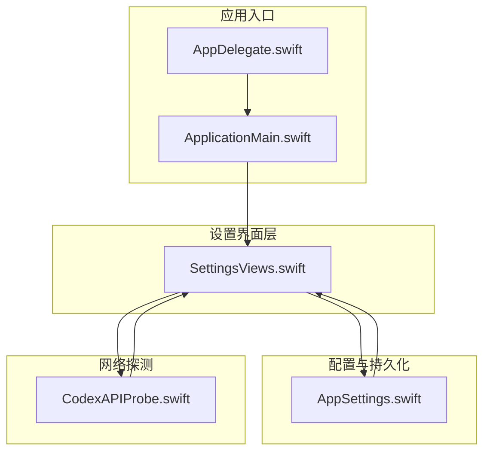
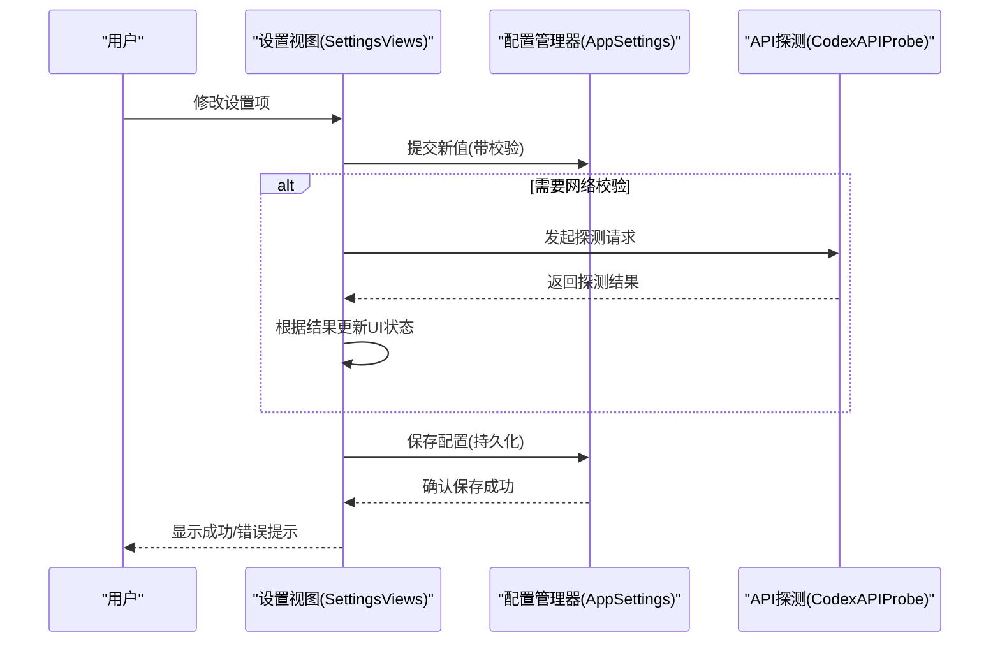
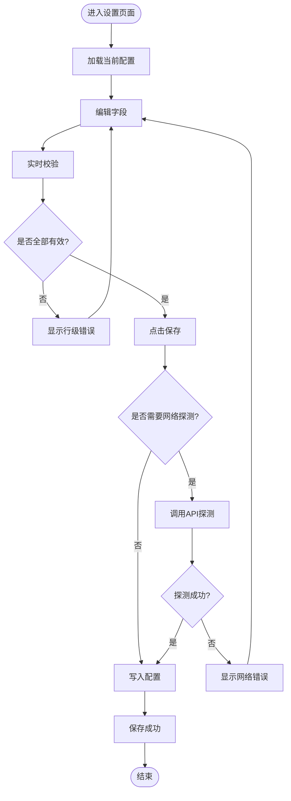
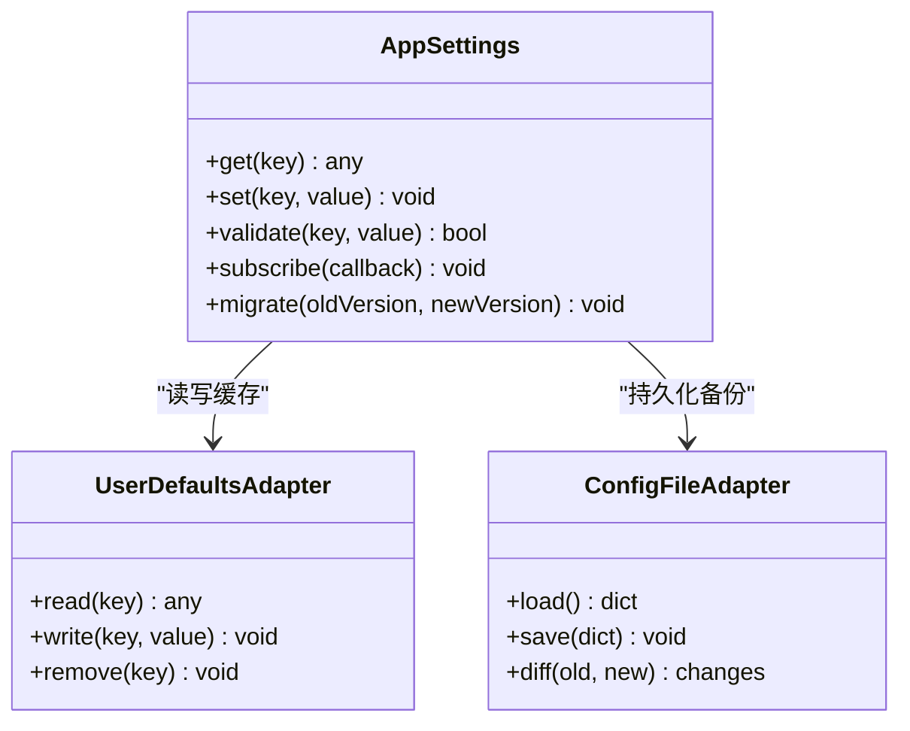
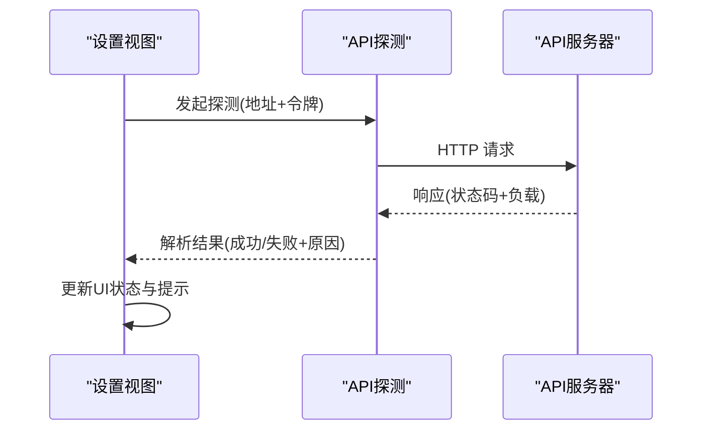
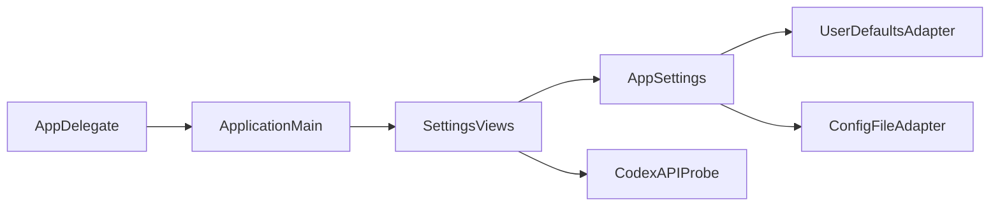

# 设置界面组件

<cite>
**本文引用的文件**   
- [SettingsViews.swift](file://app/Tomo/Sources/Tomo/SettingsViews.swift)
- [AppSettings.swift](file://app/Tomo/Sources/Tomo/AppSettings.swift)
- [CodexAPIProbe.swift](file://app/Tomo/Sources/Tomo/CodexAPIProbe.swift)
- [ApplicationMain.swift](file://app/Tomo/Sources/Tomo/ApplicationMain.swift)
- [AppDelegate.swift](file://app/Tomo/Sources/Tomo/AppDelegate.swift)
</cite>

## 目录
1. [简介](#简介)
2. [项目结构](#项目结构)
3. [核心组件](#核心组件)
4. [架构总览](#架构总览)
5. [详细组件分析](#详细组件分析)
6. [依赖分析](#依赖分析)
7. [性能考虑](#性能考虑)
8. [故障排查指南](#故障排查指南)
9. [结论](#结论)
10. [附录](#附录)

## 简介
本文件为“设置界面组件”的全面设计与技术文档，聚焦于 SettingsViews.swift 中实现的各种设置选项界面，包括应用配置、API 设置、主题选择与偏好设置。文档涵盖表单验证、数据持久化、设置同步机制、用户输入处理、错误提示与保存流程；并总结界面布局模式、可访问性支持与多语言适配策略。最后提供自定义设置项的扩展指南，包含表单组件复用与验证规则的实现示例路径。

## 项目结构
- 设置界面位于 app/Tomo/Sources/Tomo/SettingsViews.swift，采用 SwiftUI 构建，按功能分块组织：应用配置、API 设置、主题选择、偏好设置等。
- 应用配置与持久化由 AppSettings.swift 管理，负责读取/写入 UserDefaults 或配置文件，并提供类型安全的访问接口。
- API 探测与连通性校验由 CodexAPIProbe.swift 提供，用于在设置页面对 API 地址与密钥进行在线验证。
- 入口与生命周期由 ApplicationMain.swift 与 AppDelegate.swift 协调，确保设置变更在应用启动时生效。

图表来源
- [SettingsViews.swift](file://app/Tomo/Sources/Tomo/SettingsViews.swift)
- [AppSettings.swift](file://app/Tomo/Sources/Tomo/AppSettings.swift)
- [CodexAPIProbe.swift](file://app/Tomo/Sources/Tomo/CodexAPIProbe.swift)
- [ApplicationMain.swift](file://app/Tomo/Sources/Tomo/ApplicationMain.swift)
- [AppDelegate.swift](file://app/Tomo/Sources/Tomo/AppDelegate.swift)

章节来源
- [SettingsViews.swift](file://app/Tomo/Sources/Tomo/SettingsViews.swift)
- [AppSettings.swift](file://app/Tomo/Sources/Tomo/AppSettings.swift)
- [CodexAPIProbe.swift](file://app/Tomo/Sources/Tomo/CodexAPIProbe.swift)
- [ApplicationMain.swift](file://app/Tomo/Sources/Tomo/ApplicationMain.swift)
- [AppDelegate.swift](file://app/Tomo/Sources/Tomo/AppDelegate.swift)

## 核心组件
- 设置视图集合（SettingsViews）
  - 应用配置：基础运行参数、窗口行为、自动更新开关等。
  - API 设置：端点地址、鉴权令牌、超时与重试策略。
  - 主题选择：系统跟随、浅色、深色及自定义主题。
  - 偏好设置：默认模型、输出格式、日志级别、快捷键等。
- 配置管理器（AppSettings）
  - 统一读写配置键值，提供类型安全访问器与默认值。
  - 支持热更新与跨视图同步（通过 Combine/通知中心）。
- API 探测服务（CodexAPIProbe）
  - 对 API 地址与令牌进行连通性与有效性检查。
  - 返回结构化结果供设置界面展示成功/失败状态。

章节来源
- [SettingsViews.swift](file://app/Tomo/Sources/Tomo/SettingsViews.swift)
- [AppSettings.swift](file://app/Tomo/Sources/Tomo/AppSettings.swift)
- [CodexAPIProbe.swift](file://app/Tomo/Sources/Tomo/CodexAPIProbe.swift)

## 架构总览
设置界面采用分层架构：UI 层（SwiftUI 视图）→ 业务逻辑层（配置管理与 API 探测）→ 持久化层（UserDefaults/配置文件）。视图通过绑定与回调驱动配置更新，配置层负责校验与持久化，并在必要时触发网络探测。

图表来源
- [SettingsViews.swift](file://app/Tomo/Sources/Tomo/SettingsViews.swift)
- [AppSettings.swift](file://app/Tomo/Sources/Tomo/AppSettings.swift)
- [CodexAPIProbe.swift](file://app/Tomo/Sources/Tomo/CodexAPIProbe.swift)

## 详细组件分析

### 设置视图（SettingsViews）
- 界面组织
  - 使用分组与标签页划分“应用配置”“API 设置”“主题选择”“偏好设置”。
  - 每个分组内以表单形式呈现字段，支持即时预览与回滚。
- 表单验证
  - 实时校验：URL 格式、必填项、数值范围、正则匹配。
  - 提交前二次校验：聚合所有字段错误并高亮提示。
- 用户输入处理
  - 防抖与节流：避免频繁触发保存与网络请求。
  - 撤销/重做：保留最近一次有效快照，支持快速恢复。
- 错误提示
  - 行级错误：字段下方显示具体原因。
  - 全局错误：弹窗或横幅提示，区分网络错误与本地校验错误。
- 保存流程
  - 先本地校验 → 可选网络探测 → 写入配置 → 刷新相关视图 → 反馈结果。

图表来源
- [SettingsViews.swift](file://app/Tomo/Sources/Tomo/SettingsViews.swift)

章节来源
- [SettingsViews.swift](file://app/Tomo/Sources/Tomo/SettingsViews.swift)

### 配置管理器（AppSettings）
- 职责
  - 定义配置键空间与默认值。
  - 提供类型安全的 get/set 方法。
  - 监听配置变化并广播事件，驱动 UI 同步。
- 数据持久化
  - 优先写入 UserDefaults，必要时落盘到配置文件。
  - 支持迁移策略：版本升级时自动转换旧键名。
- 同步机制
  - 基于 Combine/Publisher 或 NSNotificationCenter 发布配置变更。
  - 订阅者（如主题切换、API 客户端）自动响应。

图表来源
- [AppSettings.swift](file://app/Tomo/Sources/Tomo/AppSettings.swift)

章节来源
- [AppSettings.swift](file://app/Tomo/Sources/Tomo/AppSettings.swift)

### API 探测服务（CodexAPIProbe）
- 功能
  - 校验 API 地址可达性与响应码。
  - 验证鉴权令牌的有效性（如 401/403 判定）。
  - 统计延迟与错误率，辅助用户选择最佳端点。
- 错误分类
  - 网络错误：DNS、超时、连接失败。
  - 认证错误：令牌过期、权限不足。
  - 服务端错误：5xx 状态码与业务错误码。

图表来源
- [CodexAPIProbe.swift](file://app/Tomo/Sources/Tomo/CodexAPIProbe.swift)
- [SettingsViews.swift](file://app/Tomo/Sources/Tomo/SettingsViews.swift)

章节来源
- [CodexAPIProbe.swift](file://app/Tomo/Sources/Tomo/CodexAPIProbe.swift)
- [SettingsViews.swift](file://app/Tomo/Sources/Tomo/SettingsViews.swift)

### 应用入口与生命周期（ApplicationMain / AppDelegate）
- ApplicationMain
  - 初始化应用环境、加载初始配置、创建主窗口与根视图。
- AppDelegate
  - 处理应用生命周期事件（前台/后台、退出），确保设置变更在合适时机生效。
  - 注册全局通知与观察者，保证设置同步一致性。

章节来源
- [ApplicationMain.swift](file://app/Tomo/Sources/Tomo/ApplicationMain.swift)
- [AppDelegate.swift](file://app/Tomo/Sources/Tomo/AppDelegate.swift)

## 依赖分析
- 视图层依赖配置管理器与 API 探测服务，不直接操作底层存储。
- 配置管理器抽象了存储适配器，屏蔽 UserDefaults 与文件系统的差异。
- API 探测服务独立于 UI，便于单元测试与替换实现。

图表来源
- [SettingsViews.swift](file://app/Tomo/Sources/Tomo/SettingsViews.swift)
- [AppSettings.swift](file://app/Tomo/Sources/Tomo/AppSettings.swift)
- [CodexAPIProbe.swift](file://app/Tomo/Sources/Tomo/CodexAPIProbe.swift)
- [ApplicationMain.swift](file://app/Tomo/Sources/Tomo/ApplicationMain.swift)
- [AppDelegate.swift](file://app/Tomo/Sources/Tomo/AppDelegate.swift)

章节来源
- [SettingsViews.swift](file://app/Tomo/Sources/Tomo/SettingsViews.swift)
- [AppSettings.swift](file://app/Tomo/Sources/Tomo/AppSettings.swift)
- [CodexAPIProbe.swift](file://app/Tomo/Sources/Tomo/CodexAPIProbe.swift)
- [ApplicationMain.swift](file://app/Tomo/Sources/Tomo/ApplicationMain.swift)
- [AppDelegate.swift](file://app/Tomo/Sources/Tomo/AppDelegate.swift)

## 性能考虑
- 表单输入优化
  - 使用防抖减少不必要的保存与网络请求。
  - 批量更新配置，合并多次变更后再持久化。
- 网络探测优化
  - 并发限制与超时控制，避免阻塞 UI。
  - 缓存探测结果，短时间内重复请求直接返回。
- 配置同步优化
  - 按需订阅，避免全量监听导致性能下降。
  - 增量更新 UI，仅刷新受影响区域。

## 故障排查指南
- 常见问题
  - API 地址不可达：检查 DNS、代理与防火墙设置。
  - 令牌无效：确认令牌有效期与权限范围。
  - 配置未生效：检查是否在同一进程内共享配置实例。
- 调试建议
  - 启用详细日志，记录每次保存与探测的请求/响应。
  - 使用断点观察配置变更事件流与订阅者响应。
  - 对比默认值与实际值，定位迁移问题。

章节来源
- [SettingsViews.swift](file://app/Tomo/Sources/Tomo/SettingsViews.swift)
- [AppSettings.swift](file://app/Tomo/Sources/Tomo/AppSettings.swift)
- [CodexAPIProbe.swift](file://app/Tomo/Sources/Tomo/CodexAPIProbe.swift)

## 结论
设置界面组件通过清晰的层次结构与职责分离，实现了可扩展、可维护且用户体验友好的配置管理方案。表单验证、数据持久化与设置同步机制确保了数据的正确性与一致性；API 探测服务提升了用户自助排障能力。遵循本文档的扩展指南，可快速添加新的设置项并保持整体架构的一致性。

## 附录

### 界面布局模式
- 分组与标签页：将相关设置归组，降低认知负担。
- 表单布局：左标签右控件，错误信息紧随字段下方。
- 响应式适配：在不同屏幕尺寸下自动调整列数与间距。

### 可访问性支持
- 语义化标签：为每个控件设置合适的 accessibilityLabel。
- 键盘导航：支持 Tab 顺序与回车确认。
- 屏幕阅读器：提供清晰的错误提示与成功反馈。

### 多语言适配
- 文本资源集中管理，按 Key 动态加载。
- 日期、数字与单位格式化遵循区域设置。
- 界面文案长度预留，避免截断。

### 自定义设置项扩展指南
- 新增设置项步骤
  - 在 AppSettings 中定义键名、默认值与验证规则。
  - 在 SettingsViews 中添加对应表单字段与绑定。
  - 如需网络校验，集成 CodexAPIProbe 的探测方法。
- 表单组件复用
  - 封装通用输入组件（文本框、下拉框、开关等）。
  - 统一错误展示与占位符样式。
- 验证规则实现示例路径
  - 参考现有 URL、邮箱、数值范围验证逻辑，组合成复合规则。
  - 将规则以函数或闭包形式注入表单组件，提高复用性。

章节来源
- [SettingsViews.swift](file://app/Tomo/Sources/Tomo/SettingsViews.swift)
- [AppSettings.swift](file://app/Tomo/Sources/Tomo/AppSettings.swift)
- [CodexAPIProbe.swift](file://app/Tomo/Sources/Tomo/CodexAPIProbe.swift)