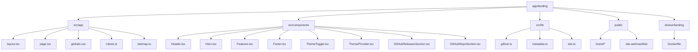
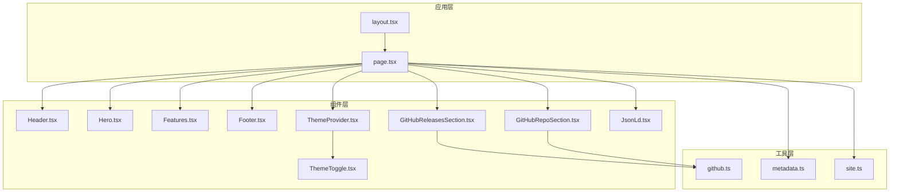
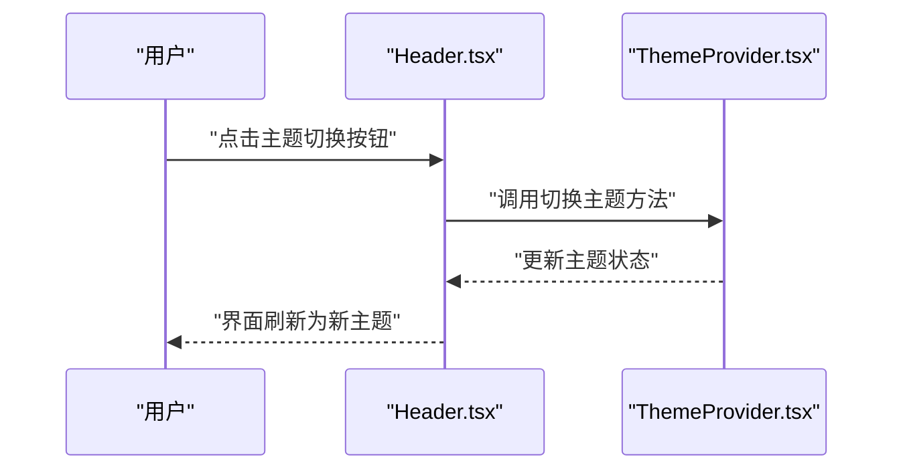
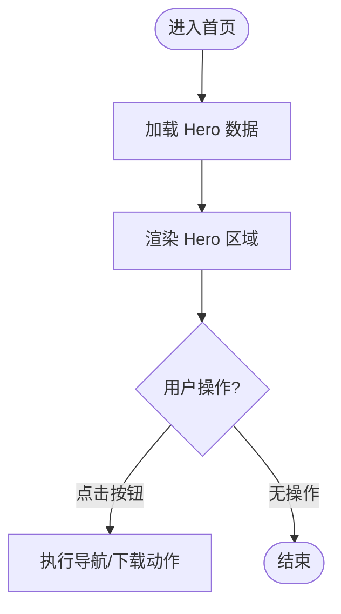
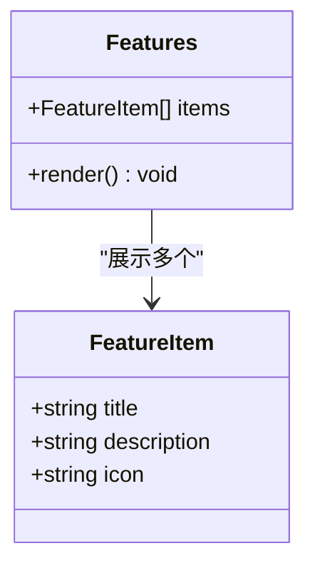
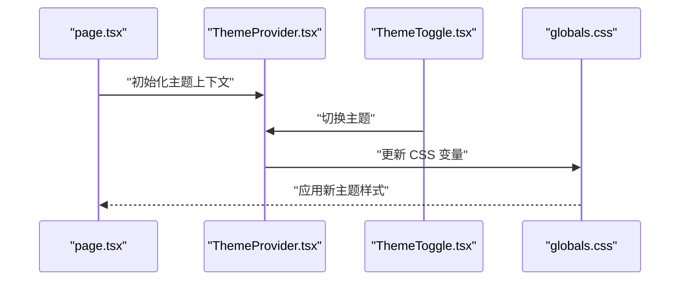
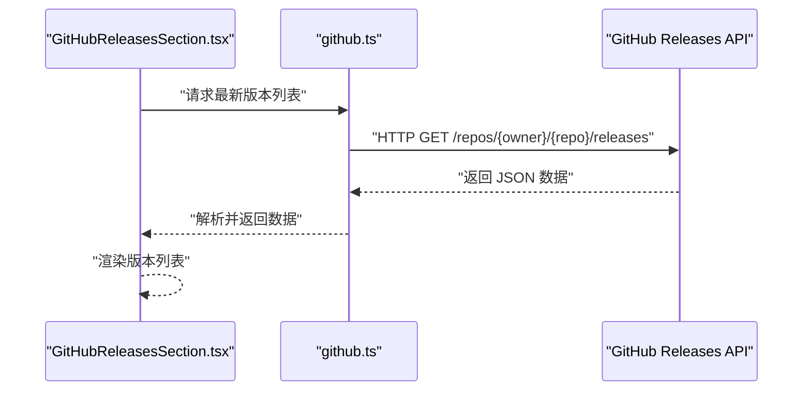
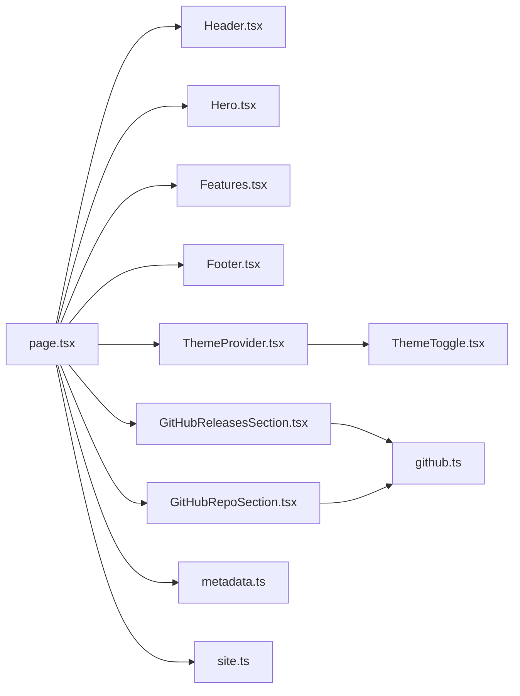

# 着陆页网站

<cite>
**本文引用的文件**   
- [app/landing/package.json](file://app/landing/package.json)
- [app/landing/next.config.ts](file://app/landing/next.config.ts)
- [app/landing/src/app/layout.tsx](file://app/landing/src/app/layout.tsx)
- [app/landing/src/app/page.tsx](file://app/landing/src/app/page.tsx)
- [app/landing/src/app/globals.css](file://app/landing/src/app/globals.css)
- [app/landing/src/app/robots.ts](file://app/landing/src/app/robots.ts)
- [app/landing/src/app/sitemap.ts](file://app/landing/src/app/sitemap.ts)
- [app/landing/src/components/Header.tsx](file://app/landing/src/components/Header.tsx)
- [app/landing/src/components/Hero.tsx](file://app/landing/src/components/Hero.tsx)
- [app/landing/src/components/Features.tsx](file://app/landing/src/components/Features.tsx)
- [app/landing/src/components/Footer.tsx](file://app/landing/src/components/Footer.tsx)
- [app/landing/src/components/ThemeToggle.tsx](file://app/landing/src/components/ThemeToggle.tsx)
- [app/landing/src/components/ThemeProvider.tsx](file://app/landing/src/components/ThemeProvider.tsx)
- [app/landing/src/components/GitHubReleasesSection.tsx](file://app/landing/src/components/GitHubReleasesSection.tsx)
- [app/landing/src/components/GitHubRepoSection.tsx](file://app/landing/src/components/GitHubRepoSection.tsx)
- [app/landing/src/lib/github.ts](file://app/landing/src/lib/github.ts)
- [app/landing/src/lib/metadata.ts](file://app/landing/src/lib/metadata.ts)
- [app/landing/src/lib/site.ts](file://app/landing/src/lib/site.ts)
- [docker/landing/Dockerfile](file://docker/landing/Dockerfile)
</cite>

## 目录
1. [简介](#简介)
2. [项目结构](#项目结构)
3. [核心组件](#核心组件)
4. [架构总览](#架构总览)
5. [详细组件分析](#详细组件分析)
6. [依赖关系分析](#依赖关系分析)
7. [性能考量](#性能考量)
8. [故障排查指南](#故障排查指南)
9. [结论](#结论)
10. [附录](#附录)

## 简介
本文件为 Tomo 着陆页网站的全面技术文档。该站点基于 Next.js（App Router）构建，采用现代前端工程化实践，包含主题系统、响应式布局、SEO 配置与 GitHub Releases API 集成等关键能力。文档面向开发者与运维人员，既提供高层架构说明，也深入到组件实现细节、数据流与部署流程，帮助读者快速理解并扩展站点功能。

## 项目结构
Tomo 着陆页位于 app/landing 子目录，遵循 Next.js App Router 的约定式路由与组件组织方式：
- src/app：应用根布局、页面、全局样式与 SEO 配置文件
- src/components：可复用 UI 组件（Header、Hero、Features、Footer、GitHub 相关模块、主题切换等）
- src/lib：工具与业务逻辑（GitHub API 调用、元数据、站点常量）
- public：静态资源（品牌图标、Web Manifest 等）
- docker/landing：Docker 容器化镜像定义

图表来源
- [app/landing/src/app/layout.tsx](file://app/landing/src/app/layout.tsx)
- [app/landing/src/app/page.tsx](file://app/landing/src/app/page.tsx)
- [app/landing/src/app/globals.css](file://app/landing/src/app/globals.css)
- [app/landing/src/app/robots.ts](file://app/landing/src/app/robots.ts)
- [app/landing/src/app/sitemap.ts](file://app/landing/src/app/sitemap.ts)
- [app/landing/src/components/Header.tsx](file://app/landing/src/components/Header.tsx)
- [app/landing/src/components/Hero.tsx](file://app/landing/src/components/Hero.tsx)
- [app/landing/src/components/Features.tsx](file://app/landing/src/components/Features.tsx)
- [app/landing/src/components/Footer.tsx](file://app/landing/src/components/Footer.tsx)
- [app/landing/src/components/ThemeToggle.tsx](file://app/landing/src/components/ThemeToggle.tsx)
- [app/landing/src/components/ThemeProvider.tsx](file://app/landing/src/components/ThemeProvider.tsx)
- [app/landing/src/components/GitHubReleasesSection.tsx](file://app/landing/src/components/GitHubReleasesSection.tsx)
- [app/landing/src/components/GitHubRepoSection.tsx](file://app/landing/src/components/GitHubRepoSection.tsx)
- [app/landing/src/lib/github.ts](file://app/landing/src/lib/github.ts)
- [app/landing/src/lib/metadata.ts](file://app/landing/src/lib/metadata.ts)
- [app/landing/src/lib/site.ts](file://app/landing/src/lib/site.ts)
- [docker/landing/Dockerfile](file://docker/landing/Dockerfile)

章节来源
- [app/landing/package.json](file://app/landing/package.json)
- [app/landing/next.config.ts](file://app/landing/next.config.ts)

## 核心组件
- Header：顶部导航栏，包含品牌标识、主导航链接与主题切换入口
- Hero：首屏英雄区域，展示产品核心价值主张与主要行动号召按钮
- Features：功能特性展示区，以卡片或网格形式呈现关键卖点
- Footer：页脚信息，包含版权、链接与社交信息
- ThemeProvider/ThemeToggle：主题系统与切换控件，支持明暗主题与持久化
- GitHubReleasesSection/GitHubRepoSection：GitHub 集成模块，动态拉取发布信息与仓库概览
- JsonLd：结构化数据注入，增强搜索引擎对页面的理解

章节来源
- [app/landing/src/components/Header.tsx](file://app/landing/src/components/Header.tsx)
- [app/landing/src/components/Hero.tsx](file://app/landing/src/components/Hero.tsx)
- [app/landing/src/components/Features.tsx](file://app/landing/src/components/Features.tsx)
- [app/landing/src/components/Footer.tsx](file://app/landing/src/components/Footer.tsx)
- [app/landing/src/components/ThemeProvider.tsx](file://app/landing/src/components/ThemeProvider.tsx)
- [app/landing/src/components/ThemeToggle.tsx](file://app/landing/src/components/ThemeToggle.tsx)
- [app/landing/src/components/GitHubReleasesSection.tsx](file://app/landing/src/components/GitHubReleasesSection.tsx)
- [app/landing/src/components/GitHubRepoSection.tsx](file://app/landing/src/components/GitHubRepoSection.tsx)

## 架构总览
站点采用 Next.js App Router 的客户端/服务端渲染混合模式：
- layout.tsx 定义全局布局与元数据注入
- page.tsx 作为首页入口，组合各组件并控制数据加载策略
- components 层负责 UI 与交互逻辑，通过 props 与上下文进行通信
- lib 层封装外部服务调用（如 GitHub API），并提供站点常量与元数据生成
- 主题系统通过 Provider 与 Toggle 组件协作，结合 CSS 变量实现主题切换
- SEO 由 robots.ts 与 sitemap.ts 自动生成，配合 JsonLd 提升搜索可见性

图表来源
- [app/landing/src/app/layout.tsx](file://app/landing/src/app/layout.tsx)
- [app/landing/src/app/page.tsx](file://app/landing/src/app/page.tsx)
- [app/landing/src/components/Header.tsx](file://app/landing/src/components/Header.tsx)
- [app/landing/src/components/Hero.tsx](file://app/landing/src/components/Hero.tsx)
- [app/landing/src/components/Features.tsx](file://app/landing/src/components/Features.tsx)
- [app/landing/src/components/Footer.tsx](file://app/landing/src/components/Footer.tsx)
- [app/landing/src/components/ThemeProvider.tsx](file://app/landing/src/components/ThemeProvider.tsx)
- [app/landing/src/components/ThemeToggle.tsx](file://app/landing/src/components/ThemeToggle.tsx)
- [app/landing/src/components/GitHubReleasesSection.tsx](file://app/landing/src/components/GitHubReleasesSection.tsx)
- [app/landing/src/components/GitHubRepoSection.tsx](file://app/landing/src/components/GitHubRepoSection.tsx)
- [app/landing/src/lib/github.ts](file://app/landing/src/lib/github.ts)
- [app/landing/src/lib/metadata.ts](file://app/landing/src/lib/metadata.ts)
- [app/landing/src/lib/site.ts](file://app/landing/src/lib/site.ts)

## 详细组件分析

### Header 导航栏
- 职责：提供品牌展示、主导航链接与主题切换入口；在移动端提供折叠菜单
- 交互：点击主题切换触发 ThemeProvider 状态更新；导航链接使用 Next.js 路由跳转
- 响应式：在小屏幕下隐藏次要链接，显示汉堡菜单

图表来源
- [app/landing/src/components/Header.tsx](file://app/landing/src/components/Header.tsx)
- [app/landing/src/components/ThemeProvider.tsx](file://app/landing/src/components/ThemeProvider.tsx)

章节来源
- [app/landing/src/components/Header.tsx](file://app/landing/src/components/Header.tsx)

### Hero 英雄区域
- 职责：展示核心价值主张、副标题与主要行动号召按钮（如下载或了解更多）
- 内容：文案与图片资源来自 site.ts 或 props；按钮行为通常跳转到下载或详情页面
- 性能：首屏优先渲染，避免阻塞关键路径

图表来源
- [app/landing/src/components/Hero.tsx](file://app/landing/src/components/Hero.tsx)
- [app/landing/src/lib/site.ts](file://app/landing/src/lib/site.ts)

章节来源
- [app/landing/src/components/Hero.tsx](file://app/landing/src/components/Hero.tsx)

### Features 功能展示
- 职责：以网格或卡片形式展示产品特性，每个特性包含标题、描述与可选图标
- 数据来源：从 site.ts 或 props 获取特性列表；支持多语言扩展
- 响应式：根据屏幕尺寸调整列数与间距

图表来源
- [app/landing/src/components/Features.tsx](file://app/landing/src/components/Features.tsx)
- [app/landing/src/lib/site.ts](file://app/landing/src/lib/site.ts)

章节来源
- [app/landing/src/components/Features.tsx](file://app/landing/src/components/Features.tsx)

### Footer 页脚
- 职责：展示版权信息、链接与社交图标；提供辅助导航
- 可访问性：确保链接具有合适的 aria-label；颜色对比度符合标准
- 国际化：文本内容可通过 site.ts 管理

章节来源
- [app/landing/src/components/Footer.tsx](file://app/landing/src/components/Footer.tsx)

### 主题系统与切换
- 架构：ThemeProvider 提供主题上下文，ThemeToggle 触发状态变更；CSS 变量驱动明暗主题
- 持久化：主题状态存储于本地存储，确保刷新后保持一致
- 兼容性：支持浏览器偏好设置与系统级主题联动

图表来源
- [app/landing/src/components/ThemeProvider.tsx](file://app/landing/src/components/ThemeProvider.tsx)
- [app/landing/src/components/ThemeToggle.tsx](file://app/landing/src/components/ThemeToggle.tsx)
- [app/landing/src/app/globals.css](file://app/landing/src/app/globals.css)

章节来源
- [app/landing/src/components/ThemeProvider.tsx](file://app/landing/src/components/ThemeProvider.tsx)
- [app/landing/src/components/ThemeToggle.tsx](file://app/landing/src/components/ThemeToggle.tsx)
- [app/landing/src/app/globals.css](file://app/landing/src/app/globals.css)

### GitHub 集成与动态内容加载
- 目标：展示最新 Release 信息与仓库概览，提升可信度与更新透明度
- 机制：通过 github.ts 调用 GitHub Releases API；错误处理与缓存策略保障稳定性
- 组件：GitHubReleasesSection 展示版本列表；GitHubRepoSection 展示仓库统计

图表来源
- [app/landing/src/components/GitHubReleasesSection.tsx](file://app/landing/src/components/GitHubReleasesSection.tsx)
- [app/landing/src/lib/github.ts](file://app/landing/src/lib/github.ts)

章节来源
- [app/landing/src/components/GitHubReleasesSection.tsx](file://app/landing/src/components/GitHubReleasesSection.tsx)
- [app/landing/src/components/GitHubRepoSection.tsx](file://app/landing/src/components/GitHubRepoSection.tsx)
- [app/landing/src/lib/github.ts](file://app/landing/src/lib/github.ts)

### SEO 优化配置
- robots.txt：通过 robots.ts 动态生成，控制爬虫抓取规则
- sitemap.xml：通过 sitemap.ts 生成站点地图，提升索引效率
- 元数据：metadata.ts 集中管理页面标题、描述、Open Graph 与 Twitter Card
- 结构化数据：JsonLd 组件注入 JSON-LD，增强搜索结果展示

章节来源
- [app/landing/src/app/robots.ts](file://app/landing/src/app/robots.ts)
- [app/landing/src/app/sitemap.ts](file://app/landing/src/app/sitemap.ts)
- [app/landing/src/lib/metadata.ts](file://app/landing/src/lib/metadata.ts)

## 依赖关系分析
- 组件耦合：page.tsx 作为编排者，组合 Header、Hero、Features、Footer、GitHub 模块与主题提供者
- 工具依赖：github.ts 被 GitHub 相关组件使用；metadata.ts 与 site.ts 为内容与元数据提供源
- 样式依赖：globals.css 定义全局样式与主题变量；Tailwind 或自定义 CSS 框架按需引入
- 构建依赖：next.config.ts 配置构建行为（如输出格式、插件、环境变量）

图表来源
- [app/landing/src/app/page.tsx](file://app/landing/src/app/page.tsx)
- [app/landing/src/components/Header.tsx](file://app/landing/src/components/Header.tsx)
- [app/landing/src/components/Hero.tsx](file://app/landing/src/components/Hero.tsx)
- [app/landing/src/components/Features.tsx](file://app/landing/src/components/Features.tsx)
- [app/landing/src/components/Footer.tsx](file://app/landing/src/components/Footer.tsx)
- [app/landing/src/components/ThemeProvider.tsx](file://app/landing/src/components/ThemeProvider.tsx)
- [app/landing/src/components/ThemeToggle.tsx](file://app/landing/src/components/ThemeToggle.tsx)
- [app/landing/src/components/GitHubReleasesSection.tsx](file://app/landing/src/components/GitHubReleasesSection.tsx)
- [app/landing/src/components/GitHubRepoSection.tsx](file://app/landing/src/components/GitHubRepoSection.tsx)
- [app/landing/src/lib/github.ts](file://app/landing/src/lib/github.ts)
- [app/landing/src/lib/metadata.ts](file://app/landing/src/lib/metadata.ts)
- [app/landing/src/lib/site.ts](file://app/landing/src/lib/site.ts)

章节来源
- [app/landing/next.config.ts](file://app/landing/next.config.ts)

## 性能考量
- 首屏优化：关键组件（Header、Hero）优先渲染，非关键内容懒加载
- 图片优化：使用 Next.js Image 组件或静态资源优化，避免阻塞渲染
- 代码分割：按路由与组件拆分打包，减少初始包体积
- 缓存策略：GitHub API 请求增加缓存与重试机制，降低失败率
- 主题切换：通过 CSS 变量与客户端状态更新，避免全量重绘

[本节为通用指导，不直接分析具体文件]

## 故障排查指南
- GitHub API 限流或网络错误：检查 github.ts 的错误处理与重试逻辑；确认环境变量与访问令牌配置
- 主题切换无效：验证 ThemeProvider 状态初始化与本地存储读写权限；检查 CSS 变量是否生效
- SEO 未生效：确认 robots.ts 与 sitemap.ts 生成正确；检查 metadata.ts 字段完整性
- 构建失败：查看 next.config.ts 配置项；清理缓存并重新安装依赖

章节来源
- [app/landing/src/lib/github.ts](file://app/landing/src/lib/github.ts)
- [app/landing/src/components/ThemeProvider.tsx](file://app/landing/src/components/ThemeProvider.tsx)
- [app/landing/src/app/robots.ts](file://app/landing/src/app/robots.ts)
- [app/landing/src/app/sitemap.ts](file://app/landing/src/app/sitemap.ts)
- [app/landing/src/lib/metadata.ts](file://app/landing/src/lib/metadata.ts)

## 结论
Tomo 着陆页基于 Next.js 构建了现代化、可扩展且易于维护的 Web 应用。通过清晰的组件分层、健壮的主题系统与完善的 SEO 配置，站点具备良好的用户体验与搜索引擎友好性。GitHub 集成增强了内容的动态性与可信度。建议后续持续优化性能指标、扩展多语言支持与丰富交互体验。

[本节为总结性内容，不直接分析具体文件]

## 附录

### 部署指南
- Docker 容器化：使用 docker/landing/Dockerfile 构建镜像，支持生产环境部署
- 静态站点生成：通过 Next.js 导出命令生成静态文件，便于 CDN 托管
- 环境变量：配置 GitHub API 密钥与站点元数据，确保构建与运行稳定

章节来源
- [docker/landing/Dockerfile](file://docker/landing/Dockerfile)
- [app/landing/next.config.ts](file://app/landing/next.config.ts)

### 自定义主题与添加新页面
- 主题定制：修改 globals.css 中的 CSS 变量，或通过 ThemeProvider 扩展主题选项
- 新增页面：在 src/app 目录下创建新路由文件，并在 layout.tsx 中共享布局与元数据
- 组件复用：将通用逻辑抽取至 src/lib 或公共组件，保持代码一致性

章节来源
- [app/landing/src/app/globals.css](file://app/landing/src/app/globals.css)
- [app/landing/src/app/layout.tsx](file://app/landing/src/app/layout.tsx)

### 性能优化最佳实践
- 使用 Next.js 内置优化：Image、Font、Script 等组件自动优化资源加载
- 减少运行时计算：将复杂逻辑移至构建时或后端服务
- 监控与分析：集成性能监控工具，跟踪核心指标（FCP、LCP、CLS）

[本节为通用指导，不直接分析具体文件]