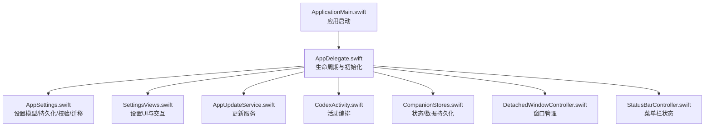
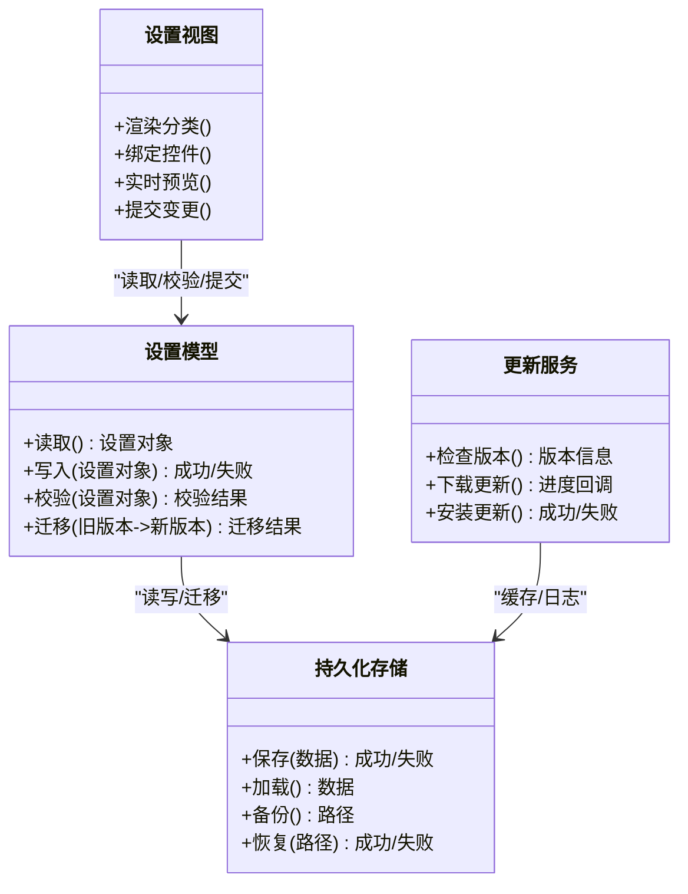
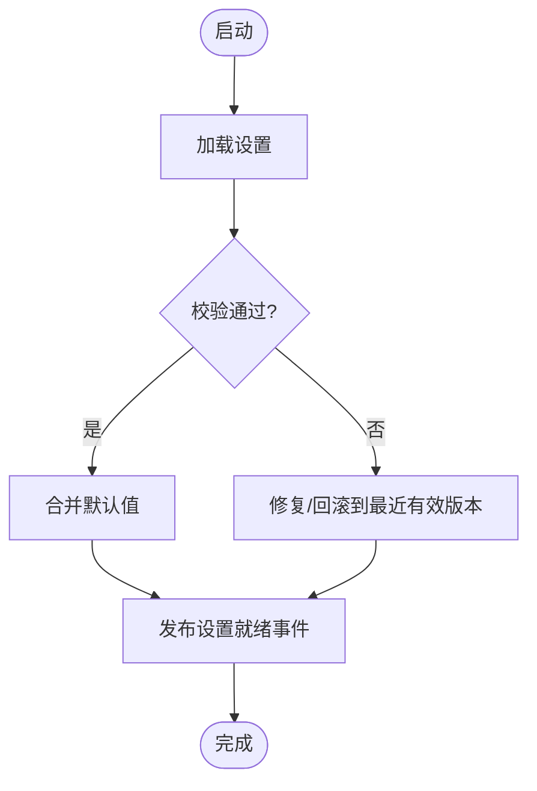
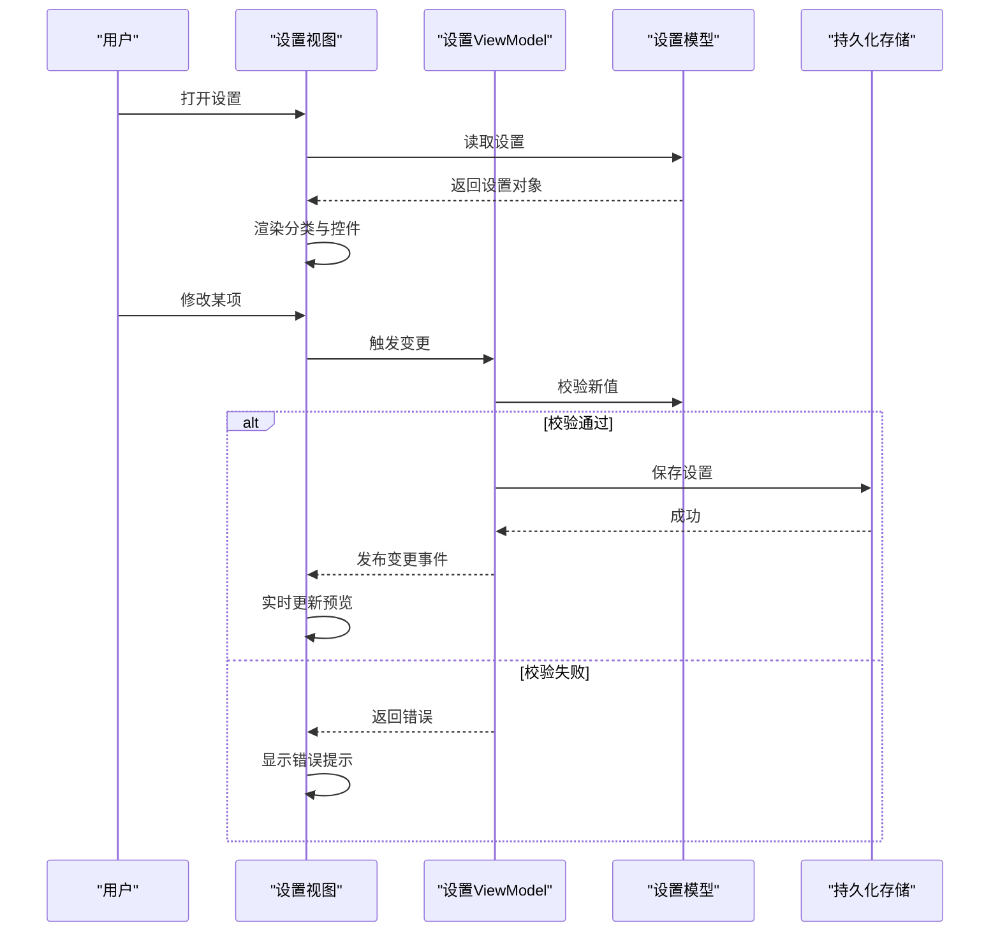
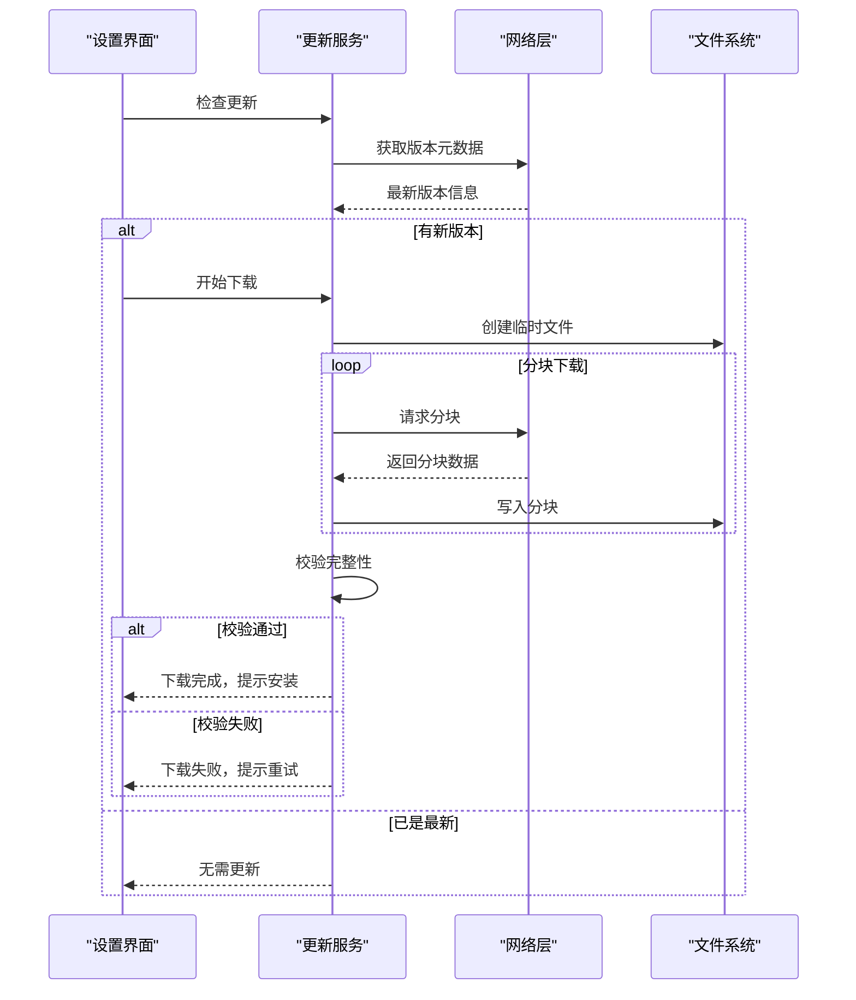
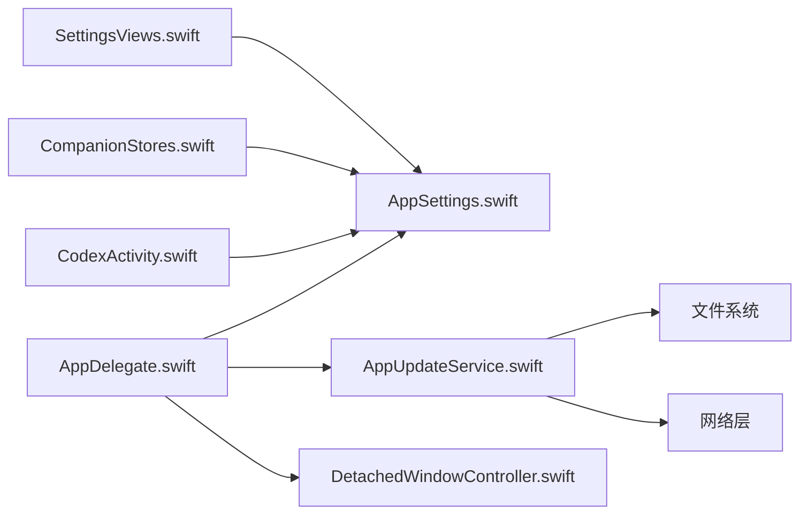

# 设置管理系统

<cite>
**本文引用的文件**   
- [AppSettings.swift](file://app/Tomo/Sources/Tomo/AppSettings.swift)
- [AppUpdateService.swift](file://app/Tomo/Sources/Tomo/AppUpdateService.swift)
- [SettingsViews.swift](file://app/Tomo/Sources/Tomo/SettingsViews.swift)
- [AppDelegate.swift](file://app/Tomo/Sources/Tomo/AppDelegate.swift)
- [ApplicationMain.swift](file://app/Tomo/Sources/Tomo/ApplicationMain.swift)
- [CodexActivity.swift](file://app/Tomo/Sources/Tomo/CodexActivity.swift)
- [CompanionStores.swift](file://app/Tomo/Sources/Tomo/CompanionStores.swift)
- [DetachedWindowController.swift](file://app/Tomo/Sources/Tomo/DetachedWindowController.swift)
- [StatusBarController.swift](file://app/Tomo/Sources/Tomo/StatusBarController.swift)
- [Package.swift](file://app/Tomo/Package.swift)
</cite>

## 目录
1. [简介](#简介)
2. [项目结构](#项目结构)
3. [核心组件](#核心组件)
4. [架构总览](#架构总览)
5. [详细组件分析](#详细组件分析)
6. [依赖关系分析](#依赖关系分析)
7. [性能考虑](#性能考虑)
8. [故障排除指南](#故障排除指南)
9. [结论](#结论)
10. [附录](#附录)

## 简介
本技术文档围绕“设置管理系统”展开，覆盖应用设置的存储架构、配置验证与数据迁移机制；设置界面的设计模式与用户交互流程（含分类组织与实时预览）；应用更新服务（版本检查、下载管理与自动更新）；设置项的类型定义、默认值管理与用户偏好同步；以及扩展指南（新增设置项与自定义验证规则）、数据安全、备份恢复与故障排除。目标是为开发者与维护者提供系统化、可操作的参考。

## 项目结构
本项目为 macOS 应用（Swift Package），设置相关代码集中在 app/Tomo/Sources/Tomo 目录下：
- AppSettings.swift：设置模型、持久化、校验与迁移的核心实现
- SettingsViews.swift：设置界面视图与交互逻辑
- AppUpdateService.swift：应用更新服务（版本检查、下载、安装）
- AppDelegate.swift / ApplicationMain.swift：应用生命周期入口与初始化
- CodexActivity.swift：活动/任务编排（可能用于后台更新或设置变更处理）
- CompanionStores.swift：状态/数据持久化辅助（可能与设置同步有关）
- DetachedWindowController.swift：窗口管理（设置窗口独立显示）
- StatusBarController.swift：菜单栏状态栏（可能触发设置面板）
- Package.swift：包清单与依赖声明

图表来源
- [ApplicationMain.swift](file://app/Tomo/Sources/Tomo/ApplicationMain.swift)
- [AppDelegate.swift](file://app/Tomo/Sources/Tomo/AppDelegate.swift)
- [AppSettings.swift](file://app/Tomo/Sources/Tomo/AppSettings.swift)
- [SettingsViews.swift](file://app/Tomo/Sources/Tomo/SettingsViews.swift)
- [AppUpdateService.swift](file://app/Tomo/Sources/Tomo/AppUpdateService.swift)
- [CodexActivity.swift](file://app/Tomo/Sources/Tomo/CodexActivity.swift)
- [CompanionStores.swift](file://app/Tomo/Sources/Tomo/CompanionStores.swift)
- [DetachedWindowController.swift](file://app/Tomo/Sources/Tomo/DetachedWindowController.swift)
- [StatusBarController.swift](file://app/Tomo/Sources/Tomo/StatusBarController.swift)

章节来源
- [Package.swift](file://app/Tomo/Package.swift)

## 核心组件
- 设置模型与持久化（AppSettings.swift）
  - 定义设置项类型、默认值、键名空间与序列化格式
  - 提供读取/写入、合并策略、增量迁移与回滚能力
  - 内置校验器（范围、格式、依赖关系）与错误分类
- 设置界面（SettingsViews.swift）
  - 分类分组（通用、网络、外观、安全等）
  - 实时预览（即时生效的开关/主题/语言等）
  - 表单校验反馈与撤销/重做
- 应用更新服务（AppUpdateService.swift）
  - 版本检查（远程元数据解析）
  - 下载管理（断点续传、进度回调、完整性校验）
  - 自动更新策略（静默/提示/强制）
- 应用生命周期与窗口（AppDelegate.swift / ApplicationMain.swift / DetachedWindowController.swift）
  - 启动时加载设置、初始化更新服务、注册菜单项
  - 设置窗口的创建、显示与销毁
- 状态与活动（CompanionStores.swift / CodexActivity.swift）
  - 设置变更事件广播与订阅
  - 后台任务编排（如更新下载、设置迁移）

章节来源
- [AppSettings.swift](file://app/Tomo/Sources/Tomo/AppSettings.swift)
- [SettingsViews.swift](file://app/Tomo/Sources/Tomo/SettingsViews.swift)
- [AppUpdateService.swift](file://app/Tomo/Sources/Tomo/AppUpdateService.swift)
- [AppDelegate.swift](file://app/Tomo/Sources/Tomo/AppDelegate.swift)
- [ApplicationMain.swift](file://app/Tomo/Sources/Tomo/ApplicationMain.swift)
- [CompanionStores.swift](file://app/Tomo/Sources/Tomo/CompanionStores.swift)
- [CodexActivity.swift](file://app/Tomo/Sources/Tomo/CodexActivity.swift)
- [DetachedWindowController.swift](file://app/Tomo/Sources/Tomo/DetachedWindowController.swift)

## 架构总览
设置系统采用“模型-视图-服务-存储”分层：
- 模型层：设置项定义、默认值、校验规则、迁移脚本
- 视图层：分类导航、表单控件、实时预览、错误提示
- 服务层：更新服务、设置读写服务、事件总线
- 存储层：本地持久化（JSON/UserDefaults/Keychain 混合）

图表来源
- [AppSettings.swift](file://app/Tomo/Sources/Tomo/AppSettings.swift)
- [SettingsViews.swift](file://app/Tomo/Sources/Tomo/SettingsViews.swift)
- [AppUpdateService.swift](file://app/Tomo/Sources/Tomo/AppUpdateService.swift)

## 详细组件分析

### 设置模型与持久化（AppSettings.swift）
- 设计要点
  - 设置项类型：布尔、整数、浮点、字符串、枚举、数组、字典
  - 默认值：按模块/功能域划分，支持条件默认值
  - 校验：必填、范围、正则、跨字段依赖
  - 迁移：版本号驱动，支持增量升级与回滚
  - 持久化：JSON 为主，敏感字段加密存储
- 关键流程
  - 启动加载：读取 -> 校验 -> 迁移 -> 合并默认值 -> 发布变更事件
  - 写入流程：表单输入 -> 前端校验 -> 后端校验 -> 持久化 -> 通知订阅者

图表来源
- [AppSettings.swift](file://app/Tomo/Sources/Tomo/AppSettings.swift)

章节来源
- [AppSettings.swift](file://app/Tomo/Sources/Tomo/AppSettings.swift)

### 设置界面（SettingsViews.swift）
- 设计模式
  - MVVM：视图绑定 ViewModel，ViewModel 持有设置模型引用
  - 分类导航：左侧树形分类，右侧表单控件
  - 实时预览：对主题、布局、语言等即时生效项进行预览
  - 校验反馈：行级错误提示，提交前统一校验
- 交互流程
  - 打开设置 -> 加载当前设置 -> 渲染分类与控件 -> 监听变更 -> 校验 -> 保存 -> 刷新预览

图表来源
- [SettingsViews.swift](file://app/Tomo/Sources/Tomo/SettingsViews.swift)
- [AppSettings.swift](file://app/Tomo/Sources/Tomo/AppSettings.swift)

章节来源
- [SettingsViews.swift](file://app/Tomo/Sources/Tomo/SettingsViews.swift)

### 应用更新服务（AppUpdateService.swift）
- 功能模块
  - 版本检查：请求远端元数据，解析最新版本号与发布说明
  - 下载管理：分块下载、断点续传、哈希校验、失败重试
  - 自动更新：策略控制（静默/提示/强制），安装后重启
- 关键流程

图表来源
- [AppUpdateService.swift](file://app/Tomo/Sources/Tomo/AppUpdateService.swift)

章节来源
- [AppUpdateService.swift](file://app/Tomo/Sources/Tomo/AppUpdateService.swift)

### 应用生命周期与窗口（AppDelegate.swift / ApplicationMain.swift / DetachedWindowController.swift）
- 启动流程
  - ApplicationMain 初始化运行时环境
  - AppDelegate 注册菜单、加载设置、初始化更新服务、创建主窗口
  - 设置窗口通过 DetachedWindowController 独立显示与管理
- 关键点
  - 设置就绪事件监听，延迟初始化依赖设置的模块
  - 更新服务在后台运行，避免阻塞主线程

章节来源
- [ApplicationMain.swift](file://app/Tomo/Sources/Tomo/ApplicationMain.swift)
- [AppDelegate.swift](file://app/Tomo/Sources/Tomo/AppDelegate.swift)
- [DetachedWindowController.swift](file://app/Tomo/Sources/Tomo/DetachedWindowController.swift)

### 状态与活动（CompanionStores.swift / CodexActivity.swift）
- 作用
  - CompanionStores 负责状态持久化与同步，可能包含设置快照
  - CodexActivity 编排后台活动（如下载、迁移、清理）
- 与设置系统的集成
  - 设置变更事件驱动活动调度
  - 活动完成后回调更新 UI 或触发后续步骤

章节来源
- [CompanionStores.swift](file://app/Tomo/Sources/Tomo/CompanionStores.swift)
- [CodexActivity.swift](file://app/Tomo/Sources/Tomo/CodexActivity.swift)

## 依赖关系分析
- 内部依赖
  - SettingsViews 依赖 AppSettings（读取/校验/提交）
  - AppUpdateService 依赖网络与文件系统
  - AppDelegate 依赖 AppSettings、AppUpdateService、窗口控制器
- 外部依赖
  - 网络库（HTTP/HTTPS）
  - 加密库（敏感字段保护）
  - 文件系统 API（沙盒目录）

图表来源
- [SettingsViews.swift](file://app/Tomo/Sources/Tomo/SettingsViews.swift)
- [AppSettings.swift](file://app/Tomo/Sources/Tomo/AppSettings.swift)
- [AppUpdateService.swift](file://app/Tomo/Sources/Tomo/AppUpdateService.swift)
- [AppDelegate.swift](file://app/Tomo/Sources/Tomo/AppDelegate.swift)
- [DetachedWindowController.swift](file://app/Tomo/Sources/Tomo/DetachedWindowController.swift)
- [CompanionStores.swift](file://app/Tomo/Sources/Tomo/CompanionStores.swift)
- [CodexActivity.swift](file://app/Tomo/Sources/Tomo/CodexActivity.swift)

章节来源
- [Package.swift](file://app/Tomo/Package.swift)

## 性能考虑
- 设置加载与合并
  - 使用懒加载与增量合并，避免全量解析大对象
  - 校验与迁移异步执行，主线程仅处理 UI 绑定
- 实时预览
  - 防抖与节流，减少频繁重绘
  - 预览数据局部更新，避免整页刷新
- 更新下载
  - 分块下载与并发限制，避免带宽拥塞
  - 断点续传与失败重试，提升弱网稳定性
- 存储优化
  - JSON 压缩与字段剔除（调试模式除外）
  - 敏感字段加密存储，最小化密钥暴露面

[本节为通用指导，不直接分析具体文件]

## 故障排除指南
- 设置加载失败
  - 检查文件格式与编码
  - 查看迁移日志与回滚记录
  - 使用备份恢复最近有效版本
- 校验失败
  - 定位具体字段与错误码
  - 检查依赖字段是否满足约束
  - 临时禁用严格校验以定位问题
- 更新下载失败
  - 检查网络连通性与代理设置
  - 确认磁盘空间与权限
  - 清理临时文件并重试
- 预览不生效
  - 确认事件总线订阅是否正常
  - 检查防抖/节流参数
  - 查看控制台错误与警告

章节来源
- [AppSettings.swift](file://app/Tomo/Sources/Tomo/AppSettings.swift)
- [AppUpdateService.swift](file://app/Tomo/Sources/Tomo/AppUpdateService.swift)
- [SettingsViews.swift](file://app/Tomo/Sources/Tomo/SettingsViews.swift)

## 结论
本设置管理系统以清晰的层次结构与可扩展的设计，实现了安全的持久化、严格的校验与平滑的迁移；界面层提供直观的分类与实时预览；更新服务保障应用的持续演进。通过遵循扩展指南与最佳实践，团队可快速添加新的设置项与自定义规则，同时确保数据安全与用户体验。

[本节为总结性内容，不直接分析具体文件]

## 附录

### 设置项类型与默认值管理
- 类型定义
  - 基础类型：布尔、整数、浮点、字符串
  - 复合类型：枚举、数组、字典
  - 特殊类型：路径、URL、颜色、字体
- 默认值策略
  - 全局默认值与模块默认值
  - 条件默认值（基于平台/设备/语言）
  - 首次运行默认值与升级默认值

章节来源
- [AppSettings.swift](file://app/Tomo/Sources/Tomo/AppSettings.swift)

### 用户偏好同步
- 本地同步
  - 内存缓存与磁盘持久化一致化
  - 变更事件广播与订阅
- 跨设备同步（可选）
  - 云端存储与冲突解决策略
  - 增量同步与离线优先

章节来源
- [CompanionStores.swift](file://app/Tomo/Sources/Tomo/CompanionStores.swift)

### 扩展指南：新增设置项与自定义验证规则
- 新增设置项步骤
  - 在设置模型中定义类型、默认值与键名
  - 在界面中添加对应控件与绑定
  - 编写校验规则并注册到校验器
  - 添加迁移脚本（如需）
- 自定义验证规则
  - 实现校验接口，返回错误信息
  - 组合多个规则形成复杂校验
  - 单元测试覆盖边界情况

章节来源
- [AppSettings.swift](file://app/Tomo/Sources/Tomo/AppSettings.swift)
- [SettingsViews.swift](file://app/Tomo/Sources/Tomo/SettingsViews.swift)

### 数据安全与备份恢复
- 数据安全
  - 敏感字段加密存储
  - 访问权限控制（沙盒）
  - 日志脱敏与最小化记录
- 备份恢复
  - 定期备份与手动导出
  - 恢复时校验与冲突处理
  - 版本兼容性与回滚策略

章节来源
- [AppSettings.swift](file://app/Tomo/Sources/Tomo/AppSettings.swift)

### 设置项分类组织与实时预览
- 分类组织
  - 一级分类（通用、网络、外观、安全）
  - 二级分类（子功能域）
  - 搜索与过滤
- 实时预览
  - 即时生效项（主题、语言、布局）
  - 需重启生效项（明确提示）
  - 预览隔离与回滚

章节来源
- [SettingsViews.swift](file://app/Tomo/Sources/Tomo/SettingsViews.swift)