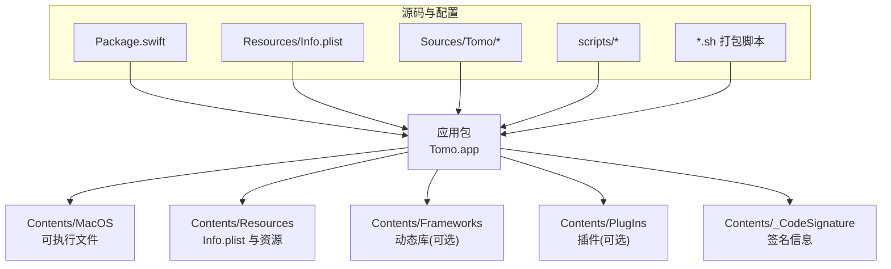
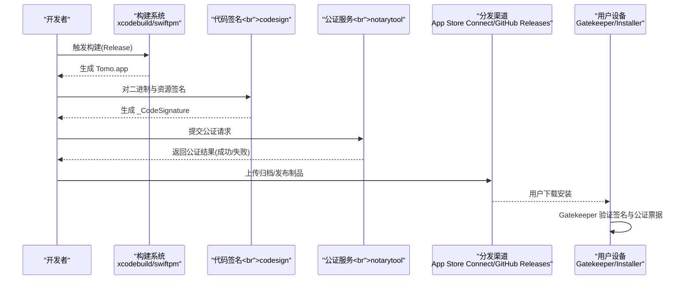
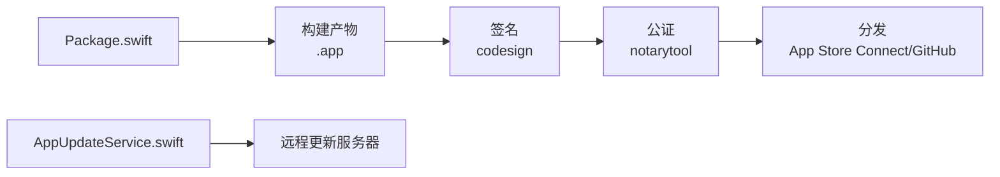

# macOS 应用打包与签名

<cite>
**本文引用的文件**   
- [Package.swift](file://app/Tomo/Package.swift)
- [package_app.sh](file://app/Tomo/package_app.sh)
- [rebuild_and_run.sh](file://app/Tomo/rebuild_and_run.sh)
- [release_app.sh](file://app/Tomo/release_app.sh)
- [run_chatgpt_api_probe.sh](file://app/Tomo/scripts/run_chatgpt_api_probe.sh)
- [Info.plist](file://app/Tomo/Resources/Info.plist)
- [AppSettings.swift](file://app/Tomo/Sources/Tomo/AppSettings.swift)
- [AppUpdateService.swift](file://app/Tomo/Sources/Tomo/AppUpdateService.swift)
- [ApplicationMain.swift](file://app/Tomo/Sources/Tomo/ApplicationMain.swift)
- [README.md](file://README.md)
- [PROJECT.md](file://PROJECT.md)
</cite>

## 目录
1. [简介](#简介)
2. [项目结构](#项目结构)
3. [核心组件](#核心组件)
4. [架构总览](#架构总览)
5. [详细组件分析](#详细组件分析)
6. [依赖关系分析](#依赖关系分析)
7. [性能考虑](#性能考虑)
8. [故障排查指南](#故障排查指南)
9. [结论](#结论)
10. [附录](#附录)

## 简介
本技术文档围绕 macOS 应用的打包、代码签名、公证（Notarization）、资源与版本管理、App Store Connect 集成以及应用更新机制，提供从工程配置到发布上线的完整实践指南。内容基于仓库中的 Swift Package 工程、打包脚本、应用清单与更新服务实现进行系统化梳理，帮助开发者建立稳定、可重复且高效的发布流水线。

## 项目结构
本项目采用 Swift Package Manager 组织 macOS 应用，关键目录与职责如下：
- app/Tomo/Package.swift：Swift Package 描述文件，定义目标、依赖与构建选项
- app/Tomo/Resources/Info.plist：应用元数据与权限声明
- app/Tomo/Sources/Tomo/*：应用源代码，包含入口、设置、更新服务等
- app/Tomo/scripts/*：辅助脚本（如 API 探测）
- app/Tomo/*.sh：打包、重建运行、发布相关脚本

图表来源
- [Package.swift:1-200](file://app/Tomo/Package.swift#L1-L200)
- [Info.plist:1-200](file://app/Tomo/Resources/Info.plist#L1-L200)
- [ApplicationMain.swift:1-200](file://app/Tomo/Sources/Tomo/ApplicationMain.swift#L1-L200)

章节来源
- [Package.swift:1-200](file://app/Tomo/Package.swift#L1-L200)
- [README.md:1-200](file://README.md#L1-L200)
- [PROJECT.md:1-200](file://PROJECT.md#L1-L200)

## 核心组件
- Swift Package 目标与产物：通过 Package.swift 定义 macOS 应用目标，指定可执行入口、资源与依赖
- 应用清单 Info.plist：定义 CFBundleIdentifier、CFBundleName、CFBundleVersion、CFBundleShortVersionString、LSMinimumSystemVersion 等关键键值
- 应用入口与生命周期：ApplicationMain.swift 作为应用启动点，负责初始化主窗口与系统菜单
- 设置与配置：AppSettings.swift 集中管理用户偏好与应用行为开关
- 更新服务：AppUpdateService.swift 负责检查更新、下载增量或全量包、校验签名并提示安装

章节来源
- [Package.swift:1-200](file://app/Tomo/Package.swift#L1-L200)
- [Info.plist:1-200](file://app/Tomo/Resources/Info.plist#L1-L200)
- [ApplicationMain.swift:1-200](file://app/Tomo/Sources/Tomo/ApplicationMain.swift#L1-L200)
- [AppSettings.swift:1-200](file://app/Tomo/Sources/Tomo/AppSettings.swift#L1-L200)
- [AppUpdateService.swift:1-200](file://app/Tomo/Sources/Tomo/AppUpdateService.swift#L1-L200)

## 架构总览
下图展示从源码到可分发 .app 包的构建与签名流程，以及后续公证与发布的整体链路。

图表来源
- [package_app.sh:1-200](file://app/Tomo/package_app.sh#L1-L200)
- [release_app.sh:1-200](file://app/Tomo/release_app.sh#L1-L200)
- [run_chatgpt_api_probe.sh:1-200](file://app/Tomo/scripts/run_chatgpt_api_probe.sh#L1-L200)

## 详细组件分析

### 代码签名与证书管理
- 开发者证书与分发证书：在钥匙串中管理“Developer ID Application”和“Mac Installer Distribution”证书；确保证书有效且未过期
- 应用标识符（Bundle Identifier）：在 Info.plist 中统一设置 CFBundleIdentifier，需与 Apple Developer 账户注册的一致
- 签名对象：对 .app 包内所有二进制、框架、插件与资源进行递归签名；使用 codesign --deep --sign
- 签名验证：使用 codesign --verify --verbose=4 检查签名完整性与时间戳
- 公证前置：确保已签名并通过基本验证，再提交 notarytool 公证

章节来源
- [Info.plist:1-200](file://app/Tomo/Resources/Info.plist#L1-L200)
- [package_app.sh:1-200](file://app/Tomo/package_app.sh#L1-L200)

### 应用包结构与资源管理
- Contents/MacOS：存放可执行文件与动态库
- Contents/Resources：放置 Info.plist、图标集、本地化资源与静态数据
- Contents/Frameworks：若使用外部框架，需按约定路径嵌入并签名
- 资源访问：通过 Bundle.main 或相对路径访问，避免硬编码绝对路径
- 图标与预览：在 Resources/AppIcon.iconset 中提供多分辨率图标

章节来源
- [Info.plist:1-200](file://app/Tomo/Resources/Info.plist#L1-L200)

### 版本信息与元数据配置
- CFBundleVersion：内部版本号，用于增量更新判断
- CFBundleShortVersionString：对外显示版本，面向用户
- LSMinimumSystemVersion：最低系统版本要求
- 其他权限与能力：如网络访问、辅助功能、沙盒权限等在 Info.plist 中声明

章节来源
- [Info.plist:1-200](file://app/Tomo/Resources/Info.plist#L1-L200)

### 应用入口与生命周期
- ApplicationMain.swift：应用启动入口，负责创建主窗口、菜单栏与状态栏
- 初始化顺序：加载配置、初始化日志、注册通知中心、加载用户设置
- 异常处理：捕获崩溃前信号，记录诊断信息以便问题定位

章节来源
- [ApplicationMain.swift:1-200](file://app/Tomo/Sources/Tomo/ApplicationMain.swift#L1-L200)

### 设置与配置管理
- AppSettings.swift：集中管理用户偏好、功能开关、API 端点与缓存策略
- 持久化：使用 UserDefaults 或配置文件存储，支持迁移与默认值回退
- 安全敏感项：避免明文存储密钥，建议使用钥匙串或加密存储

章节来源
- [AppSettings.swift:1-200](file://app/Tomo/Sources/Tomo/AppSettings.swift#L1-L200)

### 应用更新机制
- AppUpdateService.swift：实现自动检查更新、获取更新清单、校验签名与哈希、下载增量或全量包、提示安装
- 更新策略：优先增量更新，失败时回退至全量包；支持断点续传与进度反馈
- 安全校验：下载后校验签名与完整性，确保未被篡改
- 用户体验：后台静默更新与前台提示并存，允许延迟安装

章节来源
- [AppUpdateService.swift:1-200](file://app/Tomo/Sources/Tomo/AppUpdateService.swift#L1-L200)

### 打包脚本与自动化
- package_app.sh：封装 xcodebuild/swiftpm 构建、签名、归档与产物整理
- rebuild_and_run.sh：快速重建并运行应用，便于调试
- release_app.sh：执行完整发布流程，包括签名、公证、上传与版本标记
- run_chatgpt_api_probe.sh：辅助脚本，用于 API 连通性探测与诊断

章节来源
- [package_app.sh:1-200](file://app/Tomo/package_app.sh#L1-L200)
- [rebuild_and_run.sh:1-200](file://app/Tomo/rebuild_and_run.sh#L1-L200)
- [release_app.sh:1-200](file://app/Tomo/release_app.sh#L1-L200)
- [run_chatgpt_api_probe.sh:1-200](file://app/Tomo/scripts/run_chatgpt_api_probe.sh#L1-L200)

### 公证（Notarization）流程
- Apple ID 配置：使用专用 App Password 或 API Key，避免主账号密码泄露
- 提交公证：通过 notarytool submit 提交 .app 或 .pkg，等待回执
-  Staple 票据：成功后使用 stapler staple 将票据绑定到应用包
- 错误排查：根据回执错误码定位签名、时间戳、最小系统版本或权限问题

章节来源
- [release_app.sh:1-200](file://app/Tomo/release_app.sh#L1-L200)

### App Store Connect 集成
- 元数据配置：在 Xcode 或命令行工具中设置应用元数据（名称、描述、分类、关键词）
- 截图与预览：上传不同尺寸截图与预览视频，确保符合审核规范
- 审核准备：关闭测试飞行模式、提供测试账号、填写隐私合规说明
- 发布流程：提交审核、等待审批、灰度发布或全量发布

章节来源
- [README.md:1-200](file://README.md#L1-L200)
- [PROJECT.md:1-200](file://PROJECT.md#L1-L200)

## 依赖关系分析
- 构建依赖：Swift Package Manager 解析 Package.swift，拉取第三方依赖并编译
- 运行时依赖：动态库需在 Contents/Frameworks 中正确嵌入并签名
- 脚本依赖：打包脚本依赖 xcodebuild、codesign、notarytool、stapler 等命令行工具
- 外部服务：更新服务依赖远程服务器提供更新清单与下载链接

图表来源
- [Package.swift:1-200](file://app/Tomo/Package.swift#L1-L200)
- [AppUpdateService.swift:1-200](file://app/Tomo/Sources/Tomo/AppUpdateService.swift#L1-L200)

章节来源
- [Package.swift:1-200](file://app/Tomo/Package.swift#L1-L200)
- [AppUpdateService.swift:1-200](file://app/Tomo/Sources/Tomo/AppUpdateService.swift#L1-L200)

## 性能考虑
- 构建优化：启用并行构建、增量编译、禁用未使用的模块与调试符号
- 资源优化：压缩图片与音频、按需加载、避免大体积静态资源
- 签名与公证：批量签名减少 IO 开销、合理缓存公证票据
- 更新策略：优先增量更新减少下载体积、分片下载提升稳定性
- 运行时优化：懒加载、异步任务调度、内存管理与崩溃日志采样

[本节为通用指导，不直接分析具体文件]

## 故障排查指南
- 签名失败：检查证书有效期、Bundle Identifier 一致性、代码签名深度与时间戳
- 公证失败：核对最小系统版本、权限声明、第三方库签名与依赖完整性
- 应用无法启动：查看控制台日志、崩溃报告、权限拒绝原因
- 更新失败：检查网络连接、服务器响应、签名校验与磁盘空间
- 脚本错误：确认命令行工具路径、环境变量与权限设置

章节来源
- [package_app.sh:1-200](file://app/Tomo/package_app.sh#L1-L200)
- [release_app.sh:1-200](file://app/Tomo/release_app.sh#L1-L200)
- [run_chatgpt_api_probe.sh:1-200](file://app/Tomo/scripts/run_chatgpt_api_probe.sh#L1-L200)

## 结论
通过规范的 Swift Package 工程组织、严格的代码签名与公证流程、完善的资源与版本管理、以及可靠的更新机制，可实现高效、安全的 macOS 应用发布与维护。建议持续完善自动化脚本与监控告警，提升发布效率与问题定位速度。

[本节为总结性内容，不直接分析具体文件]

## 附录
- 常用命令参考：codesign、notarytool、stapler、xcrun altool
- 最佳实践：最小权限原则、安全密钥管理、灰度发布与回滚策略
- 参考资料：Apple 开发者文档、Swift Package Manager 官方指南、macOS 安全白皮书

[本节为补充信息，不直接分析具体文件]