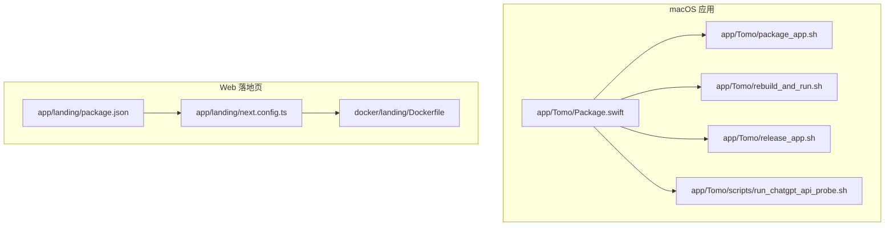
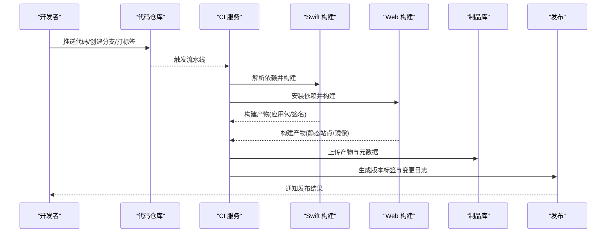
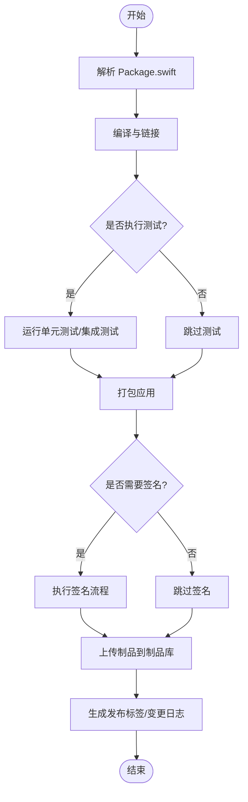
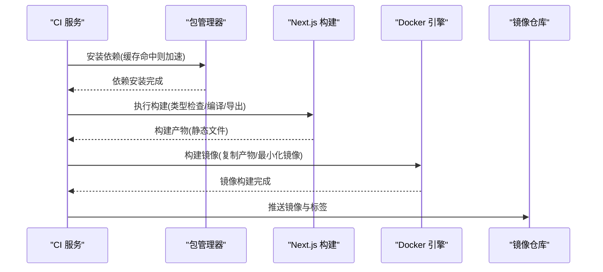
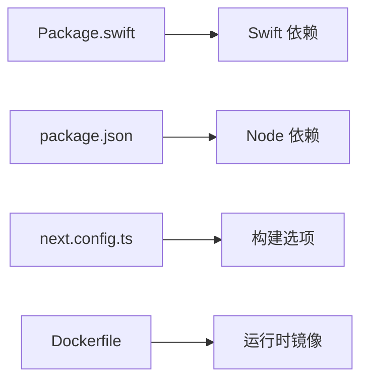

# 持续集成与部署流水线

<cite>
**本文引用的文件**   
- [README.md](file://README.md)
- [PROJECT.md](file://PROJECT.md)
- [app/Tomo/Package.swift](file://app/Tomo/Package.swift)
- [app/Tomo/package_app.sh](file://app/Tomo/package_app.sh)
- [app/Tomo/rebuild_and_run.sh](file://app/Tomo/rebuild_and_run.sh)
- [app/Tomo/release_app.sh](file://app/Tomo/release_app.sh)
- [app/Tomo/scripts/run_chatgpt_api_probe.sh](file://app/Tomo/scripts/run_chatgpt_api_probe.sh)
- [app/landing/package.json](file://app/landing/package.json)
- [app/landing/next.config.ts](file://app/landing/next.config.ts)
- [docker/landing/Dockerfile](file://docker/landing/Dockerfile)
</cite>

## 目录
1. [简介](#简介)
2. [项目结构](#项目结构)
3. [核心组件](#核心组件)
4. [架构总览](#架构总览)
5. [详细组件分析](#详细组件分析)
6. [依赖关系分析](#依赖关系分析)
7. [性能考量](#性能考量)
8. [故障排查指南](#故障排查指南)
9. [结论](#结论)
10. [附录](#附录)

## 简介
本技术文档面向持续集成与部署（CI/CD）流水线的构建、测试、打包与发布，覆盖触发条件、并行执行、状态管理、代码质量检查、自动化构建、多环境部署策略、发布管理与回滚机制，以及监控告警与性能优化最佳实践。内容基于仓库中的脚本与配置文件进行梳理，确保读者能够据此搭建或优化端到端的交付流水线。

## 项目结构
仓库包含两个主要应用：
- macOS 桌面应用（Swift Package Manager 工程），提供本地能力与系统集成
- Next.js 落地页（Web 应用），用于产品宣传与下载分发

关键目录与职责：
- app/Tomo：Swift 包定义、应用入口、资源与打包脚本
- app/landing：Next.js 站点源码、构建配置与依赖清单
- docker/landing：落地页容器镜像构建文件
- docs：方案与设计文档
- assets：截图等静态资源

图表来源
- [app/Tomo/Package.swift](file://app/Tomo/Package.swift)
- [app/Tomo/package_app.sh](file://app/Tomo/package_app.sh)
- [app/Tomo/rebuild_and_run.sh](file://app/Tomo/rebuild_and_run.sh)
- [app/Tomo/release_app.sh](file://app/Tomo/release_app.sh)
- [app/Tomo/scripts/run_chatgpt_api_probe.sh](file://app/Tomo/scripts/run_chatgpt_api_probe.sh)
- [app/landing/package.json](file://app/landing/package.json)
- [app/landing/next.config.ts](file://app/landing/next.config.ts)
- [docker/landing/Dockerfile](file://docker/landing/Dockerfile)

章节来源
- [README.md](file://README.md)
- [PROJECT.md](file://PROJECT.md)

## 核心组件
- Swift 包与构建产物：由 Package.swift 描述模块与依赖，配合 shell 脚本完成构建、打包与发布流程
- Web 站点构建：由 package.json 与 next.config.ts 驱动，Dockerfile 负责镜像化
- 辅助脚本：用于重建运行、API 探测与发布准备

章节来源
- [app/Tomo/Package.swift](file://app/Tomo/Package.swift)
- [app/landing/package.json](file://app/landing/package.json)
- [app/landing/next.config.ts](file://app/landing/next.config.ts)
- [docker/landing/Dockerfile](file://docker/landing/Dockerfile)

## 架构总览
下图展示 CI/CD 流水线在仓库中的关键节点与交互关系：代码提交触发构建，分别对 Swift 应用与 Next.js 站点进行独立构建与测试；随后生成可分发的产物并进入发布阶段。

图表来源
- [app/Tomo/package_app.sh](file://app/Tomo/package_app.sh)
- [app/Tomo/rebuild_and_run.sh](file://app/Tomo/rebuild_and_run.sh)
- [app/Tomo/release_app.sh](file://app/Tomo/release_app.sh)
- [app/landing/package.json](file://app/landing/package.json)
- [app/landing/next.config.ts](file://app/landing/next.config.ts)
- [docker/landing/Dockerfile](file://docker/landing/Dockerfile)

## 详细组件分析

### Swift 应用构建与发布
- 构建入口：Package.swift 定义包结构与依赖
- 构建与运行：rebuild_and_run.sh 用于快速重建与运行，便于本地验证
- 打包：package_app.sh 负责将应用打包为可分发格式
- 发布：release_app.sh 用于生成发布所需产物与元数据
- 辅助：run_chatgpt_api_probe.sh 用于外部 API 连通性探测

图表来源
- [app/Tomo/Package.swift](file://app/Tomo/Package.swift)
- [app/Tomo/rebuild_and_run.sh](file://app/Tomo/rebuild_and_run.sh)
- [app/Tomo/package_app.sh](file://app/Tomo/package_app.sh)
- [app/Tomo/release_app.sh](file://app/Tomo/release_app.sh)

章节来源
- [app/Tomo/Package.swift](file://app/Tomo/Package.swift)
- [app/Tomo/rebuild_and_run.sh](file://app/Tomo/rebuild_and_run.sh)
- [app/Tomo/package_app.sh](file://app/Tomo/package_app.sh)
- [app/Tomo/release_app.sh](file://app/Tomo/release_app.sh)
- [app/Tomo/scripts/run_chatgpt_api_probe.sh](file://app/Tomo/scripts/run_chatgpt_api_probe.sh)

### Web 落地页构建与容器化
- 依赖与脚本：package.json 定义依赖与构建命令
- 构建配置：next.config.ts 控制站点构建行为
- 容器镜像：docker/landing/Dockerfile 定义镜像构建步骤

图表来源
- [app/landing/package.json](file://app/landing/package.json)
- [app/landing/next.config.ts](file://app/landing/next.config.ts)
- [docker/landing/Dockerfile](file://docker/landing/Dockerfile)

章节来源
- [app/landing/package.json](file://app/landing/package.json)
- [app/landing/next.config.ts](file://app/landing/next.config.ts)
- [docker/landing/Dockerfile](file://docker/landing/Dockerfile)

### 代码质量检查与覆盖率
- 建议的测试与检查项：
  - Swift：单元测试、集成测试、静态分析与格式化校验
  - Web：TypeScript 类型检查、ESLint/Prettier、单元测试与覆盖率统计
- 覆盖率统计：
  - Swift：通过 Xcode/Swift 工具链生成覆盖率报告
  - Web：使用 Jest/Vitest 等工具输出覆盖率并上传至平台

说明：具体命令与参数应结合各工程的脚本与配置文件进行编排，确保在 CI 中统一执行。

章节来源
- [app/Tomo/Package.swift](file://app/Tomo/Package.swift)
- [app/landing/package.json](file://app/landing/package.json)

### 多环境部署策略
- 开发环境：本地脚本 rebuild_and_run.sh 快速验证功能与问题定位
- 测试环境：CI 构建产物自动部署到测试集群或沙箱，执行冒烟测试
- 生产环境：通过 release_app.sh 与镜像推送流程，配合灰度/蓝绿发布策略，降低风险

隔离配置要点：
- 环境变量分离（密钥、端点、开关）
- 构建时注入不同环境的配置常量
- 制品与镜像按环境打标与隔离存储

章节来源
- [app/Tomo/rebuild_and_run.sh](file://app/Tomo/rebuild_and_run.sh)
- [app/Tomo/release_app.sh](file://app/Tomo/release_app.sh)
- [app/landing/next.config.ts](file://app/landing/next.config.ts)
- [docker/landing/Dockerfile](file://docker/landing/Dockerfile)

### 发布管理与回滚机制
- 版本标签：在发布阶段生成语义化版本标签，关联变更日志
- 变更日志：根据提交信息与 PR 标题自动生成
- 回滚机制：
  - 应用：保留历史版本包，支持一键回滚
  - 镜像：保留历史镜像标签，支持快速切换
- 发布审批：引入人工审批环节，确保关键变更可控

章节来源
- [app/Tomo/release_app.sh](file://app/Tomo/release_app.sh)
- [app/landing/package.json](file://app/landing/package.json)

## 依赖关系分析
- Swift 应用依赖：由 Package.swift 声明，CI 中需解析并缓存依赖以加速构建
- Web 应用依赖：由 package.json 声明，建议使用 pnpm/npm/yarn 锁定版本并启用缓存
- 容器镜像依赖：Dockerfile 中仅包含运行时必要依赖，减小镜像体积

图表来源
- [app/Tomo/Package.swift](file://app/Tomo/Package.swift)
- [app/landing/package.json](file://app/landing/package.json)
- [app/landing/next.config.ts](file://app/landing/next.config.ts)
- [docker/landing/Dockerfile](file://docker/landing/Dockerfile)

章节来源
- [app/Tomo/Package.swift](file://app/Tomo/Package.swift)
- [app/landing/package.json](file://app/landing/package.json)
- [app/landing/next.config.ts](file://app/landing/next.config.ts)
- [docker/landing/Dockerfile](file://docker/landing/Dockerfile)

## 性能考量
- 依赖缓存：
  - Swift：缓存包管理器依赖与编译中间产物
  - Web：缓存 node_modules 与构建缓存目录
- 增量构建：
  - Swift：利用增量编译特性，避免全量重编
  - Web：利用 Next.js 构建缓存与增量导出
- 并行执行：
  - 将 Swift 构建与 Web 构建作为并行任务执行，缩短整体耗时
- 制品瘦身：
  - Web：使用多阶段构建与最小化镜像
  - Swift：按需裁剪资源与符号信息

[本节为通用指导，不直接分析具体文件]

## 故障排查指南
- 构建失败：
  - 检查依赖解析与网络代理设置
  - 确认工具链版本与系统环境一致性
- 测试失败：
  - 查看测试日志与覆盖率报告，定位失败用例
  - 针对外部依赖（如 API）增加模拟或降级逻辑
- 发布异常：
  - 校验签名与权限配置
  - 核对制品上传与镜像推送状态
- 监控告警：
  - 对构建时长、失败率、制品大小设置阈值告警
  - 对发布后健康检查与错误率进行监控

章节来源
- [app/Tomo/scripts/run_chatgpt_api_probe.sh](file://app/Tomo/scripts/run_chatgpt_api_probe.sh)
- [app/landing/package.json](file://app/landing/package.json)

## 结论
本仓库提供了 Swift 桌面应用与 Next.js 落地页的构建与发布基础。通过合理编排 CI/CD 流水线，可实现高效的并行构建、严格的代码质量检查、稳定的制品管理与安全的发布回滚。建议在生产环境中引入更完善的监控与告警体系，持续提升交付效率与稳定性。

[本节为总结性内容，不直接分析具体文件]

## 附录
- 相关文档：
  - README.md：项目概览与使用说明
  - PROJECT.md：项目规划与里程碑
- 建议补充：
  - 在仓库根目录添加 CI/CD 配置文件（如 GitHub Actions、GitLab CI 等）
  - 完善测试套件与覆盖率阈值
  - 制定发布规范与回滚预案

章节来源
- [README.md](file://README.md)
- [PROJECT.md](file://PROJECT.md)