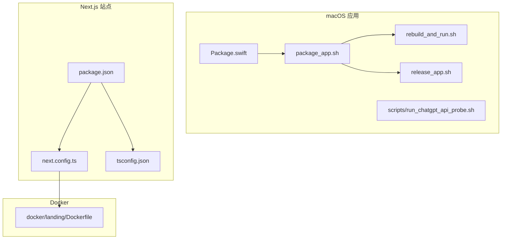
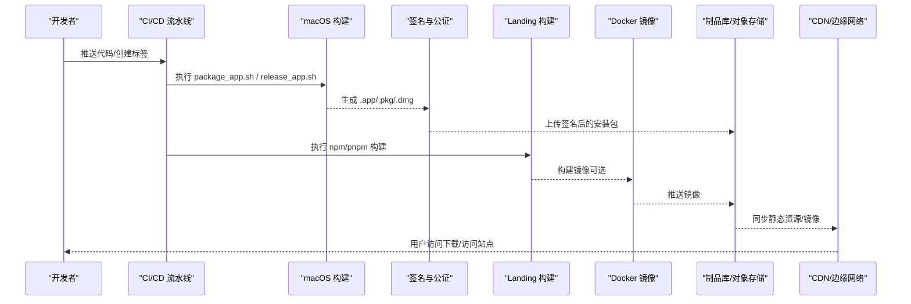
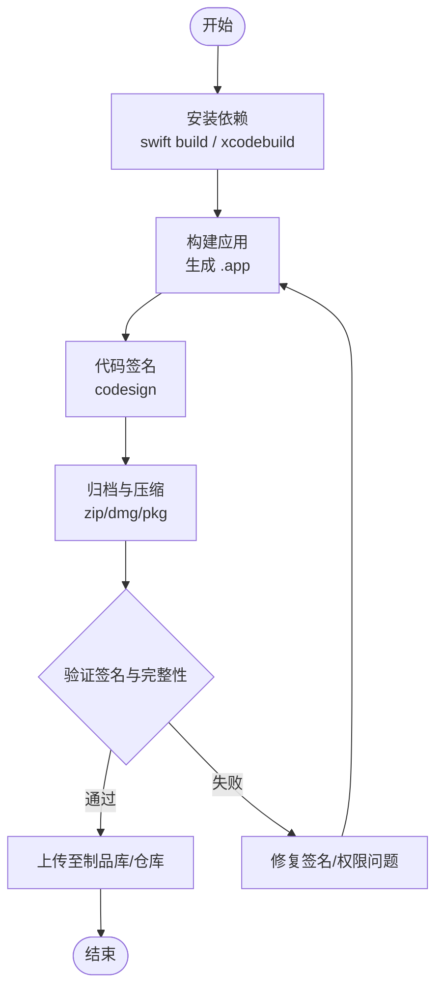
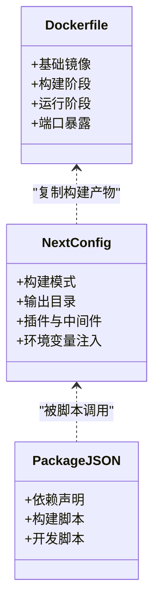
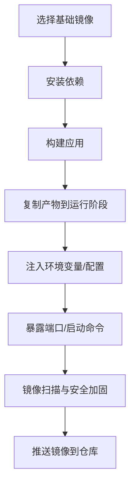
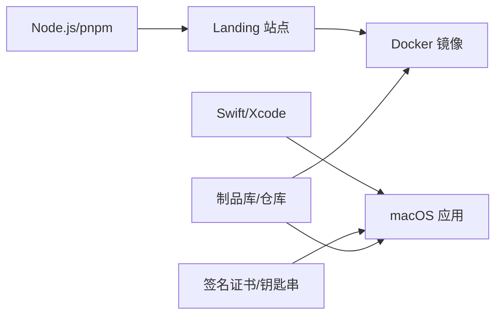

# 部署与分发

<cite>
**本文引用的文件**   
- [README.md](file://README.md)
- [PROJECT.md](file://PROJECT.md)
- [app/Tomo/Package.swift](file://app/Tomo/Package.swift)
- [app/Tomo/package_app.sh](file://app/Tomo/package_app.sh)
- [app/Tomo/rebuild_and_run.sh](file://app/Tomo/rebuild_and_run.sh)
- [app/Tomo/release_app.sh](file://app/Tomo/release_app.sh)
- [app/Tomo/scripts/run_chatgpt_api_probe.sh](file://app/Tomo/scripts/run_chatgpt_api_probe.sh)
- [app/landing/package.json](file://app/landing/package.json)
- [app/landing/next.config.ts](file://app/landing/next.config.ts)
- [app/landing/tsconfig.json](file://app/landing/tsconfig.json)
- [docker/landing/Dockerfile](file://docker/landing/Dockerfile)
</cite>

## 目录
1. [简介](#简介)
2. [项目结构](#项目结构)
3. [核心组件](#核心组件)
4. [架构总览](#架构总览)
5. [详细组件分析](#详细组件分析)
6. [依赖分析](#依赖分析)
7. [性能考虑](#性能考虑)
8. [故障排查指南](#故障排查指南)
9. [结论](#结论)
10. [附录](#附录)

## 简介
本文件面向生产环境的部署与分发，覆盖以下关键主题：
- Docker 镜像构建与优化（多阶段构建、最小化镜像、环境变量注入）
- macOS 应用打包与签名（代码签名、公证、App Store 提交）
- 静态站点部署策略（CDN、缓存、域名绑定）
- 自动化流水线（CI/CD、发布管理）
- 生产监控、日志收集与故障排查
- 安全加固、性能优化与备份恢复最佳实践

## 项目结构
本项目包含两个主要产物：
- macOS 桌面应用（Swift Package + Shell 脚本）
- Next.js 静态站点（Landing）
- Docker 镜像用于 Landing 站点的容器化部署

**图示来源** 
- [app/Tomo/Package.swift](file://app/Tomo/Package.swift)
- [app/Tomo/package_app.sh](file://app/Tomo/package_app.sh)
- [app/Tomo/rebuild_and_run.sh](file://app/Tomo/rebuild_and_run.sh)
- [app/Tomo/release_app.sh](file://app/Tomo/release_app.sh)
- [app/Tomo/scripts/run_chatgpt_api_probe.sh](file://app/Tomo/scripts/run_chatgpt_api_probe.sh)
- [app/landing/package.json](file://app/landing/package.json)
- [app/landing/next.config.ts](file://app/landing/next.config.ts)
- [app/landing/tsconfig.json](file://app/landing/tsconfig.json)
- [docker/landing/Dockerfile](file://docker/landing/Dockerfile)

**章节来源**
- [README.md](file://README.md)
- [PROJECT.md](file://PROJECT.md)

## 核心组件
- macOS 应用构建与发布：通过 Swift Package 定义应用目标，使用 Shell 脚本完成构建、打包、签名与归档。
- Landing 站点构建：基于 Next.js，提供构建配置与类型配置，支持静态导出或服务端渲染产物。
- Docker 镜像：为 Landing 站点提供容器化运行环境，便于在任意平台一致部署。

**章节来源**
- [app/Tomo/Package.swift](file://app/Tomo/Package.swift)
- [app/Tomo/package_app.sh](file://app/Tomo/package_app.sh)
- [app/Tomo/release_app.sh](file://app/Tomo/release_app.sh)
- [app/landing/package.json](file://app/landing/package.json)
- [app/landing/next.config.ts](file://app/landing/next.config.ts)
- [docker/landing/Dockerfile](file://docker/landing/Dockerfile)

## 架构总览
下图展示了从源码到产物的端到端流程：开发者提交代码后，触发 CI 构建；对 macOS 应用进行编译、签名与归档；对 Landing 站点进行构建并生成可部署产物；将产物推送到仓库或对象存储；最终由 CDN 或分发渠道对外提供服务。

**图示来源** 
- [app/Tomo/package_app.sh](file://app/Tomo/package_app.sh)
- [app/Tomo/release_app.sh](file://app/Tomo/release_app.sh)
- [app/landing/package.json](file://app/landing/package.json)
- [app/landing/next.config.ts](file://app/landing/next.config.ts)
- [docker/landing/Dockerfile](file://docker/landing/Dockerfile)

## 详细组件分析

### macOS 应用构建与发布
- 构建入口与依赖：通过 Swift Package 定义应用目标与依赖。
- 打包流程：Shell 脚本负责调用包管理器、生成 .app、归档与签名。
- 发布流程：release 脚本负责版本标记、归档上传与发布说明生成。
- 辅助工具：探针脚本可用于 API 连通性检查与调试。

**图示来源** 
- [app/Tomo/package_app.sh](file://app/Tomo/package_app.sh)
- [app/Tomo/release_app.sh](file://app/Tomo/release_app.sh)
- [app/Tomo/scripts/run_chatgpt_api_probe.sh](file://app/Tomo/scripts/run_chatgpt_api_probe.sh)

**章节来源**
- [app/Tomo/Package.swift](file://app/Tomo/Package.swift)
- [app/Tomo/package_app.sh](file://app/Tomo/package_app.sh)
- [app/Tomo/release_app.sh](file://app/Tomo/release_app.sh)
- [app/Tomo/scripts/run_chatgpt_api_probe.sh](file://app/Tomo/scripts/run_chatgpt_api_probe.sh)

### Landing 站点构建与部署
- 构建配置：Next.js 配置文件控制构建行为（如输出格式、路由、插件等）。
- 类型与依赖：TypeScript 配置与包管理确保构建一致性。
- 容器化：Dockerfile 定义运行时环境与构建步骤，便于跨平台部署。

**图示来源** 
- [app/landing/next.config.ts](file://app/landing/next.config.ts)
- [app/landing/package.json](file://app/landing/package.json)
- [docker/landing/Dockerfile](file://docker/landing/Dockerfile)

**章节来源**
- [app/landing/package.json](file://app/landing/package.json)
- [app/landing/next.config.ts](file://app/landing/next.config.ts)
- [app/landing/tsconfig.json](file://app/landing/tsconfig.json)
- [docker/landing/Dockerfile](file://docker/landing/Dockerfile)

### Docker 镜像构建与优化
- 多阶段构建：分离依赖安装、构建与运行阶段，减小最终镜像体积。
- 缓存优化：合理分层与顺序，最大化利用构建缓存。
- 环境变量：通过构建参数与环境变量注入配置，避免硬编码。
- 安全基线：选择精简基础镜像，限制运行时权限。

**图示来源** 
- [docker/landing/Dockerfile](file://docker/landing/Dockerfile)

**章节来源**
- [docker/landing/Dockerfile](file://docker/landing/Dockerfile)

## 依赖分析
- macOS 应用依赖 Swift 工具链与 Xcode 命令行工具，构建产物受签名证书与钥匙串影响。
- Landing 站点依赖 Node.js 生态，构建过程受 pnpm/npm 与 TypeScript 版本约束。
- Docker 镜像依赖基础镜像的稳定性与漏洞修复周期。

**图示来源** 
- [app/Tomo/Package.swift](file://app/Tomo/Package.swift)
- [app/landing/package.json](file://app/landing/package.json)
- [docker/landing/Dockerfile](file://docker/landing/Dockerfile)

**章节来源**
- [app/Tomo/Package.swift](file://app/Tomo/Package.swift)
- [app/landing/package.json](file://app/landing/package.json)
- [docker/landing/Dockerfile](file://docker/landing/Dockerfile)

## 性能考虑
- 镜像体积：采用多阶段构建与精简基础镜像，减少攻击面与传输成本。
- 构建缓存：合理组织 Dockerfile 层与依赖安装顺序，提升 CI 速度。
- 静态资源：启用 CDN 缓存与长缓存头，降低源站压力。
- 资源压缩：开启 gzip/brotli 压缩，减少带宽占用。
- 并发与连接：根据负载调整反向代理与线程池参数。

[本节为通用指导，不直接分析具体文件]

## 故障排查指南
- macOS 应用签名失败：检查证书有效期、钥匙串权限与代码签名选项。
- 构建缓存异常：清理缓存目录，确认依赖锁定文件一致性。
- 镜像构建失败：核对基础镜像可用性、网络代理与构建上下文。
- 站点访问异常：检查域名解析、CDN 缓存刷新与后端健康检查。
- 探针与诊断：使用探针脚本验证外部 API 连通性与超时设置。

**章节来源**
- [app/Tomo/scripts/run_chatgpt_api_probe.sh](file://app/Tomo/scripts/run_chatgpt_api_probe.sh)

## 结论
通过统一的构建与发布流程，结合容器化与 CDN 分发，可实现稳定、高效的生产部署。建议在生产环境中引入完善的监控、日志与告警体系，持续优化镜像与构建性能，并严格执行安全加固与备份恢复策略。

[本节为总结性内容，不直接分析具体文件]

## 附录

### Docker 镜像优化清单
- 使用多阶段构建，分离依赖安装与运行环境
- 选择最小化基础镜像（如 alpine/slim）
- 合并 RUN 指令，减少镜像层数
- 仅复制必要文件，避免多余上下文
- 设置非 root 用户运行，限制权限
- 使用 .dockerignore 排除无关文件

**章节来源**
- [docker/landing/Dockerfile](file://docker/landing/Dockerfile)

### macOS 应用打包与签名要点
- 确保证书与描述文件有效且匹配
- 使用 codesign 对二进制与资源进行签名
- 生成 pkg/dmg 前进行完整性校验
- 归档上传前进行公证（Notarize）
- 记录版本号与变更日志，便于回滚

**章节来源**
- [app/Tomo/package_app.sh](file://app/Tomo/package_app.sh)
- [app/Tomo/release_app.sh](file://app/Tomo/release_app.sh)

### Landing 站点部署策略
- 构建产物输出到静态目录，便于 CDN 直出
- 配置合适的缓存头（Cache-Control、ETag）
- 域名绑定与 HTTPS 证书管理
- 灰度发布与蓝绿部署策略
- 错误页面与降级方案

**章节来源**
- [app/landing/package.json](file://app/landing/package.json)
- [app/landing/next.config.ts](file://app/landing/next.config.ts)

### 自动化流水线与发布管理
- 分支策略与标签规范
- 构建矩阵（多平台、多版本）
- 制品管理与版本回滚
- 通知与审计（邮件、Slack、审计日志）
- 安全扫描与合规检查

[本节为通用指导，不直接分析具体文件]

### 生产监控、日志与故障排查
- 指标采集（CPU、内存、请求量、错误率）
- 结构化日志与集中式收集（ELK/Loki）
- 分布式追踪与链路分析
- 告警规则与阈值设定
- 故障演练与应急预案

[本节为通用指导，不直接分析具体文件]

### 安全加固与备份恢复
- 最小权限原则与密钥管理
- 依赖漏洞扫描与镜像签名
- 数据加密与传输安全
- 定期备份与恢复演练
- 灾难恢复计划与 RTO/RPO

[本节为通用指导，不直接分析具体文件]