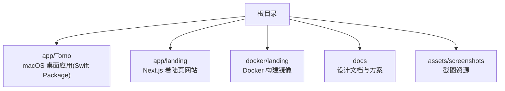
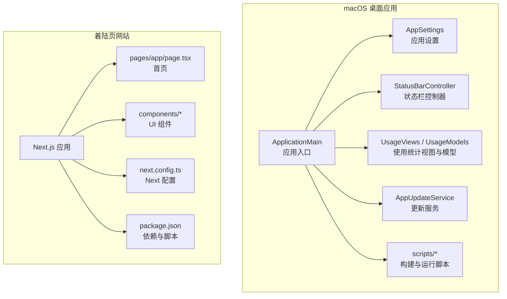
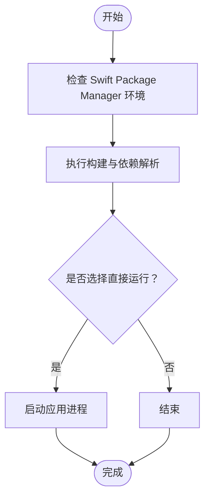
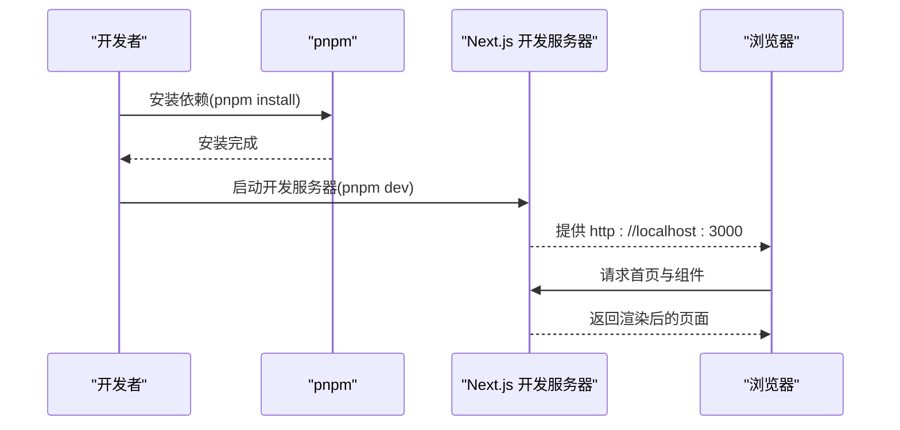
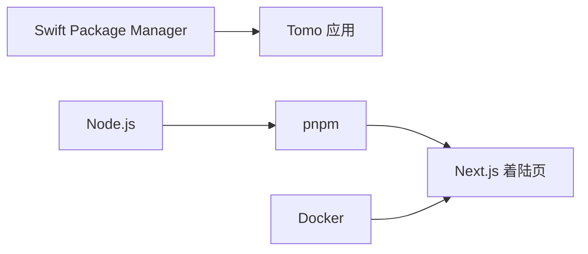

# 快速开始

<cite>
**本文引用的文件**   
- [README.md](file://README.md)
- [PROJECT.md](file://PROJECT.md)
- [app/landing/package.json](file://app/landing/package.json)
- [app/landing/next.config.ts](file://app/landing/next.config.ts)
- [app/landing/tsconfig.json](file://app/landing/tsconfig.json)
- [app/landing/.npmrc](file://app/landing/.npmrc)
- [docker/landing/Dockerfile](file://docker/landing/Dockerfile)
- [app/Tomo/Package.swift](file://app/Tomo/Package.swift)
- [app/Tomo/scripts/rebuild_and_run.sh](file://app/Tomo/scripts/rebuild_and_run.sh)
- [app/Tomo/scripts/release_app.sh](file://app/Tomo/scripts/release_app.sh)
- [app/Tomo/scripts/run_chatgpt_api_probe.sh](file://app/Tomo/scripts/run_chatgpt_api_probe.sh)
</cite>

## 目录
1. [简介](#简介)
2. [项目结构](#项目结构)
3. [核心组件](#核心组件)
4. [架构总览](#架构总览)
5. [详细组件分析](#详细组件分析)
6. [依赖关系分析](#依赖关系分析)
7. [性能注意事项](#性能注意事项)
8. [故障排查指南](#故障排查指南)
9. [结论](#结论)
10. [附录](#附录)

## 简介
本快速开始指南帮助你在最短时间内完成 Tomo 项目的安装与运行，包括：
- 系统要求与环境准备
- 克隆代码库、安装依赖与配置环境
- 启动主应用（macOS 桌面端）与着陆页网站开发服务器
- 基本验证步骤，确保安装成功
- 常见安装问题的排查与解决方案

## 项目结构
Tomo 包含两个主要子项目：
- app/Tomo：macOS 桌面应用（Swift Package），提供主应用入口、设置、状态栏、使用统计等能力。
- app/landing：基于 Next.js 的着陆页网站，用于展示产品特性、下载入口与发布信息。

**图表来源** 
- [app/Tomo/Package.swift](file://app/Tomo/Package.swift)
- [app/landing/package.json](file://app/landing/package.json)
- [docker/landing/Dockerfile](file://docker/landing/Dockerfile)

**章节来源**
- [README.md](file://README.md)
- [PROJECT.md](file://PROJECT.md)

## 核心组件
- macOS 桌面应用（Tomo）
  - 通过 Swift Package 管理依赖与构建，提供应用生命周期、设置面板、状态栏集成、使用统计与更新检查等功能。
  - 关键脚本：重建并运行、发布打包、API 探测等。
- 着陆页网站（Next.js）
  - 使用 TypeScript + Next.js，提供页面布局、主题切换、功能介绍、GitHub 仓库与发布信息等模块。
  - 通过 pnpm 进行包管理与构建。

**章节来源**
- [app/Tomo/Package.swift](file://app/Tomo/Package.swift)
- [app/landing/package.json](file://app/landing/package.json)

## 架构总览
下图展示了两个子项目的职责与交互边界：桌面应用负责本地功能与系统集成；着陆页网站负责对外展示与下载引导。两者相互独立，分别维护各自的依赖与构建流程。

**图表来源** 
- [app/Tomo/ApplicationMain.swift](file://app/Tomo/ApplicationMain.swift)
- [app/Tomo/AppSettings.swift](file://app/Tomo/AppSettings.swift)
- [app/Tomo/StatusBarController.swift](file://app/Tomo/StatusBarController.swift)
- [app/Tomo/UsageViews.swift](file://app/Tomo/UsageViews.swift)
- [app/Tomo/UsageModels.swift](file://app/Tomo/UsageModels.swift)
- [app/Tomo/AppUpdateService.swift](file://app/Tomo/AppUpdateService.swift)
- [app/landing/src/app/page.tsx](file://app/landing/src/app/page.tsx)
- [app/landing/next.config.ts](file://app/landing/next.config.ts)
- [app/landing/package.json](file://app/landing/package.json)

## 详细组件分析

### macOS 桌面应用（Tomo）
- 构建与运行
  - 使用 Swift Package Manager 管理依赖与构建。
  - 提供脚本用于重建并运行、发布打包以及 API 探测。
- 关键脚本说明
  - 重建并运行：用于在开发环境中清理并重新构建应用后自动启动。
  - 发布打包：生成可分发的应用包。
  - API 探测：执行外部 API 连通性检测脚本。

**图表来源** 
- [app/Tomo/Package.swift](file://app/Tomo/Package.swift)
- [app/Tomo/scripts/rebuild_and_run.sh](file://app/Tomo/scripts/rebuild_and_run.sh)
- [app/Tomo/scripts/release_app.sh](file://app/Tomo/scripts/release_app.sh)
- [app/Tomo/scripts/run_chatgpt_api_probe.sh](file://app/Tomo/scripts/run_chatgpt_api_probe.sh)

**章节来源**
- [app/Tomo/Package.swift](file://app/Tomo/Package.swift)
- [app/Tomo/scripts/rebuild_and_run.sh](file://app/Tomo/scripts/rebuild_and_run.sh)
- [app/Tomo/scripts/release_app.sh](file://app/Tomo/scripts/release_app.sh)
- [app/Tomo/scripts/run_chatgpt_api_probe.sh](file://app/Tomo/scripts/run_chatgpt_api_probe.sh)

### 着陆页网站（Next.js）
- 技术栈
  - Next.js + TypeScript，使用 pnpm 作为包管理器。
  - 配置文件包括 next.config.ts、tsconfig.json、eslint.config.mjs、postcss.config.mjs 等。
- 开发与构建
  - 通过 package.json 中的脚本进行安装、开发、构建与预览。
  - 支持 Docker 构建镜像以统一环境。

**图表来源** 
- [app/landing/package.json](file://app/landing/package.json)
- [app/landing/next.config.ts](file://app/landing/next.config.ts)
- [app/landing/src/app/page.tsx](file://app/landing/src/app/page.tsx)

**章节来源**
- [app/landing/package.json](file://app/landing/package.json)
- [app/landing/next.config.ts](file://app/landing/next.config.ts)
- [app/landing/tsconfig.json](file://app/landing/tsconfig.json)
- [app/landing/.npmrc](file://app/landing/.npmrc)
- [docker/landing/Dockerfile](file://docker/landing/Dockerfile)

## 依赖关系分析
- macOS 桌面应用
  - 依赖由 Swift Package Manager 管理，定义于 Package.swift。
  - 脚本依赖 Shell 环境与必要的系统工具（如 xcodebuild）。
- 着陆页网站
  - 依赖由 pnpm 管理，定义于 package.json。
  - 需要 Node.js 与 pnpm 环境。
  - 可选使用 Docker 构建镜像以隔离环境。

**图表来源** 
- [app/Tomo/Package.swift](file://app/Tomo/Package.swift)
- [app/landing/package.json](file://app/landing/package.json)
- [docker/landing/Dockerfile](file://docker/landing/Dockerfile)

**章节来源**
- [app/Tomo/Package.swift](file://app/Tomo/Package.swift)
- [app/landing/package.json](file://app/landing/package.json)
- [docker/landing/Dockerfile](file://docker/landing/Dockerfile)

## 性能注意事项
- 首次构建可能耗时较长，尤其是 Swift Package 依赖解析与 Next.js 依赖安装阶段。
- 建议使用稳定的网络环境以避免依赖下载失败或中断。
- 若磁盘空间不足，清理构建缓存后再试。

[本节为通用指导，不直接分析具体文件]

## 故障排查指南
- 无法找到 Swift 或 Xcode 工具链
  - 确认已安装 Xcode 命令行工具，并确保 Swift 版本满足要求。
  - 尝试重新安装命令行工具并重启终端。
- pnpm 命令不可用或 Node.js 版本不匹配
  - 安装 pnpm 并使用与项目兼容的 Node.js 版本。
  - 检查 .npmrc 配置是否正确。
- 开发服务器端口被占用
  - 更换端口或关闭占用该端口的进程后重试。
- Docker 构建失败
  - 检查 Docker 引擎是否正常运行，网络是否可达。
  - 查看构建日志定位具体错误。

**章节来源**
- [app/Tomo/scripts/rebuild_and_run.sh](file://app/Tomo/scripts/rebuild_and_run.sh)
- [app/landing/package.json](file://app/landing/package.json)
- [app/landing/.npmrc](file://app/landing/.npmrc)
- [docker/landing/Dockerfile](file://docker/landing/Dockerfile)

## 结论
按照本指南完成环境准备与依赖安装后，你可以快速启动 Tomo 的 macOS 桌面应用与着陆页网站。如遇问题，请参考故障排查部分逐步定位与解决。建议在稳定网络环境下进行首次构建，以获得最佳体验。

[本节为总结性内容，不直接分析具体文件]

## 附录

### 系统要求与环境准备
- macOS 桌面应用
  - 操作系统：macOS（建议最新稳定版）
  - 工具链：Xcode 与 Swift 命令行工具
  - 包管理：Swift Package Manager（随 Xcode 提供）
- 着陆页网站
  - Node.js（LTS 版本）
  - pnpm（推荐）
  - 可选：Docker（用于镜像构建）

**章节来源**
- [app/Tomo/Package.swift](file://app/Tomo/Package.swift)
- [app/landing/package.json](file://app/landing/package.json)
- [docker/landing/Dockerfile](file://docker/landing/Dockerfile)

### 克隆代码库与安装依赖
- 克隆仓库
  - 使用 Git 将仓库克隆到本地目录。
- 安装依赖
  - 桌面应用：进入 app/Tomo 目录，使用 Swift Package Manager 解析依赖。
  - 着陆页网站：进入 app/landing 目录，使用 pnpm 安装依赖。

**章节来源**
- [app/Tomo/Package.swift](file://app/Tomo/Package.swift)
- [app/landing/package.json](file://app/landing/package.json)

### 启动主应用（macOS 桌面端）
- 使用脚本重建并运行
  - 进入 app/Tomo 目录，执行重建并运行的脚本。
- 手动构建与运行
  - 使用 Swift Package Manager 构建后，运行生成的可执行文件。

**章节来源**
- [app/Tomo/scripts/rebuild_and_run.sh](file://app/Tomo/scripts/rebuild_and_run.sh)
- [app/Tomo/Package.swift](file://app/Tomo/Package.swift)

### 启动着陆页网站开发服务器
- 安装依赖
  - 进入 app/landing 目录，执行 pnpm install。
- 启动开发服务器
  - 执行 package.json 中提供的开发脚本，访问 http://localhost:3000 查看效果。

**章节来源**
- [app/landing/package.json](file://app/landing/package.json)
- [app/landing/next.config.ts](file://app/landing/next.config.ts)

### 基本验证步骤
- 桌面应用
  - 应用启动后应显示主界面与状态栏图标，设置面板可打开。
- 着陆页网站
  - 浏览器访问 http://localhost:3000，应看到首页内容与导航菜单。

**章节来源**
- [app/Tomo/ApplicationMain.swift](file://app/Tomo/ApplicationMain.swift)
- [app/landing/src/app/page.tsx](file://app/landing/src/app/page.tsx)

### 常见问题与解决方案
- 构建失败
  - 检查 Xcode 命令行工具与 Swift 版本。
  - 清理构建缓存后重试。
- 依赖安装失败
  - 检查网络连接与代理设置。
  - 使用国内镜像源加速 pnpm 安装。
- 端口冲突
  - 修改开发服务器端口或释放占用端口。

**章节来源**
- [app/Tomo/scripts/rebuild_and_run.sh](file://app/Tomo/scripts/rebuild_and_run.sh)
- [app/landing/.npmrc](file://app/landing/.npmrc)
- [app/landing/package.json](file://app/landing/package.json)