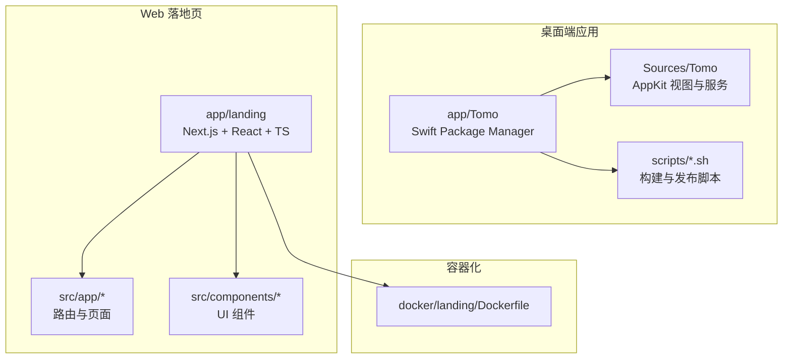
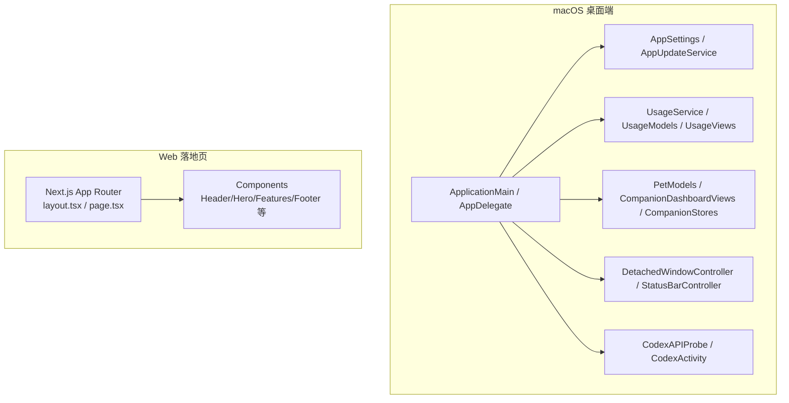
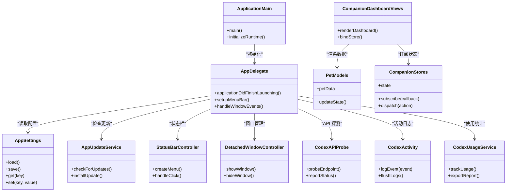
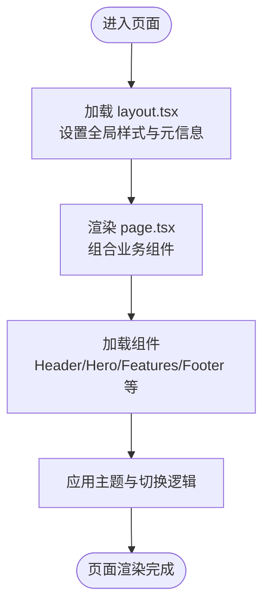
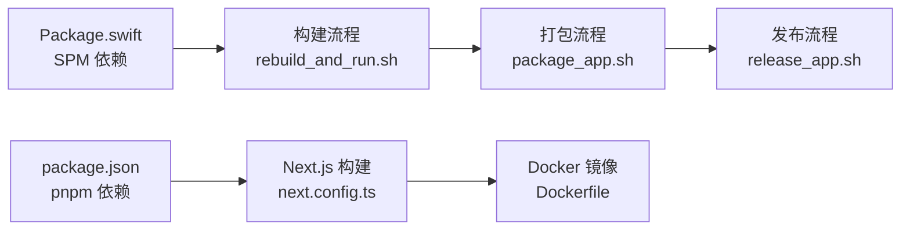

# 技术栈

<cite>
**本文引用的文件**   
- [README.md](file://README.md)
- [PROJECT.md](file://PROJECT.md)
- [app/Tomo/Package.swift](file://app/Tomo/Package.swift)
- [app/Tomo/package_app.sh](file://app/Tomo/package_app.sh)
- [app/Tomo/rebuild_and_run.sh](file://app/Tomo/rebuild_and_run.sh)
- [app/Tomo/release_app.sh](file://app/Tomo/release_app.sh)
- [app/Tomo/Sources/Tomo/AppDelegate.swift](file://app/Tomo/Sources/Tomo/AppDelegate.swift)
- [app/Tomo/Sources/Tomo/ApplicationMain.swift](file://app/Tomo/Sources/Tomo/ApplicationMain.swift)
- [app/Tomo/Sources/Tomo/AppSettings.swift](file://app/Tomo/Sources/Tomo/AppSettings.swift)
- [app/Tomo/Sources/Tomo/AppUpdateService.swift](file://app/Tomo/Sources/Tomo/AppUpdateService.swift)
- [app/Tomo/Sources/Tomo/CodexAPIProbe.swift](file://app/Tomo/Sources/Tomo/CodexAPIProbe.swift)
- [app/Tomo/Sources/Tomo/CodexActivity.swift](file://app/Tomo/Sources/Tomo/CodexActivity.swift)
- [app/Tomo/Sources/Tomo/CodexUsageService.swift](file://app/Tomo/Sources/Tomo/CodexUsageService.swift)
- [app/Tomo/Sources/Tomo/CompanionDashboardViews.swift](file://app/Tomo/Sources/Tomo/CompanionDashboardViews.swift)
- [app/Tomo/Sources/Tomo/CompanionStores.swift](file://app/Tomo/Sources/Tomo/CompanionStores.swift)
- [app/Tomo/Sources/Tomo/DetachedWindowController.swift](file://app/Tomo/Sources/Tomo/DetachedWindow控制器.swift)
- [app/Tomo/Sources/Tomo/PetModels.swift](file://app/Tomo/Sources/Tomo/PetModels.swift)
- [app/Tomo/Sources/Tomo/ResetCouponFusionViews.swift](file://app/Tomo/Sources/Tomo/ResetCouponFusionViews.swift)
- [app/Tomo/Sources/Tomo/SettingsViews.swift](file://app/Tomo/Sources/Tomo/SettingsViews.swift)
- [app/Tomo/Sources/Tomo/StatusBarController.swift](file://app/Tomo/Sources/Tomo/StatusBarController.swift)
- [app/Tomo/Sources/Tomo/UsageModels.swift](file://app/Tomo/Sources/Tomo/UsageModels.swift)
- [app/Tomo/Sources/Tomo/UsageViews.swift](file://app/Tomo/Sources/Tomo/UsageViews.swift)
- [app/Tomo/scripts/run_chatgpt_api_probe.sh](file://app/Tomo/scripts/run_chatgpt_api_probe.sh)
- [app/landing/package.json](file://app/landing/package.json)
- [app/landing/next.config.ts](file://app/landing/next.config.ts)
- [app/landing/tsconfig.json](file://app/landing/tsconfig.json)
- [app/landing/src/app/layout.tsx](file://app/landing/src/app/layout.tsx)
- [app/landing/src/app/page.tsx](file://app/landing/src/app/page.tsx)
- [docker/landing/Dockerfile](file://docker/landing/Dockerfile)
</cite>

## 目录
1. [简介](#简介)
2. [项目结构](#项目结构)
3. [核心组件](#核心组件)
4. [架构总览](#架构总览)
5. [详细组件分析](#详细组件分析)
6. [依赖分析](#依赖分析)
7. [性能考虑](#性能考虑)
8. [故障排查指南](#故障排查指南)
9. [结论](#结论)
10. [附录](#附录)

## 简介
本技术栈文档面向 Tomo 项目的开发者与维护者，系统梳理前端与后端（桌面端）技术选型、开发环境要求、构建系统与包管理策略、代码组织与模块划分原则，以及开发工具链、调试环境与性能优化建议。同时提供环境搭建步骤与常见问题解决方案，帮助团队快速上手并高效协作。

## 项目结构
Tomo 采用多子工程结构：
- app/Tomo：macOS 原生应用（Swift Package Manager + AppKit），包含应用入口、设置、状态栏集成、使用统计、宠物伴侣界面等。
- app/landing：Next.js 静态站点（React + TypeScript），用于产品落地页与下载引导。
- docker/landing：为 landing 页面提供容器化部署能力。
- docs：方案与设计文档。
- assets：截图等资源。

图表来源
- [app/Tomo/Package.swift](file://app/Tomo/Package.swift)
- [app/Tomo/Sources/Tomo/AppDelegate.swift](file://app/Tomo/Sources/Tomo/AppDelegate.swift)
- [app/Tomo/Sources/Tomo/ApplicationMain.swift](file://app/Tomo/Sources/Tomo/ApplicationMain.swift)
- [app/landing/package.json](file://app/landing/package.json)
- [app/landing/src/app/layout.tsx](file://app/landing/src/app/layout.tsx)
- [app/landing/src/app/page.tsx](file://app/landing/src/app/page.tsx)
- [docker/landing/Dockerfile](file://docker/landing/Dockerfile)

章节来源
- [README.md](file://README.md)
- [PROJECT.md](file://PROJECT.md)

## 核心组件
- macOS 桌面端（Swift/AppKit）
  - 应用生命周期与主入口：ApplicationMain、AppDelegate
  - 设置与配置：AppSettings
  - 更新服务：AppUpdateService
  - API 探测与活动跟踪：CodexAPIProbe、CodexActivity
  - 使用统计：CodexUsageService、UsageModels、UsageViews
  - 宠物伴侣与仪表盘：PetModels、CompanionDashboardViews、CompanionStores
  - 窗口与状态栏：DetachedWindowController、StatusBarController
  - 重置优惠券相关视图：ResetCouponFusionViews、SettingsViews
- Web 落地页（Next.js/React/TypeScript）
  - 应用布局与页面：layout.tsx、page.tsx
  - UI 组件：Header、Hero、Features、Footer、GitHub 相关组件、主题切换等
  - 构建与类型：next.config.ts、tsconfig.json、package.json

章节来源
- [app/Tomo/Sources/Tomo/ApplicationMain.swift](file://app/Tomo/Sources/Tomo/ApplicationMain.swift)
- [app/Tomo/Sources/Tomo/AppDelegate.swift](file://app/Tomo/Sources/Tomo/AppDelegate.swift)
- [app/Tomo/Sources/Tomo/AppSettings.swift](file://app/Tomo/Sources/Tomo/AppSettings.swift)
- [app/Tomo/Sources/Tomo/AppUpdateService.swift](file://app/Tomo/Sources/Tomo/AppUpdateService.swift)
- [app/Tomo/Sources/Tomo/CodexAPIProbe.swift](file://app/Tomo/Sources/Tomo/CodexAPIProbe.swift)
- [app/Tomo/Sources/Tomo/CodexActivity.swift](file://app/Tomo/Sources/Tomo/CodexActivity.swift)
- [app/Tomo/Sources/Tomo/CodexUsageService.swift](file://app/Tomo/Sources/Tomo/CodexUsageService.swift)
- [app/Tomo/Sources/Tomo/CompanionDashboardViews.swift](file://app/Tomo/Sources/Tomo/CompanionDashboardViews.swift)
- [app/Tomo/Sources/Tomo/CompanionStores.swift](file://app/Tomo/Sources/Tomo/CompanionStores.swift)
- [app/Tomo/Sources/Tomo/DetachedWindowController.swift](file://app/Tomo/Sources/Tomo/DetachedWindow控制器.swift)
- [app/Tomo/Sources/Tomo/PetModels.swift](file://app/Tomo/Sources/Tomo/PetModels.swift)
- [app/Tomo/Sources/Tomo/ResetCouponFusionViews.swift](file://app/Tomo/Sources/Tomo/ResetCouponFusionViews.swift)
- [app/Tomo/Sources/Tomo/SettingsViews.swift](file://app/Tomo/Sources/Tomo/SettingsViews.swift)
- [app/Tomo/Sources/Tomo/StatusBarController.swift](file://app/Tomo/Sources/Tomo/StatusBarController.swift)
- [app/Tomo/Sources/Tomo/UsageModels.swift](file://app/Tomo/Sources/Tomo/UsageModels.swift)
- [app/Tomo/Sources/Tomo/UsageViews.swift](file://app/Tomo/Sources/Tomo/UsageViews.swift)
- [app/landing/src/app/layout.tsx](file://app/landing/src/app/layout.tsx)
- [app/landing/src/app/page.tsx](file://app/landing/src/app/page.tsx)

## 架构总览
整体架构由“macOS 桌面端 + Next.js 落地页”组成。桌面端通过 Swift Package Manager 管理依赖，使用 AppKit 构建用户界面，并与系统状态栏、窗口、设置、更新、使用统计等功能集成；Web 端基于 Next.js 提供静态站点，便于 SEO 与快速访问。

图表来源
- [app/Tomo/Sources/Tomo/ApplicationMain.swift](file://app/Tomo/Sources/Tomo/ApplicationMain.swift)
- [app/Tomo/Sources/Tomo/AppDelegate.swift](file://app/Tomo/Sources/Tomo/AppDelegate.swift)
- [app/Tomo/Sources/Tomo/AppSettings.swift](file://app/Tomo/Sources/Tomo/AppSettings.swift)
- [app/Tomo/Sources/Tomo/AppUpdateService.swift](file://app/Tomo/Sources/Tomo/AppUpdateService.swift)
- [app/Tomo/Sources/Tomo/CodexUsageService.swift](file://app/Tomo/Sources/Tomo/CodexUsageService.swift)
- [app/Tomo/Sources/Tomo/CompanionDashboardViews.swift](file://app/Tomo/Sources/Tomo/CompanionDashboardViews.swift)
- [app/Tomo/Sources/Tomo/CompanionStores.swift](file://app/Tomo/Sources/Tomo/CompanionStores.swift)
- [app/Tomo/Sources/Tomo/DetachedWindowController.swift](file://app/Tomo/Sources/Tomo/DetachedWindow控制器.swift)
- [app/Tomo/Sources/Tomo/StatusBarController.swift](file://app/Tomo/Sources/Tomo/StatusBarController.swift)
- [app/Tomo/Sources/Tomo/CodexAPIProbe.swift](file://app/Tomo/Sources/Tomo/CodexAPIProbe.swift)
- [app/Tomo/Sources/Tomo/CodexActivity.swift](file://app/Tomo/Sources/Tomo/CodexActivity.swift)
- [app/landing/src/app/layout.tsx](file://app/landing/src/app/layout.tsx)
- [app/landing/src/app/page.tsx](file://app/landing/src/app/page.tsx)

## 详细组件分析

### macOS 桌面端（Swift/AppKit）
- 应用入口与生命周期
  - ApplicationMain：应用启动入口，负责初始化运行时环境与主循环。
  - AppDelegate：处理应用生命周期事件、菜单、状态栏、窗口管理等。
- 设置与更新
  - AppSettings：集中管理应用配置项与持久化。
  - AppUpdateService：检查与安装更新，保障版本一致性。
- 功能服务
  - CodexAPIProbe：对外部 API 连通性探测与诊断。
  - CodexActivity：记录关键活动与行为日志。
  - CodexUsageService/UsageModels/UsageViews：采集与展示使用统计。
- 界面与数据
  - PetModels：宠物模型定义。
  - CompanionDashboardViews/CompanionStores：伴侣仪表盘视图与状态存储。
  - ResetCouponFusionViews/SettingsViews：重置优惠券与设置界面。
- 窗口与状态栏
  - DetachedWindowController：独立窗口控制。
  - StatusBarController：菜单栏状态图标交互。

图表来源
- [app/Tomo/Sources/Tomo/ApplicationMain.swift](file://app/Tomo/Sources/Tomo/ApplicationMain.swift)
- [app/Tomo/Sources/Tomo/AppDelegate.swift](file://app/Tomo/Sources/Tomo/AppDelegate.swift)
- [app/Tomo/Sources/Tomo/AppSettings.swift](file://app/Tomo/Sources/Tomo/AppSettings.swift)
- [app/Tomo/Sources/Tomo/AppUpdateService.swift](file://app/Tomo/Sources/Tomo/AppUpdateService.swift)
- [app/Tomo/Sources/Tomo/CodexAPIProbe.swift](file://app/Tomo/Sources/Tomo/CodexAPIProbe.swift)
- [app/Tomo/Sources/Tomo/CodexActivity.swift](file://app/Tomo/Sources/Tomo/CodexActivity.swift)
- [app/Tomo/Sources/Tomo/CodexUsageService.swift](file://app/Tomo/Sources/Tomo/CodexUsageService.swift)
- [app/Tomo/Sources/Tomo/CompanionDashboardViews.swift](file://app/Tomo/Sources/Tomo/CompanionDashboardViews.swift)
- [app/Tomo/Sources/Tomo/CompanionStores.swift](file://app/Tomo/Sources/Tomo/CompanionStores.swift)
- [app/Tomo/Sources/Tomo/DetachedWindowController.swift](file://app/Tomo/Sources/Tomo/DetachedWindow控制器.swift)
- [app/Tomo/Sources/Tomo/StatusBarController.swift](file://app/Tomo/Sources/Tomo/StatusBarController.swift)

章节来源
- [app/Tomo/Sources/Tomo/ApplicationMain.swift](file://app/Tomo/Sources/Tomo/ApplicationMain.swift)
- [app/Tomo/Sources/Tomo/AppDelegate.swift](file://app/Tomo/Sources/Tomo/AppDelegate.swift)
- [app/Tomo/Sources/Tomo/AppSettings.swift](file://app/Tomo/Sources/Tomo/AppSettings.swift)
- [app/Tomo/Sources/Tomo/AppUpdateService.swift](file://app/Tomo/Sources/Tomo/AppUpdateService.swift)
- [app/Tomo/Sources/Tomo/CodexAPIProbe.swift](file://app/Tomo/Sources/Tomo/CodexAPIProbe.swift)
- [app/Tomo/Sources/Tomo/CodexActivity.swift](file://app/Tomo/Sources/Tomo/CodexActivity.swift)
- [app/Tomo/Sources/Tomo/CodexUsageService.swift](file://app/Tomo/Sources/Tomo/CodexUsageService.swift)
- [app/Tomo/Sources/Tomo/CompanionDashboardViews.swift](file://app/Tomo/Sources/Tomo/CompanionDashboardViews.swift)
- [app/Tomo/Sources/Tomo/CompanionStores.swift](file://app/Tomo/Sources/Tomo/CompanionStores.swift)
- [app/Tomo/Sources/Tomo/DetachedWindowController.swift](file://app/Tomo/Sources/Tomo/DetachedWindow控制器.swift)
- [app/Tomo/Sources/Tomo/StatusBarController.swift](file://app/Tomo/Sources/Tomo/StatusBarController.swift)

### Web 落地页（Next.js/React/TypeScript）
- 应用结构与路由
  - layout.tsx：全局布局与元信息注入。
  - page.tsx：首页内容入口。
- 组件化
  - Header、Hero、Features、Footer、GitHubReleasesSection、GitHubRepoSection、ThemeToggle、ThemeProvider 等。
- 构建与类型
  - next.config.ts：Next.js 构建配置。
  - tsconfig.json：TypeScript 编译选项。
  - package.json：依赖与脚本。

图表来源
- [app/landing/src/app/layout.tsx](file://app/landing/src/app/layout.tsx)
- [app/landing/src/app/page.tsx](file://app/landing/src/app/page.tsx)
- [app/landing/package.json](file://app/landing/package.json)
- [app/landing/next.config.ts](file://app/landing/next.config.ts)
- [app/landing/tsconfig.json](file://app/landing/tsconfig.json)

章节来源
- [app/landing/src/app/layout.tsx](file://app/landing/src/app/layout.tsx)
- [app/landing/src/app/page.tsx](file://app/landing/src/app/page.tsx)
- [app/landing/package.json](file://app/landing/package.json)
- [app/landing/next.config.ts](file://app/landing/next.config.ts)
- [app/landing/tsconfig.json](file://app/landing/tsconfig.json)

## 依赖分析
- 桌面端依赖管理
  - Swift Package Manager（Package.swift）：声明应用依赖与目标平台。
  - 构建与打包脚本：package_app.sh、rebuild_and_run.sh、release_app.sh。
- Web 端依赖管理
  - Node.js + pnpm：通过 package.json 管理依赖与脚本。
  - Docker 镜像：docker/landing/Dockerfile 提供一致的构建环境。

图表来源
- [app/Tomo/Package.swift](file://app/Tomo/Package.swift)
- [app/Tomo/rebuild_and_run.sh](file://app/Tomo/rebuild_and_run.sh)
- [app/Tomo/package_app.sh](file://app/Tomo/package_app.sh)
- [app/Tomo/release_app.sh](file://app/Tomo/release_app.sh)
- [app/landing/package.json](file://app/landing/package.json)
- [app/landing/next.config.ts](file://app/landing/next.config.ts)
- [docker/landing/Dockerfile](file://docker/landing/Dockerfile)

章节来源
- [app/Tomo/Package.swift](file://app/Tomo/Package.swift)
- [app/Tomo/rebuild_and_run.sh](file://app/Tomo/rebuild_and_run.sh)
- [app/Tomo/package_app.sh](file://app/Tomo/package_app.sh)
- [app/Tomo/release_app.sh](file://app/Tomo/release_app.sh)
- [app/landing/package.json](file://app/landing/package.json)
- [app/landing/next.config.ts](file://app/landing/next.config.ts)
- [docker/landing/Dockerfile](file://docker/landing/Dockerfile)

## 性能考虑
- 桌面端
  - 使用 AppKit 的异步绘制与事件循环，避免阻塞主线程。
  - 合理使用状态存储（CompanionStores）减少不必要的重绘。
  - 使用 CodexUsageService 收集性能指标，定位瓶颈。
- Web 端
  - 利用 Next.js 的静态生成与增量静态再生，提升首屏加载速度。
  - 组件拆分与懒加载，减少初始包体积。
  - 主题与样式按需加载，避免重复计算。

[本节为通用指导，不直接分析具体文件]

## 故障排查指南
- 桌面端
  - 构建失败：检查 Xcode 与 Swift 工具链版本，确认 Package.swift 依赖可用。
  - 运行异常：查看日志输出与 CodexActivity 记录，定位错误堆栈。
  - 更新失败：检查网络连通性与签名证书，验证 AppUpdateService 返回码。
- Web 端
  - 依赖安装失败：清理 pnpm 缓存，重新安装依赖。
  - 构建报错：核对 next.config.ts 与 tsconfig.json 配置，确保 Node.js 版本兼容。
  - 部署问题：检查 Docker 镜像构建日志与环境变量。

章节来源
- [app/Tomo/Sources/Tomo/CodexActivity.swift](file://app/Tomo/Sources/Tomo/CodexActivity.swift)
- [app/Tomo/Sources/Tomo/AppUpdateService.swift](file://app/Tomo/Sources/Tomo/AppUpdateService.swift)
- [app/landing/package.json](file://app/landing/package.json)
- [app/landing/next.config.ts](file://app/landing/next.config.ts)
- [docker/landing/Dockerfile](file://docker/landing/Dockerfile)

## 结论
Tomo 以 Swift/AppKit 构建 macOS 桌面端，结合 Next.js/React/TypeScript 打造高性能落地页。通过 SPM 与 pnpm 分别管理依赖，配合脚本与 Docker 实现一致的开发与发布体验。清晰的模块划分与完善的调试手段有助于提升开发与维护效率。

[本节为总结，不直接分析具体文件]

## 附录

### 开发环境要求
- macOS 桌面端
  - Xcode：建议使用最新稳定版，确保 Swift 工具链与 SDK 匹配。
  - Swift：遵循 Package.swift 指定的最低版本。
  - 终端与脚本：bash/zsh，具备执行权限。
- Web 落地页
  - Node.js：建议使用 LTS 版本（参考 package.json 引擎约束）。
  - pnpm：推荐使用 v8+，以获得更好的性能与锁文件稳定性。
  - Docker：可选，用于统一构建环境。

章节来源
- [app/Tomo/Package.swift](file://app/Tomo/Package.swift)
- [app/landing/package.json](file://app/landing/package.json)
- [docker/landing/Dockerfile](file://docker/landing/Dockerfile)

### 构建系统与包管理策略
- 桌面端
  - 构建：rebuild_and_run.sh 用于本地快速构建与运行。
  - 打包：package_app.sh 生成可分发包。
  - 发布：release_app.sh 执行签名与上传流程。
  - 依赖：Package.swift 声明依赖与目标平台。
- Web 端
  - 依赖：package.json 管理依赖与脚本。
  - 构建：next.config.ts 配置构建行为。
  - 类型：tsconfig.json 指定编译选项。
  - 容器：Dockerfile 提供一致构建环境。

章节来源
- [app/Tomo/rebuild_and_run.sh](file://app/Tomo/rebuild_and_run.sh)
- [app/Tomo/package_app.sh](file://app/Tomo/package_app.sh)
- [app/Tomo/release_app.sh](file://app/Tomo/release_app.sh)
- [app/Tomo/Package.swift](file://app/Tomo/Package.swift)
- [app/landing/package.json](file://app/landing/package.json)
- [app/landing/next.config.ts](file://app/landing/next.config.ts)
- [app/landing/tsconfig.json](file://app/landing/tsconfig.json)
- [docker/landing/Dockerfile](file://docker/landing/Dockerfile)

### 代码组织结构与模块划分原则
- 桌面端
  - 按职责分层：入口与生命周期（ApplicationMain/AppDelegate）、配置与更新（AppSettings/AppUpdateService）、功能服务（API 探测、活动、使用统计）、界面与数据（视图与模型）、窗口与状态栏（控制器）。
  - 视图与状态分离：CompanionDashboardViews 与 CompanionStores 解耦，便于测试与维护。
- Web 端
  - 路由与页面：app 目录下 layout.tsx/page.tsx 明确页面边界。
  - 组件化：components 目录按功能拆分为独立组件，提高复用性。
  - 配置与类型：next.config.ts/tsconfig.json 统一管理构建与类型。

章节来源
- [app/Tomo/Sources/Tomo/ApplicationMain.swift](file://app/Tomo/Sources/Tomo/ApplicationMain.swift)
- [app/Tomo/Sources/Tomo/AppDelegate.swift](file://app/Tomo/Sources/Tomo/AppDelegate.swift)
- [app/Tomo/Sources/Tomo/AppSettings.swift](file://app/Tomo/Sources/Tomo/AppSettings.swift)
- [app/Tomo/Sources/Tomo/AppUpdateService.swift](file://app/Tomo/Sources/Tomo/AppUpdateService.swift)
- [app/Tomo/Sources/Tomo/CodexAPIProbe.swift](file://app/Tomo/Sources/Tomo/CodexAPIProbe.swift)
- [app/Tomo/Sources/Tomo/CodexActivity.swift](file://app/Tomo/Sources/Tomo/CodexActivity.swift)
- [app/Tomo/Sources/Tomo/CodexUsageService.swift](file://app/Tomo/Sources/Tomo/CodexUsageService.swift)
- [app/Tomo/Sources/Tomo/CompanionDashboardViews.swift](file://app/Tomo/Sources/Tomo/CompanionDashboardViews.swift)
- [app/Tomo/Sources/Tomo/CompanionStores.swift](file://app/Tomo/Sources/Tomo/CompanionStores.swift)
- [app/landing/src/app/layout.tsx](file://app/landing/src/app/layout.tsx)
- [app/landing/src/app/page.tsx](file://app/landing/src/app/page.tsx)

### 开发工具链与调试环境
- 桌面端
  - Xcode：用于编辑、构建、调试与性能分析。
  - 脚本：rebuild_and_run.sh 快速迭代；run_chatgpt_api_probe.sh 进行 API 探测。
- Web 端
  - VS Code/IDE：配合 ESLint、Prettier、TypeScript 插件。
  - Next.js Dev Server：热重载与错误提示。
  - Docker：隔离构建环境，避免本地差异。

章节来源
- [app/Tomo/rebuild_and_run.sh](file://app/Tomo/rebuild_and_run.sh)
- [app/Tomo/scripts/run_chatgpt_api_probe.sh](file://app/Tomo/scripts/run_chatgpt_api_probe.sh)
- [app/landing/package.json](file://app/landing/package.json)
- [docker/landing/Dockerfile](file://docker/landing/Dockerfile)

### 环境搭建步骤
- 桌面端
  - 安装 Xcode 与命令行工具。
  - 克隆仓库，进入 app/Tomo。
  - 使用 rebuild_and_run.sh 构建并运行。
  - 如需打包或发布，依次执行 package_app.sh 与 release_app.sh。
- Web 端
  - 安装 Node.js（LTS）与 pnpm。
  - 进入 app/landing，执行依赖安装与开发服务器启动。
  - 可选：使用 Dockerfile 构建镜像以确保一致性。

章节来源
- [app/Tomo/rebuild_and_run.sh](file://app/Tomo/rebuild_and_run.sh)
- [app/Tomo/package_app.sh](file://app/Tomo/package_app.sh)
- [app/Tomo/release_app.sh](file://app/Tomo/release_app.sh)
- [app/landing/package.json](file://app/landing/package.json)
- [docker/landing/Dockerfile](file://docker/landing/Dockerfile)

### 常见问题解决方案
- 桌面端
  - 构建失败：检查 Xcode 版本与 Swift 工具链；确认 Package.swift 依赖可用。
  - 运行崩溃：查看控制台日志与 CodexActivity 记录；定位异常堆栈。
  - 更新失败：检查网络与证书；验证 AppUpdateService 返回值。
- Web 端
  - 依赖安装失败：清理 pnpm 缓存并重装；检查 Node.js 版本。
  - 构建报错：核对 next.config.ts 与 tsconfig.json；确保依赖版本兼容。
  - 部署问题：检查 Docker 镜像构建日志与环境变量。

章节来源
- [app/Tomo/Sources/Tomo/CodexActivity.swift](file://app/Tomo/Sources/Tomo/CodexActivity.swift)
- [app/Tomo/Sources/Tomo/AppUpdateService.swift](file://app/Tomo/Sources/Tomo/AppUpdateService.swift)
- [app/landing/package.json](file://app/landing/package.json)
- [app/landing/next.config.ts](file://app/landing/next.config.ts)
- [docker/landing/Dockerfile](file://docker/landing/Dockerfile)