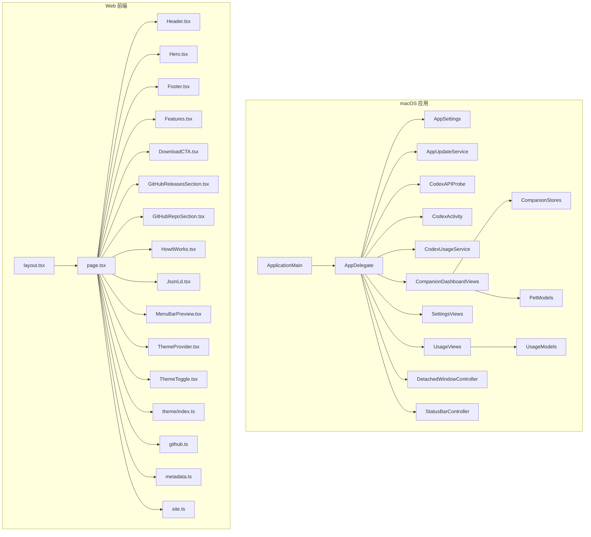
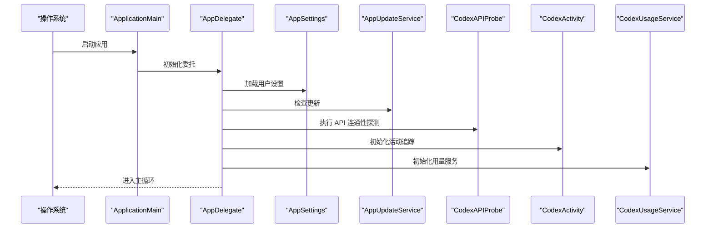
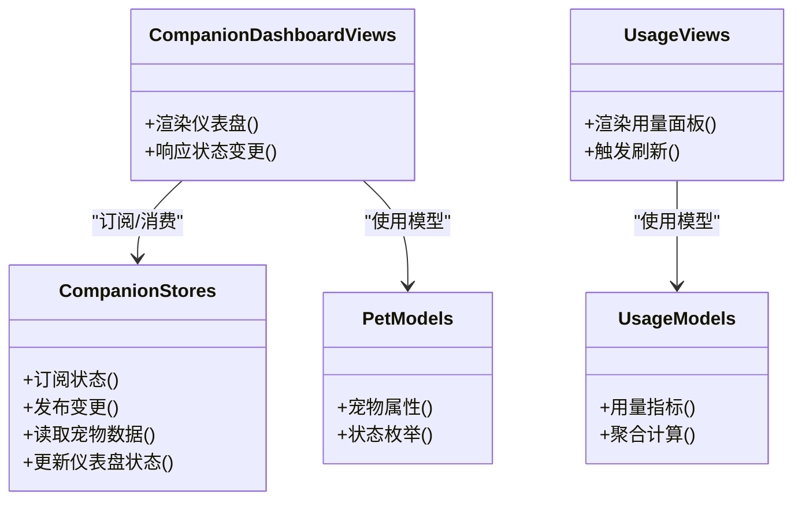
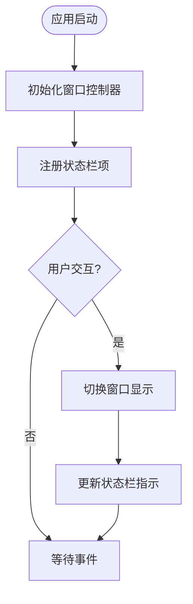
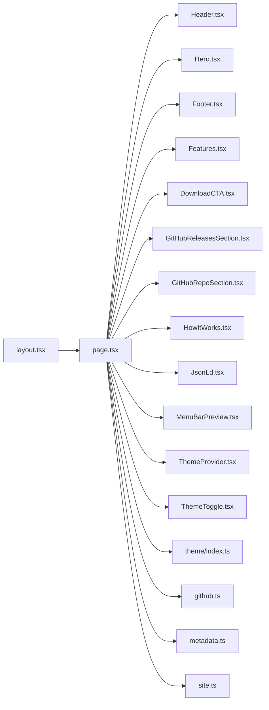
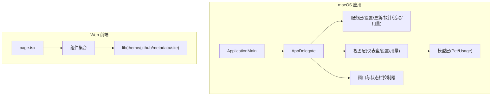

# 架构概览

<cite>
**本文引用的文件**   
- [README.md](file://README.md)
- [PROJECT.md](file://PROJECT.md)
- [app/Tomo/Package.swift](file://app/Tomo/Package.swift)
- [app/Tomo/Sources/Tomo/AppDelegate.swift](file://app/Tomo/Sources/Tomo/AppDelegate.swift)
- [app/Tomo/Sources/Tomo/ApplicationMain.swift](file://app/Tomo/Sources/Tomo/ApplicationMain.swift)
- [app/Tomo/Sources/Tomo/AppSettings.swift](file://app/Tomo/Sources/Tomo/AppSettings.swift)
- [app/Tomo/Sources/Tomo/AppUpdateService.swift](file://app/Tomo/Sources/Tomo/AppUpdateService.swift)
- [app/Tomo/Sources/Tomo/CodexAPIProbe.swift](file://app/Tomo/Sources/Tomo/CodexAPIProbe.swift)
- [app/Tomo/Sources/Tomo/CodexActivity.swift](file://app/Tomo/Sources/Tomo/CodexActivity.swift)
- [app/Tomo/Sources/Tomo/CodexUsageService.swift](file://app/Tomo/Sources/Tomo/CodexUsageService.swift)
- [app/Tomo/Sources/Tomo/CompanionDashboardViews.swift](file://app/Tomo/Sources/Tomo/CompanionDashboardViews.swift)
- [app/Tomo/Sources/Tomo/CompanionStores.swift](file://app/Tomo/Sources/Tomo/CompanionStores.swift)
- [app/Tomo/Sources/Tomo/DetachedWindowController.swift](file://app/Tomo/Sources/Tomo/DetachedWindow控制器.swift)
- [app/Tomo/Sources/Tomo/PetModels.swift](file://app/Tomo/Sources/Tomo/PetModels.swift)
- [app/Tomo/Sources/Tomo/ResetCouponFusionViews.swift](file://app/Tomo/Sources/Tomo/ResetCouponFusionViews.swift)
- [app/Tomo/Sources/Tomo/SettingsViews.swift](file://app/Tomo/Sources/Tomo/SettingsViews.swift)
- [app/Tomo/Sources/Tomo/StatusBarController.swift](file://app/Tomo/Sources/Tomo/StatusBarController.swift)
- [app/Tomo/Sources/Tomo/UsageModels.swift](file://app/Tomo/Sources/Tomo/UsageModels.swift)
- [app/Tomo/Sources/Tomo/UsageViews.swift](file://app/Tomo/Sources/Tomo/UsageViews.swift)
- [app/Tomo/Resources/AppIcon.iconset/Info.plist](file://app/Tomo/Resources/AppIcon.iconset/Info.plist)
- [app/Tomo/Resources/Pets/Tomo/pet.json](file://app/Tomo/Resources/Pets/Tomo/pet.json)
- [app/Tomo/scripts/run_chatgpt_api_probe.sh](file://app/Tomo/scripts/run_chatgpt_api_probe.sh)
- [app/landing/src/app/layout.tsx](file://app/landing/src/app/layout.tsx)
- [app/landing/src/app/page.tsx](file://app/landing/src/app/page.tsx)
- [app/landing/src/components/Header.tsx](file://app/landing/src/components/Header.tsx)
- [app/landing/src/components/Hero.tsx](file://app/landing/src/components/Hero.tsx)
- [app/landing/src/components/Footer.tsx](file://app/landing/src/components/Footer.tsx)
- [app/landing/src/components/Features.tsx](file://app/landing/src/components/Features.tsx)
- [app/landing/src/components/DownloadCTA.tsx](file://app/landing/src/components/DownloadCTA.tsx)
- [app/landing/src/components/GitHubReleasesSection.tsx](file://app/landing/src/components/GitHubReleasesSection.tsx)
- [app/landing/src/components/GitHubRepoSection.tsx](file://app/landing/src/components/GitHubRepoSection.tsx)
- [app/landing/src/components/HowItWorks.tsx](file://app/landing/src/components/HowItWorks.tsx)
- [app/landing/src/components/JsonLd.tsx](file://app/landing/src/components/JsonLd.tsx)
- [app/landing/src/components/MenuBarPreview.tsx](file://app/landing/src/components/MenuBarPreview.tsx)
- [app/landing/src/components/ThemeProvider.tsx](file://app/landing/src/components/ThemeProvider.tsx)
- [app/landing/src/components/ThemeToggle.tsx](file://app/landing/src/components/ThemeToggle.tsx)
- [app/landing/src/lib/theme/index.ts](file://app/landing/src/lib/theme/index.ts)
- [app/landing/src/lib/github.ts](file://app/landing/src/lib/github.ts)
- [app/landing/src/lib/metadata.ts](file://app/landing/src/lib/metadata.ts)
- [app/landing/src/lib/site.ts](file://app/landing/src/lib/site.ts)
- [docker/landing/Dockerfile](file://docker/landing/Dockerfile)
</cite>

## 目录
1. [简介](#简介)
2. [项目结构](#项目结构)
3. [核心组件](#核心组件)
4. [架构总览](#架构总览)
5. [详细组件分析](#详细组件分析)
6. [依赖关系分析](#依赖关系分析)
7. [性能考量](#性能考量)
8. [故障排查指南](#故障排查指南)
9. [结论](#结论)
10. [附录](#附录)

## 简介
本文件为 Tomo 项目的架构概览，面向开发者与产品人员，帮助快速理解 macOS 应用与 Web 前端两大子系统的职责边界、交互方式与数据流。文档涵盖：
- macOS 应用架构（Swift Package + AppKit）：入口、窗口与状态栏、设置与使用量统计、宠物陪伴仪表盘等。
- Web 前端架构（Next.js）：着陆页、主题、GitHub 集成、SEO 元数据等。
- 子系统间交互：通过资源与脚本进行配置探测、更新检查与下载分发。
- 模块化设计原则与解耦策略：分层清晰、职责单一、事件驱动与可插拔扩展点。

[无章节来源]

## 项目结构
Tomo 由两个主要子项目组成：
- macOS 应用（app/Tomo）：基于 Swift Package 组织，包含应用入口、服务层、UI 视图与模型、资源与脚本。
- Web 前端（app/landing）：基于 Next.js，提供产品着陆页、功能介绍、下载入口与 GitHub 信息展示。

```mermaid
graph TB
subgraph "macOS 应用"
A["ApplicationMain.swift"]
B["AppDelegate.swift"]
C["AppSettings.swift"]
D["AppUpdateService.swift"]
E["CodexAPIProbe.swift"]
F["CodexActivity.swift"]
G["CodexUsageService.swift"]
H["CompanionDashboardViews.swift"]
I["CompanionStores.swift"]
J["PetModels.swift"]
K["SettingsViews.swift"]
L["UsageViews.swift"]
M["UsageModels.swift"]
N["DetachedWindowController.swift"]
O["StatusBarController.swift"]
P["pet.json"]
Q["run_chatgpt_api_probe.sh"]
end
subgraph "Web 前端"
W["layout.tsx"]
X["page.tsx"]
Y["Header.tsx"]
Z["Hero.tsx"]
AA["Footer.tsx"]
AB["Features.tsx"]
AC["DownloadCTA.tsx"]
AD["GitHubReleasesSection.tsx"]
AE["GitHubRepoSection.tsx"]
AF["HowItWorks.tsx"]
AG["JsonLd.tsx"]
AH["MenuBarPreview.tsx"]
AI["ThemeProvider.tsx"]
AJ["ThemeToggle.tsx"]
AK["theme/index.ts"]
AL["github.ts"]
AM["metadata.ts"]
AN["site.ts"]
end
subgraph "部署与资源"
AO["Dockerfile"]
AP["Info.plist"]
end
A --> B
B --> C
B --> D
B --> E
B --> F
B --> G
B --> H
B --> I
B --> J
B --> K
B --> L
B --> M
B --> N
B --> O
H --> I
H --> J
L --> M
E --> Q
D --> AP
W --> X
X --> Y
X --> Z
X --> AA
X --> AB
X --> AC
X --> AD
X --> AE
X --> AF
X --> AG
X --> AH
X --> AI
X --> AJ
X --> AK
X --> AL
X --> AM
X --> AN
AO --> X
```

图表来源
- [app/Tomo/Sources/Tomo/ApplicationMain.swift](file://app/Tomo/Sources/Tomo/ApplicationMain.swift)
- [app/Tomo/Sources/Tomo/AppDelegate.swift](file://app/Tomo/Sources/Tomo/AppDelegate.swift)
- [app/Tomo/Sources/Tomo/AppSettings.swift](file://app/Tomo/Sources/Tomo/AppSettings.swift)
- [app/Tomo/Sources/Tomo/AppUpdateService.swift](file://app/Tomo/Sources/Tomo/AppUpdateService.swift)
- [app/Tomo/Sources/Tomo/CodexAPIProbe.swift](file://app/Tomo/Sources/Tomo/CodexAPIProbe.swift)
- [app/Tomo/Sources/Tomo/CodexActivity.swift](file://app/Tomo/Sources/Tomo/CodexActivity.swift)
- [app/Tomo/Sources/Tomo/CodexUsageService.swift](file://app/Tomo/Sources/Tomo/CodexUsageService.swift)
- [app/Tomo/Sources/Tomo/CompanionDashboardViews.swift](file://app/Tomo/Sources/Tomo/CompanionDashboardViews.swift)
- [app/Tomo/Sources/Tomo/CompanionStores.swift](file://app/Tomo/Sources/Tomo/CompanionStores.swift)
- [app/Tomo/Sources/Tomo/PetModels.swift](file://app/Tomo/Sources/Tomo/PetModels.swift)
- [app/Tomo/Sources/Tomo/SettingsViews.swift](file://app/Tomo/Sources/Tomo/SettingsViews.swift)
- [app/Tomo/Sources/Tomo/UsageViews.swift](file://app/Tomo/Sources/Tomo/UsageViews.swift)
- [app/Tomo/Sources/Tomo/UsageModels.swift](file://app/Tomo/Sources/Tomo/UsageModels.swift)
- [app/Tomo/Sources/Tomo/DetachedWindowController.swift](file://app/Tomo/Sources/Tomo/DetachedWindow控制器.swift)
- [app/Tomo/Sources/Tomo/StatusBarController.swift](file://app/Tomo/Sources/Tomo/StatusBarController.swift)
- [app/Tomo/Resources/Pets/Tomo/pet.json](file://app/Tomo/Resources/Pets/Tomo/pet.json)
- [app/Tomo/scripts/run_chatgpt_api_probe.sh](file://app/Tomo/scripts/run_chatgpt_api_probe.sh)
- [app/landing/src/app/layout.tsx](file://app/landing/src/app/layout.tsx)
- [app/landing/src/app/page.tsx](file://app/landing/src/app/page.tsx)
- [app/landing/src/components/Header.tsx](file://app/landing/src/components/Header.tsx)
- [app/landing/src/components/Hero.tsx](file://app/landing/src/components/Hero.tsx)
- [app/landing/src/components/Footer.tsx](file://app/landing/src/components/Footer.tsx)
- [app/landing/src/components/Features.tsx](file://app/landing/src/components/Features.tsx)
- [app/landing/src/components/DownloadCTA.tsx](file://app/landing/src/components/DownloadCTA.tsx)
- [app/landing/src/components/GitHubReleasesSection.tsx](file://app/landing/src/components/components/GitHubReleasesSection.tsx)
- [app/landing/src/components/GitHubRepoSection.tsx](file://app/landing/src/components/GitHubRepoSection.tsx)
- [app/landing/src/components/HowItWorks.tsx](file://app/landing/src/components/HowItWorks.tsx)
- [app/landing/src/components/JsonLd.tsx](file://app/landing/src/components/JsonLd.tsx)
- [app/landing/src/components/MenuBarPreview.tsx](file://app/landing/src/components/MenuBarPreview.tsx)
- [app/landing/src/components/ThemeProvider.tsx](file://app/landing/src/components/ThemeProvider.tsx)
- [app/landing/src/components/ThemeToggle.tsx](file://app/landing/src/components/ThemeToggle.tsx)
- [app/landing/src/lib/theme/index.ts](file://app/landing/src/lib/theme/index.ts)
- [app/landing/src/lib/github.ts](file://app/landing/src/lib/github.ts)
- [app/landing/src/lib/metadata.ts](file://app/landing/src/lib/metadata.ts)
- [app/landing/src/lib/site.ts](file://app/landing/src/lib/site.ts)
- [docker/landing/Dockerfile](file://docker/landing/Dockerfile)

章节来源
- [README.md](file://README.md)
- [PROJECT.md](file://PROJECT.md)
- [app/Tomo/Package.swift](file://app/Tomo/Package.swift)

## 核心组件
- ApplicationMain：应用启动与生命周期编排，负责初始化关键服务与 UI。
- AppDelegate：系统事件接入（如激活、退出、后台任务），协调各模块。
- AppSettings：用户偏好与配置管理，持久化存储。
- AppUpdateService：版本检查与更新流程。
- CodexAPIProbe：对外部 API 连通性探测与诊断。
- CodexActivity：活动追踪与行为埋点。
- CodexUsageService：用量统计与上报。
- CompanionDashboardViews / CompanionStores / PetModels：宠物陪伴仪表盘的数据与视图。
- SettingsViews / UsageViews / UsageModels：设置与用量相关界面与数据。
- DetachedWindowController / StatusBarController：独立窗口与菜单栏状态控制。

章节来源
- [app/Tomo/Sources/Tomo/ApplicationMain.swift](file://app/Tomo/Sources/Tomo/ApplicationMain.swift)
- [app/Tomo/Sources/Tomo/AppDelegate.swift](file://app/Tomo/Sources/Tomo/AppDelegate.swift)
- [app/Tomo/Sources/Tomo/AppSettings.swift](file://app/Tomo/Sources/Tomo/AppSettings.swift)
- [app/Tomo/Sources/Tomo/AppUpdateService.swift](file://app/Tomo/Sources/Tomo/AppUpdateService.swift)
- [app/Tomo/Sources/Tomo/CodexAPIProbe.swift](file://app/Tomo/Sources/Tomo/CodexAPIProbe.swift)
- [app/Tomo/Sources/Tomo/CodexActivity.swift](file://app/Tomo/Sources/Tomo/CodexActivity.swift)
- [app/Tomo/Sources/Tomo/CodexUsageService.swift](file://app/Tomo/Sources/Tomo/CodexUsageService.swift)
- [app/Tomo/Sources/Tomo/CompanionDashboardViews.swift](file://app/Tomo/Sources/Tomo/CompanionDashboardViews.swift)
- [app/Tomo/Sources/Tomo/CompanionStores.swift](file://app/Tomo/Sources/Tomo/CompanionStores.swift)
- [app/Tomo/Sources/Tomo/PetModels.swift](file://app/Tomo/Sources/Tomo/PetModels.swift)
- [app/Tomo/Sources/Tomo/SettingsViews.swift](file://app/Tomo/Sources/Tomo/SettingsViews.swift)
- [app/Tomo/Sources/Tomo/UsageViews.swift](file://app/Tomo/Sources/Tomo/UsageViews.swift)
- [app/Tomo/Sources/Tomo/UsageModels.swift](file://app/Tomo/Sources/Tomo/UsageModels.swift)
- [app/Tomo/Sources/Tomo/DetachedWindowController.swift](file://app/Tomo/Sources/Tomo/DetachedWindow控制器.swift)
- [app/Tomo/Sources/Tomo/StatusBarController.swift](file://app/Tomo/Sources/Tomo/StatusBarController.swift)

## 架构总览
整体采用“macOS 原生应用 + Web 着陆页”的双端架构：
- macOS 应用承担核心业务逻辑、本地状态管理与系统集成；
- Web 前端负责产品宣传、下载引导与 GitHub 信息展示；
- 两者通过资源与脚本进行轻量耦合（如探针脚本、图标与清单）。

图表来源
- [app/Tomo/Sources/Tomo/ApplicationMain.swift](file://app/Tomo/Sources/Tomo/ApplicationMain.swift)
- [app/Tomo/Sources/Tomo/AppDelegate.swift](file://app/Tomo/Sources/Tomo/AppDelegate.swift)
- [app/Tomo/Sources/Tomo/AppSettings.swift](file://app/Tomo/Sources/Tomo/AppSettings.swift)
- [app/Tomo/Sources/Tomo/AppUpdateService.swift](file://app/Tomo/Sources/Tomo/AppUpdateService.swift)
- [app/Tomo/Sources/Tomo/CodexAPIProbe.swift](file://app/Tomo/Sources/Tomo/CodexAPIProbe.swift)
- [app/Tomo/Sources/Tomo/CodexActivity.swift](file://app/Tomo/Sources/Tomo/CodexActivity.swift)
- [app/Tomo/Sources/Tomo/CodexUsageService.swift](file://app/Tomo/Sources/Tomo/CodexUsageService.swift)
- [app/Tomo/Sources/Tomo/CompanionDashboardViews.swift](file://app/Tomo/Sources/Tomo/CompanionDashboardViews.swift)
- [app/Tomo/Sources/Tomo/CompanionStores.swift](file://app/Tomo/Sources/Tomo/CompanionStores.swift)
- [app/Tomo/Sources/Tomo/PetModels.swift](file://app/Tomo/Sources/Tomo/PetModels.swift)
- [app/Tomo/Sources/Tomo/SettingsViews.swift](file://app/Tomo/Sources/Tomo/SettingsViews.swift)
- [app/Tomo/Sources/Tomo/UsageViews.swift](file://app/Tomo/Sources/Tomo/UsageViews.swift)
- [app/Tomo/Sources/Tomo/UsageModels.swift](file://app/Tomo/Sources/Tomo/UsageModels.swift)
- [app/Tomo/Sources/Tomo/DetachedWindowController.swift](file://app/Tomo/Sources/Tomo/DetachedWindow控制器.swift)
- [app/Tomo/Sources/Tomo/StatusBarController.swift](file://app/Tomo/Sources/Tomo/StatusBarController.swift)
- [app/landing/src/app/layout.tsx](file://app/landing/src/app/layout.tsx)
- [app/landing/src/app/page.tsx](file://app/landing/src/app/page.tsx)
- [app/landing/src/components/Header.tsx](file://app/landing/src/components/Header.tsx)
- [app/landing/src/components/Hero.tsx](file://app/landing/src/components/Hero.tsx)
- [app/landing/src/components/Footer.tsx](file://app/landing/src/components/Footer.tsx)
- [app/landing/src/components/Features.tsx](file://app/landing/src/components/Features.tsx)
- [app/landing/src/components/DownloadCTA.tsx](file://app/landing/src/components/DownloadCTA.tsx)
- [app/landing/src/components/GitHubReleasesSection.tsx](file://app/landing/src/components/GitHubReleasesSection.tsx)
- [app/landing/src/components/GitHubRepoSection.tsx](file://app/landing/src/components/GitHubRepoSection.tsx)
- [app/landing/src/components/HowItWorks.tsx](file://app/landing/src/components/HowItWorks.tsx)
- [app/landing/src/components/JsonLd.tsx](file://app/landing/src/components/JsonLd.tsx)
- [app/landing/src/components/MenuBarPreview.tsx](file://app/landing/src/components/MenuBarPreview.tsx)
- [app/landing/src/components/ThemeProvider.tsx](file://app/landing/src/components/ThemeProvider.tsx)
- [app/landing/src/components/ThemeToggle.tsx](file://app/landing/src/components/ThemeToggle.tsx)
- [app/landing/src/lib/theme/index.ts](file://app/landing/src/lib/theme/index.ts)
- [app/landing/src/lib/github.ts](file://app/landing/src/lib/github.ts)
- [app/landing/src/lib/metadata.ts](file://app/landing/src/lib/metadata.ts)
- [app/landing/src/lib/site.ts](file://app/landing/src/lib/site.ts)

## 详细组件分析

### macOS 应用启动与生命周期
- ApplicationMain 负责应用启动顺序与关键服务初始化。
- AppDelegate 接入系统事件，协调设置、更新、探针、活动与用量服务，并管理窗口与状态栏。

图表来源
- [app/Tomo/Sources/Tomo/ApplicationMain.swift](file://app/Tomo/Sources/Tomo/ApplicationMain.swift)
- [app/Tomo/Sources/Tomo/AppDelegate.swift](file://app/Tomo/Sources/Tomo/AppDelegate.swift)
- [app/Tomo/Sources/Tomo/AppSettings.swift](file://app/Tomo/Sources/Tomo/AppSettings.swift)
- [app/Tomo/Sources/Tomo/AppUpdateService.swift](file://app/Tomo/Sources/Tomo/AppUpdateService.swift)
- [app/Tomo/Sources/Tomo/CodexAPIProbe.swift](file://app/Tomo/Sources/Tomo/CodexAPIProbe.swift)
- [app/Tomo/Sources/Tomo/CodexActivity.swift](file://app/Tomo/Sources/Tomo/CodexActivity.swift)
- [app/Tomo/Sources/Tomo/CodexUsageService.swift](file://app/Tomo/Sources/Tomo/CodexUsageService.swift)

章节来源
- [app/Tomo/Sources/Tomo/ApplicationMain.swift](file://app/Tomo/Sources/Tomo/ApplicationMain.swift)
- [app/Tomo/Sources/Tomo/AppDelegate.swift](file://app/Tomo/Sources/Tomo/AppDelegate.swift)

### 状态管理与数据流
- CompanionStores 作为状态容器，提供响应式状态与变更通知。
- CompanionDashboardViews 消费状态并渲染仪表盘。
- PetModels 定义宠物相关数据结构。
- UsageViews 与 UsageModels 共同管理用量数据的展示与计算。

图表来源
- [app/Tomo/Sources/Tomo/CompanionStores.swift](file://app/Tomo/Sources/Tomo/CompanionStores.swift)
- [app/Tomo/Sources/Tomo/CompanionDashboardViews.swift](file://app/Tomo/Sources/Tomo/CompanionDashboardViews.swift)
- [app/Tomo/Sources/Tomo/PetModels.swift](file://app/Tomo/Sources/Tomo/PetModels.swift)
- [app/Tomo/Sources/Tomo/UsageViews.swift](file://app/Tomo/Sources/Tomo/UsageViews.swift)
- [app/Tomo/Sources/Tomo/UsageModels.swift](file://app/Tomo/Sources/Tomo/UsageModels.swift)

章节来源
- [app/Tomo/Sources/Tomo/CompanionStores.swift](file://app/Tomo/Sources/Tomo/CompanionStores.swift)
- [app/Tomo/Sources/Tomo/CompanionDashboardViews.swift](file://app/Tomo/Sources/Tomo/CompanionDashboardViews.swift)
- [app/Tomo/Sources/Tomo/PetModels.swift](file://app/Tomo/Sources/Tomo/PetModels.swift)
- [app/Tomo/Sources/Tomo/UsageViews.swift](file://app/Tomo/Sources/Tomo/UsageViews.swift)
- [app/Tomo/Sources/Tomo/UsageModels.swift](file://app/Tomo/Sources/Tomo/UsageModels.swift)

### 窗口与状态栏控制
- DetachedWindowController 管理独立窗口的创建、显示与销毁。
- StatusBarController 维护菜单栏状态项的可见性与交互。

图表来源
- [app/Tomo/Sources/Tomo/DetachedWindowController.swift](file://app/Tomo/Sources/Tomo/DetachedWindow控制器.swift)
- [app/Tomo/Sources/Tomo/StatusBarController.swift](file://app/Tomo/Sources/Tomo/StatusBarController.swift)

章节来源
- [app/Tomo/Sources/Tomo/DetachedWindowController.swift](file://app/Tomo/Sources/Tomo/DetachedWindow控制器.swift)
- [app/Tomo/Sources/Tomo/StatusBarController.swift](file://app/Tomo/Sources/Tomo/StatusBarController.swift)

### Web 前端架构
- layout.tsx 定义全局布局与主题上下文。
- page.tsx 组合页面内容，挂载各功能区块组件。
- 组件层包括 Header、Hero、Footer、Features、DownloadCTA、GitHub 相关区块、HowItWorks、JsonLd、MenuBarPreview、ThemeProvider、ThemeToggle。
- lib 层提供主题、GitHub API、元数据与站点配置。

图表来源
- [app/landing/src/app/layout.tsx](file://app/landing/src/app/layout.tsx)
- [app/landing/src/app/page.tsx](file://app/landing/src/app/page.tsx)
- [app/landing/src/components/Header.tsx](file://app/landing/src/components/Header.tsx)
- [app/landing/src/components/Hero.tsx](file://app/landing/src/components/Hero.tsx)
- [app/landing/src/components/Footer.tsx](file://app/landing/src/components/Footer.tsx)
- [app/landing/src/components/Features.tsx](file://app/landing/src/components/Features.tsx)
- [app/landing/src/components/DownloadCTA.tsx](file://app/landing/src/components/DownloadCTA.tsx)
- [app/landing/src/components/GitHubReleasesSection.tsx](file://app/landing/src/components/GitHubReleasesSection.tsx)
- [app/landing/src/components/GitHubRepoSection.tsx](file://app/landing/src/components/GitHubRepoSection.tsx)
- [app/landing/src/components/HowItWorks.tsx](file://app/landing/src/components/HowItWorks.tsx)
- [app/landing/src/components/JsonLd.tsx](file://app/landing/src/components/JsonLd.tsx)
- [app/landing/src/components/MenuBarPreview.tsx](file://app/landing/src/components/MenuBarPreview.tsx)
- [app/landing/src/components/ThemeProvider.tsx](file://app/landing/src/components/ThemeProvider.tsx)
- [app/landing/src/components/ThemeToggle.tsx](file://app/landing/src/components/ThemeToggle.tsx)
- [app/landing/src/lib/theme/index.ts](file://app/landing/src/lib/theme/index.ts)
- [app/landing/src/lib/github.ts](file://app/landing/src/lib/github.ts)
- [app/landing/src/lib/metadata.ts](file://app/landing/src/lib/metadata.ts)
- [app/landing/src/lib/site.ts](file://app/landing/src/lib/site.ts)

章节来源
- [app/landing/src/app/layout.tsx](file://app/landing/src/app/layout.tsx)
- [app/landing/src/app/page.tsx](file://app/landing/src/app/page.tsx)

### 资源与脚本
- pet.json 提供宠物相关静态数据。
- run_chatgpt_api_probe.sh 用于外部 API 连通性探测。
- Info.plist 与图标资源支持应用打包与运行。

章节来源
- [app/Tomo/Resources/Pets/Tomo/pet.json](file://app/Tomo/Resources/Pets/Tomo/pet.json)
- [app/Tomo/scripts/run_chatgpt_api_probe.sh](file://app/Tomo/scripts/run_chatgpt_api_probe.sh)
- [app/Tomo/Resources/AppIcon.iconset/Info.plist](file://app/Tomo/Resources/AppIcon.iconset/Info.plist)

## 依赖关系分析
- macOS 应用内部依赖：
  - ApplicationMain 依赖 AppDelegate 与各服务模块；
  - 视图层依赖 Stores 与 Models；
  - 窗口与状态栏控制器被 AppDelegate 统一管理。
- Web 前端依赖：
  - page.tsx 组合多个组件；
  - 组件依赖 theme、github、metadata、site 等库模块。
- 部署依赖：
  - Dockerfile 用于构建与运行 Web 前端。

图表来源
- [app/Tomo/Sources/Tomo/ApplicationMain.swift](file://app/Tomo/Sources/Tomo/ApplicationMain.swift)
- [app/Tomo/Sources/Tomo/AppDelegate.swift](file://app/Tomo/Sources/Tomo/AppDelegate.swift)
- [app/Tomo/Sources/Tomo/AppSettings.swift](file://app/Tomo/Sources/Tomo/AppSettings.swift)
- [app/Tomo/Sources/Tomo/AppUpdateService.swift](file://app/Tomo/Sources/Tomo/AppUpdateService.swift)
- [app/Tomo/Sources/Tomo/CodexAPIProbe.swift](file://app/Tomo/Sources/Tomo/CodexAPIProbe.swift)
- [app/Tomo/Sources/Tomo/CodexActivity.swift](file://app/Tomo/Sources/Tomo/CodexActivity.swift)
- [app/Tomo/Sources/Tomo/CodexUsageService.swift](file://app/Tomo/Sources/Tomo/CodexUsageService.swift)
- [app/Tomo/Sources/Tomo/CompanionDashboardViews.swift](file://app/Tomo/Sources/Tomo/CompanionDashboardViews.swift)
- [app/Tomo/Sources/Tomo/CompanionStores.swift](file://app/Tomo/Sources/Tomo/CompanionStores.swift)
- [app/Tomo/Sources/Tomo/PetModels.swift](file://app/Tomo/Sources/Tomo/PetModels.swift)
- [app/Tomo/Sources/Tomo/SettingsViews.swift](file://app/Tomo/Sources/Tomo/SettingsViews.swift)
- [app/Tomo/Sources/Tomo/UsageViews.swift](file://app/Tomo/Sources/Tomo/UsageViews.swift)
- [app/Tomo/Sources/Tomo/UsageModels.swift](file://app/Tomo/Sources/Tomo/UsageModels.swift)
- [app/Tomo/Sources/Tomo/DetachedWindowController.swift](file://app/Tomo/Sources/Tomo/DetachedWindow控制器.swift)
- [app/Tomo/Sources/Tomo/StatusBarController.swift](file://app/Tomo/Sources/Tomo/StatusBarController.swift)
- [app/landing/src/app/page.tsx](file://app/landing/src/app/page.tsx)
- [app/landing/src/lib/theme/index.ts](file://app/landing/src/lib/theme/index.ts)
- [app/landing/src/lib/github.ts](file://app/landing/src/lib/github.ts)
- [app/landing/src/lib/metadata.ts](file://app/landing/src/lib/metadata.ts)
- [app/landing/src/lib/site.ts](file://app/landing/src/lib/site.ts)
- [docker/landing/Dockerfile](file://docker/landing/Dockerfile)

章节来源
- [app/Tomo/Package.swift](file://app/Tomo/Package.swift)
- [docker/landing/Dockerfile](file://docker/landing/Dockerfile)

## 性能考量
- 状态管理：CompanionStores 应尽量减少不必要的重渲染，采用细粒度订阅与批量更新。
- 网络请求：CodexAPIProbe 与 AppUpdateService 需实现超时与重试策略，避免阻塞主线程。
- UI 渲染：将重型计算放入后台队列，确保主线程流畅。
- 资源加载：静态资源（如 pet.json）应缓存并按需加载。
- Web 前端：合理使用代码分割与懒加载，减少首屏体积。

[无章节来源]

## 故障排查指南
- 启动失败：检查 ApplicationMain 与 AppDelegate 初始化顺序与依赖注入。
- 设置异常：验证 AppSettings 的读写权限与默认值。
- 更新失败：确认 AppUpdateService 的网络可达性与签名校验。
- API 探测失败：查看 CodexAPIProbe 日志与脚本输出。
- 用量统计缺失：检查 CodexUsageService 的事件采集与上报链路。
- 前端构建错误：核对 Dockerfile 与依赖安装步骤。

章节来源
- [app/Tomo/Sources/Tomo/AppSettings.swift](file://app/Tomo/Sources/Tomo/AppSettings.swift)
- [app/Tomo/Sources/Tomo/AppUpdateService.swift](file://app/Tomo/Sources/Tomo/AppUpdateService.swift)
- [app/Tomo/Sources/Tomo/CodexAPIProbe.swift](file://app/Tomo/Sources/Tomo/CodexAPIProbe.swift)
- [app/Tomo/Sources/Tomo/CodexUsageService.swift](file://app/Tomo/Sources/Tomo/CodexUsageService.swift)
- [docker/landing/Dockerfile](file://docker/landing/Dockerfile)

## 结论
Tomo 采用清晰的 macOS 原生应用与 Web 前端双端架构，职责分离明确、模块内聚性强。通过 ApplicationMain 与 AppDelegate 统一编排生命周期与服务，配合 Stores/Models 的状态管理模式，实现了良好的可扩展性与可维护性。Web 前端以组件化与库化组织，便于迭代与部署。建议在后续开发中继续强化错误处理、性能监控与测试覆盖，以提升稳定性与用户体验。

[无章节来源]

## 附录
- 扩展点建议：
  - 在 AppDelegate 中预留插件钩子，允许新增服务或 UI 模块。
  - 在 CompanionStores 中增加事件总线，支持跨模块通信。
  - 在 Web 前端通过路由与动态导入实现功能按需加载。
- 自定义选项：
  - AppSettings 暴露更多用户偏好开关。
  - 主题与站点配置可通过 site.ts 与 theme/index.ts 灵活定制。

[无章节来源]