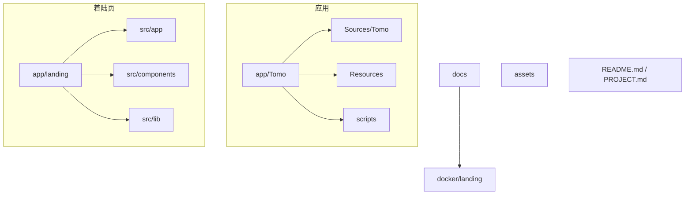
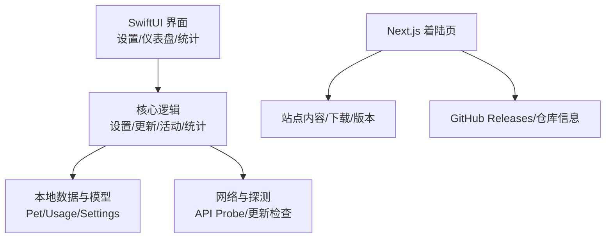
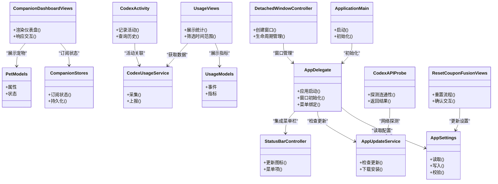
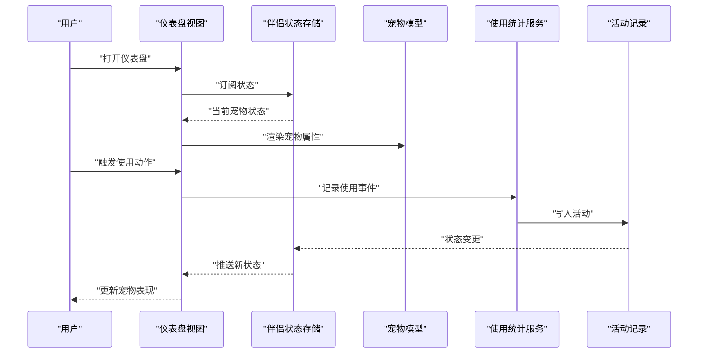
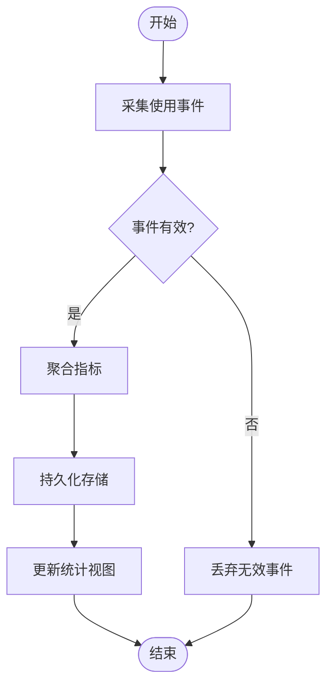
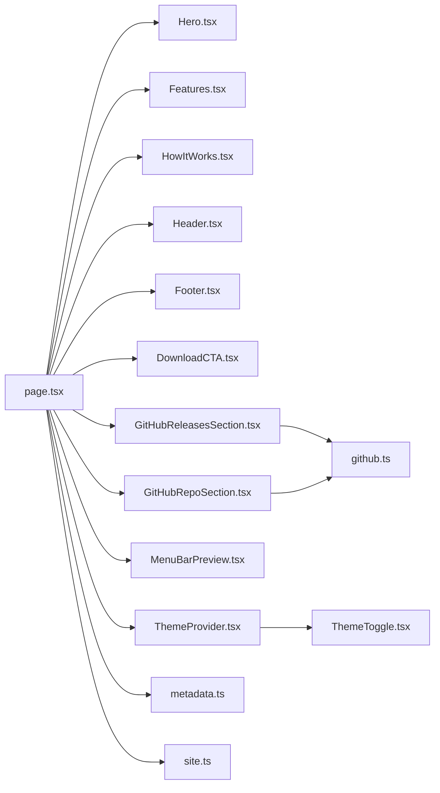
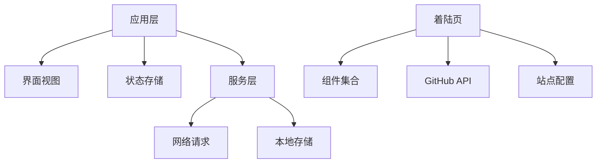

# 项目介绍

<cite>
**本文档引用的文件**   
- [README.md](file://README.md)
- [PROJECT.md](file://PROJECT.md)
- [app/Tomo/Package.swift](file://app/Tomo/Package.swift)
- [app/Tomo/Sources/Tomo/ApplicationMain.swift](file://app/Tomo/Sources/Tomo/ApplicationMain.swift)
- [app/Tomo/Sources/Tomo/AppDelegate.swift](file://app/Tomo/Sources/Tomo/AppDelegate.swift)
- [app/Tomo/Sources/Tomo/AppSettings.swift](file://app/Tomo/Sources/Tomo/AppSettings.swift)
- [app/Tomo/Sources/Tomo/AppUpdateService.swift](file://app/Tomo/Sources/Tomo/AppUpdateService.swift)
- [app/Tomo/Sources/Tomo/CodexAPIProbe.swift](file://app/Tomo/Sources/Tomo/CodexAPIProbe.swift)
- [app/Tomo/Sources/Tomo/CodexActivity.swift](file://app/Tomo/Sources/Tomo/CodexActivity.swift)
- [app/Tomo/Sources/Tomo/CodexUsageService.swift](file://app/Tomo/Sources/Tomo/CodexUsageService.swift)
- [app/Tomo/Sources/Tomo/CompanionDashboardViews.swift](file://app/Tomo/Sources/Tomo/CompanionDashboardViews.swift)
- [app/Tomo/Sources/Tomo/CompanionStores.swift](file://app/Tomo/Sources/Tomo/CompanionStores.swift)
- [app/Tomo/Sources/Tomo/DetachedWindowController.swift](file://app/Tomo/Sources/Tomo/DetachedWindow控制器.swift)
- [app/Tomo/Sources/Tomo/PetModels.swift](file://app/Tomo/Sources/Tomo/PetModels.swift)
- [app/Tomo/Sources/Tomo/ResetCouponFusionViews.swift](file://app/Tomo/Sources/Tomo/ResetCouponFusionViews.swift)
- [app/Tomo/Sources/Tomo/SettingsViews.swift](file://app/Tomo/Sources/Tomo/SettingsViews.swift)
- [app/Tomo/Sources/Tomo/StatusBarController.swift](file://app/Tomo/Sources/Tomo/StatusBarController.swift)
- [app/Tomo/Sources/Tomo/UsageModels.swift](file://app/Tomo/Sources/Tomo/UsageModels.swift)
- [app/Tomo/Sources/Tomo/UsageViews.swift](file://app/Tomo/Sources/Tomo/UsageViews.swift)
- [app/Tomo/Resources/Pets/Tomo/pet.json](file://app/Tomo/Resources/Pets/Tomo/pet.json)
- [app/Tomo/scripts/run_chatgpt_api_probe.sh](file://app/Tomo/scripts/run_chatgpt_api_probe.sh)
- [app/Tomo/package_app.sh](file://app/Tomo/package_app.sh)
- [app/Tomo/rebuild_and_run.sh](file://app/Tomo/rebuild_and_run.sh)
- [app/Tomo/release_app.sh](file://app/Tomo/release_app.sh)
- [app/landing/src/app/page.tsx](file://app/landing/src/app/page.tsx)
- [app/landing/src/components/Hero.tsx](file://app/landing/src/components/Hero.tsx)
- [app/landing/src/components/Features.tsx](file://app/landing/src/components/Features.tsx)
- [app/landing/src/components/Header.tsx](file://app/landing/src/components/Header.tsx)
- [app/landing/src/components/Footer.tsx](file://app/landing/src/components/Footer.tsx)
- [app/landing/src/components/DownloadCTA.tsx](file://app/landing/src/components/DownloadCTA.tsx)
- [app/landing/src/components/GitHubReleasesSection.tsx](file://app/landing/src/components/GitHubReleasesSection.tsx)
- [app/landing/src/components/GitHubRepoSection.tsx](file://app/landing/src/components/GitHubRepoSection.tsx)
- [app/landing/src/components/HowItWorks.tsx](file://app/landing/src/components/HowItWorks.tsx)
- [app/landing/src/components/MenuB arPreview.tsx](file://app/landing/src/components/MenuBarPreview.tsx)
- [app/landing/src/components/ThemeProvider.tsx](file://app/landing/src/components/ThemeProvider.tsx)
- [app/landing/src/components/ThemeToggle.tsx](file://app/landing/src/components/ThemeToggle.tsx)
- [app/landing/src/lib/site.ts](file://app/landing/src/lib/site.ts)
- [app/landing/src/lib/github.ts](file://app/landing/src/lib/github.ts)
- [app/landing/src/lib/metadata.ts](file://app/landing/src/lib/metadata.ts)
- [app/landing/next.config.ts](file://app/landing/next.config.ts)
- [app/landing/package.json](file://app/landing/package.json)
- [docker/landing/Dockerfile](file://docker/landing/Dockerfile)
- [docs/tomo方案.md](file://docs/tomo方案.md)
- [docs/dashboard-orientation.md](file://docs/dashboard-orientation.md)
- [docs/pet-companion-state-plan.md](file://docs/pet-companion-state-plan.md)
- [docs/ui-refresh-implementation-plan.md](file://docs/ui刷新实现计划.md)
</cite>

## 目录
1. [简介](#简介)
2. [项目结构](#项目结构)
3. [核心组件](#核心组件)
4. [架构总览](#架构总览)
5. [详细组件分析](#详细组件分析)
6. [依赖关系分析](#依赖关系分析)
7. [性能考量](#性能考量)
8. [故障排查指南](#故障排查指南)
9. [结论](#结论)
10. [附录](#附录)

## 简介
Tomo 是一款面向 macOS 的原生应用程序，围绕“宠物伴侣系统”与“设置管理”两大核心能力，为开发者提供与 AI 交互的沉浸式体验。项目同时包含一个着陆页网站，用于展示产品特性、下载入口与更新信息。其价值主张在于：
- 以直观的菜单栏与窗口化界面，降低使用门槛，提升日常开发效率
- 通过“宠物伴侣”机制，将使用过程可视化、游戏化，增强持续使用的动力
- 提供完善的设置管理与使用统计，帮助用户掌控行为与成本
- 支持自动更新与 API 探测，保障稳定可靠的运行体验

设计理念强调“简洁、直观、可配置”，技术选型聚焦于 Swift + SwiftUI（应用层）、Next.js（着陆页），并配合脚本与容器化部署，形成端到端的开发与发布流程。

## 项目结构
仓库采用多模块组织方式：
- app/Tomo：macOS 应用源码、资源与构建脚本
- app/landing：着陆页网站（Next.js）
- docs：设计文档与实施计划
- docker/landing：着陆页容器化镜像
- assets：截图与素材
- 根级说明文件：README.md、PROJECT.md 等

图表来源
- [app/Tomo/Package.swift](file://app/Tomo/Package.swift)
- [app/landing/package.json](file://app/landing/package.json)
- [docker/landing/Dockerfile](file://docker/landing/Dockerfile)

章节来源
- [README.md](file://README.md)
- [PROJECT.md](file://PROJECT.md)
- [app/Tomo/Package.swift](file://app/Tomo/Package.swift)
- [app/landing/package.json](file://app/landing/package.json)

## 核心组件
- 主应用（macOS）
  - 应用生命周期与入口：ApplicationMain、AppDelegate
  - 设置管理：AppSettings、SettingsViews
  - 更新服务：AppUpdateService
  - 状态栏集成：StatusBarController
  - 宠物伴侣系统：PetModels、CompanionDashboardViews、CompanionStores、pet.json
  - 使用统计：UsageModels、UsageViews、CodexUsageService
  - API 探测与活动跟踪：CodexAPIProbe、CodexActivity
  - 辅助窗口：DetachedWindowController
  - 优惠券重置融合视图：ResetCouponFusionViews
- 着陆页网站（Next.js）
  - 页面与布局：page.tsx、layout.tsx
  - 展示组件：Hero、Features、HowItWorks、Header、Footer、DownloadCTA、GitHubReleasesSection、GitHubRepoSection、MenuBarPreview
  - 主题与元数据：ThemeProvider、ThemeToggle、metadata.ts、site.ts
  - GitHub 集成：github.ts
  - 构建与配置：next.config.ts、package.json

章节来源
- [app/Tomo/Sources/Tomo/ApplicationMain.swift](file://app/Tomo/Sources/Tomo/ApplicationMain.swift)
- [app/Tomo/Sources/Tomo/AppDelegate.swift](file://app/Tomo/Sources/Tomo/AppDelegate.swift)
- [app/Tomo/Sources/Tomo/AppSettings.swift](file://app/Tomo/Sources/Tomo/AppSettings.swift)
- [app/Tomo/Sources/Tomo/AppUpdateService.swift](file://app/Tomo/Sources/Tomo/AppUpdateService.swift)
- [app/Tomo/Sources/Tomo/StatusBarController.swift](file://app/Tomo/Sources/Tomo/StatusBarController.swift)
- [app/Tomo/Sources/Tomo/PetModels.swift](file://app/Tomo/Sources/Tomo/PetModels.swift)
- [app/Tomo/Sources/Tomo/CompanionDashboardViews.swift](file://app/Tomo/Sources/Tomo/CompanionDashboardViews.swift)
- [app/Tomo/Sources/Tomo/CompanionStores.swift](file://app/Tomo/Sources/Tomo/CompanionStores.swift)
- [app/Tomo/Sources/Tomo/UsageModels.swift](file://app/Tomo/Sources/Tomo/UsageModels.swift)
- [app/Tomo/Sources/Tomo/UsageViews.swift](file://app/Tomo/Sources/Tomo/UsageViews.swift)
- [app/Tomo/Sources/Tomo/CodexUsageService.swift](file://app/Tomo/Sources/Tomo/CodexUsageService.swift)
- [app/Tomo/Sources/Tomo/CodexAPIProbe.swift](file://app/Tomo/Sources/Tomo/CodexAPIProbe.swift)
- [app/Tomo/Sources/Tomo/CodexActivity.swift](file://app/Tomo/Sources/Tomo/CodexActivity.swift)
- [app/Tomo/Sources/Tomo/DetachedWindowController.swift](file://app/Tomo/Sources/Tomo/DetachedWindow控制器.swift)
- [app/Tomo/Sources/Tomo/ResetCouponFusionViews.swift](file://app/Tomo/Sources/Tomo/ResetCouponFusionViews.swift)
- [app/Tomo/Sources/Tomo/SettingsViews.swift](file://app/Tomo/Sources/Tomo/SettingsViews.swift)
- [app/Tomo/Resources/Pets/Tomo/pet.json](file://app/Tomo/Resources/Pets/Tomo/pet.json)
- [app/landing/src/app/page.tsx](file://app/landing/src/app/page.tsx)
- [app/landing/src/components/Hero.tsx](file://app/landing/src/components/Hero.tsx)
- [app/landing/src/components/Features.tsx](file://app/landing/src/components/Features.tsx)
- [app/landing/src/components/Header.tsx](file://app/landing/src/components/Header.tsx)
- [app/landing/src/components/Footer.tsx](file://app/landing/src/components/Footer.tsx)
- [app/landing/src/components/DownloadCTA.tsx](file://app/landing/src/components/DownloadCTA.tsx)
- [app/landing/src/components/GitHubReleasesSection.tsx](file://app/landing/src/components/GitHubReleasesSection.tsx)
- [app/landing/src/components/GitHubRepoSection.tsx](file://app/landing/src/components/GitHubRepoSection.tsx)
- [app/landing/src/components/HowItWorks.tsx](file://app/landing/src/components/HowItWorks.tsx)
- [app/landing/src/components/MenuBarPreview.tsx](file://app/landing/src/components/MenuBarPreview.tsx)
- [app/landing/src/components/ThemeProvider.tsx](file://app/landing/src/components/ThemeProvider.tsx)
- [app/landing/src/components/ThemeToggle.tsx](file://app/landing/src/components/ThemeToggle.tsx)
- [app/landing/src/lib/site.ts](file://app/landing/src/lib/site.ts)
- [app/landing/src/lib/github.ts](file://app/landing/src/lib/github.ts)
- [app/landing/src/lib/metadata.ts](file://app/landing/src/lib/metadata.ts)
- [app/landing/next.config.ts](file://app/landing/next.config.ts)
- [app/landing/package.json](file://app/landing/package.json)

## 架构总览
整体架构分为三层：
- 应用层（Swift/SwiftUI）：负责用户界面、状态管理、设置与统计、更新与探测
- 数据与服务层：本地模型与存储、外部 API 探测与使用上报
- 展示层（Next.js）：着陆页用于产品宣传、下载引导与版本信息展示

图表来源
- [app/Tomo/Sources/Tomo/ApplicationMain.swift](file://app/Tomo/Sources/Tomo/ApplicationMain.swift)
- [app/Tomo/Sources/Tomo/AppSettings.swift](file://app/Tomo/Sources/Tomo/AppSettings.swift)
- [app/Tomo/Sources/Tomo/AppUpdateService.swift](file://app/Tomo/Sources/Tomo/AppUpdateService.swift)
- [app/Tomo/Sources/Tomo/CodexAPIProbe.swift](file://app/Tomo/Sources/Tomo/CodexAPIProbe.swift)
- [app/Tomo/Sources/Tomo/UsageModels.swift](file://app/Tomo/Sources/Tomo/UsageModels.swift)
- [app/landing/src/app/page.tsx](file://app/landing/src/app/page.tsx)
- [app/landing/src/lib/github.ts](file://app/landing/src/lib/github.ts)

## 详细组件分析

### macOS 应用核心组件
- 应用入口与生命周期
  - ApplicationMain：应用启动与初始化编排
  - AppDelegate：系统事件处理与窗口/菜单初始化
- 设置与更新
  - AppSettings：集中式配置读写与校验
  - SettingsViews：设置界面与交互
  - AppUpdateService：版本检查与更新流程
- 宠物伴侣系统
  - PetModels：宠物实体与属性定义
  - CompanionDashboardViews：仪表盘视图与状态展示
  - CompanionStores：状态持久化与变更驱动
  - pet.json：宠物初始配置与资源
- 使用统计
  - UsageModels：统计数据结构
  - UsageViews：统计展示界面
  - CodexUsageService：采集与上报逻辑
- 其他支撑
  - CodexAPIProbe：API 连通性探测
  - CodexActivity：活动记录与追踪
  - StatusBarController：菜单栏状态集成
  - DetachedWindowController：独立窗口管理
  - ResetCouponFusionViews：优惠券重置相关界面

图表来源
- [app/Tomo/Sources/Tomo/ApplicationMain.swift](file://app/Tomo/Sources/Tomo/ApplicationMain.swift)
- [app/Tomo/Sources/Tomo/AppDelegate.swift](file://app/Tomo/Sources/Tomo/AppDelegate.swift)
- [app/Tomo/Sources/Tomo/AppSettings.swift](file://app/Tomo/Sources/Tomo/AppSettings.swift)
- [app/Tomo/Sources/Tomo/AppUpdateService.swift](file://app/Tomo/Sources/Tomo/AppUpdateService.swift)
- [app/Tomo/Sources/Tomo/PetModels.swift](file://app/Tomo/Sources/Tomo/PetModels.swift)
- [app/Tomo/Sources/Tomo/CompanionDashboardViews.swift](file://app/Tomo/Sources/Tomo/CompanionDashboardViews.swift)
- [app/Tomo/Sources/Tomo/CompanionStores.swift](file://app/Tomo/Sources/Tomo/CompanionStores.swift)
- [app/Tomo/Sources/Tomo/UsageModels.swift](file://app/Tomo/Sources/Tomo/UsageModels.swift)
- [app/Tomo/Sources/Tomo/UsageViews.swift](file://app/Tomo/Sources/Tomo/UsageViews.swift)
- [app/Tomo/Sources/Tomo/CodexUsageService.swift](file://app/Tomo/Sources/Tomo/CodexUsageService.swift)
- [app/Tomo/Sources/Tomo/CodexAPIProbe.swift](file://app/Tomo/Sources/Tomo/CodexAPIProbe.swift)
- [app/Tomo/Sources/Tomo/CodexActivity.swift](file://app/Tomo/Sources/Tomo/CodexActivity.swift)
- [app/Tomo/Sources/Tomo/StatusBarController.swift](file://app/Tomo/Sources/Tomo/StatusBarController.swift)
- [app/Tomo/Sources/Tomo/DetachedWindowController.swift](file://app/Tomo/Sources/Tomo/DetachedWindow控制器.swift)
- [app/Tomo/Sources/Tomo/ResetCouponFusionViews.swift](file://app/Tomo/Sources/Tomo/ResetCouponFusionViews.swift)

章节来源
- [app/Tomo/Sources/Tomo/ApplicationMain.swift](file://app/Tomo/Sources/Tomo/ApplicationMain.swift)
- [app/Tomo/Sources/Tomo/AppDelegate.swift](file://app/Tomo/Sources/Tomo/AppDelegate.swift)
- [app/Tomo/Sources/Tomo/AppSettings.swift](file://app/Tomo/Sources/Tomo/AppSettings.swift)
- [app/Tomo/Sources/Tomo/AppUpdateService.swift](file://app/Tomo/Sources/Tomo/AppUpdateService.swift)
- [app/Tomo/Sources/Tomo/PetModels.swift](file://app/Tomo/Sources/Tomo/PetModels.swift)
- [app/Tomo/Sources/Tomo/CompanionDashboardViews.swift](file://app/Tomo/Sources/Tomo/CompanionDashboardViews.swift)
- [app/Tomo/Sources/Tomo/CompanionStores.swift](file://app/Tomo/Sources/Tomo/CompanionStores.swift)
- [app/Tomo/Sources/Tomo/UsageModels.swift](file://app/Tomo/Sources/Tomo/UsageModels.swift)
- [app/Tomo/Sources/Tomo/UsageViews.swift](file://app/Tomo/Sources/Tomo/UsageViews.swift)
- [app/Tomo/Sources/Tomo/CodexUsageService.swift](file://app/Tomo/Sources/Tomo/CodexUsageService.swift)
- [app/Tomo/Sources/Tomo/CodexAPIProbe.swift](file://app/Tomo/Sources/Tomo/CodexAPIProbe.swift)
- [app/Tomo/Sources/Tomo/CodexActivity.swift](file://app/Tomo/Sources/Tomo/CodexActivity.swift)
- [app/Tomo/Sources/Tomo/StatusBarController.swift](file://app/Tomo/Sources/Tomo/StatusBarController.swift)
- [app/Tomo/Sources/Tomo/DetachedWindowController.swift](file://app/Tomo/Sources/Tomo/DetachedWindow控制器.swift)
- [app/Tomo/Sources/Tomo/ResetCouponFusionViews.swift](file://app/Tomo/Sources/Tomo/ResetCouponFusionViews.swift)

### 宠物伴侣系统流程
宠物伴侣系统通过状态驱动与可视化仪表盘，将使用行为转化为可感知的反馈。典型流程如下：

图表来源
- [app/Tomo/Sources/Tomo/CompanionDashboardViews.swift](file://app/Tomo/Sources/Tomo/CompanionDashboardViews.swift)
- [app/Tomo/Sources/Tomo/CompanionStores.swift](file://app/Tomo/Sources/Tomo/CompanionStores.swift)
- [app/Tomo/Sources/Tomo/PetModels.swift](file://app/Tomo/Sources/Tomo/PetModels.swift)
- [app/Tomo/Sources/Tomo/CodexUsageService.swift](file://app/Tomo/Sources/Tomo/CodexUsageService.swift)
- [app/Tomo/Sources/Tomo/CodexActivity.swift](file://app/Tomo/Sources/Tomo/CodexActivity.swift)

章节来源
- [app/Tomo/Sources/Tomo/CompanionDashboardViews.swift](file://app/Tomo/Sources/Tomo/CompanionDashboardViews.swift)
- [app/Tomo/Sources/Tomo/CompanionStores.swift](file://app/Tomo/Sources/Tomo/CompanionStores.swift)
- [app/Tomo/Sources/Tomo/PetModels.swift](file://app/Tomo/Sources/Tomo/PetModels.swift)
- [app/Tomo/Sources/Tomo/CodexUsageService.swift](file://app/Tomo/Sources/Tomo/CodexUsageService.swift)
- [app/Tomo/Sources/Tomo/CodexActivity.swift](file://app/Tomo/Sources/Tomo/CodexActivity.swift)

### 使用统计处理流程
使用统计涵盖数据采集、聚合与展示，关键步骤包括：

图表来源
- [app/Tomo/Sources/Tomo/UsageModels.swift](file://app/Tomo/Sources/Tomo/UsageModels.swift)
- [app/Tomo/Sources/Tomo/UsageViews.swift](file://app/Tomo/Sources/Tomo/UsageViews.swift)
- [app/Tomo/Sources/Tomo/CodexUsageService.swift](file://app/Tomo/Sources/Tomo/CodexUsageService.swift)

章节来源
- [app/Tomo/Sources/Tomo/UsageModels.swift](file://app/Tomo/Sources/Tomo/UsageModels.swift)
- [app/Tomo/Sources/Tomo/UsageViews.swift](file://app/Tomo/Sources/Tomo/UsageViews.swift)
- [app/Tomo/Sources/Tomo/CodexUsageService.swift](file://app/Tomo/Sources/Tomo/CodexUsageService.swift)

### 着陆页网站组件
着陆页由多个组件构成，覆盖品牌展示、功能说明、下载引导与版本信息：
- Hero：首屏价值主张与行动号召
- Features：核心特性列表
- HowItWorks：工作原理说明
- Header/Footer：导航与页脚信息
- DownloadCTA：下载按钮与渠道
- GitHubReleasesSection/GitHubRepoSection：版本与仓库信息
- MenuBarPreview：菜单栏预览图
- ThemeProvider/ThemeToggle：主题切换
- site.ts/metadata.ts：站点信息与 SEO 元数据
- github.ts：GitHub API 调用

图表来源
- [app/landing/src/app/page.tsx](file://app/landing/src/app/page.tsx)
- [app/landing/src/components/Hero.tsx](file://app/landing/src/components/Hero.tsx)
- [app/landing/src/components/Features.tsx](file://app/landing/src/components/Features.tsx)
- [app/landing/src/components/HowItWorks.tsx](file://app/landing/src/components/HowItWorks.tsx)
- [app/landing/src/components/Header.tsx](file://app/landing/src/components/Header.tsx)
- [app/landing/src/components/Footer.tsx](file://app/landing/src/components/Footer.tsx)
- [app/landing/src/components/DownloadCTA.tsx](file://app/landing/src/components/DownloadCTA.tsx)
- [app/landing/src/components/GitHubReleasesSection.tsx](file://app/landing/src/components/GitHubReleasesSection.tsx)
- [app/landing/src/components/GitHubRepoSection.tsx](file://app/landing/src/components/GitHubRepoSection.tsx)
- [app/landing/src/components/MenuBarPreview.tsx](file://app/landing/src/components/MenuBarPreview.tsx)
- [app/landing/src/components/ThemeProvider.tsx](file://app/landing/src/components/ThemeProvider.tsx)
- [app/landing/src/components/ThemeToggle.tsx](file://app/landing/src/components/ThemeToggle.tsx)
- [app/landing/src/lib/metadata.ts](file://app/landing/src/lib/metadata.ts)
- [app/landing/src/lib/site.ts](file://app/landing/src/lib/site.ts)
- [app/landing/src/lib/github.ts](file://app/landing/src/lib/github.ts)

章节来源
- [app/landing/src/app/page.tsx](file://app/landing/src/app/page.tsx)
- [app/landing/src/components/Hero.tsx](file://app/landing/src/components/Hero.tsx)
- [app/landing/src/components/Features.tsx](file://app/landing/src/components/Features.tsx)
- [app/landing/src/components/HowItWorks.tsx](file://app/landing/src/components/HowItWorks.tsx)
- [app/landing/src/components/Header.tsx](file://app/landing/src/components/Header.tsx)
- [app/landing/src/components/Footer.tsx](file://app/landing/src/components/Footer.tsx)
- [app/landing/src/components/DownloadCTA.tsx](file://app/landing/src/components/DownloadCTA.tsx)
- [app/landing/src/components/GitHubReleasesSection.tsx](file://app/landing/src/components/GitHubReleasesSection.tsx)
- [app/landing/src/components/GitHubRepoSection.tsx](file://app/landing/src/components/GitHubRepoSection.tsx)
- [app/landing/src/components/MenuBarPreview.tsx](file://app/landing/src/components/MenuBarPreview.tsx)
- [app/landing/src/components/ThemeProvider.tsx](file://app/landing/src/components/ThemeProvider.tsx)
- [app/landing/src/components/ThemeToggle.tsx](file://app/landing/src/components/ThemeToggle.tsx)
- [app/landing/src/lib/metadata.ts](file://app/landing/src/lib/metadata.ts)
- [app/landing/src/lib/site.ts](file://app/landing/src/lib/site.ts)
- [app/landing/src/lib/github.ts](file://app/landing/src/lib/github.ts)

## 依赖关系分析
- 应用内依赖
  - 界面层依赖状态存储与模型
  - 服务层依赖网络与本地存储
  - 更新与探测依赖网络栈
- 着陆页依赖
  - Next.js 运行时与组件库
  - GitHub API 客户端
  - 主题与元数据工具

图表来源
- [app/Tomo/Sources/Tomo/CompanionDashboardViews.swift](file://app/Tomo/Sources/Tomo/CompanionDashboardViews.swift)
- [app/Tomo/Sources/Tomo/CompanionStores.swift](file://app/Tomo/Sources/Tomo/CompanionStores.swift)
- [app/Tomo/Sources/Tomo/CodexUsageService.swift](file://app/Tomo/Sources/Tomo/CodexUsageService.swift)
- [app/landing/src/components/GitHubReleasesSection.tsx](file://app/landing/src/components/GitHubReleasesSection.tsx)
- [app/landing/src/lib/github.ts](file://app/landing/src/lib/github.ts)
- [app/landing/src/lib/site.ts](file://app/landing/src/lib/site.ts)

章节来源
- [app/Tomo/Sources/Tomo/CompanionDashboardViews.swift](file://app/Tomo/Sources/Tomo/CompanionDashboardViews.swift)
- [app/Tomo/Sources/Tomo/CompanionStores.swift](file://app/Tomo/Sources/Tomo/CompanionStores.swift)
- [app/Tomo/Sources/Tomo/CodexUsageService.swift](file://app/Tomo/Sources/Tomo/CodexUsageService.swift)
- [app/landing/src/components/GitHubReleasesSection.tsx](file://app/landing/src/components/GitHubReleasesSection.tsx)
- [app/landing/src/lib/github.ts](file://app/landing/src/lib/github.ts)
- [app/landing/src/lib/site.ts](file://app/landing/src/lib/site.ts)

## 性能考量
- 界面渲染：使用 SwiftUI 声明式 UI，结合状态订阅减少不必要的重绘
- 数据存储：优先本地缓存与增量更新，避免频繁 I/O
- 网络请求：合并与去抖，失败重试与超时控制
- 统计上报：批量提交与后台任务，降低前台阻塞
- 着陆页：静态生成与按需加载，减少首屏体积

[本节为通用指导，不直接分析具体文件]

## 故障排查指南
- 应用启动问题
  - 检查 ApplicationMain 与 AppDelegate 初始化顺序
  - 验证配置文件与权限
- 更新失败
  - 检查 AppUpdateService 的网络可达性与签名校验
  - 查看日志与错误码
- API 探测异常
  - 使用 CodexAPIProbe 进行连通性测试
  - 核对代理与证书配置
- 宠物状态不同步
  - 检查 CompanionStores 的状态订阅与持久化
  - 确认 PetModels 字段映射
- 统计缺失或异常
  - 核查 UsageModels 的事件结构与过滤条件
  - 检查 CodexUsageService 的上报策略与限流

章节来源
- [app/Tomo/Sources/Tomo/ApplicationMain.swift](file://app/Tomo/Sources/Tomo/ApplicationMain.swift)
- [app/Tomo/Sources/Tomo/AppDelegate.swift](file://app/Tomo/Sources/Tomo/AppDelegate.swift)
- [app/Tomo/Sources/Tomo/AppUpdateService.swift](file://app/Tomo/Sources/Tomo/AppUpdateService.swift)
- [app/Tomo/Sources/Tomo/CodexAPIProbe.swift](file://app/Tomo/Sources/Tomo/CodexAPIProbe.swift)
- [app/Tomo/Sources/Tomo/CompanionStores.swift](file://app/Tomo/Sources/Tomo/CompanionStores.swift)
- [app/Tomo/Sources/Tomo/PetModels.swift](file://app/Tomo/Sources/Tomo/PetModels.swift)
- [app/Tomo/Sources/Tomo/UsageModels.swift](file://app/Tomo/Sources/Tomo/UsageModels.swift)
- [app/Tomo/Sources/Tomo/CodexUsageService.swift](file://app/Tomo/Sources/Tomo/CodexUsageService.swift)

## 结论
Tomo 以“宠物伴侣系统”为核心差异化能力，结合完善的设置管理与使用统计，为 macOS 用户提供高效且有趣的 AI 交互体验。通过清晰的模块化设计与稳健的服务层，项目在易用性与可扩展性之间取得平衡。未来可在宠物行为演化、统计维度扩展与着陆页国际化等方面持续演进。

[本节为总结性内容，不直接分析具体文件]

## 附录
- 历史背景与发展路线
  - 参考设计文档与实施计划，了解宠物伴侣状态规划、仪表板方向与 UI 刷新计划
- 构建与发布
  - 使用 Package.swift 管理依赖，脚本完成打包与发布
  - 着陆页通过 Next.js 构建，Docker 容器化部署

章节来源
- [docs/pet-companion-state-plan.md](file://docs/pet-companion-state-plan.md)
- [docs/dashboard-orientation.md](file://docs/dashboard-orientation.md)
- [docs/ui刷新实现计划.md](file://docs/ui刷新实现计划.md)
- [app/Tomo/Package.swift](file://app/Tomo/Package.swift)
- [app/Tomo/package_app.sh](file://app/Tomo/package_app.sh)
- [app/Tomo/rebuild_and_run.sh](file://app/Tomo/rebuild_and_run.sh)
- [app/Tomo/release_app.sh](file://app/Tomo/release_app.sh)
- [docker/landing/Dockerfile](file://docker/landing/Dockerfile)