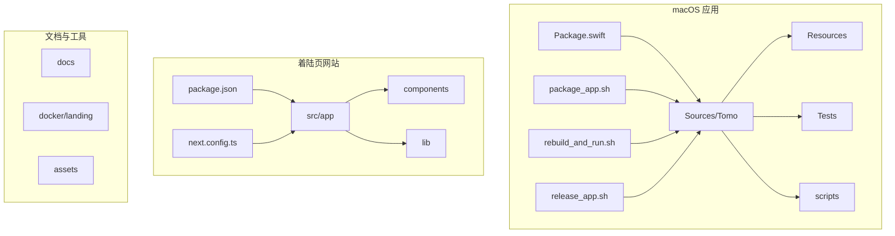
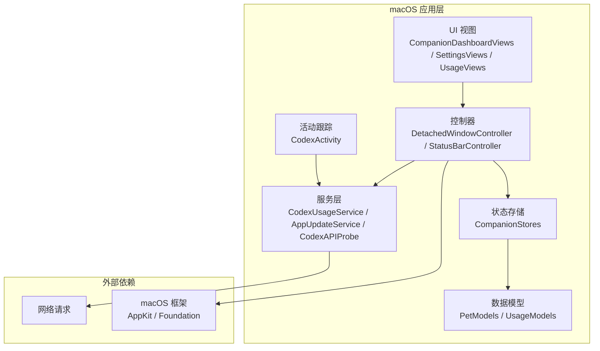
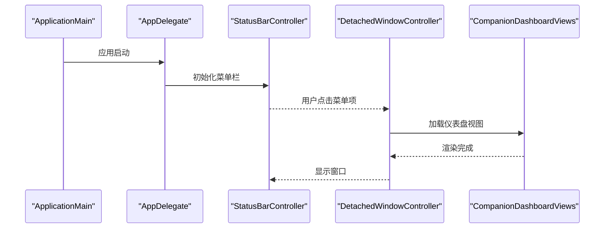
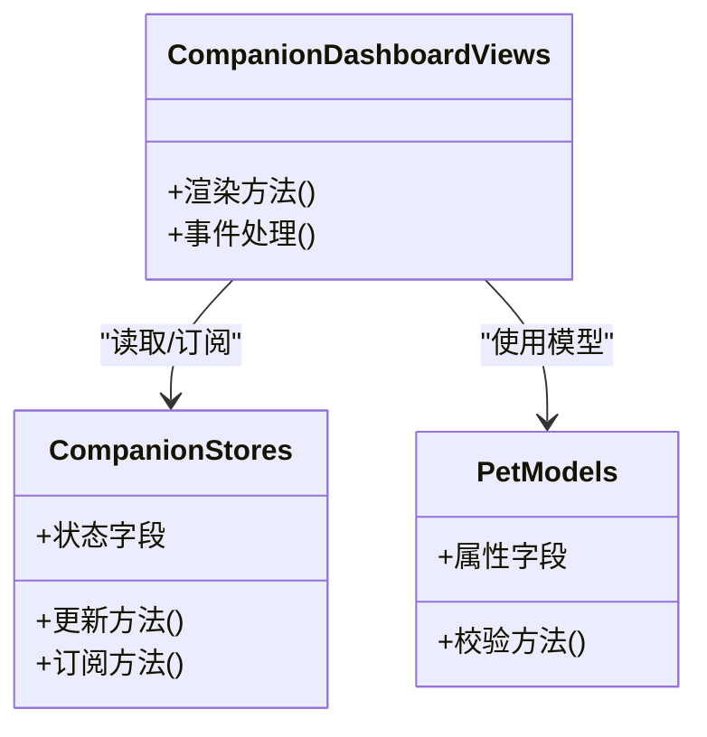
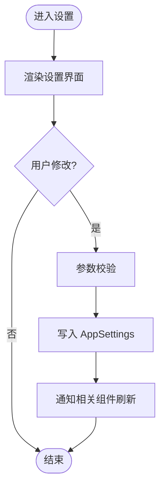
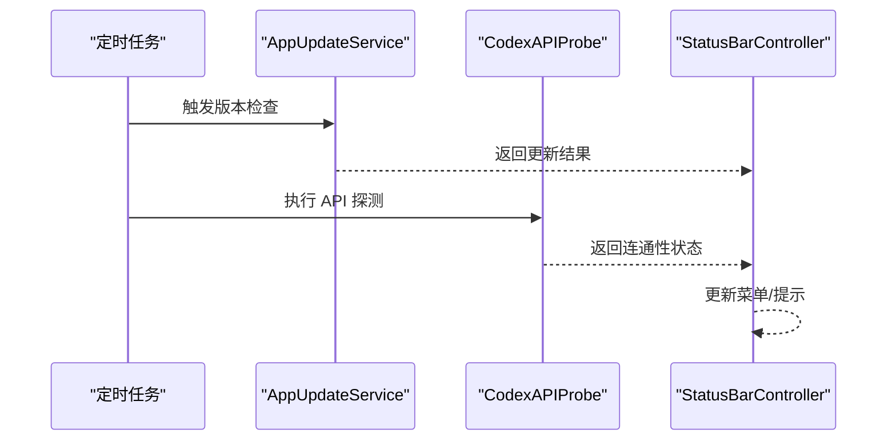
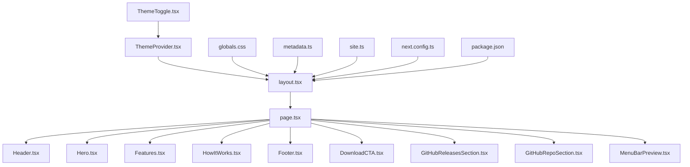
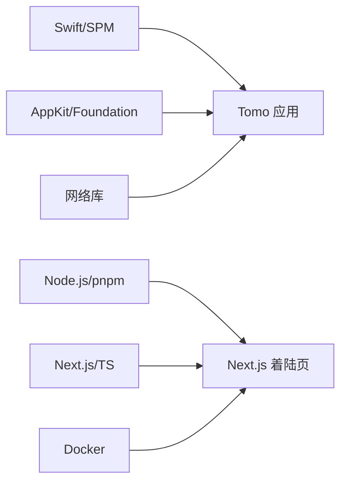

# 项目概览

<cite>
**本文引用的文件**   
- [README.md](file://README.md)
- [PROJECT.md](file://PROJECT.md)
- [Package.swift](file://app/Tomo/Package.swift)
- [ApplicationMain.swift](file://app/Tomo/Sources/Tomo/ApplicationMain.swift)
- [AppDelegate.swift](file://app/Tomo/Sources/Tomo/AppDelegate.swift)
- [AppSettings.swift](file://app/Tomo/Sources/Tomo/AppSettings.swift)
- [AppUpdateService.swift](file://app/Tomo/Sources/Tomo/AppUpdateService.swift)
- [CodexAPIProbe.swift](file://app/Tomo/Sources/Tomo/CodexAPIProbe.swift)
- [CodexActivity.swift](file://app/Tomo/Sources/Tomo/CodexActivity.swift)
- [CodexUsageService.swift](file://app/Tomo/Sources/Tomo/CodexUsageService.swift)
- [CompanionDashboardViews.swift](file://app/Tomo/Sources/Tomo/CompanionDashboardViews.swift)
- [CompanionStores.swift](file://app/Tomo/Sources/Tomo/CompanionStores.swift)
- [DetachedWindowController.swift](file://app/Tomo/Sources/Tomo/DetachedWindowController.swift)
- [PetModels.swift](file://app/Tomo/Sources/Tomo/PetModels.swift)
- [ResetCouponFusionViews.swift](file://app/Tomo/Sources/Tomo/ResetCouponFusionViews.swift)
- [SettingsViews.swift](file://app/Tomo/Sources/Tomo/SettingsViews.swift)
- [StatusBarController.swift](file://app/Tomo/Sources/Tomo/StatusBarController.swift)
- [UsageModels.swift](file://app/Tomo/Sources/Tomo/UsageModels.swift)
- [UsageViews.swift](file://app/Tomo/Sources/Tomo/UsageViews.swift)
- [package_app.sh](file://app/Tomo/package_app.sh)
- [rebuild_and_run.sh](file://app/Tomo/rebuild_and_run.sh)
- [release_app.sh](file://app/Tomo/release_app.sh)
- [run_chatgpt_api_probe.sh](file://app/Tomo/scripts/run_chatgpt_api_probe.sh)
- [package.json](file://app/landing/package.json)
- [next.config.ts](file://app/landing/next.config.ts)
- [layout.tsx](file://app/landing/src/app/layout.tsx)
- [page.tsx](file://app/landing/src/app/page.tsx)
- [Header.tsx](file://app/landing/src/components/Header.tsx)
- [Hero.tsx](file://app/landing/src/components/Hero.tsx)
- [Features.tsx](file://app/landing/src/components/Features.tsx)
- [HowItWorks.tsx](file://app/landing/src/components/HowItWorks.tsx)
- [Footer.tsx](file://app/landing/src/components/Footer.tsx)
- [DownloadCTA.tsx](file://app/landing/src/components/DownloadCTA.tsx)
- [GitHubReleasesSection.tsx](file://app/landing/src/components/GitHubReleasesSection.tsx)
- [GitHubRepoSection.tsx](file://app/landing/src/components/GitHubRepoSection.tsx)
- [MenuBarsPreview.tsx](file://app/landing/src/components/MenuBarPreview.tsx)
- [ThemeProvider.tsx](file://app/landing/src/components/ThemeProvider.tsx)
- [ThemeToggle.tsx](file://app/landing/src/components/ThemeToggle.tsx)
- [globals.css](file://app/landing/src/app/globals.css)
- [robots.ts](file://app/landing/src/app/robots.ts)
- [sitemap.ts](file://app/landing/src/app/sitemap.ts)
- [theme/index.ts](file://app/landing/src/lib/theme/index.ts)
- [github.ts](file://app/landing/src/lib/github.ts)
- [metadata.ts](file://app/landing/src/lib/metadata.ts)
- [site.ts](file://app/landing/src/lib/site.ts)
- [Dockerfile](file://docker/landing/Dockerfile)
- [tomo方案.md](file://docs/tomo方案.md)
- [dashboard-orientation.md](file://docs/dashboard-orientation.md)
- [pet-companion-state-plan.md](file://docs/pet-companion-state-plan.md)
- [ui-refresh-implementation-plan.md](file://docs/ui-refresh-implementation-plan.md)
</cite>

## 目录
1. [简介](#简介)
2. [项目结构](#项目结构)
3. [核心组件](#核心组件)
4. [架构总览](#架构总览)
5. [详细组件分析](#详细组件分析)
6. [依赖分析](#依赖分析)
7. [性能考虑](#性能考虑)
8. [故障排查指南](#故障排查指南)
9. [结论](#结论)
10. [附录](#附录)

## 简介
Tomo 是一款 macOS 应用程序，提供“宠物伴侣系统”与“设置管理”能力。它由两部分组成：
- Tomo 主应用（Swift + AppKit）：负责菜单栏状态、窗口管理、宠物伴侣仪表盘、使用量统计、更新检查、API 探测等。
- 着陆页网站（Next.js）：用于产品说明、下载入口、功能展示与发布动态。

技术栈与开发环境要求：
- 主应用：Swift、Xcode、macOS SDK、SPM（Package.swift）。
- 着陆页：Node.js、pnpm、Next.js。
- 可选容器化部署：Docker（用于构建/运行着陆页）。

本概览旨在帮助开发者快速理解代码组织方式、安装与基本使用方法，以及整体架构与关键流程。

## 项目结构
仓库采用多模块组织：
- app/Tomo：Swift 主应用源码、资源、脚本与测试。
- app/landing：Next.js 着陆页前端工程。
- docs：设计文档与实现计划。
- docker/landing：着陆页的 Docker 构建配置。
- assets：截图与素材。

图表来源
- [Package.swift](file://app/Tomo/Package.swift)
- [applicationMain.swift](file://app/Tomo/Sources/Tomo/ApplicationMain.swift)
- [package.json](file://app/landing/package.json)
- [next.config.ts](file://app/landing/next.config.ts)

章节来源
- [README.md](file://README.md)
- [PROJECT.md](file://PROJECT.md)

## 核心组件
- 应用入口与生命周期
  - ApplicationMain.swift：应用启动入口，初始化运行时环境与菜单。
  - AppDelegate.swift：处理应用级事件（如启动、退出、后台任务）。
- 菜单栏与窗口
  - StatusBarController.swift：菜单栏图标与菜单项交互。
  - DetachedWindowController.swift：独立窗口控制器，承载仪表盘或设置界面。
- 宠物伴侣与仪表盘
  - CompanionDashboardViews.swift：仪表盘 UI 视图。
  - CompanionStores.swift：仪表盘数据状态存储。
  - PetModels.swift：宠物模型定义。
- 设置与使用量
  - SettingsViews.swift：设置界面。
  - UsageModels.swift / UsageViews.swift：使用量模型与视图。
  - CodexUsageService.swift：使用量服务。
- 更新与 API 探测
  - AppUpdateService.swift：应用更新检查与服务。
  - CodexAPIProbe.swift：外部 API 连通性探测。
- 活动与脚本
  - CodexActivity.swift：活动记录与追踪。
  - scripts/*：辅助脚本（如 API 探测）。
  - package_app.sh / rebuild_and_run.sh / release_app.sh：打包、重建与发布脚本。

章节来源
- [ApplicationMain.swift](file://app/Tomo/Sources/Tomo/ApplicationMain.swift)
- [AppDelegate.swift](file://app/Tomo/Sources/Tomo/AppDelegate.swift)
- [StatusBarController.swift](file://app/Tomo/Sources/Tomo/StatusBarController.swift)
- [DetachedWindowController.swift](file://app/Tomo/Sources/Tomo/DetachedWindowController.swift)
- [CompanionDashboardViews.swift](file://app/Tomo/Sources/Tomo/CompanionDashboardViews.swift)
- [CompanionStores.swift](file://app/Tomo/Sources/Tomo/CompanionStores.swift)
- [PetModels.swift](file://app/Tomo/Sources/Tomo/PetModels.swift)
- [SettingsViews.swift](file://app/Tomo/Sources/Tomo/SettingsViews.swift)
- [UsageModels.swift](file://app/Tomo/Sources/Tomo/UsageModels.swift)
- [UsageViews.swift](file://app/Tomo/Sources/Tomo/UsageViews.swift)
- [CodexUsageService.swift](file://app/Tomo/Sources/Tomo/CodexUsageService.swift)
- [AppUpdateService.swift](file://app/Tomo/Sources/Tomo/AppUpdateService.swift)
- [CodexAPIProbe.swift](file://app/Tomo/Sources/Tomo/CodexAPIProbe.swift)
- [CodexActivity.swift](file://app/Tomo/Sources/Tomo/CodexActivity.swift)
- [package_app.sh](file://app/Tomo/package_app.sh)
- [rebuild_and_run.sh](file://app/Tomo/rebuild_and_run.sh)
- [release_app.sh](file://app/Tomo/release_app.sh)
- [run_chatgpt_api_probe.sh](file://app/Tomo/scripts/run_chatgpt_api_probe.sh)

## 架构总览
Tomo 采用“macOS 原生应用 + Web 着陆页”的双端结构。应用通过菜单栏与独立窗口驱动用户交互；内部以 Store/Model/View 分层组织状态与界面；对外通过 API 探测与更新服务进行网络交互。着陆页基于 Next.js 提供静态/SSG 页面，便于分发与 SEO。

图表来源
- [CompanionDashboardViews.swift](file://app/Tomo/Sources/Tomo/CompanionDashboardViews.swift)
- [CompanionStores.swift](file://app/Tomo/Sources/Tomo/CompanionStores.swift)
- [PetModels.swift](file://app/Tomo/Sources/Tomo/PetModels.swift)
- [UsageModels.swift](file://app/Tomo/Sources/Tomo/UsageModels.swift)
- [UsageViews.swift](file://app/Tomo/Sources/Tomo/UsageViews.swift)
- [SettingsViews.swift](file://app/Tomo/Sources/Tomo/SettingsViews.swift)
- [CodexUsageService.swift](file://app/Tomo/Sources/Tomo/CodexUsageService.swift)
- [AppUpdateService.swift](file://app/Tomo/Sources/Tomo/AppUpdateService.swift)
- [CodexAPIProbe.swift](file://app/Tomo/Sources/Tomo/CodexAPIProbe.swift)
- [CodexActivity.swift](file://app/Tomo/Sources/Tomo/CodexActivity.swift)
- [DetachedWindowController.swift](file://app/Tomo/Sources/Tomo/DetachedWindowController.swift)
- [StatusBarController.swift](file://app/Tomo/Sources/Tomo/StatusBarController.swift)

## 详细组件分析

### 应用启动与菜单栏控制
- 启动流程：ApplicationMain 初始化应用上下文，AppDelegate 注册生命周期回调，StatusBarController 创建菜单栏图标与菜单项，点击后打开 DetachedWindowController 管理的窗口。
- 典型调用链：

图表来源
- [ApplicationMain.swift](file://app/Tomo/Sources/Tomo/ApplicationMain.swift)
- [AppDelegate.swift](file://app/Tomo/Sources/Tomo/AppDelegate.swift)
- [StatusBarController.swift](file://app/Tomo/Sources/Tomo/StatusBarController.swift)
- [DetachedWindowController.swift](file://app/Tomo/Sources/Tomo/DetachedWindowController.swift)
- [CompanionDashboardViews.swift](file://app/Tomo/Sources/Tomo/CompanionDashboardViews.swift)

章节来源
- [ApplicationMain.swift](file://app/Tomo/Sources/Tomo/ApplicationMain.swift)
- [AppDelegate.swift](file://app/Tomo/Sources/Tomo/AppDelegate.swift)
- [StatusBarController.swift](file://app/Tomo/Sources/Tomo/StatusBarController.swift)
- [DetachedWindowController.swift](file://app/Tomo/Sources/Tomo/DetachedWindowController.swift)
- [CompanionDashboardViews.swift](file://app/Tomo/Sources/Tomo/CompanionDashboardViews.swift)

### 宠物伴侣仪表盘（Store/Model/View）
- 数据流：CompanionStores 维护状态，PetModels 定义数据结构，CompanionDashboardViews 消费状态并渲染。
- 关键职责：
  - CompanionStores：集中管理宠物伴侣的状态变更与订阅。
  - PetModels：统一的数据契约，确保 UI 与逻辑一致性。
  - CompanionDashboardViews：响应式更新与交互反馈。

图表来源
- [CompanionStores.swift](file://app/Tomo/Sources/Tomo/CompanionStores.swift)
- [PetModels.swift](file://app/Tomo/Sources/Tomo/PetModels.swift)
- [CompanionDashboardViews.swift](file://app/Tomo/Sources/Tomo/CompanionDashboardViews.swift)

章节来源
- [CompanionStores.swift](file://app/Tomo/Sources/Tomo/CompanionStores.swift)
- [PetModels.swift](file://app/Tomo/Sources/Tomo/PetModels.swift)
- [CompanionDashboardViews.swift](file://app/Tomo/Sources/Tomo/CompanionDashboardViews.swift)

### 设置管理与使用量统计
- 设置：SettingsViews 提供用户偏好配置，持久化到 AppSettings。
- 使用量：UsageModels 定义用量指标，UsageViews 展示统计，CodexUsageService 负责采集与上报。

图表来源
- [SettingsViews.swift](file://app/Tomo/Sources/Tomo/SettingsViews.swift)
- [AppSettings.swift](file://app/Tomo/Sources/Tomo/AppSettings.swift)
- [UsageModels.swift](file://app/Tomo/Sources/Tomo/UsageModels.swift)
- [UsageViews.swift](file://app/Tomo/Sources/Tomo/UsageViews.swift)
- [CodexUsageService.swift](file://app/Tomo/Sources/Tomo/CodexUsageService.swift)

章节来源
- [SettingsViews.swift](file://app/Tomo/Sources/Tomo/SettingsViews.swift)
- [AppSettings.swift](file://app/Tomo/Sources/Tomo/AppSettings.swift)
- [UsageModels.swift](file://app/Tomo/Sources/Tomo/UsageModels.swift)
- [UsageViews.swift](file://app/Tomo/Sources/Tomo/UsageViews.swift)
- [CodexUsageService.swift](file://app/Tomo/Sources/Tomo/CodexUsageService.swift)

### 更新检查与 API 探测
- 更新检查：AppUpdateService 定期检查版本并发布更新提示。
- API 探测：CodexAPIProbe 检测外部服务可用性，辅助诊断与降级策略。

图表来源
- [AppUpdateService.swift](file://app/Tomo/Sources/Tomo/AppUpdateService.swift)
- [CodexAPIProbe.swift](file://app/Tomo/Sources/Tomo/CodexAPIProbe.swift)
- [StatusBarController.swift](file://app/Tomo/Sources/Tomo/StatusBarController.swift)

章节来源
- [AppUpdateService.swift](file://app/Tomo/Sources/Tomo/AppUpdateService.swift)
- [CodexAPIProbe.swift](file://app/Tomo/Sources/Tomo/CodexAPIProbe.swift)
- [StatusBarController.swift](file://app/Tomo/Sources/Tomo/StatusBarController.swift)

### 着陆页网站（Next.js）
- 路由与布局：layout.tsx 定义全局布局，page.tsx 为首页入口。
- 组件：Header、Hero、Features、HowItWorks、Footer、DownloadCTA、GitHubReleasesSection、GitHubRepoSection、MenuBarPreview、ThemeProvider、ThemeToggle。
- 样式与主题：globals.css、lib/theme。
- 元数据与 SEO：robots.ts、sitemap.ts、lib/metadata.ts。
- 站点信息：lib/site.ts。
- 构建与配置：package.json、next.config.ts。

图表来源
- [layout.tsx](file://app/landing/src/app/layout.tsx)
- [page.tsx](file://app/landing/src/app/page.tsx)
- [Header.tsx](file://app/landing/src/components/Header.tsx)
- [Hero.tsx](file://app/landing/src/components/Hero.tsx)
- [Features.tsx](file://app/landing/src/components/Features.tsx)
- [HowItWorks.tsx](file://app/landing/src/components/HowItWorks.tsx)
- [Footer.tsx](file://app/landing/src/components/Footer.tsx)
- [DownloadCTA.tsx](file://app/landing/src/components/DownloadCTA.tsx)
- [GitHubReleasesSection.tsx](file://app/landing/src/components/GitHubReleasesSection.tsx)
- [GitHubRepoSection.tsx](file://app/landing/src/components/GitHubRepoSection.tsx)
- [MenuBarPreview.tsx](file://app/landing/src/components/MenuBarPreview.tsx)
- [ThemeProvider.tsx](file://app/landing/src/components/ThemeProvider.tsx)
- [ThemeToggle.tsx](file://app/landing/src/components/ThemeToggle.tsx)
- [globals.css](file://app/landing/src/app/globals.css)
- [metadata.ts](file://app/landing/src/lib/metadata.ts)
- [site.ts](file://app/landing/src/lib/site.ts)
- [next.config.ts](file://app/landing/next.config.ts)
- [package.json](file://app/landing/package.json)

章节来源
- [package.json](file://app/landing/package.json)
- [next.config.ts](file://app/landing/next.config.ts)
- [layout.tsx](file://app/landing/src/app/layout.tsx)
- [page.tsx](file://app/landing/src/app/page.tsx)
- [Header.tsx](file://app/landing/src/components/Header.tsx)
- [Hero.tsx](file://app/landing/src/components/Hero.tsx)
- [Features.tsx](file://app/landing/src/components/Features.tsx)
- [HowItWorks.tsx](file://app/landing/src/components/HowItWorks.tsx)
- [Footer.tsx](file://app/landing/src/components/Footer.tsx)
- [DownloadCTA.tsx](file://app/landing/src/components/DownloadCTA.tsx)
- [GitHubReleasesSection.tsx](file://app/landing/src/components/GitHubReleasesSection.tsx)
- [GitHubRepoSection.tsx](file://app/landing/src/components/GitHubRepoSection.tsx)
- [MenuBarPreview.tsx](file://app/landing/src/components/MenuBarPreview.tsx)
- [ThemeProvider.tsx](file://app/landing/src/components/ThemeProvider.tsx)
- [ThemeToggle.tsx](file://app/landing/src/components/ThemeToggle.tsx)
- [globals.css](file://app/landing/src/app/globals.css)
- [robots.ts](file://app/landing/src/app/robots.ts)
- [sitemap.ts](file://app/landing/src/app/sitemap.ts)
- [theme/index.ts](file://app/landing/src/lib/theme/index.ts)
- [github.ts](file://app/landing/src/lib/github.ts)
- [metadata.ts](file://app/landing/src/lib/metadata.ts)
- [site.ts](file://app/landing/src/lib/site.ts)

## 依赖分析
- 主应用依赖
  - Swift Package Manager（Package.swift）管理依赖与目标。
  - macOS 框架（AppKit/Foundation）用于 UI 与系统交互。
  - 网络库用于更新检查与 API 探测。
- 着陆页依赖
  - Node.js 生态（pnpm、Next.js、TypeScript、PostCSS、ESLint）。
  - 可选 Docker 镜像用于构建与部署。

图表来源
- [Package.swift](file://app/Tomo/Package.swift)
- [package.json](file://app/landing/package.json)
- [next.config.ts](file://app/landing/next.config.ts)
- [Dockerfile](file://docker/landing/Dockerfile)

章节来源
- [Package.swift](file://app/Tomo/Package.swift)
- [package.json](file://app/landing/package.json)
- [next.config.ts](file://app/landing/next.config.ts)
- [Dockerfile](file://docker/landing/Dockerfile)

## 性能考虑
- 主应用
  - 将频繁访问的状态集中在 CompanionStores，减少重复计算与 UI 重绘。
  - 使用延迟加载与按需渲染，避免首屏卡顿。
  - API 探测与更新检查应异步执行，避免阻塞主线程。
- 着陆页
  - 利用 Next.js 的 SSG/ISR 优化首屏加载与缓存。
  - 图片与静态资源走 CDN，减小包体积。
  - 组件拆分与懒加载，降低初始 JS 体积。

[本节为通用指导，不直接分析具体文件]

## 故障排查指南
- 应用无法启动
  - 检查 Xcode 与 macOS SDK 版本是否匹配。
  - 确认 Package.swift 依赖可用且无冲突。
- 菜单栏无响应
  - 验证 StatusBarController 初始化与事件绑定。
  - 检查 DetachedWindowController 是否正确创建与显示。
- 仪表盘数据不更新
  - 查看 CompanionStores 状态变更与订阅链路。
  - 确认 PetModels 字段与 UI 绑定一致。
- 设置保存失败
  - 检查 AppSettings 写入权限与路径。
  - 确认 SettingsViews 的参数校验逻辑。
- 使用量统计异常
  - 核查 CodexUsageService 采集与上报逻辑。
  - 检查 UsageModels 字段完整性。
- 更新检查失败
  - 检查 AppUpdateService 的网络请求与错误码处理。
- API 探测失败
  - 使用 run_chatgpt_api_probe.sh 进行连通性诊断。
  - 检查防火墙与代理设置。

章节来源
- [StatusBarController.swift](file://app/Tomo/Sources/Tomo/StatusBarController.swift)
- [DetachedWindowController.swift](file://app/Tomo/Sources/Tomo/DetachedWindowController.swift)
- [CompanionStores.swift](file://app/Tomo/Sources/Tomo/CompanionStores.swift)
- [PetModels.swift](file://app/Tomo/Sources/Tomo/PetModels.swift)
- [SettingsViews.swift](file://app/Tomo/Sources/Tomo/SettingsViews.swift)
- [AppSettings.swift](file://app/Tomo/Sources/Tomo/AppSettings.swift)
- [CodexUsageService.swift](file://app/Tomo/Sources/Tomo/CodexUsageService.swift)
- [UsageModels.swift](file://app/Tomo/Sources/Tomo/UsageModels.swift)
- [AppUpdateService.swift](file://app/Tomo/Sources/Tomo/AppUpdateService.swift)
- [CodexAPIProbe.swift](file://app/Tomo/Sources/Tomo/CodexAPIProbe.swift)
- [run_chatgpt_api_probe.sh](file://app/Tomo/scripts/run_chatgpt_api_probe.sh)

## 结论
Tomo 以 macOS 原生应用为核心，结合 Next.js 着陆页，形成完整的“宠物伴侣系统 + 设置管理”解决方案。通过清晰的模块化结构与分层设计，开发者可以快速定位问题、扩展功能并进行持续交付。建议优先完善状态管理与网络层的健壮性，同时优化着陆页的首屏性能与可访问性。

[本节为总结性内容，不直接分析具体文件]

## 附录
- 安装与运行
  - 主应用
    - 安装 Xcode 与命令行工具。
    - 在 app/Tomo 目录下使用 SPB 或 Xcode 打开 Package.swift。
    - 使用 rebuild_and_run.sh 进行重建与运行。
    - 使用 package_app.sh 打包应用。
    - 使用 release_app.sh 生成发布产物。
  - 着陆页
    - 安装 Node.js 与 pnpm。
    - 在 app/landing 目录下执行 pnpm install。
    - 使用 pnpm dev 启动开发服务器。
    - 使用 pnpm build 构建生产版本。
    - 可选：使用 docker/landing/Dockerfile 构建镜像。
- 基本使用示例
  - 启动应用后，菜单栏出现图标，点击打开仪表盘。
  - 在设置中调整偏好，保存后立即生效。
  - 查看使用量统计，了解当前周期内的使用情况。
  - 着陆页提供下载入口与功能介绍，便于新用户上手。

章节来源
- [rebuild_and_run.sh](file://app/Tomo/rebuild_and_run.sh)
- [package_app.sh](file://app/Tomo/package_app.sh)
- [release_app.sh](file://app/Tomo/release_app.sh)
- [package.json](file://app/landing/package.json)
- [Dockerfile](file://docker/landing/Dockerfile)